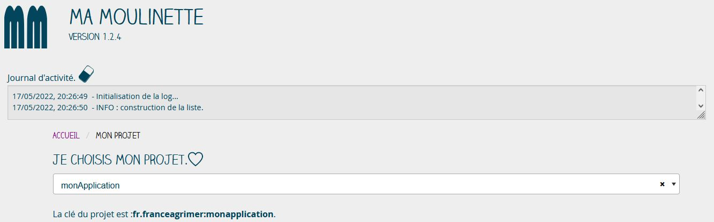
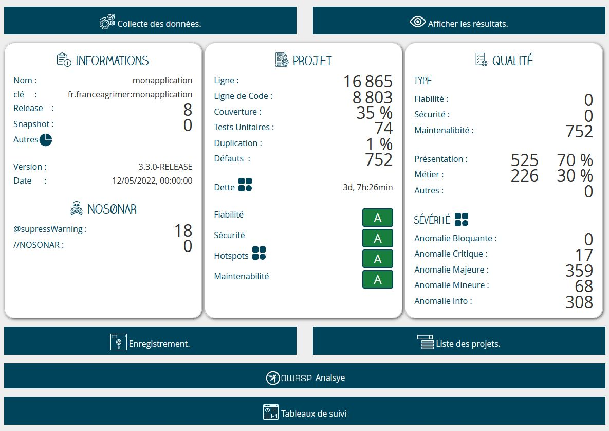
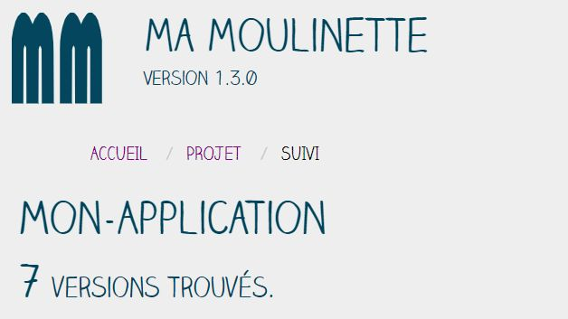
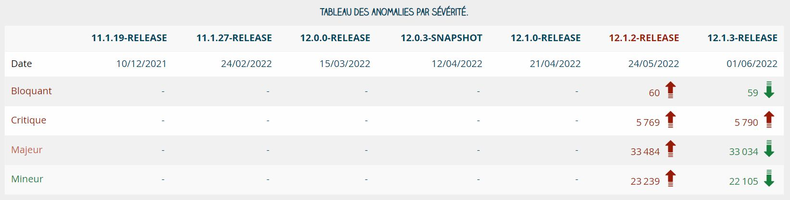
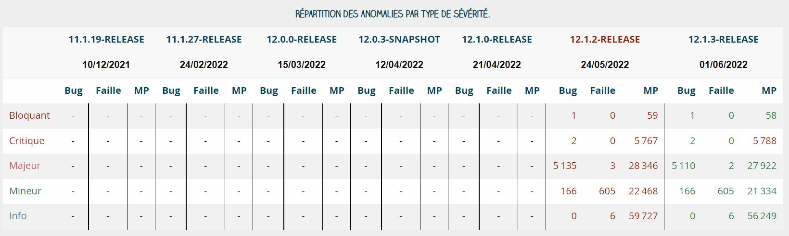

# README


## Introduction

Ma Moulinette est une application, locale, qui a pour objectif de simplifier la consultation et le suivi des principaux indicateurs collectés et calculés par la plateforme sonarqube.

L'application fonctionne avec sonarqube 8.9.3 LTS. Elle s'appuie sur les API publiques de l'application.

## Histoire

L'application a été développée pour pallier la suppression et/ou l'abandon de certaines fonctionnalités présente dans la version 5.4.3 LTS de Sonarqube.

L'objectif étant de recréer ses fonctionnalités dans une application locale et indépendante. En d'autres termes, il fallait que l'application puisse être utilisée simplement depuis un poste de travail sans installer un serveur dédié pour la collecte et la présentation des indicateurs.

Cette première version développée en 10 jours a été réalisée en HTML5, CSS et Javascript. Le stockage en base de données s'appuyait sur indexedDB.

Cette solution a été abandonnée à cause des problèmes de CORS rencontrés lors du déploiement en environnement de production.

Pour contourner le problème des accès CORS en environnement sécurisé, il a été décidé d'utiliser un client en PHP (i.e. à la place des solutions javascript utilisées) pour réaliser les appels de webservices.

La réécriture totale de l'application a débutée le 28 janvier 2022.

## Ma-Moulinette en images

Version 1.1.0

### Page d'accueil

 \
 \

### Page Projet

 \
 \

### Page Suivi

 \
 \
 \
 \
 \
 \

### Page Suivi/modification

 \
 \

## Technologie

Ma moulinette s'appuie sur les technologies suivantes :

- PHP 8.1.0, HTML5, CSS 3 & Javascript ES2015 ;
- Symfony 5.4.3, Zurb Foundation 6.7.4 ;
- sqlLite 4 ;
- select2, chartjs.

## Architecture

Elle est développée selon les principes "Mobile First" et "API First".

- Client web responsive (Zurb Foundation) ;
- Serveur d'application local (symfony server) ;
- Accès aux API sur un serveur local ou distant via Token ou Login/Mot de passe ;


## Configuration

Le fichier **. env-prod** est un template de configuration. Il est nécessaire de le renommer en **. env** et de le paramétrer en fonction de vos besoins ;

Les propriétés suivantes sont disponibles :

- APP_ENV = 'prod'
- APP_DEBUG = '0'

- SONAR_URL = <https://monsonar.a-moi-tout-seul.it>
- SONAR_TOKEN = 'mon_token'
- SONAR_USER = 'mon_login'
- SONAR_PASSWORD = 'mon_password'
- SONAR_PROFILES = 'mon profil sonar'
- SONAR_ORGANIZATION = 'ma petite Entreprise'

- NOMBRE_FAVORI = 10

`APP_ENV` : défini le type d'environnement **dev** ou **prod** ; \
`APP_DEBUG` : active ou désactive le debug ; \
`SONAR_URL` : Correspond l'URL du serveur sonarqube ; \
`SONAR_TOKEN` : Correspond au token d'accès généré sur la plateforme sonarqube. Il suffit de faire un copier/coller sans ajouter de guillemets ;\
`SONAR_USER` : Correspond au login de l’utilisateur ; \
`SONAR_PASSWORD` : Correspond au mot de passe de l'utilisateur ; \
`SONAR_PROFILES` : Permet de définir le nom du profil correspondant au nom données pour un jeu de règles ; \
`SONAR_ORGANIZATION` : Permet de personnaliser le nom de l'établissement utilisé dans les rapports ; \
`NOMBRE_FAVORI` : Défini le nombre de version affiché en page d'accueil correspondant aux applications marquées comme favorites.

## Installation des dépendances

En mode développement, il est nécessaire d'installer les dépendances PHP et NPM.

- `composer install`
- `npm install`

En mode production, seul le dossier **vendor** est utilisé, les dépendances npm ne sont pas nécessaires.

## Création de la base de données

La base de données est disponible dans le dossier : **ma-moulinette\var\data.db**
Elle contient l'ensemble des tables définies depuis les class du dossier **entity**.

Les tables créées sont les suivantes :

- Anomalie
- AnomalieDetails
- Favori
- Historique
- HotspotsDetails
- HotspotOwasp
- Hotspots
- InformationProjet
- ListeProjet
- Mesures
- NoSonar
- Notes
- Owasp
- Profiles

La génération des entity, i.e. la création des **getter** et des \*_setter_ est réalisée avec la commande :

`php bin/console make : entity --regenerate`

**Attention** : La table `Historique` est particulière.
En effet, cette table contient une clé primaire composée des attributs `maven_key`, `version` et `date_version`. Lors de la génération automatique, si l'annotation `#[ORM\Id]` est présente, seul le getter est créé. Une erreur se produit alors quand on veut enregistrer les données dans la table (i.e. il manque les setter).

L'astuce est de générer ces trois attribut sans le marqueur de clé primaire puis de les ajouter pour avoir les setter et les getter sur ces trois attributs.

Enfin, l'enregistrement ne fonctionne pas si l'attribut **date_version** est de type `Datetime`, il a été modifié en **varChar ()** mais est typé manuellement en Datetime dans la base. En d'autres termes, si l'on souhaite recréer la base de données depuis les class d'Entity, il ne faudra pas oublier de re-typer l'attibut **date_version** de la relation **Historique** en Datetime.

Création de la table :

```sql
CREATE TABLE "historique" (
"maven_key" VARCHAR (128) NOT NULL, "version" VARCHAR (32) NOT NULL, "date_version" VARCHAR (128) NOT NULL,
"nom_projet" VARCHAR (128) NOT NULL,"version_release" INTEGER NOT NULL, "version_snapshot" INTEGER NOT NULL,
"suppress_warning" INTEGER NOT NULL, "no_sonar" INTEGER NOT NULL, "nombre_ligne" INTEGER NOT NULL,
"nombre_ligne_code" INTEGER NOT NULL, "couverture" DOUBLE PRECISION NOT NULL, "duplication" DOUBLE PRECISION NOT NULL,
"tests_unitaires" INTEGER NOT NULL, "nombre_defaut" INTEGER NOT NULL, "nombre_bug" INTEGER NOT NULL,
"nombre_vulnerability" INTEGER NOT NULL, "nombre_code_smell" INTEGER NOT NULL, "frontend" INTEGER NOT NULL,
"backend" INTEGER NOT NULL, "batch" INTEGER NOT NULL, "dette" INTEGER NOT NULL,
"nombre_anomalie_bloquant" INTEGER NOT NULL, "nombre_anomalie_critique" INTEGER NOT NULL,
"nombre_anomalie_info" INTEGER NOT NULL, "nombre_anomalie_majeur" INTEGER NOT NULL,
"nombre_anomalie_mineur" INTEGER NOT NULL, "note_reliability" VARCHAR (4) NOT NULL, "note_security" VARCHAR (4) NOT NULL,
"note_sqale" VARCHAR (4) NOT NULL, "note_hotspot" VARCHAR (4) NOT NULL, "hotspot_high" VARCHAR (4) NOT NULL,
"hotspot_medium" INTEGER NOT NULL, "hotspot_low" INTEGER NOT NULL, "hotspot_total" INTEGER NOT NULL,
"favori" BOOLEAN NOT NULL, "initial" BOOLEAN NOT NULL, "date_enregistrement" DATETIME NOT NULL,
PRIMARY KEY ("maven_key","version","date_version"));
```

Pour créer le fichier de création automatique des relations, il suffit de lancer la commande :

`php bin/console make : migration`

Pour créer la base de données, il suffit de lancer la commande :

`php bin/console doctrine : migrations : migrate`

Il ne faudra pas oublier de changer le type de l'attribut `date_version` de la relation **Historique**.

## Migration 1.0.0 vers 1.1.0

[X] La table **anomalie_details** doit être supprimée :

```sql
DROP TABLE anomalie_details
```

[X] La table **temp_anomalie** doit être supprimée :

```sql
DROP TABLE temp_anomalie
```

[X] La table **anomalie_details** doit être ajouté avec la commande :

```sql
CREATE TABLE anomalie_details (id INTEGER PRIMARY KEY AUTOINCREMENT NOT NULL, maven_key VARCHAR (128) NOT NULL, name VARCHAR (128) NOT NULL, bug_blocker INTEGER NOT NULL, bug_critical INTEGER NOT NULL, bug_info INTEGER NOT NULL, bug_major INTEGER NOT NULL, bug_minor INTEGER NOT NULL, vulnerability_blocker INTEGER NOT NULL, vulnerability_critical INTEGER NOT NULL, vulnerability_info INTEGER NOT NULL, vulnerability_major INTEGER NOT NULL, vulnerability_minor INTEGER NOT NULL, code_smell_blocker INTEGER NOT NULL, code_smell_critical INTEGER NOT NULL, code_smell_info INTEGER NOT NULL, code_smell_major INTEGER NOT NULL, code_smell_minor INTEGER NOT NULL, date_enregistrement DATETIME NOT NULL)
```

[X] La table **historique** doit être modifiée :

```sql
ALTER TABLE historique ADD COLUMN bug_blocker INTEGER ;
ALTER TABLE historique ADD COLUMN bug_critical INTEGER ;
ALTER TABLE historique ADD COLUMN bug_major INTEGER ;
ALTER TABLE historique ADD COLUMN bug_minor INTEGER ;
ALTER TABLE historique ADD COLUMN bug_info INTEGER ;
ALTER TABLE historique ADD COLUMN vulnerability_blocker INTEGER ;
ALTER TABLE historique ADD COLUMN vulnerability_critical INTEGER ;
ALTER TABLE historique ADD COLUMN vulnerability_major INTEGER ;
ALTER TABLE historique ADD COLUMN vulnerability_minor INTEGER ;
ALTER TABLE historique ADD COLUMN vulnerability_info INTEGER ;
ALTER TABLE historique ADD COLUMN code_smell_blocker INTEGER ;
ALTER TABLE historique ADD COLUMN code_smell_critical INTEGER ;
ALTER TABLE historique ADD COLUMN code_smell_major INTEGER ;
ALTER TABLE historique ADD COLUMN code_smell_minor INTEGER ;
ALTER TABLE historique ADD COLUMN code_smell_info INTEGER ;
```

## Démarrage en développement

- Modifiez les paramètres APP_ENV et APP_DEBUG :

```yaml
APP_ENV = dev
APP_DEBUG = 1
```

Par défaut, les programmes de démarrage et d'arrêt sont dans le dossier bin/ du projet.

- Lancez le programme **symfony_start.bat** pour démarrer le serveur Symfony ;
- Lancez le programme **symfony_stop.bat** pour arrêter le serveur Symfony ;
- Lancez le programme **encore.bat** pour démarrer la compilation à la volée des ressources JS/CSS ;

## Mise en production

- Modifiez les paramètres APP_ENV et APP_DEBUG :

```yaml
APP_ENV = prod
APP_DEBUG = 0
```

- Supprimer les fichiers du dossier **public/build**
- Supprimer le dossier **dev** et **prod** du dossier **var/cache**
- Supprimer le fichier dev.log du dossier **var/log**
- Lancez la commande pour compiler le fichier **. env** : `composer dump-env prod`
- Lancez la commande pour compiler les fichiers css/js : `npm run build`

## Accès à l'application

Il est possible de configurer un proxy pour lancer l'application sur un domaine local (i.e. sonar-dash.wip) ou depuis l'adresse locale sur le port 8000. L'adresse par défaut est :
< http ://localhost : 8000 >

L'utilisation du serveur local en https n'est pas recommandé si vous n'avez pas main sur se le serveur apache/nginx servant de proxy à la plateforme sonarqube.

## Symfony security : check

`Audit du 24/04/2022`

```console
Symfony Security Check Report
=============================
No packages have known vulnerabilities.
```

## npm audit

`Audit du 24/04/2022`

```console
=== npm audit security report ===

found 0 vulnerabilities
in 926 scanned packages
```

## Erreurs courantes

### Erreur lors de l'impression d'un rapport

Le message ci-dessous est affiché dans la console au moment de la construction du fichier PDF.

```plaintext
Unable to access cssRules property DOMException :
CSSStyleSheet. cssRules getter : Not allowed to access cross-origin stylesheet
```

Cette erreur est due à l'utilisation d'une extension du navigateur. Par exemple dans Firefox, l'utilisation de l'extension merciApp doit être désactivée.

Pour identifier l'extension en cause, il suffit de désactiver toutes les extensions et de les ajouter l'une après l'autre et vérifier ainsi laquelle peut poser un problème.

### Analyse de code Sonarqube

Analyse de la version 1.1.0. \


New code. \


Overall code. \


Répartiton par dossier. \


Analyse Ma-moulinette. \

