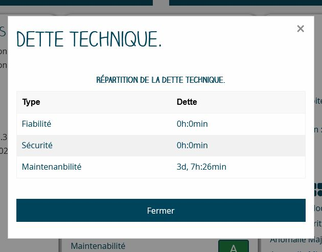
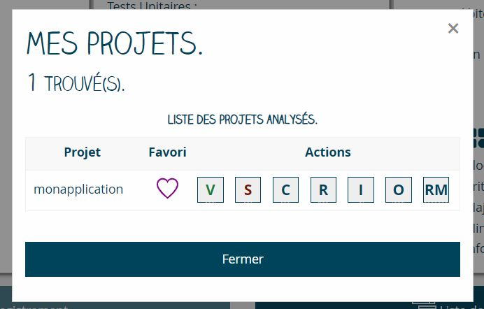
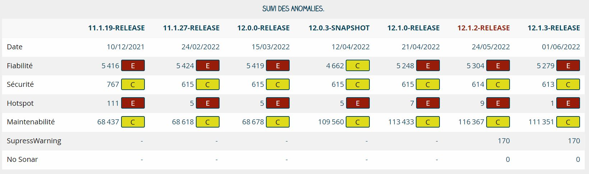
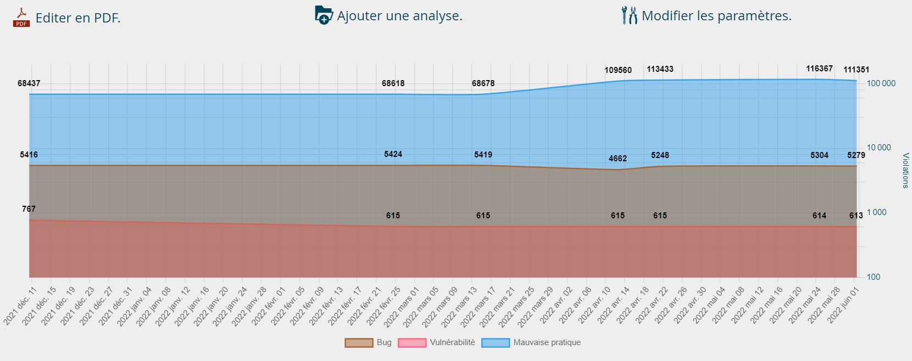
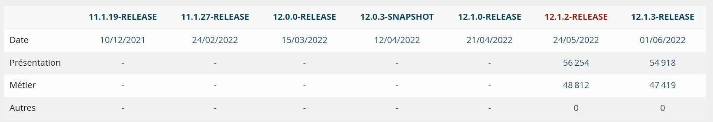
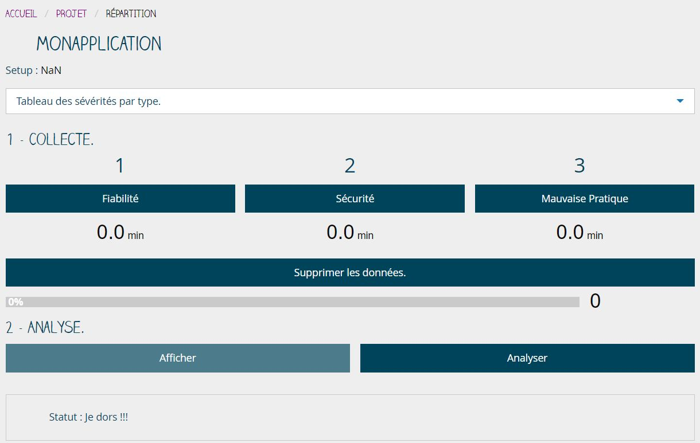
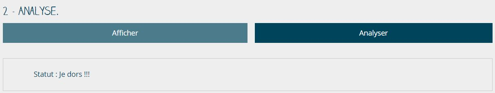

# README


## Introduction

Ma Moulinette est une application, locale, qui a pour objectif de simplifier la consultation et le suivi des principaux indicateurs collectés et calculés par la plateforme sonarqube.

L'application fonctionne avec sonarqube 8.9.3 LTS. Elle s'appuie sur les API publiques de l'application.

## Histoire

L'application a été développée pour pallier la suppression et/ou l'abandon de certaines fonctionnalités présente dans la version 5.4.3 LTS de sonarqube.

L'objectif étant de recréer ses fonctionnalités dans une application locale et indépendante. En d'autres termes, il fallait que l'application puisse être utilisée simplement depuis un poste de travail sans installer un serveur dédié pour la collecte et la présentation des indicateurs.

Cette première version développée en 10 jours a été réalisée en HTML5, CSS et Javascript. Le stockage en base de données s'appuyait sur indexedDB.

Cette solution a été abandonnée à cause des problèmes de CORS rencontrés lors du déploiement en environnement de production.

Pour contourner le problème des accès CORS en environnement sécurisé, il a été décidé d'utiliser un client en PHP (i.e. à la place des solutions javascript utilisées) pour réaliser les appels de webservices.

La réécriture totale de l'application a débuté le 28 janvier 2022.

## Architecture des applications Java

Il est possible de passer la moulinette sur toutes les applications disponibles sur la plateforme sonarqube. Cependant, certains indicateurs ne seront pas calculés si l'architecture n'est pas conforme avec l'organisation qui a été retenue pour les applications Java.

Les indicateurs de suivi par module (frontend, backend et autre) sont calculés sur la base d'un filtrage du nom du dossier parent.

Le projet Java doit avoir au moins les modules suivants :

Pour l'application frontend :


Pour l'application frontend :


Le filtrage est utilisé par la méthode hotspotDetails() et la méthode projetAnomalie() du controller ApiProjet.

Ci-dessous la liste des filtres pour une application frontend :

* [x] `presentation-ear`
* [x] `webapp`
* [ ] `presentation`
* [ ] `presentation-commun`

Ci-dessous la liste des filtres pour une application backend :

* [x] `api`
* [x] `common`
* [x] `dao`
* [ ] `service`
* [ ] `metier`
* [ ] `metier-ear`
* [ ] `middleoffice`
* [ ] `serviceweb`
* [ ] `serviceweb-client`
* [ ] `metier-rest`
* [ ] `entite`

Ci-dessous la liste des filtres pour les autres modules backend :

* [ ] `Batchs`
* [ ] `batch`
* [ ] `rdd`

## Ma-Moulinette en images

`Version 1.4.0-Release`

### Page d'accueil

Cette page permet le chargement du référentiel des applications pris en charge par le serveur sonarqube et la consultation et la mise à jour des référentiels de règles.


La liste des applications favorites est affichée.


### Page Projet

La page projet permet, une fois sélectionné un projet, de collecter les données et/ou d'afficher les résultats de la dernière collecte.

Je choisi mon projet à partie du référentiel local.


Je lance la collecte et j'affiche les résultats.


Je peux ensuite enregistrer les indicateurs dans la base locale. Cette base sera utilisée pour le suivi des versions du projet.

Note : Dans la version `1.3.0`, un nouveau bouton est disponible.
En effet, le bouton "Répartition par module" permet l'accès à la page de collecte et l'analyse des signalements par type de sévérité. Elle permet l'affichage des signalements par module applicatif.


Je peux afficher la répartition des versions (Release et SNAPSHOT).


Je peux afficher la répartition de la dette technique :



Je peux afficher le détail des hotspots :


Je peux aussi afficher la répartition détaillée des anomalies :


Et je peux afficher la liste des projets que j'ai déjà analysés et ceux qui sont favoris :



En version `1.4.0`, un bloc d'actions a été ajouté pour permettre de :

* [V] Sélectionner un projet de la liste et déverrouiller tous les boutons ;
* [S] Supprimer le projet de la liste des projets déjà analysés ;
* [C] Lancer la collecte des indicateurs sonarqube et le calcul des agrégats ;
* [R] Lancer la restitution des données calculés ;
* [I] Ouvrir la page de suivi des indicateurs ;
* [O] Ouvrir la page du rapport OWASP ;
* [RM] Ouvrir la page de suivi de la répartition par module ;


### Page OWASP

Cette page permet l'affichage des vulnérabilités et des hotspots selon le référentiel OWASP 2017.

Quand tout va bien :)


Exemple de remonté de hotspots :


Les vulnérabilités et hotspots sont affichées en fonction du type de faille.


Il est possible d'afficher le nombre et la sévérité d'une faille OWASP.


Quand tout va bien le tableau est vide.


Exemple de remonté de hotspots :


La documentation de chaque faille.


### Page Suivi des indicateurs

La page permet l'affichage des 10 dernières versions de l'application sélectionnée.


Le tableau de suivi :



La jolie courbe :



La répartition par module :



La répartition par type :


La répartition par type et sévérité :


### Page Suivi/modification

Il est possible de modifier les paramètres d'affichage d'une version en activant ou non l'option favori et/ou l'option version de référence.


`Note :` la version de référence est la version qui sera utilisé pour comparer la tendance.

### Page de suivi/répartition-module

Cette page affiche la liste des anomalies totales par type et sévérité. Il est possible de lancer une collecte pour chaque type (fiabilité, sécurité et maintenabilité) et d'en calculer la répartition par module.

Tableau de répartition des sévérités par type :



Le menu est ouvert.


La page permet d'accéder au processus de **Collecte** (1) et au processus d'**Analyse** (2).

Pour chaque type (fiabilité, sécurité et maintenabilité), il est possible de collecter jusqu'à 50 000 signalements.


Au lancement, on vérifie si, il existe un "set-up", une collecte déjà présente pour ce projet. Si un "set-up" existe, on en créé un nouveau pour la nouvelle collecte.


À la fin du traitement, l'indicateur de l'étape passe en orange. Attention, le traitement peut prendre plusieurs minutes.

Le bouton "supprimer" permet de purger la base "tampon" des données du projet. Il faudra alors lancer un VACCUM sur la base pour la défragmenter.

L'indicateur de progression indique l'état d'avancement de la collecte. La durée est exprimée en minutes et secondes.

La collecte progresse :)


La collecte est terminée.


La phase d'analyse permet de lancer et afficher le tableau de répartition par module des signalements sonarqube. Il faut pour cela choisir le bouton **Analyser**.

Le bouton **Afficher** permet quant à lui d'afficher la dernière analyse si elle existe pour le projet.



Le processus va permettre de répartir les signalements en pour chacun des types en fonction de leur nature (frontend, backend, autres).


## Technologie

Ma moulinette s'appuie sur les technologies suivantes :

### En production

* PHP 8.1.0, HTML5, CSS 3 & Javascript ES2015 ;
* symfony-cli 5.4.10, Zurb Foundation 6.7.4 ;
* SQLite 4 ;
* select2, chartjs.

### En développement

* nodejs 12.22.12
* composer
* sqlite3

## Architecture

Elle est développée selon les principes "Mobile First" et "API First".

* Client web responsive (Zurb Foundation) ;
* Serveur d'application local (symfony server) ;
* Deux bases de données (data.db et temp.db) ;
* Accès aux API sur un serveur local ou distant via Token ou Login/Mot de passe ;


## Configuration

### Les dossiers

Il existe deux environnements : développement et production

La version de production contient l'application symfony, deux bases vides, la version compilée des sources JS et CSS (dans le dossier /public/build). Le repository git n'est pas présent. Enfin, Le dossier **node_modules** n'étant pas nécessaire, il a été supprimé (car il est utilisé uniquement en développement).

Le dossier racine du projet est `ma-moulinette`. La version de production et la version de développement sont dans deux dossiers différents.

* [prod] : c:\sonar-dash.prod
* [dev] : c:\sonar-dash.dev

Ce point et important, pour le paramétrage des accès et le lancemment de symfony-cli.

### Les environnements

Le fichier **.env-prod** est un template de configuration.

Il peut être utilisé pour l'environnement de dev ou de prod. Il suffit pour cela de le renommer en **.env** et de le paramétrer en fonction de vos besoins ;

Les propriétés suivantes sont disponibles :
Pour l'environement de production.

* APP_ENV = 'prod'
* APP_DEBUG = '0'

Pour l'environement de développement

* APP_ENV = 'dev'
* APP_DEBUG = '1'

La configuration nécessaire pour se connecter à sonarqube. Il est recommandé d'utiliser un token. Attention, le token n'est pas entre simple ou double cote.

* SONAR_URL = <https://monsonar.a-moi-tout-seul.it>
* SONAR_TOKEN = 'mon_token'
* SONAR_USER = 'mon_login'
* SONAR_PASSWORD = 'mon_password'

Le nom du profil utilisé pour tous les profils qualités.

* SONAR_PROFILES = 'mon profil sonar'
* SONAR_ORGANIZATION = 'ma petite Entreprise'
* NOMBRE_FAVORI = 10

Explications:

* `APP_ENV` : définit le type d'environnement **dev** ou **prod** ;
* `APP_DEBUG` : active ou désactive, le debug (1, 0) ;
* `SONAR_URL` : Correspond l'URL du serveur sonarqube ;
* `SONAR_TOKEN` : Correspond au token d'accès généré sur la plateforme sonarqube. Il suffit de faire un copier et coller sans ajouter de guillemets ;
* `SONAR_USER` : Correspond au login de l’utilisateur ;
* `SONAR_PASSWORD` : Correspond au mot de passe de l'utilisateur ;
* `SONAR_PROFILES` : Permet de définir le nom du profil correspondant au nom donné pour un jeu de règles ;
* `SONAR_ORGANIZATION` : Permet de personnaliser le nom de l'établissement utilisé dans les rapports ;
* `NOMBRE_FAVORI` : Définit le nombre de versions affiché en page d'accueil correspondant aux applications marquées comme favorites.

## Installation des dépendances

En mode développement, il est nécessaire d'installer les dépendances PHP et NPM.

* `composer install`
* `npm install`

Il n'est pas nécessaire de compiler les ressources JS et CSS. Il faut cependant ne pas oublier de lancer `encore` avec la commande : `npm run watch`

En mode production, seul le dossier **vendor** est utilisé, les dépendances npm ne sont pas nécessaires.

Par contre, il faut compiler la version avec la commande : `npm run build`

## Création de la base de données

Les deux bases de données sont disponibles dans le dossier `ma-moulinette\var\` :

[x] **ma-moulinette\var\data.db**
[x] **ma-moulinette\var\temp.db**

Elles contiennent l'ensemble des tables définies depuis les class du dossier **Entity/Main** et **Entity/Secondary**.

Les tables pour la base **data** sont les suivantes :

* Anomalie
* AnomalieDetails
* Favori
* Historique
* HotspotsDetails
* HotspotOwasp
* Hotspots
* InformationProjet
* ListeProjet
* Mesures
* NoSonar
* Notes
* Owasp
* Profiles

Les tables pour la base **temp** sont les suivantes :

* Repartition

La génération des entity, i.e. la création des **getter** et des \*_setter_ est réalisée avec la commande :

`php bin/console make:entity --regenerate --overwrite App\Entity\Main\`
`php bin/console make:entity --regenerate --overwrite App\Entity\Secondary\`

Pour créer le fichier de création automatique des relations, il suffit de lancer la commande :

`php bin/console make:migration`

Pour créer la base de données, il suffit de lancer la commande :

Pour la base de données **data** :

* Création du script.
`php bin/console doctrine:migrations:diff --em default --namespace MigrationsDefault --no-interaction`

* Création de la base.
`php bin/console doctrine:migrations:migrate --em default --no-interaction`

Pour la base de données **temp** :

* Création du script.
`php bin/console doctrine:migrations:diff --em secondary --namespace MigrationsSecondary --no-interaction`

* Création de la base.
`php bin/console doctrine:migrations:migrate --em secondary --no-interaction`

`Attention` : Il y a un bug en version 3.2.2 qui ne permet plus la gestion des fichiers de configuration. Cela se traduit par l'exécution de tous les fichiers de version pour la base **temp**.

La base intégrée a été nettoyée.

## Migration 1.0.0 vers 1.1.0

Note : le fichier SQL `data-1.1.0.sql`, de mise à jour est disponible dans le dossier **/migrations/**.

[X] La table **anomalie_details** doit être supprimée :

```sql
DROP TABLE anomalie_details;
```

[X] La table **temp_anomalie** doit être supprimée :

```sql
DROP TABLE temp_anomalie;
```

[X] La table **anomalie_details** doit être ajoutée avec la commande :

```sql
CREATE TABLE anomalie_details (
  id INTEGER PRIMARY KEY AUTOINCREMENT NOT NULL,
  maven_key VARCHAR (128) NOT NULL,
  name VARCHAR (128) NOT NULL,
  bug_blocker INTEGER NOT NULL,
  bug_critical INTEGER NOT NULL,
  bug_info INTEGER NOT NULL,
  bug_major INTEGER NOT NULL,
  bug_minor INTEGER NOT NULL,
  vulnerability_blocker INTEGER NOT NULL,
  vulnerability_critical INTEGER NOT NULL,
  vulnerability_info INTEGER NOT NULL,
  vulnerability_major INTEGER NOT NULL,
  vulnerability_minor INTEGER NOT NULL,
  code_smell_blocker INTEGER NOT NULL,
  code_smell_critical INTEGER NOT NULL,
  code_smell_info INTEGER NOT NULL,
  code_smell_major INTEGER NOT NULL,
  code_smell_minor INTEGER NOT NULL,
  date_enregistrement DATETIME NOT NULL);
```

[X] La table **historique** doit être modifiée :

```sql
ALTER TABLE historique ADD COLUMN bug_blocker INTEGER ;
ALTER TABLE historique ADD COLUMN bug_critical INTEGER ;
ALTER TABLE historique ADD COLUMN bug_major INTEGER ;
ALTER TABLE historique ADD COLUMN bug_minor INTEGER ;
ALTER TABLE historique ADD COLUMN bug_info INTEGER ;
ALTER TABLE historique ADD COLUMN vulnerability_blocker INTEGER ;
ALTER TABLE historique ADD COLUMN vulnerability_critical INTEGER ;
ALTER TABLE historique ADD COLUMN vulnerability_major INTEGER ;
ALTER TABLE historique ADD COLUMN vulnerability_minor INTEGER ;
ALTER TABLE historique ADD COLUMN vulnerability_info INTEGER ;
ALTER TABLE historique ADD COLUMN code_smell_blocker INTEGER ;
ALTER TABLE historique ADD COLUMN code_smell_critical INTEGER ;
ALTER TABLE historique ADD COLUMN code_smell_major INTEGER ;
ALTER TABLE historique ADD COLUMN code_smell_minor INTEGER ;
ALTER TABLE historique ADD COLUMN code_smell_info INTEGER ;
```

## Migration 1.2.3 vers 1.2.4

Note : le fichier SQL `data-1.2.4.sql`, de mise à jour est disponible dans le dossier **/migrations/**.

La version **1.2.4** introduit plusieurs changements :

* Remplacement de l'attribut "batch" par "autre" sur les tables "Anomalie", "Historique" et "HotspotDetails" ;
* Ajout de l'attribut "niveau" pour la gestion du tri sur la table HotspotDetails ;

Les instructions suivantes permettent de remplacer, pour chaque table, l'attribut "batch" par "autre".

### Pour la table Anomalie

```sql
ALTER TABLE anomalie RENAME batch TO autre;
```

### Pour la table Historique

```sql
ALTER TABLE historique RENAME batch TO autre;
```

### Pour la table Hotspotdetails

```sql
ALTER TABLE hotspot_details RENAME batch TO autre;
ALTER TABLE hotspot_details ADD COLUMN niveau INTERGER;
```

### Mise à jour de la colonne niveau

```sql
UPDATE hotspot_details SET niveau=1 WHERE severity='HIGH';
UPDATE hotspot_details SET niveau=2 WHERE severity='MEDIUM';
UPDATE hotspot_details SET niveau=3 WHERE severity='LOW';
```

## Migration 1.2.4 vers 1.3.0

Note : le fichier SQL `data-1.3.0.sql`, de mise à jour est disponible dans le dossier **/migrations/**.

La version **1.3.0** introduit un changement majeur :

* Ajout d'une table 'repartition' pour réaliser les calculs temporaires sur les indicateurs de sévérité par module.

```sql
CREATE TABLE repartition (
  id INTEGER PRIMARY KEY AUTOINCREMENT NOT NULL,
  maven_key VARCHAR(128) NOT NULL, name VARCHAR(128) NOT NULL,
  component CLOB NOT NULL, type VARCHAR(16) NOT NULL,
  severity VARCHAR(8) NOT NULL, setup UNSIGNED BIG INT NOT NULL,
  date_enregistrement DATETIME NOT NULL);
```

## Migration 1.3. vers 1.4.0

Note : le fichier SQL `data-1.4.0.sql`, de mise à jour est disponible dans le dossier **/migrations/**.

La version **1.4.0** introduit un changement mineur :

```sql
ALTER TABLE anomalie ADD COLUMN liste BOOLEAN DEFAULT 1 NOT NULL;

```

## Démarrage de l'environnement de développement

* Modifiez les paramètres APP_ENV et APP_DEBUG :

```yaml
APP_ENV = dev
APP_DEBUG = 1
```

Par défaut, les programmes de démarrage et d'arrêt sont dans le dossier bin/ du projet.

* Lancez le programme **symfony_start.bat** pour démarrer le serveur symfony ;
* Lancez le programme **symfony_stop.bat** pour arrêter le serveur symfony ;
* Lancez le programme **encore.bat** pour démarrer la compilation à la volée des ressources JS/CSS ;

## Mise en production

* Modifiez les paramètres APP_ENV et APP_DEBUG :

```yaml
APP_ENV = prod
APP_DEBUG = 0
```

* Supprimer les fichiers du dossier **public/build**
* Supprimer le dossier **dev** et **prod** du dossier **var/cache**
* Supprimer le fichier dev.log du dossier **var/log**
* Lancez la commande pour compiler le fichier **. env** : `composer dump-env prod`
* Lancez la commande pour compiler les fichiers css/js : `npm run-script build`

```plaintext
npm run-script build

> ma-moulinette@1.2.4 build c:\sonar-dash.dev\ma-moulinette
> encore production --progress

Running webpack ...

99% done plugins FriendlyErrorsWebpackPlugin DONE  Compiled successfully in 18856ms                                           20:45:28

131 files written to public\build
webpack compiled successfully
```

## Accès à l'application

Il est possible de configurer un proxy pour lancer l'application sur un domaine local (i.e. sonar-dash.wip) ou depuis l'adresse locale sur le port 8000. L'adresse par défaut est :
<http://localhost:8000>

L'utilisation du serveur local en https n'est pas recommandée si vous n'avez pas main sur se le serveur apache/nginx servant de proxy à la plateforme sonarqube.

## symfony security : check

`Audit du 24/04/2022`

```console
symfony Security Check Report
=============================
No packages have known vulnerabilities.
```

## npm audit

`Audit du 24/04/2022`

```console
=== npm audit security report ===

found 0 vulnerabilities
in 926 scanned packages
```

## Erreurs courantes

### Erreur lors de l'impression d'un rapport

Le message ci-dessous est affiché dans la console au moment de la construction du fichier PDF.

```plaintext
Unable to access cssRules property DOMException :
CSSStyleSheet. cssRules getter : Not allowed to access cross-origin stylesheet
```

Cette erreur est due à l'utilisation d'une extension du navigateur. Par exemple dans Firefox, l'utilisation de l'extension merciApp doit être désactivée.

Pour identifier l'extension en cause, il suffit de désactiver toutes les extensions et de les ajouter l'une après l'autre et vérifier ainsi laquelle peut poser un problème.

### Analyse de code sonarqube

Analyse de la version 1.1.0.


New code.


Overall code.


Répartiton par dossier.


Analyse Ma-moulinette.


**-- FIN --**
