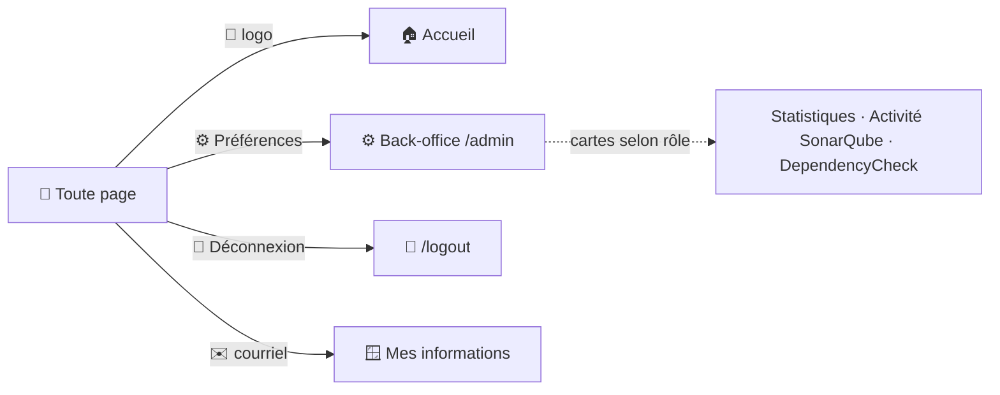
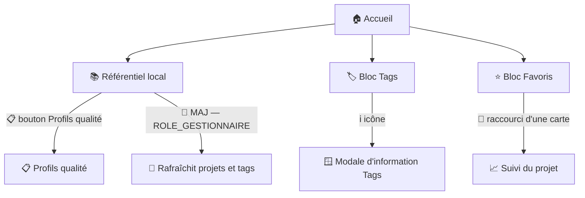

# 🏠 Page d'accueil

La page d'accueil est le point d'entrée de l'application après [authentification](../authentification/authentification.md). Elle affiche l'état des référentiels locaux (projets, profils qualité), permet leur mise à jour, et donne accès aux projets/versions favoris de l'utilisateur.

## 🗺️ Cartographie

La navigation se lit en deux temps : le **bandeau commun** (identique en tête de **toutes** les pages) et le **contenu propre** à la page d'accueil.

### Bandeau commun (présent sur toutes les pages)

<!-- markdownlint-disable MD046 -->

<!-- markdownlint-enable MD046 -->

- Le bandeau (`header.html.twig`) est **identique sur toutes les pages** — détaillé dans [Haut de page](#-haut-de-page).
- **Préférences** et **Déconnexion** sont de vraies redirections `<a href>` ; le **courriel** ouvre une **modale** (`modalSafe`).
- Le back-office (`/admin`) est une porte à privilège minimal qui affiche ensuite des **cartes filtrées par rôle** — voir [Dashboard back-office](../back-office/dashboard.md#-page-daccueil-cartes).

### Contenu de la page d'accueil

<!-- markdownlint-disable MD046 -->

<!-- markdownlint-enable MD046 -->

- Le **raccourci** d'une carte de favori ouvre la page [Suivi](suivi.md) du projet (`/suivi/set?maven_key=…`).
- L'**icône ℹ️** des Tags ouvre une **modale** (`modalSafe`), sans quitter la page.

## 🧭 Chemin de fer de la page

L'écran se lit en deux colonnes sous le bandeau commun : à gauche « **Informations et outils** » (état des référentiels), à droite les « **Favoris** ».

<!-- markdownlint-disable MD046 -->
```text
Page Accueil
│
├── 🧵 Fil d'Ariane
├── 🔝 Bandeau commun (header, présent sur toutes les pages)
│       ├── 🏢 Logo                → Accueil
│       ├── 🏷️ Nom + version + badge d'environnement (DEV/REC/PRD)
│       ├── ⚙️ Icône Préférences   → /admin
│       ├── 🚪 Icône Déconnexion   → /logout
│       └── ✉️ Courriel            → modale « Mes informations »
│
├── 📊 Colonne gauche « Informations et outils »
│       ├── 📚 Bloc Référentiel local (projets / profils)
│       │       ├── 🔄 Bouton « Mise à jour » (ROLE_GESTIONNAIRE)
│       │       └── 📋 Bouton « Profils qualité » → page Profils
│       ├── 🖥️ Version du serveur SonarQube (« Inconnu » si indisponible)
│       ├── 🏷️ Bloc Tags  ── ℹ️ icône → modale d'information
│       └── 👁️ Bloc Visibilité (public / privé)
│
└── ⭐ Colonne droite « Favoris »
        ├── 🔢 Compteur (issu des préférences)
        ├── 🃏 Cartes projets OU versions (issues de l'historique)
        │        └── 🔗 Raccourci → Suivi du projet
        └── ⚠️ Alerte si un favori est désynchronisé
```
<!-- markdownlint-enable MD046 -->

## 🔝 Haut de page

Le bandeau supérieur (`header.html.twig`, inclus sur **toutes** les pages de l'application, pas seulement l'accueil) affiche :

- le logo (lien vers la page d'accueil),
- le nom de l'application avec sa version,
- un badge indiquant le type d'environnement (`DEV`/`REC`/`PRD`, défini par la variable `ENVIRONNEMENT`),
- l'adresse courriel de l'utilisateur (ouvre une fenêtre « Informations » : avec avatar, nom, dates, bascule de réinitialisation du mot de passe),
- et 2 boutons affichant des icônes :

| Icône | Cible | Rôle requis |
| --- | --- | --- |
| Préférences de l'application | `/admin` (back-office EasyAdmin) | `ROLE_UTILISATEUR` (tout le monde) |
| Se déconnecter | `/logout` | `ROLE_UTILISATEUR` |

!!! note "🔐 Une seule icône, plusieurs niveaux d'accès derrière"
    L'icône « Préférences de l'application » est volontairement accessible à tous (`ROLE_UTILISATEUR`) : c'est la porte d'entrée du back-office, dont la page d'accueil affiche ensuite des cartes filtrées par rôle (`ROLE_GESTIONNAIRE`, `ROLE_BATCH`, `ROLE_ACTUATOR`...) — voir [Dashboard back-office](../back-office/dashboard.md#-page-daccueil-cartes). Il n'y a **pas** d'icône « Mes préférences » dans ce bandeau : la page [Préférences](preferences.md) est accessible depuis une carte du back-office (« Réglages personnels ») ou depuis la page « Plan du site » (lien en bas de page).

Depuis la v2.0.0, le back-office donne aussi accès (selon rôle) aux pages [Statistiques](statistiques.md), [Activité SonarQube](activite.md) (`ROLE_ACTIVITY`) et au module [DependencyCheck](../dependency-check/pages.md).

!!! note "🔀 Deux cartes « Activité » distinctes"
    Ne pas confondre la carte **« Activité »** (statistiques d'usage des utilisateurs, sans rôle particulier) et la carte **« Activité SonarQube »** (historique des tâches d'analyse SonarQube, `ROLE_ACTIVITY`) — voir [Dashboard back-office](../back-office/dashboard.md#-page-daccueil-cartes).

## 📚 Bloc référentiel local

Affiche le nombre de projets et de profils qualité connus localement, comparés au nombre réel sur le serveur SonarQube.
Un écart déclenche un message de recommandation de mise à jour, avec le delta (en plus ou en moins). La comparaison ne se fait qu'au-delà d'une fréquence paramétrable (variables `MAJ_PROJET`/`MAJ_PROFIL`, en jours — par défaut recommandation quotidienne pour les projets, mensuelle pour les profils) : si le référentiel a déjà été rafraîchi récemment, aucun signalement n'apparaît même en cas d'écart réel.

La mise à jour manuelle de la liste des projets et des tags nécessite le rôle `ROLE_GESTIONNAIRE`.

Le bouton profile qualité ouvre la page [Profils qualité](../back-office/profils.md) du back-office, qui permet de visualiser les profils de language connus localement et de les mettre à jour depuis le serveur SonarQube.

## 🏷️ Bloc des tags

!!! note "💡 Astuce"
    Le bloc des tags est affiché **même si l'utilisateur n'a pas le rôle `ROLE_GESTIONNAIRE`**. Il permet de vérifier que les tags sont bien appliqués sur les projets, même pour un simple utilisateur.

Affiche le nombre total de projets du référentiel et le nombre de projets ayant au moins un tag valide.

**Un projet sans tag n'est rattaché à aucun groupe fonctionnel et reste invisible pour les utilisateurs dont l'accès est filtré par groupe** — voir [Groupes](../back-office/groupes.md#-groupe-fonctionnel).

!!! warning Attention
    Le bloc des tags **n'affiche pas les tags eux-mêmes** : il ne s'agit pas d'un inventaire, mais d'une vérification de l'application des tags sur les projets. Pour consulter la liste des tags, voir [Tags](../back-office/tags.md).
    Un projet peut avoir plusieurs tags, mais un tag ne peut pas être appliqué à un projet si le tag n'existe pas dans le référentiel.

## 👁️ Bloc visibilité

!!! note "💡 Astuce"
    Il convient de vérifier que les projets sont bien configurés en visibilité `public` ou `privé`, même pour un simple utilisateur.
    Il est recommandé de ne pas laisser de projet en visibilité `public` car il sera visible par tous les utilisateurs, y compris ceux qui n'ont pas de compte sur l'application.

Affiche le nombre de projets de visibilité `public` et `privé`.

## ⭐ Bloc Informations sur la version sonarqube

ce bloc affiche la version du serveur SonarQube.
Si la version du serveur est différente de celle attendue par l'application (variable `VERSION_SONARQUBE`), un message d'avertissement est affiché.

!!! note "✅ Version indisponible : « Inconnu » au lieu de « 0 »"
    Si le serveur SonarQube est injoignable ou renvoie une erreur (par ex. token invalide → 401), la page affichait auparavant « Version du serveur : **0** », trompeur. Désormais la valeur s'affiche **« Inconnu » en rouge** (défaut explicite `Version inconnue.` côté serveur + garde-fou Twig), quel que soit le chemin de rendu.

## ⭐ Bloc des favoris

Affiche, au choix de l'utilisateur (paramètre exclusif, pas de mélange possible), soit ses **projets favoris**, soit les **versions favorites** d'un même projet — voir [Préférences](preferences.md). Le nombre de versions affichées est paramétrable (variable `NOMBRE_FAVORI`, 20 par défaut).
Chaque carte porte un **raccourci** (icône) qui ouvre directement la page [Suivi](suivi.md) du projet concerné.

!!! warning "⚠️ Favori désynchronisé"
    Le **compteur** de favoris reflète les **préférences** de l'utilisateur, tandis que les **cartes** affichées proviennent de l'**historique**. Si un projet favori a disparu de l'historique (changement de serveur SonarQube, purge SQL), le compteur peut indiquer « 1 » sans qu'aucune carte ne s'affiche. Dans ce cas, un message d'avertissement **nomme le favori orphelin** et propose les deux corrections : **relancer une collecte** du projet, ou **retirer le favori** depuis la page [Préférences](preferences.md).

## ℹ️ Fenêtre d'information

Une fenêtre d'information (pop-up) est disponible au niveau du bloc Tags.peut s'ouvrir suite a un clique sur l'icône I à côté du label Tags. Elle précise à l’utilisateur les règles d'utilisation des tags dans la prise en compte des projets dans l'application Ma-Moulinette.

## ⚠️ Messages remontés par la page

Les messages empruntent **deux canaux distincts** (mécanisme commun décrit dans [Gestion des messages](../erreur/gestion-messages.md)) :

- **Flash (serveur)** — posés par le contrôleur (`addFlash`) et rendus **au chargement** de la page (boucles `notice` / `info`). Sévérités : `success` · `primary` · `warning` · `error`.
- **JS (client)** — affichés **dynamiquement** après un appel API (`fetch`), via `showMessage()` de `messageHelper.js`, dans la boîte `#message-box`. Sévérités : `alert` · `critical` ; souvent liés à un **code HTTP** (`assets/js/common/constante.js` : `http_400` … `http_504`) — voir aussi [Erreurs HTTP](../erreur/http-erreur.md).

### Messages Flash (serveur, au chargement)
<!-- markdownlint-disable MD033 -->
| Sévérité | Déclencheur | Message |
| --- | --- | --- |
| `error` | Échec d'un appel SonarQube (version serveur, comptage projets/profils, écriture des propriétés) | ❌ *{message d'erreur renvoyé par le client HTTP}* |
| `warning` | Schéma de base non à jour | ⚠️ La base de données est en version *X*. Vous devez passer le script de migration *Y*. |
| `warning` | Projet favori absent de l'historique | ⚠️ Favori désynchronisé — absent de l'historique : *…*<br>Relancez une collecte de ce projet, ou retirez-le depuis la page Préférences. |
| `primary` | Référentiel projets/profils désynchronisé du serveur SonarQube | 📌 Vous devez mettre à jour le référentiel local pour les *PROJETS* / *PROFILS* |
| `success` | Mise à jour de la liste des projets réussie | ✅ Mise à jour de la liste des projets effectuée. |
<!-- markdownlint-enable MD033 -->

### Messages JS (client, après une action)

<!-- markdownlint-disable MD033 --
| Sévérité | Déclencheur | Message |
| --- | --- | --- |
| `critical` | Module JS non chargé | Le module n'a pas été chargé correctement (Erreur 500). |
| `critical` | Serveur SonarQube injoignable | État du serveur SonarQube : **DOWN** (Erreur 500). |
| `alert` | Requête invalide | La requête est incorrecte (Erreur 404). |
| `critical` | Échec de la mise à jour des projets | Une erreur inattendue s'est produite lors de la mise à jour des projets (Erreur 500). |
| `critical` | Échec de la récupération des tags | Une erreur inattendue s'est produite lors de la récupération du nombre de tags (Erreur 500). |
| *(relayé du serveur)* | Codes HTTP 400 / 401 / 403 / 404 / 500 / 504 | ❌ Erreur d'authentification. La clé n'est pas correcte (Erreur 401)<br>❌ Le service est actuellement indisponible. Impossible d'établir une connexion (Erreur 503) |
<!-- markdownlint-enable MD033 -->

!!! note "🧩 Où trouver les libellés génériques"
    Les **codes HTTP** sont centralisés dans `assets/js/common/constante.js`. Les **textes** proviennent soit du contrôleur (`addFlash`), soit de la réponse de l'API relayée par `showMessage()`. Ce **pattern à deux tableaux (Flash serveur / JS client)** est réutilisable tel quel sur les autres pages de l'application.

-**-- FIN --**-

[Retour au menu principal](/index.html)
