# Ma-Moulinette en images

## Évolutions

> En version **2.0.0** :

- [x] l'application est compatible multi-utilisateur (i.e. utilisation d'un serveur). La gestion des droits est renforcée et les préférences individuelles sont sauvegardées.
- [x] il est possible d'afficher les informations des projets favoris ou des versions des projets favoris.
- [x] Le *logger* est supprimé et laisse sa place à une boîte d'information.
- [x] l'icône **traitement** apparaît dès lors que vous avez le rôle **[BATCH]**.
- [x] l'icône **préférence** apparaît.
- [x] il est possible d'ouvrir, depuis la zone des favoris, le projet directement en cliquant sur l'icône de raccourci situé à côté du titre.
- [x] la gestion des préférences a été ajouté pour gérer ses projets et ses favoris.
- [x] la gestion de l’authentification a été améliorée. La sécurité a été renforcée.
- [x] l'identification de l'utilisateur et le renouvellement de son mot de passe a été ajouté.
- [x] prise en compte partielle du WCAG 2.2.
- [x] ajout du bloc Tags pour afficher le nombre de projet orphelin.
- [x] un message d'erreur 503 bloquant apparaît si le serveur SonarQube n'est pas disponible.
- [x] ajout du bloc "information utilisateur".
- [x] ajout d'un badge pour indiquer le type d'environnement (dev, rec, prd).
- [ ] il est possible d'afficher le logo de l'entreprise en pleine page.

> En version **1.6.0** :

- [x] deux (2) nouveaux indicateurs apparaissent pour afficher le nombre de projets dont la visibilité est de type **public** ou **privé**.
- [x] la détection des changements sur les référentiels a été ajoutée.

> En version **1.5.0** :

- [x] la gestion des versions a été ajoutée.

## Page d'accueil

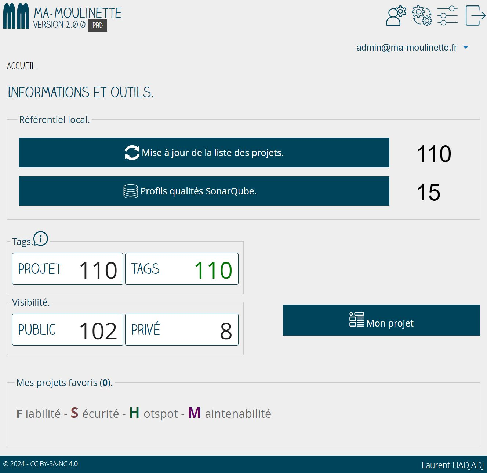

Cette page est la page d'ouverture de l'application. Elle permet :

- [x] de mettre à jour la liste du référentiel des applications SonarQube ;
- [x] de mettre à jour la liste du référentiel des règles SonarQube ;
- [x] d'afficher le nombre de projets de type **privé** ;
- [x] d'afficher le nombre de projets de type **public** ;
- [x] d'afficher le nombre de projet ayant un tags ;
- [ ] d'afficher les projets favoris par projet et/ou par version.

A l'ouverture de la page d'accueil, plusieurs situations peuvent se présenter à l'utilisateur comme :

- [ ] le serveur SonarQube ne répond pas ps (Erreur 503) ;
- [ ] la version de l'application Ma-Moulinette installée n'est pas à jour ;
- [ ] l'application a détectée des changements sur le nombre de projets présent dans l'application et le nombre de projets existant sur le serveur SonarQube ;
- [ ] l'application à détectée un changement sur les référentiels de règles (profils) ;

> A tout moment, il est possible de revenir sur la page d'accueil en cliquant sur le nom de l'application **Ma Moulinette** situé en haut à gauche de la page.

## Le haut de page

Le haut de page est constitué :

- [ ] du logo de l'entreprise (facultatif) ;
- [x] du logo de l'application (mm) ;
- [x] du bloc nom de l'application et de la version ;
- [x] du type d'environnement (DEV | REC | PRD) ;
- [x] des raccourcis :
  - [ ] gestion des utilisateurs (ROLE_GESTIONNAIRE) ;
  - [ ] gestion des traitements automatiques (ROLE_BATCH) ;
  - [x] mes préférences (ROLE_UTILISATEUR) ;
  - [x] se déconnecter ;
- [x]  du compte utilisateur et des informations de l'utilisateur connecté.

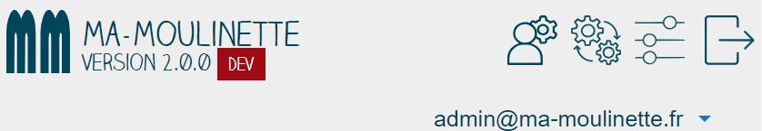

### Les différents environnements

Le type d'environnement est une variable défini dans le fichier `.env` ou `.env.local`.

Pour l'environnement de développement :

Pour l'environnement de recette :

Pour l'environnement de production :

## Le bloc référentiel local

Le bloc des référentiels locaux affiche le nombre de projet analysé et le nombre de profil qualité disponible sur le serveur SonarQube.

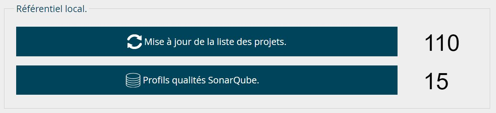

Il est possible par ailleurs pour un utilisateur disposant des bons droits de :

- [ ] Mettre à jour la liste des projets SonarQube [ROLE_COLLECTE] ;
- [ ] Mettre à jour la liste des profils qualités [ROLE_GESTIONNAIRE] ;

> fréquence de mise à jour automatique.

La mise à jour est signalée quand :

- [x] le nombre de projets et/ou de profils est différent de ceux présents sur le serveur SonarQube ;

Le contrôle se fait en fonction de la fréquence choisie, par défaut :

- [x] 1 jour pour les projets ;
- [x] 30 jours pour les profils ;

Cela veut dire que si la table des références de projets et de profils a été mise à jour dans la journée, il n'y aura pas de signalement en cas de différences avec le serveur SonarQube.

Si la table des projets et des profils n'est pas à jour, un message s'affiche pour indiquer que la mise à jour est recommandée. Le nombre de projets et/ou de profils en plus ou en moins est indiqué.

> Mise à jour manuelle des référentiels locaux.

Le nombre de projets et de profils locaux est comparé à ceux présents sur le serveur SonarQube selon une fréquence paramétrable.

Lorsque l'application est installée pour la première fois, il est normal que le référentiel des projets et celui des profils soient vide. L'indicateur de différentiel (+/-) affiche le delta entres les référentiels locaux et ceux présents sur le serveur SonarQube.

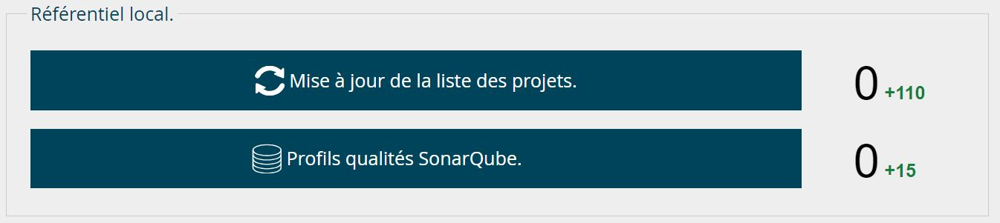

Si le référentiel de projets ou des profils du serveur SonarQube contient plus de projets/profils que les référentiels locaux alors la différence sera positive.

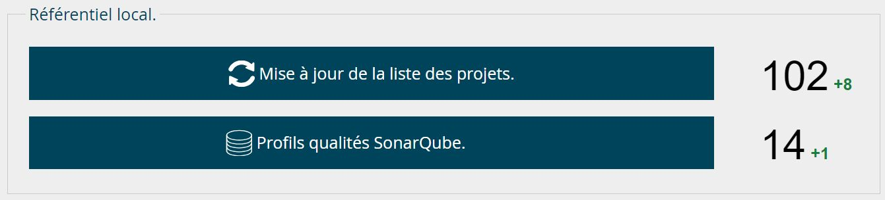

A l'inverse si des projets ou des profils sont supprimés sur le serveurs SonarQube alors la différence sera négative.

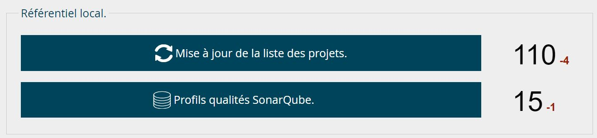

## Le bloc des tags

La section tags affiche le nombre de projets présent dans le référentiel et le nombre projets ayant un tags valide.

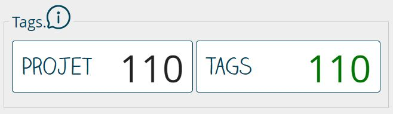

Si le nombre de tags est plus petit que le nombre de projet, cela veut dire qu'il y a des projets qui ne seront pas rattachés à une équipe et ils ne seront pas visible pour les utilisateurs.

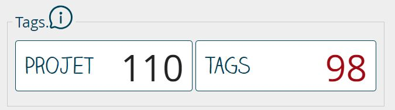

La bulle d'information affiche une explication sur la gestion des tags.

## Le bloc visibilité

Cette section affiche le nombre de projet au statut **public** et ceux aux statut **privé**.

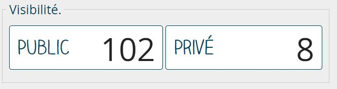

## Le bouton "Mon projet"

Le bouton `Mon Projet' donne un accès à la page **Projet**.

## Le bloc des favoris

Cette section affiche :

- [ ] les **projets favoris** ;
- [ ] les **versions d'un projet** ;

> **Il n'est pas possible de mixer les deux modes**

Le nombre de version affiché est un paramètre modifiable depuis le fichier `.env` ou `.env.local`. Sa valeur par défaut est de 10.

Si l'utilisateur n'a pas de projet ou de version en favori, le bloc sera vide.

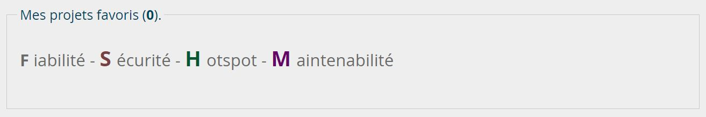

Si l'utilisateur a choisi d'afficher plusieurs projets en favoris, le bloc affichera les informations importantes de chaque projet.

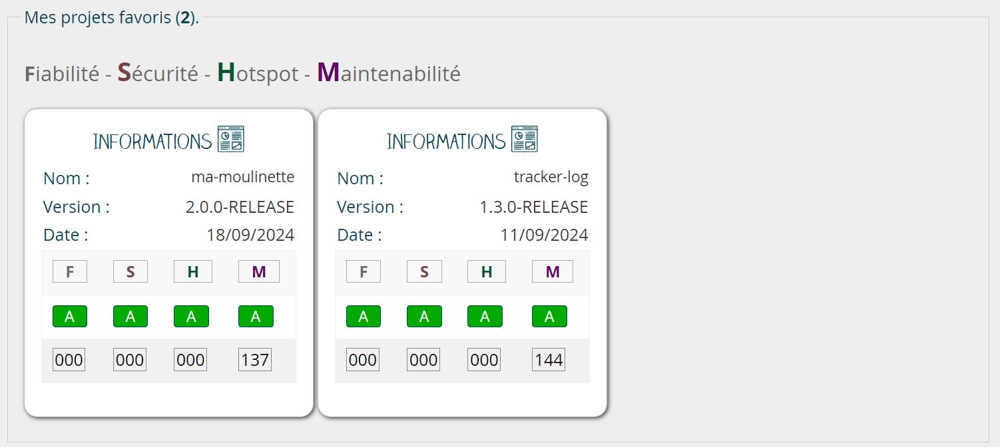

Si l'utilisateur à choisi d'afficher plusieurs versions des mêmes projet, chaque projet sera affiché avec les versions correspondantes.

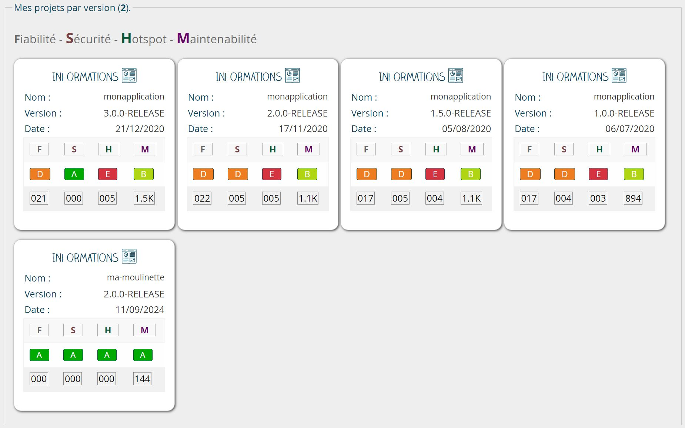

Un raccourci est disponible pour accéder directement au projet.

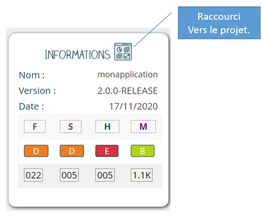

## Les messages d'information

### Mise à jour de la base de données

Si la version de l'application et de la base de données sont identiques, tout va bien. Par contre, si une différence est détectée, alors un message est affiché à l'utilisateur connecté.

Il faudra passer le ou les scripts de migration pour aligner la version de l'application au schéma de la base de données.

### Mise à jour de la table des projets 

Lorsque le nombre de projets enregistrés est différents de ceux présents sur le serveur SonarQube, il est recommandé de mettre à jour le référentiel.

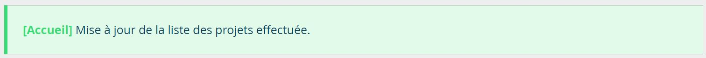

### Les référentiels locaux ne sont pas à jour

> Le référentiel des profils est vide.

> Le référentiel des projets n'est pas à jour.

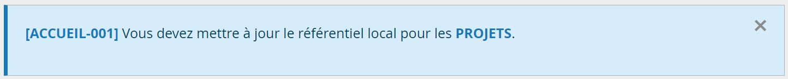

> Le référentiel des profils n'est pas à jour.

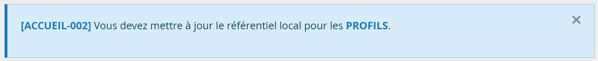

### Les erreurs HTTP

> **Erreur 400**. Les paramètres de la requêtes sont incorrectes.

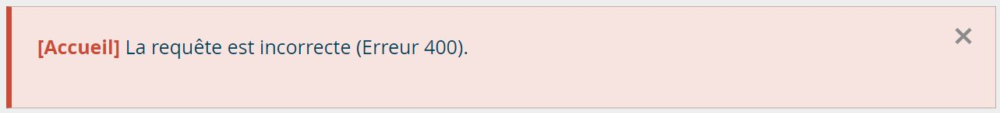

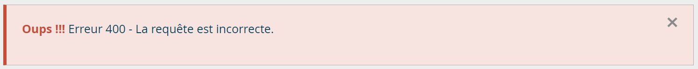

> **Erreur 403**. Vous ne disposer pas des droits suffisants.

> **Erreur 404**. Le serveur SonarQube est disponible mais l'application est arrêté.

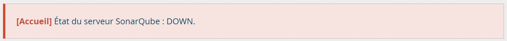

> **Erreur 404**. Le projet n'a pas été trouvé sur le serveur SonarQube.

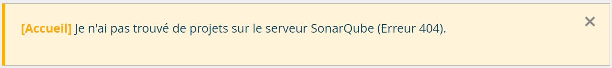

> **Erreur 503**. Le serveur SonarQube n'est pas disponible.

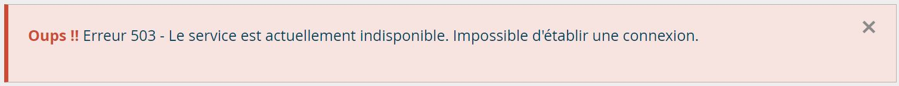

> **Erreur 504**. Le serveur ne répond pas.

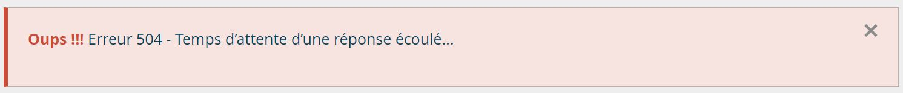

-**-- FIN --**-

[Retour au menu principal](/index.html)
