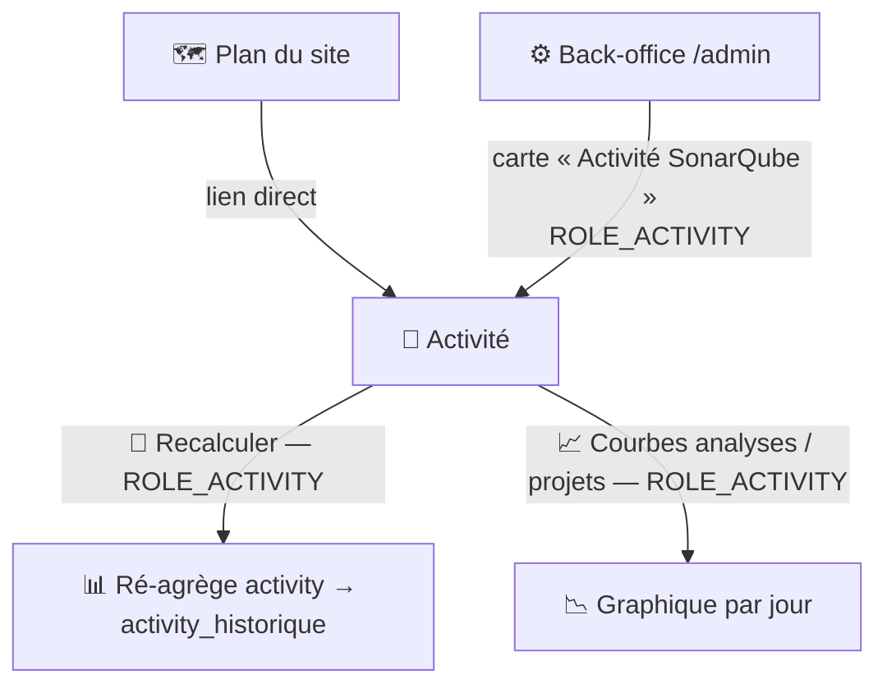
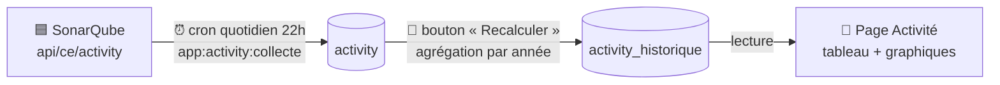

# 📅 Activité SonarQube

La page Activité est un **tableau de bord en lecture seule** de l'historique des tâches d'exécution SonarQube (background tasks, `api/ce/activity`), agrégé **par année**. L'accès à la page (affichage) et les deux actions (recalcul, graphiques) exigent tous le rôle **`ROLE_ACTIVITY`**.

## 🗺️ Cartographie

Le **bandeau commun** (logo, Préférences, Déconnexion, courriel) est identique sur toutes les pages — voir [Page d'accueil › Bandeau commun](accueil.md#bandeau-commun-present-sur-toutes-les-pages). Contenu propre à la page :

<!-- markdownlint-disable MD046 -->

<!-- markdownlint-enable MD046 -->

## 🧭 Chemin de fer de la page

<!-- markdownlint-disable MD046 -->
```text
Page Activité
│
├── 🧵 Fil d'Ariane : Accueil › Activité
├── 🔔 Zone de messages (flash serveur + messages JS)
├── 🗓️ Dernière date d'enregistrement
│
├── 🔄 Bouton « Recalculer les statistiques » (ROLE_ACTIVITY)
│        └── ré-agrège activity → activity_historique (pas de collecte SonarQube)
│
├── 📊 Tableau annuel (une ligne par année) — 8 colonnes
│        Année · Jour · Analyse · Moyenne/jour · Succès · Échec · Taux · Temp Max
│
├── 📈 3 boutons de tracé (ROLE_ACTIVITY)
│        ├── Courbes des analyses
│        ├── Courbes des projets
│        └── Courbe analyses + projets
│
└── 📉 Graphique (canvas, dessiné à la demande)
```
<!-- markdownlint-enable MD046 -->

## 📊 Le tableau annuel

Une ligne par année, issue de `activity_historique` :

| Colonne | Signification | Source |
| --- | --- | --- |
| **Année** | Année des analyses | `year` |
| **Jour** | Nombre de jours depuis la première analyse | `day` |
| **Analyse** | **Nombre total** d'analyses | `analyse` |
| **Moyenne** | Moyenne d'analyses **par jour** | `analyse_average` |
| **Succès** | Analyses réussies (`status = SUCCESS`) | `success` |
| **Échec** | Analyses échouées (`status = FAILED`) | `failed` |
| **Taux de réussite** | `succès / total × 100` (≤ 100 %) | `success_rate` |
| **Temp Max** | Durée d'exécution maximale (`H:i:s`) | `max_time` |

Le bouton **« Recalculer les statistiques »** (re)génère ce tableau à partir de la table `activity` — il ne collecte rien depuis SonarQube.

## 📈 Les graphiques

Trois séries temporelles (analyses/jour, projets/jour, ou les deux) tracées dans un canvas via Chart.js, sur les données de l'**année courante** (`activity`). Le tracé se fait à la demande au clic sur un bouton (appel `POST /api/secure/activity/dessin`).

## ⚙️ Comment la page est alimentée

!!! note "🏗️ La collecte n'est plus déclenchée depuis l'UI"
    Historiquement, cette page comparait les tâches SonarQube à la base et **lançait la collecte directement**.
    Depuis la migration de mai 2026 (collecte directe → Messenger → commande CLI), la **collecte est assurée uniquement par la commande `app:activity:collecte`**, exécutée par le **cron quotidien** (Supercronic, 22h00) — voir [Traitement quotidien](../architecture/processus-batch-activity.md).
    La page ne fait plus que **lire** et **ré-agréger** des données déjà en base.

<!-- markdownlint-disable MD046 -->

<!-- markdownlint-enable MD046 -->

- **Collecte** (nouvelles tâches) : cron uniquement, jamais depuis la page.
- **Ré-agrégation** (`activity` → `activity_historique`) : c'est ce que fait le bouton **« Recalculer les statistiques »** — aucun appel à SonarQube.
- **Lecture** : la page lit `activity_historique` pour le tableau, `activity` pour les graphiques.

!!! note "🔑 Prérequis de collecte : un token utilisateur administrateur"
    La commande `app:activity:collecte` interroge l'API Compute Engine (`api/ce/activity`), qui exige la permission **« Administer System »**.
    Un **token d'analyse globale ne suffit pas** (`403 Insufficient privileges`) : il faut un **token utilisateur personnel** généré depuis un compte **administrateur**, placé dans `SONAR_ACTIVITY_TOKEN` (variable distincte de `SONAR_TOKEN`).
    Les bornes de période sont envoyées au format **ISO 8601 avec offset** (`2026-07-08T00:00:00+0200`), faute de quoi SonarQube renvoie `400 « cannot be parsed »`.

!!! note "🔁 Fenêtre de collecte : reprise incrémentale ou backfill complet"
    - **Reprise** (table déjà peuplée) : la collecte repart de la **dernière date connue en base** (+ 1 jour) jusqu'à hier.
    - **Initialisation** (table vide) : **backfill de tout l'historique** — on part de la **date la plus éloignée** (option `--init-days`, ~3 ans par défaut) jusqu'à hier, découpé en fenêtres de `--catch-up-days` jours (7 par défaut, `1` possible). Ce découpage est **volontaire** : l'API `api/ce/activity` **plafonne à 10 000 résultats par requête** (`p × ps ≤ 10000`) ; des fenêtres étroites restent sous ce plafond et garantissent de **tout récupérer**.

## ⚠️ Messages remontés par la page

Deux canaux distincts (mécanisme commun dans [Gestion des messages](../erreur/gestion-messages.md)).

### Messages Flash (serveur, au chargement)

| Sévérité | Déclencheur | Message |
| --- | --- | --- |
| `error` | Échec de l'appel SonarQube `api/ce/activity` | ❌ *{erreur}* / ❌ Une erreur est survenue lors de la récupération des analyses. |
| `warning` | Aucune analyse en base pour l'année | ⚠️ Aucune analyse en base pour cette année. La collecte automatique (cron « app:activity:collecte ») alimentera la table. |
| `warning` | Date de dernière analyse indisponible | ⚠️ La date de dernière analyse est indisponible. |
| `warning` | SonarQube plus récent que la base | ⏳ SonarQube a des analyses plus récentes que la base (*X* jours d'écart). La collecte automatique quotidienne les intégrera. |
| `info` | Base à jour | 📌 La liste des analyses SonarQube est à jour. |
| `primary` | Statistiques pas encore générées (`activity_historique` vide) | 📊 Aucune statistique n'a encore été générée. Cliquez sur « Recalculer les statistiques » pour construire le tableau. |

### Messages JS (client, après une action)

| Sévérité | Déclencheur | Message |
| --- | --- | --- |
| `warning` | Rôle `ROLE_ACTIVITY` manquant (403) | ⚠️ Vous n'êtes pas autorisé à effectuer cette opération (Erreur 403). |
| `critical` | Échec du recalcul des statistiques | 🔴 Une erreur globale est survenue lors de la mise à jour (Erreur 500). |
| `error` | Données du graphique indisponibles | ❌ Impossible de récupérer les données du graphique (Erreur *X*). |
| `critical` | Échec du tracé du graphique | 🔴 Une erreur est survenue lors du tracé du graphique (Erreur 500). |
| *(réponse API 204)* | Aucune donnée pour l'année | Aucune donnée d'activité pour cette année. Lancez la collecte via la commande `app:activity:collecte`. |
| *(réponse API 500)* | Échec de l'écriture en base lors du recalcul | ❌ Échec de l'enregistrement des statistiques : *{erreur}* |
| *(inline)* | Tableau vide | Aucune donnée disponible. |

## ✅ Corrections apportées (2026-07-14)

!!! note "✅ Passage en rapport « lecture seule » assumé + fiabilisation"
    Suite à la migration qui a retiré la collecte directe, la page a été fiabilisée :

    - **Bouton renommé** « Mise à jour de la liste » → **« Recalculer les statistiques »** (ré-agrégation, pas de collecte).
    - **Colonnes corrigées** : « Analyse » conserve le **total** ; « Moyenne » est enfin **alimentée** (analyses/jour) ; « Échec » n'est plus perdu (clé `failed`) ; **taux = succès/total, borné à 100 %** (formule était inversée).
    - **Recalcul réparé** : la réponse renvoyait la clé `liste` mais le contrôleur/JS lisaient `request` — le tableau ne se remplissait jamais. Aligné sur `liste`.
    - **`max_time` réparé** : la colonne est un `INTEGER` (secondes), mais le contrôleur le formatait en `H:i:s` **avant** l'écriture (`SQLSTATE[22P02]` à l'insertion). Corrigé : stockage en secondes, formatage `H:i:s` uniquement à la lecture.
    - **Échecs d'écriture rendus visibles** : un insert/update en échec ne produisait plus aucune ligne mais affichait quand même « Aucune donnée disponible » sans explication. La page renvoie désormais une erreur explicite (voir tableau des messages JS ci-dessus).
    - **Graphique réparé** : `moment` (jamais importé → `ReferenceError`) remplacé par `date-fns` ; axe cohérent ; titre réel ; gestion des erreurs/403.
    - **Bouton mort retiré** (« Affiche les données du jour »).
    - **Messages pragmatiques** : plus d'invite à « mettre à jour la liste » (impossible depuis l'UI) ; message d'action unique quand le tableau n'est pas encore généré.
    - **Collecte fiabilisée** (`app:activity:collecte`) : URL sans double slash, dates ISO 8601, backfill complet sur table vide, colonnes `activity` élargies (UUID 36 car.), pagination corrigée, erreurs 403/plafond signalées.
    - **Page reliée au back-office** : nouvelle carte **« Activité SonarQube »** sur `admin/home.html.twig` (gated `ROLE_ACTIVITY`) — voir [Dashboard back-office](../back-office/dashboard.md#-page-daccueil-cartes). La page reste aussi accessible depuis le plan du site. En cohérence, l'**affichage de la page** (pas seulement ses actions) est désormais protégé par `#[IsGranted('ROLE_ACTIVITY')]` sur la route `/activity`.

!!! caution "⚠️ Limitation résiduelle connue"
    Code mort restant à nettoyer : `ActivityRepository::insertActivity()`, `ActivityRepository::nombreJourAnneeDonnee()` (orphelins), et `src/Schedule.php` (planificateur vide, remplacé par le cron).

## 📚 Pour aller plus loin

- [Processus de récupération des tâches](../architecture/processus-activity.md) et [Traitement quotidien](../architecture/processus-batch-activity.md) : le mécanisme de collecte (cron + commande).
- [Gestion de la sécurité](../developpement/securite.md) : `ROLE_ACTIVITY`.
- [Statistiques](statistiques.md) : l'autre vue analytique (utilisateurs/sessions).

-**-- FIN --**-

[Retour au menu principal](/index.html)
