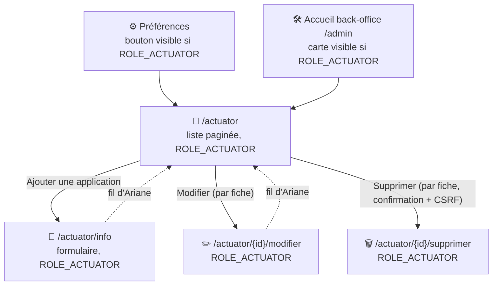

# 🌱 Actuator

!!! note "📇 Un carnet d'adresses, pas une collecte automatique"
    Malgré son nom, ce module ne fait **aucun appel HTTP automatique** vers un endpoint Spring Boot Actuator distant depuis ses propres pages. C'est un **inventaire manuel** : l'utilisateur saisit lui-même, via un formulaire, les informations d'une application (URL du point d'accès, identifiants d'accès, et une liste libre de couples clé/valeur inspirés de `/actuator/info`).
    Le seul appel réel vers l'URL enregistrée est fait ailleurs, par le batch de collecte du projet (voir plus bas).

## 🎯 Expression de besoin — workflow cible

Cette section décrit le comportement voulu du module, qui a servi de référence à la remise à niveau du 2026-07-19 (voir [✅ Remise à niveau effectuée](#-remise-à-niveau-effectuée-2026-07-19) ci-dessous pour le détail des corrections apportées).

**Objectif** : permettre à un utilisateur habilité (`ROLE_ACTUATOR`) de déclarer un point d'accès Actuator (`/actuator/info` d'une application Spring Boot) et une liste de clés JSON à en extraire, pour qu'à chaque collecte projet Ma-Moulinette interroge ce point d'accès, extraie les clés demandées, et conserve le résultat dans l'historique — affiché ensuite à l'utilisateur dans une fenêtre modale sur la page Projet.

### 1. Gestion de l'inventaire (page `/actuator`)

L'utilisateur habilité peut :

- **Ajouter** un nouveau point d'accès → ouvre le formulaire `/actuator/info`.
- **Modifier** un point d'accès existant : ajouter une nouvelle clé, modifier une clé existante, supprimer une clé.
- **Supprimer** un point d'accès → supprime en cascade toutes les clés associées.

### 2. Formulaire d'un point d'accès (`/actuator/info` et `/actuator/{id}/modifier`)

Champs **obligatoires** :

- Nom de l'application
- Clé Maven (`groupId:artifactId`)
- Responsable
- Point d'accès : URL complète ou partielle (ex. `http://localhost/monapplication` ou `http://localhost/monapplication/actuator/info`)
- Compte Actuator **et** mot de passe — **le mot de passe devient obligatoire** (ce n'est plus un champ optionnel)

Champs additionnels par clé (0 à **15 maximum**) :

- Description (libre, optionnelle)
- **Nom de la clé** = le nœud JSON à extraire de la réponse `/actuator/info` (ex. `app.angular.version`) — la **valeur**, elle, n'est jamais saisie à la main : elle est calculée à chaque collecte.

### 3. Workflow de collecte (dernière étape avant écriture en historique)

Pour une `maven_key` donnée, lors de la collecte projet :

1. Rechercher si la `maven_key` est déclarée dans la table `actuator`, en comparant les **formes canoniques** (minuscule des deux côtés, pour éviter les problèmes de casse).
2. **Absente** → enregistrer `null` (ou un JSON vide) dans l'historique — c'est le comportement déjà en place.
3. **Présente** → récupérer l'URL du point d'accès, le compte Actuator et le mot de passe (déchiffré), puis appeler le endpoint avec un **timeout court** (le call ne doit jamais ralentir significativement une collecte projet).
4. **Succès** (JSON reçu) → extraire les clés demandées par l'utilisateur, puis générer un JSON de la forme :
   ```json
   {
     "date_extraction": "...",
     "code": 200,
     "message": "...",
     "app.angular.version": "...",
     "...": "..."
   }
   ```
5. **Échec** (timeout, erreur HTTP, exception) → générer un JSON minimal : `{ "date_extraction": "...", "code": ..., "message": "..." }`.
6. Le JSON (succès ou échec) est stocké pour être restitué lors de la peinture de la page Projet.

### 4. Affichage sur la page Projet (peinture)

Dans le bloc « Informations générales », un lien **Actuator** ouvre une **fenêtre modale** affichant les couples clé/valeur collectés, précédé d'une **pastille ronde** :

| Pastille | Signification |
| --- | --- |
| ⚪ Gris | Aucune collecte effectuée (pas de point d'accès déclaré, ou jamais collecté) |
| 🟢 Vert | Données disponibles pour cette application |
| 🔴 Rouge | Une erreur est survenue lors de la dernière collecte |

### 5. Bonnes pratiques (bannière d'avertissement sur `/actuator`)

Un message rappelle explicitement :

- Le mot de passe est **obligatoire**.
- **Ne jamais** déclarer un point d'accès pointant vers une application de **production**.
- (Autres rappels à préciser — voir questions ouvertes.)

## ✅ Remise à niveau effectuée (2026-07-19)

Un audit du code (avant remise à niveau) avait constaté 10 écarts entre le module tel qu'implémenté et le besoin ci-dessus. Les 10 sont désormais corrigés :

1. **Modèle de données** — `ActuatorInfo::$actuatorInfoValue` renommé en `actuatorInfoCle` (colonne `actuator_info_cle`) : c'est désormais le nœud JSON à extraire (ex. `app.version`), plus jamais une valeur saisie à la main.
2. **Mot de passe obligatoire** à la création (`ActuatorFormType`, groupe de validation par mode) ; en modification, vide continue de signifier « conserver le mot de passe existant ».
3. **Bug d'ajout de clé corrigé** — la logique JS (`newItem`, écouteurs) a été déplacée dans le bon bundle (`ajouter-actuator.js`), avec au passage une limite de 15 lignes appliquée côté client.
4. **Validation de l'URL à l'enregistrement** — `Assert\Url` (schéma `http`/`https` obligatoire, `localhost` autorisé) puis un **ping** (`ActuatorController::urlActuatorEstJoignable`, réutilise `ClientService::httpActuator` sans authentification) avant tout `persist()`. Complétion automatique du suffixe `/actuator/info` si absent.
5. **Comparaison canonique de la `maven_key`** — normalisée en minuscule à l'enregistrement (`Actuator::setMavenKey`) et comparée via `LOWER(maven_key) = LOWER(:maven_key)` côté requête.
6. **Extraction des clés implémentée** — `BatchCollecteActuatorController::BatchCollecteActuatorInfo()` lit désormais les clés déclarées (`ActuatorInfoRepository::findActuatorInfoById`), extrait chaque nœud JSON par chemin à points, et construit `{date_extraction, code, message, <clé>: <valeur>}` (succès) ou `{date_extraction, code, message}` (échec) — stocké dans `historique.actuator_info`.
7. **Timeout dédié de 3 s** sur l'appel Actuator (`ClientService::httpActuator`), au lieu des 45 s génériques.
8. **Affichage sur la page Projet implémenté** — voir [🖼️ Affichage sur la page Projet](#️-affichage-sur-la-page-projet) ci-dessous.
9. **Bannière de bonnes pratiques** ajoutée sur `/actuator`.
10. **Limite de 15 clés appliquée** côté serveur (`Assert\Count(min: 1, max: 15)`) et côté client.

Deux bugs supplémentaires ont été trouvés et corrigés en cours de route (tests manuels) :

- `Actuator::preUpdate()` assignait un `\DateTimeImmutable` à `dateModification`, une colonne Doctrine typée `DATETIME_MUTABLE` — toute modification d'une fiche existante plantait (`Could not convert PHP value of type DateTimeImmutable...`).
- `BatchCollecteActuatorController` construisait l'URL d'appel via `UrlBuilderService::build($baseUrl, 'actuator/info', ['project' => $maven_key])`, dupliquant le suffixe `/actuator/info` (déjà présent dans l'URL enregistrée depuis le point 4 ci-dessus) et ajoutant un paramètre `?project=...` sans objet pour un endpoint Actuator — l'URL réellement appelée était fausse (404 côté serveur distant). L'URL enregistrée est désormais appelée telle quelle.
- Le "best effort" n'était respecté que côté backend : `projetActuator()` (collecte interactive, page Projet) traitait encore un échec HTTP (ex. 503, serveur de test éteint) comme une erreur bloquante — message d'erreur affiché, `sessionStorage.ma_moulinette_collecte` marqué en échec, bouton de collecte désactivé. Corrigé pour que, comme côté backend, un échec Actuator n'affecte que sa propre pastille (rouge), sans jamais bloquer la suite de la collecte du projet.

## 🔐 Accès

Rôle vérifié **en dur dans le contrôleur** (pas via `access_control`/attribut Symfony) sur les deux actions : `ROLE_ACTUATOR` (hérite de `ROLE_UTILISATEUR`). En son absence, flash `warning` 403 et page rendue vide (liste : `pagination = null` ; formulaire : rendu sans donnée).

## 🗺️ Cartographie



!!! note "🔗 Deux points d'entrée équivalents vers la liste"
    `/actuator` est accessible depuis le bouton « Accéder à l'inventaire Actuator » de la page [Préférences](preferences.md) et depuis la carte « Actuator » de la page d'accueil du back-office (`/admin`, voir [Dashboard back-office](../back-office/dashboard.md#-page-daccueil-cartes)) — les deux gated par `ROLE_ACTUATOR`.

## 📋 Page `/actuator` — liste

- Tri (colonnes cliquables) sur **Application**, **URL**, **Personne**, **Date** — whitelist stricte côté contrôleur et re-vérifiée côté dépôt ; colonne/direction invalides → repli sur `date_modification DESC`.
- **Pagination : 9 fiches par page**, compteur total affiché.
- Une carte par fiche : nom d'application, URL ("Point d'accès Actuator"), personne responsable, date de dernière modification (ou "-" si jamais modifiée), date d'enregistrement, et 2 actions : **Modifier** (lien) et **Supprimer** (bouton avec confirmation JS + jeton CSRF, suppression immédiate en base).
- Un bouton « Ajouter une application » en haut de page mène au formulaire de création.
- Aucun résultat → message "Aucun résultat trouvé".

## 📝 Pages `/actuator/info` (ajout) et `/actuator/{id}/modifier` (édition)

Même formulaire, mêmes champs, réutilisés pour les deux actions :

| Champ | Contrainte |
| --- | --- |
| Nom de l'application | requis, 128 caractères max |
| Clé Maven | requis, 255 caractères max, normalisée en minuscule à l'enregistrement |
| Responsable (prénom, nom) | requis, 128 caractères max |
| URL | requis, 12 à 128 caractères, format d'URL valide (`http`/`https`, `localhost` autorisé) ; suffixe `/actuator/info` complété automatiquement si absent ; **ping** avant enregistrement (rejeté si injoignable) |
| Utilisateur d'accès | optionnel |
| Mot de passe d'accès | **requis à la création** (voir chiffrement ci-dessous) ; en modification, vide = conserver le mot de passe existant |
| Informations (liste dynamique, 15 maximum) | chaque ligne = description (libre) + **nom de la clé** (nœud JSON à extraire, ex. `app.version`) ; boutons `+`/`-` en JavaScript, limite de 15 appliquée aussi côté serveur |

Soumission valide → ping de l'URL, puis enregistrement en base, message de confirmation, redirection vers la liste `/actuator`.

!!! note "✏️ Édition : le mot de passe n'est jamais réaffiché"
    En modification, le champ mot de passe est toujours vide à l'ouverture (la valeur chiffrée stockée n'est jamais renvoyée au navigateur). Le laisser vide conserve le mot de passe actuellement enregistré ; y saisir une nouvelle valeur le remplace.

!!! note "🔒 mot de passe d'accès chiffré (AES-256-GCM), plus stocké en clair"
    La colonne `actuator_password` était auparavant stockée en clair. Elle est désormais chiffrée de façon réversible (`ActuatorCredentialCipher`, AES-256-GCM, clé dans la variable d'environnement `ACTUATOR_CIPHER_KEY`).

## 🗃️ Données stockées

Deux tables de configuration (voir [Architecture — base de données](../architecture/architecture-base-de-donnees.md)), plus une colonne sur `historique` :

- `actuator` : clé maven, nom d'application, URL (complète, suffixe `/actuator/info` inclus), identifiants d'accès (mot de passe chiffré), personne contact, dates.
- `actuator_info` : couples description/clé (nœud JSON à extraire) associés à une fiche `actuator` (suppression en cascade des orphelins), 15 maximum.
- `historique.actuator_info` (JSONB) : résultat de la **dernière collecte** pour le projet — `{date_extraction, code, message, <clé>: <valeur>, ...}` en succès, `{date_extraction, code, message}` en échec, `[]` si aucun point d'accès déclaré. C'est cette colonne qui alimente la pastille et la modale de la page Projet (voir ci-dessous).

## 🔗 Workflow de collecte

Le batch de collecte du projet (`BatchCollecteActuatorController::BatchCollecteActuatorInfo`, appariement par clé maven, comparaison insensible à la casse) est le point du code qui appelle réellement l'URL enregistrée pour une fiche.
C'est à cet endroit que le mot de passe est déchiffré (`ActuatorRepository::findActuatorMavenKey`) juste avant l'appel HTTP (timeout 3 s dédié). Les clés déclarées dans `actuator_info` sont ensuite extraites du JSON reçu (chemin à points, ex. `app.version` → `$json['app']['version']`) pour construire le JSON stocké dans `historique.actuator_info`.

Le déclenchement se fait de deux façons :

- **Automatique** (cron/lot Supercronic, `CollecteController::collecte()`) : Actuator est l'étape 13 des 14 étapes de la collecte complète d'un projet.
- **Interactif** (page [Projet](projet.md), bouton « Collecter ») : `POST /api/secure/collecte/actuator/info` (`ApiCollecteController::apiCollecteActuator`).

Dans les deux cas, Actuator est **best-effort** : un échec (endpoint injoignable, erreur HTTP, timeout) ne bloque pas le reste de la collecte du projet — seule une erreur interne Ma-Moulinette (recherche du point d'accès en base) le fait, comme n'importe quelle autre étape.

## 🖼️ Affichage sur la page Projet

Dans le bloc « Informations générales » de la page [Projet](projet.md), une pastille ronde à côté du libellé « Actuator » ouvre une fenêtre modale listant les couples clé/valeur de la dernière collecte :

| Pastille | Signification |
| --- | --- |
| ⚪ Grise | Aucune collecte effectuée (pas de point d'accès déclaré pour ce projet, ou jamais collecté) |
| 🟢 Verte | Dernière collecte réussie (`code: 200`) |
| 🔴 Rouge | Une erreur est survenue lors de la dernière collecte |

Source des données (`ApiPeintureController::peintureProjetActuator`, `POST /api/secure/peinture/projet/actuator`) : contrairement aux autres blocs de la page Projet (qui relisent une table « état courant » dédiée, mise à jour pendant la collecte), Actuator n'a pas d'équivalent — sa seule trace persistée est `historique.actuator_info`.
La page privilégie donc les données d'une collecte **tout juste lancée dans la page courante** (mémorisées côté navigateur, tant que le même projet reste sélectionné) ; à défaut, elle relit le dernier JSON connu en base. Cliquer sur « Enregistrer » persiste ce JSON dans une nouvelle ligne `historique` (`ApiEnregistrementController::enregistrement`).

## 📚 Pour aller plus loin

- [Préférences](preferences.md) : point d'entrée vers ce module.
- [Projet](projet.md) : déclenche la collecte qui utilise réellement l'URL enregistrée ici.
- [Gestion de la sécurité](../developpement/securite.md) : `ROLE_ACTUATOR`.

-**-- FIN --**-

[Retour au menu principal](/index.html)
