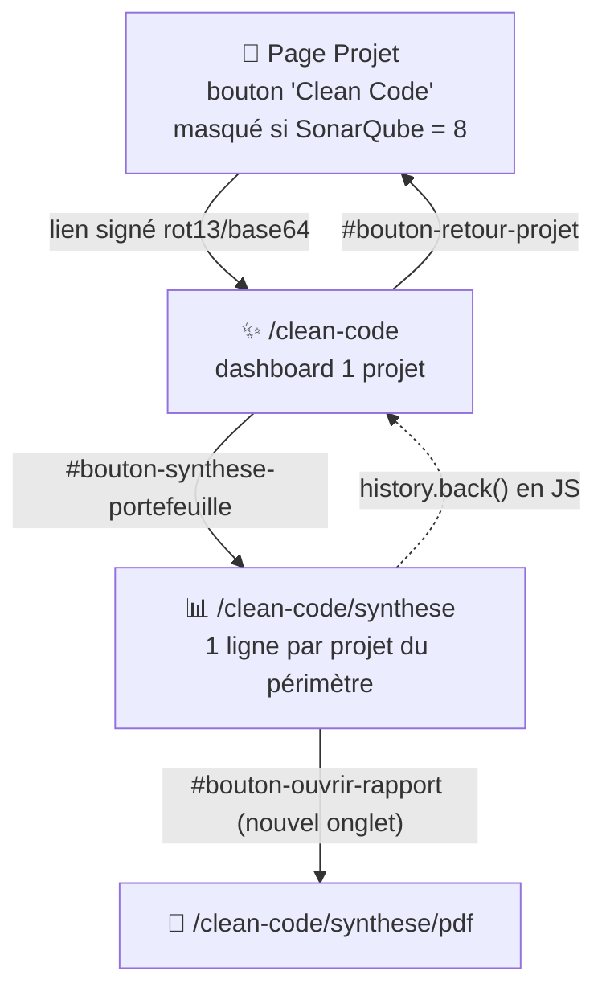

# ✨ Clean Code

## 🎯 À quoi ça sert

SonarQube 10+ a introduit un nouveau modèle de notation **Clean Code**, qui vient compléter la classification historique (bugs/vulnérabilités/code smells) par trois axes : **catégories d'attribut** (`CONSISTENT`, `INTENTIONAL`, `ADAPTABLE`, `RESPONSIBLE`), **qualités logicielles impactées** (maintenabilité, fiabilité, sécurité) et **sévérité d'impact** (blocker → info, 5 niveaux). Ce module collecte et restitue ces indicateurs.

La collecte se fait automatiquement, intégrée au pipeline standard de collecte d'un projet (`BatchCollecteCleanCodeController`, appelé depuis la collecte des anomalies), via les facettes de l'API `/api/issues/search` de SonarQube (`cleanCodeAttributeCategories`, `impactSeverities`, `impactSoftwareQualities` + 3 appels compliance OWASP/SANS/CWE).

Sur un serveur SonarQube antérieur à la version 10 (qui ne supporte pas ces facettes), la collecte est **silencieusement ignorée**. Les pages Clean Code elles-mêmes **ne collectent jamais rien** : lecture pure de la table `clean_code` (+ `historique` pour l'évolution).

!!! note "✅ Filtrage par groupe fonctionnel ajouté sur `/clean-code`"
    Contrairement à [OWASP](owasp.md)/[Suivi](suivi.md)/[COSUI](cosui.md), `CleanCodeController::index()` ne vérifiait jusqu'ici **aucune** appartenance au groupe fonctionnel de l'utilisateur connecté — seul le pare-feu (`ROLE_UTILISATEUR`) protégeait la page.
    Comme le token n'est qu'un `rot13(base64(...))` sans clé secrète côté serveur, on réutilise  le trait partagé `App\Controller\Traits\ProjetPerimetreGuard` (même mécanisme que OWASP/Suivi/COSUI).
    La page `/clean-code/synthese` n'était en revanche pas concernée : elle ne prend aucune clé Maven en paramètre, elle liste directement les projets de `MesProjets::liste($groupes)`.

## 🗺️ Cartographie



!!! note "🔗 Navigation par lien signé, pas par rôle Symfony dédié"
    Comme OWASP/Répartition/COSUI/Profil, `/clean-code` n'est protégée par aucun rôle Symfony spécifique (seule la règle globale `ROLE_UTILISATEUR` s'applique) : le token est un `rot13(base64("hashcode(maven_key)|maven_key"))` généré côté page Projet — accessible uniquement à qui est passé par cette page, et désormais vérifié côté serveur contre le groupe fonctionnel (voir note ci-dessus). `/clean-code/synthese` repose uniquement sur l'appartenance à un groupe fonctionnel (`MesProjets::liste()`), pas sur un jeton.

## 🧭 Chemin de fer de la page `/clean-code`

<!-- markdownlint-disable MD046 -->
```text
Page Clean Code
│
├── 🧵 Fil d'Ariane : Accueil › Mon projet › Clean Code Taxonomy
├── 🔔 Zone de messages (flash serveur uniquement)
│
├── ℹ️ Callout pédagogique (distinction Attribut Clean Code / Impact qualité × sévérité)
│
├── 📊 Ligne 1 — 3 cartes
│        ├── Score de risque (/4,0) + delta vs version précédente
│        ├── Gouvernance RESPONSIBLE (%) + delta
│        └── Exposition Sécurité (%) + delta
│
├── 📈 Ligne 2 — 2 graphiques (donut catégories, barres horizontales sévérités)
├── 📉 Courbe d'évolution (si ≥2 collectes dans l'historique, sinon message dédié)
│
├── 🧩 Ligne 3 — 3 cartes qualité logicielle (Maintenabilité / Fiabilité / Sécurité)
├── 📋 Ligne 4 — 3 indicateurs de conformité (OWASP Top 10 2021 / SANS-CWE Top 25 / CWE)
│
├── 🗒️ Tableau détail des 4 catégories d'attribut (ligne RESPONSIBLE surlignée si >0)
│
└── 🔘 Footer : Retour au projet / Portefeuille (→ /clean-code/synthese)
```
<!-- markdownlint-enable MD046 -->

## 📁 Page `/clean-code` — blocs détaillés

Si le token est absent, mal formé, ou que l'utilisateur n'a pas accès au projet (périmètre) ou qu'aucune donnée n'existe pour la clé maven (`CleanCodeRepository::selectCleanCode` renvoie vide) → callout unique (400, 404/406 périmètre, ou 404 données selon le cas) invitant à lancer une collecte depuis la page Projet, rien d'autre affiché.

Sinon :

- **Bandeau projet** : nom, version (dernière `information_projet`), date de collecte, nombre total d'issues.
- **3 cartes** :

  - *Score de risque* — `BLOCKER×4 + HIGH×3 + MEDIUM×2 + LOW×1 + INFO×0,5 / nb issues`, sur 4,0 ; badge critique/élevé/moyen/faible ; delta vs version précédente (▲/▼/stable) si un historique existe.
  - *Gouvernance RESPONSIBLE* — % d'issues catégorie RESPONSIBLE, couleur alerte si >5 %.
  - *Exposition Sécurité* — `quality_security / (maintainability+reliability+security)`, couleur alerte si >15 %, avertissement si >5 %.
- **2 graphiques** : donut des 4 catégories d'attribut (RESPONSIBLE en rouge) ; barres horizontales des 5 niveaux de sévérité d'impact.
- **Courbe d'évolution** (si ≥2 lignes d'historique disponibles, sinon message "pas encore assez de données") : score de risque, % RESPONSIBLE, % sécurité, sur les 10 dernières collectes enregistrées.
- **3 cartes qualité logicielle** : Maintenabilité (neutre), Fiabilité (alerte si >0), Sécurité (alerte si >0).
- **3 indicateurs de conformité** : OWASP Top 10 2021, SANS/CWE Top 25, CWE (total de références, peut cumuler plusieurs tags par issue).
- **Tableau détail** : une ligne par catégorie d'attribut (signification, nb issues, % du total), ligne RESPONSIBLE surlignée si >0, total = 100 %.

## 🧭 Chemin de fer de la page `/clean-code/synthese`

<!-- markdownlint-disable MD046 -->
```text
Page Clean Code — Synthèse
│
├── 🧵 Fil d'Ariane : Accueil › Clean Code — Synthèse
├── 🔔 Zone de messages (flash serveur uniquement)
├── 🏷️ Badge de périmètre ("Périmètre : {groupes}" ou "Aucun périmètre")
│
├── 📊 Tableau 15 colonnes (1 ligne par projet du périmètre, trié par risque)
│
└── 🔘 Footer : Retour (history.back()) / Rapport PDF (nouvel onglet)
```
<!-- markdownlint-enable MD046 -->

## 📊 Page `/clean-code/synthese` — blocs détaillés

- Badge de périmètre ("Périmètre : {groupes}" ou "Aucun périmètre").
- Cas d'absence de données, dans l'ordre de vérification : aucun groupe fonctionnel rattaché → inviter à contacter un gestionnaire ; aucun projet dans le périmètre → callout dédié ; aucune donnée Clean Code sur les projets du périmètre → callout dédié.
- **Tableau 15 colonnes**, trié par niveau de risque (critique→faible) puis nom de projet : Projet/Version, Quality Gate, notes A-E (maintenabilité/fiabilité/sécurité/complexité/complexité cognitive), niveau de risque Clean Code, % RESPONSIBLE, nb bugs, nb vulnérabilités, % couverture, % duplication, nb OWASP — chaque colonne numérique affiche « — » si la donnée est absente plutôt qu'un zéro trompeur.

!!! caution "⚠️ Le PDF de synthèse est moins riche que l'écran"
    L'export PDF (`clean_code_synthese_pdf`) ne reprend que 9 des 15 colonnes du tableau web : il omet le Quality Gate, les notes de complexité, le % RESPONSIBLE, le % de duplication et le nombre d'anomalies OWASP — à garder à l'esprit si le PDF est partagé comme référence unique.

## 🗃️ Données stockées

Table `clean_code` (voir [Architecture — base de données](../architecture/architecture-base-de-donnees.md)) : clé maven, nombre total d'issues, compteurs par catégorie d'attribut, par qualité logicielle impactée, par sévérité d'impact, et les 3 indicateurs de conformité. Recopiés dans `historique` lors de l'enregistrement d'une version — voir [Suivi](suivi.md).

## ⚠️ Messages remontés par la page

### Page `/clean-code` (flash serveur, `CleanCodeController::index()`)

| Sévérité | Déclencheur | Message |
| --- | --- | --- |
| `error` | Token absent | ❌ La requête est incorrecte (Erreur 400). |
| `error` | Token présent mais indécodable (base64/format invalide) | ❌ La requête est incorrecte (Erreur 400). |
| `warning` | Utilisateur sans groupe fonctionnel | Vous devez être rattaché à un groupe fonctionnel (Erreur 404). |
| `warning` | Aucun projet trouvé pour le groupe fonctionnel de l'utilisateur | ⚠️ Je n'ai pas trouvé de projets pour ton groupe fonctionnel. Vérifie le nom du tag utilisé dans SonarQube (Erreur 406). |
| `warning` | Projet décodé hors du périmètre de l'utilisateur | ⚠️ Le projet n'est pas présent dans la liste de projets de l'utilisateur. |
| `warning` | Token valide et projet dans le périmètre, mais aucune donnée `clean_code` | ⚠️ Aucune donnée clean code disponible pour ce projet. Lancez une collecte depuis la page projet. |

### Page `/clean-code/synthese` (flash serveur, `CleanCodeSyntheseController::index()`)

| Sévérité | Déclencheur | Message |
| --- | --- | --- |
| `warning` | Utilisateur sans groupe fonctionnel rattaché | ⚠️ Vous devez être rattaché à un groupe fonctionnel pour accéder à cette vue (Erreur 404). |
| `warning` | Aucun projet dans le périmètre de l'utilisateur | ⚠️ Aucun projet trouvé pour votre groupe fonctionnel — vérifiez le tag SonarQube (Erreur 406). |
| `warning` | Aucun projet du périmètre ne dispose de données clean code dans l'historique | ⚠️ Aucun projet du portefeuille ne dispose encore de données clean code dans l'historique. |

## 📚 Pour aller plus loin

- [Projet](projet.md) : point d'entrée du lien signé vers cette page.
- [Profil](profil.md) : autre exemple de navigation par lien signé.

-**-- FIN --**-

[Retour au menu principal](/index.html)
