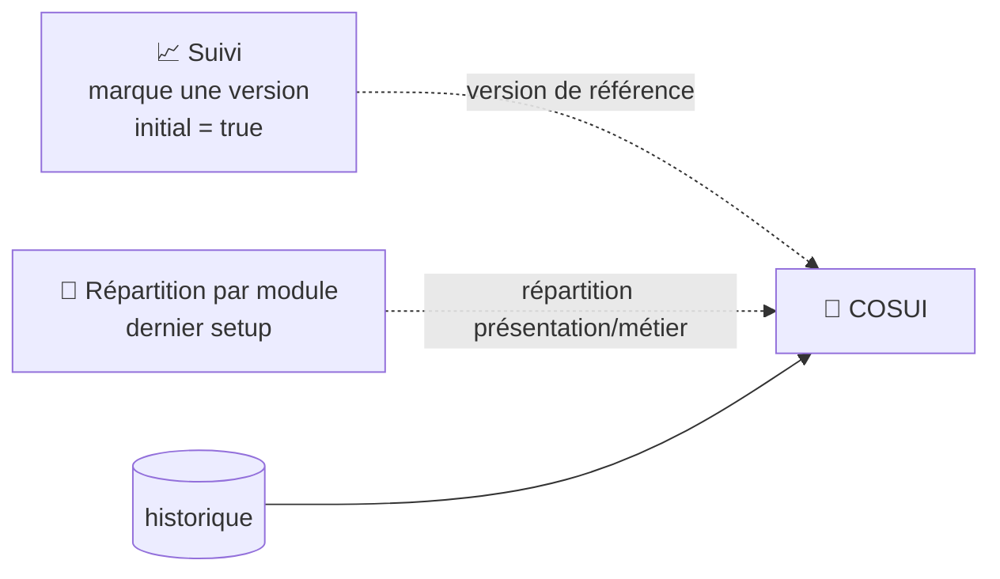

# 📅 COSUI — Comité de suivi

Compare la **version courante** d'un projet (dernière ligne de `historique`, triée par date) à sa **version de référence** (ligne marquée `historique.initial = true`, définie depuis la page [Suivi](suivi.md#️-modifier-les-paramètres-dune-version)).
Accessible depuis [Projet](projet.md) via un lien avec la clé Maven encodée.

Aucun rôle métier spécifique n'est requis (`ROLE_UTILISATEUR` suffit).

!!! note "🔓 Jeton = confort de navigation, mais pas que..."
    L'accès se fait via `/projet/cosui?token=...`, un jeton **ROT13 + Base64** (`salt|maven_key`) — même mécanisme que [Suivi](suivi.md)/[Répartition](repartition_details.md)/OWASP/Clean Code.
    Ce jeton n'a jamais eu vocation à être une preuve cryptographique : sa fonction est d'éviter d'exposer la clé Maven en clair dans l'URL au fil de la navigation interne, pas de filtrer l'accès.
    Le vrai périmètre de sécurité tient en deux couches, indépendantes du contenu du jeton :

    1. **Le pare-feu Symfony** (`config/packages/security.yaml`, `access_control` sur `^/api/secure/` → `ROLE_UTILISATEUR`) exige une session authentifiée valide pour atteindre la moindre route — un `curl` sans session (même avec un jeton parfaitement forgé après rétro-ingénierie du JS) est rejeté avant même d'atteindre le contrôleur.
    2. **`listeProjet()`**, appelée dans `projetCosui()` — 404 si l'utilisateur n'a aucun groupe fonctionnel, 406 si le projet n'appartient pas à son périmètre. La méthode vérifie que la clé Maven décodée appartient bien au **groupe fonctionnel** de l'utilisateur *authentifié* — donc même une session légitime ne peut pas afficher un projet hors de son périmètre, jeton ou pas.

## 🗺️ Origine des données

<!-- markdownlint-disable MD046 -->

<!-- markdownlint-enable MD046 -->

Si aucune version de référence n'a été définie, les valeurs par défaut sont affichées (version « 0.0.0 », notes « F », compteurs à zéro) plutôt qu'une erreur bloquante. De même, si aucune [Répartition par module](repartition_details.md) n'a encore été lancée pour ce projet, le tableau « Répartition des défauts » reste vide (`--`).

!!! note "✅ Avertissement affiché en cas de répartition partielle"
    Un bandeau d'avertissement s'affiche désormais sous le `setup` dès que la répartition lue n'est pas complète : `complet (100%)` → rien, `partiel (66%)`/`partiel (33%)` → 66 %/33 %, `inconnue` → 0 %.
    Le calcul (`ProjetCosuiService::controlToPercent()`) est fait une fois pour toutes côté serveur, pas dupliqué en JS.

COSUI est une page **100 % SSR** (server-side rendering) : elle ne fait **aucun appel réseau à SonarQube**, ni côté PHP ni côté JavaScript — tout provient de `historique` et `repartition` en base locale, via `ProjetCosuiService`.

## 🧭 Chemin de fer de la page

<!-- markdownlint-disable MD046 -->
```text
Page COSUI
│
├── 🧵 Fil d'Ariane : Accueil › Projet › COSUI
├── 🔔 Zone de messages (flash serveur uniquement — aucun message JS, voir plus bas)
│
├── 🆔 Setup (dernier cycle de répartition connu pour ce projet)
├── ⚠️ Bandeau « répartition partielle » (si control ≠ complet 100 %)
├── 🔀 Interrupteur « Afficher les variations ? » (flèches ▲/▼/= , purement client)
│
├── 📊 Tableau de comparaison des notes
│        ├── Colonne « Application référence » (+ bouton ℹ️ → modale de détail)
│        ├── Maintenabilité / Fiabilité / Vulnérabilité / Hotspot
│        └── Bloquant / Critique / Majeur / Note (référence vs courante)
│
├── 🧩 Tableau « Répartition des défauts » (version courante uniquement)
│        └── Maintenabilité / Fiabilité / Vulnérabilité × Métier / Présentation × Bloquant/Critique/Majeur
│
├── 🕸️ Graphique radar (6 axes, référence vs courante)
│
└── 🪟 Modale « Projet de référence » (déjà chargée en SSR, pas de nouvel appel réseau)
```
<!-- markdownlint-enable MD046 -->

## 📊 Tableau de comparaison des notes

Une colonne « référence » et une colonne « courante », avec pour chacune : version, date, notes de fiabilité/sécurité/maintenabilité/hotspot (badge coloré A-F), et le détail bloquant/critique/majeur par catégorie (bug, vulnérabilité, mauvaise pratique).
Une icône ℹ️ à côté de la date de référence ouvre une fenêtre récapitulant en détail cette version de référence (les données sont déjà chargées côté serveur, aucun nouvel appel réseau).

Un interrupteur **« Afficher les variations ? »** affiche/masque, purement côté navigateur (aucun rappel serveur), des flèches de tendance (▲/▼/=) à côté de chaque compteur, comparant référence et version courante.

## 🧩 Répartition des défauts

Tableau croisé Maintenabilité/Fiabilité/Vulnérabilité × Présentation/Métier × Bloquant/Critique/Majeur — **pour la version courante uniquement** (pas de comparaison référence/courante ici, contrairement au tableau du dessus), alimenté par le dernier cycle de la page [Répartition par module](repartition_details.md).

!!! note "✅ Colonne Fiabilité corrigée (2026-07-28)"
    `ProjetCosuiService::generateRender()` construit la clé de variable de rendu à partir du même identifiant interne (`bug`/`vulnerability`/`code_smell`) que celui utilisé pour retrouver la colonne en base (`frontendBugBlocker`, etc.). Le template attend cependant `nombre_metier_reliability_*`/`nombre_presentation_reliability_*` (label affiché : Fiabilité) — sans correspondance entre `bug` et `reliability`, la colonne Fiabilité du tableau affichait toujours **0**, quelle que soit la donnée réellement en base. Corrigé par une table de correspondance dédiée à la construction de la clé de rendu ; les colonnes Vulnérabilité/Maintenabilité n'étaient pas concernées (leur identifiant interne correspond déjà au label attendu). Trouvé en écrivant la couverture e2e du module.

## 🕸️ Graphique radar

Compare visuellement référence et version courante sur 6 axes : fiabilité, vulnérabilité, hotspots, maintenabilité, couverture de tests, dette technique (ratio inversé). Les notes lettres sont converties en points sur 100 pour permettre le tracé (`note2point()` côté serveur).

!!! note "✅ Seuils du tooltip Hotspot alignés sur `note2point()`"
    Le serveur (`ProjetCosuiService::note2point()`) utilise des seuils fixes (A=100/B=80/C=60/D=30/E=10/F=0) pour construire les points du radar — et `construireRadarChart()` convertit bien l'axe **Hotspot** via cette même grille, au même titre que Fiabilité/Vulnérabilité/Maintenabilité.
    Les axes **Couverture** et **Dette** restent une bucketisation JS purement indicative (le serveur n'y calcule pas de note lettre, seulement une valeur numérique), donc rien à aligner pour eux.

## ⚠️ Messages remontés par la page

COSUI n'utilise jamais `showMessage()` côté JavaScript (`index-cosui.js` ne contient aucun appel) — la page ne fait aucun appel AJAX propre, donc **tous les messages viennent du flash serveur** au chargement (`CosuiController::projetCosui()`).

| Sévérité | Déclencheur | Message |
| --- | --- | --- |
| `error` | Paramètre `token` absent de l'URL | ❌ La requête est incorrecte (Erreur 400). |
| `error` | Décodage du token en échec (base64/format invalide) | ❌ La requête est incorrecte (Erreur 400). |
| `warning` | Utilisateur sans groupe fonctionnel | ⚠️ Vous devez être rattaché à un groupe fonctionnel (Erreur 404). |
| `warning` | Projet absent de la liste filtrée par groupe fonctionnel (`listeProjet()`) | ⚠️ Je n'ai pas trouvé de projets pour ton groupe fonctionnel / le projet n'est pas dans ta liste (Erreur 406). |
| *(dynamique, relayé du service)* | `ProjetCosuiService::generateRender()` retourne un code ≠ 200 (ex. aucune donnée de référence en base, échec de lecture du `setup`) | Le type et le message renvoyés par le service sont affichés tels quels (préfixés ❌) |
| `critical` | Exception `RuntimeException` inattendue pendant la génération | 🔴 Erreur lors de la génération COSUI. |

## 📚 Pour aller plus loin

- [Projet](projet.md) — point d'entrée vers COSUI.
- [Suivi](suivi.md) — définit la version de référence (`historique.initial = true`) et l'historique complet.
- [Répartition détaillée](repartition_details.md) — alimente le tableau « Répartition des défauts ».
- [Gestion de la sécurité](../developpement/securite.md) — détail des rôles.

-**-- FIN --**-

[Retour au menu principal](/index.html)
