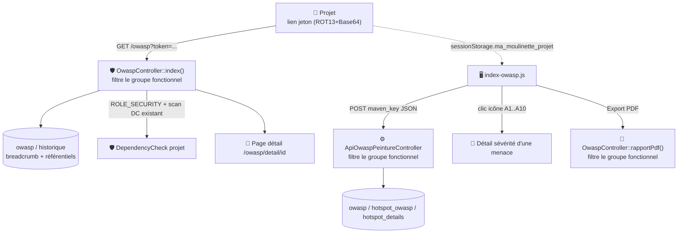

# 🛡️ Page OWASP

Vue de restitution des vulnérabilités et hotspots de sécurité d'un projet, classés selon les référentiels **OWASP Top 10 2017 et 2021** (le référentiel 2025 est prévu côté interface mais pas encore supporté par SonarQube — voir la note ci-dessous). C'est une page de **lecture pure** : elle ne déclenche aucune collecte SonarQube — les données proviennent de la collecte lancée depuis la page [Projet](projet.md) (`ApiCollecteController` → tables `owasp`/`hotspot_owasp`/`hotspot_details`).

!!! note "🔓 Aucun rôle métier dédié, mais un filtrage par groupe fonctionnel"
    Contrairement à ce qu'on pourrait attendre, l'accès à la page OWASP elle-même n'exige aucun rôle spécifique (`ROLE_UTILISATEUR` suffit). Seul le bouton **Dependency-Check** est conditionné par `ROLE_SECURITY`.
    Depuis le 2026-07-17, l'accès au projet lui-même est filtré par **groupe fonctionnel** de l'utilisateur authentifié (voir ci-dessous) — aligné sur [Suivi](suivi.md) et [COSUI](cosui.md).

## 🔀 Deux mécanismes de clé Maven, deux filtrages

OWASP est la seule des pages « projet » à combiner **deux** sources de clé Maven distinctes, chacune désormais filtrée séparément :

1. **Le chargement de la page** (`GET /owasp?token=...`) : comme [Suivi](suivi.md)/[COSUI](cosui.md), un jeton ROT13+Base64 (`salt|maven_key`) est décodé côté serveur par `OwaspController::index()`. Il sert au fil d'Ariane, au bloc « Informations » (application/version) et au lien Dependency-Check.
2. **Les appels AJAX de la page** (`remplissageOwaspInfo`, `remplissageHotspotInfo`, `remplissageHotspotListe`, `remplissageHotspotDetails`, `remplissageDetailsHotspotOwasp`, l'export PDF) : `index-owasp.js` ne réutilise **pas** le token — il relit `sessionStorage.getItem('ma_moulinette_projet')` (posé par la page [Projet](projet.md) au clic sur un projet) et l'envoie tel quel en POST à `ApiOwaspPeintureController`.

!!! note "✅ Filtrage par groupe fonctionnel ajouté sur les deux mécanismes"
    Jusqu'ici, ni `OwaspController::index()`/`rapportPdf()`, ni les 5 endpoints de `ApiOwaspPeintureController` ne vérifiaient l'appartenance du projet au groupe fonctionnel de l'utilisateur — seul le pare-feu (`ROLE_UTILISATEUR`) protégeait la page. Comme `sessionStorage` est manipulable côté client (outils de développement du navigateur), le filtrage ne pouvait de toute façon pas reposer sur le JS : il fallait le poser côté serveur, sur chacun des 7 points d'entrée (`index`, `rapportPdf`, et les 5 méthodes de `ApiOwaspPeintureController`).
    La vérification (`ProjetPerimetreGuard::verifierPerimetreProjet()`) est désormais **mutualisée dans un trait partagé** (`App\Controller\Traits\ProjetPerimetreGuard`) plutôt que dupliquée méthode par méthode — c'est la 3ᵉ/4ᵉ reprise du même contrôle après Suivi/COSUI, ce qui a fait basculer la duplication en abstraction.

!!! note "✅ Casse de la clé Maven préservée"
    `OwaspController::decodeToken()` appliquait un `strtolower()` sur la clé Maven décodée — absent de `SuiviController`/`CosuiController`. Une clé à casse mixte réelle (ex. `fr.ma-moulinette:Ma-Moulinette`) devenait `ma-moulinette` et ne correspondait plus (comparaison stricte `===`) à l'entrée `liste_projet`/`historique` : le projet était rejeté à tort en 406 alors qu'il appartenait bien au périmètre de l'utilisateur. Corrigé pour préserver la casse, comme le reste de l'application.

## 🗺️ Cartographie

<!-- markdownlint-disable MD046 -->

<!-- markdownlint-enable MD046 -->

## 📅 Référentiel actif selon la version SonarQube

Le référentiel proposé dépend du paramètre applicatif `sonar.version` (`SONAR_VERSION`), pas d'un choix utilisateur libre :

| Version SonarQube | Référentiels disponibles |
| --- | --- |
| 8 | 2017 uniquement |
| ≥ 9 (y compris les versions calendaires type `2024`, `2026`, ...) | 2017 + 2021 |

!!! note "🤔 Contre-intuitif : le référentiel OWASP et son support SonarQube n'avancent pas au même rythme"
    L'OWASP publie ses Top 10 par génération — **2013, 2017, 2021, 2025**. Mais **l'intégration côté SonarQube** (les facettes `owaspTop10`/`owaspTop10-2021`/... exposées par `/api/issues/search`) ne suit pas cette date de publication : c'est SonarQube qui décide, dans une version donnée de son propre produit, quels référentiels il sait classer.
    À ce jour, **même la dernière version connue de SonarQube (2026) ne classe pas encore les failles selon l'OWASP Top 10 2025** — seuls 2017 et 2021 sont réellement disponibles, quelle que soit la valeur de `sonar.version`.
    Concrètement : le bouton « OWASP 2025 » de la page reste désactivé indépendamment de `sonar.version`, tant qu'aucune version de SonarQube ne supporte la facette correspondante — pas de seuil numérique à deviner ou à maintenir pour ça.
    Le jour où SonarQube l'ajoutera, il faudra explicitement l'activer dans `templates/owasp/index.html.twig` (et implémenter la collecte associée dans `BatchCollecteOwaspController`, qui aujourd'hui ne récupère que 2017 et 2021).

!!! note "🔍 Page à 0 partout malgré des vraies failles visibles dans SonarQube : vérifier la classification côté SonarQube avant de suspecter l'application"
    `BatchCollecteOwaspController` interroge les facettes officielles `owaspTop10`/`owaspTop10-2021` de `/api/issues/search` — la classification que SonarQube calcule lui-même à partir des métadonnées de chaque règle.
    Ce n'est **pas** la même chose que la facette générique `sonarsourceSecurity` (catégories propriétaires SonarSource) ni que les tags libres d'une issue (`owasp-a01`, etc.) : une règle peut très bien être détectée comme un problème de sécurité (`sonarsourceSecurity` non vide, éventuellement classée `"others"` ou dans une catégorie propriétaire comme `"encrypt-data"`) **sans** que ses métadonnées `owaspTop10`/`owaspTop10-2021` soient renseignées pour la version de SonarQube installée, ni qu'elle porte le moindre tag `owasp-aXX` — auquel cas les deux mécanismes ci-dessous renvoient 0 en toute cohérence : SonarQube ne rattache tout simplement plus cette faille à OWASP (par exemple parce qu'il la classe uniquement par CWE).
    Pour vérifier rapidement : `GET /api/issues/search?componentKeys={maven_key}&facets=owaspTop10,owaspTop10-2021,sonarsourceSecurity` — si `sonarsourceSecurity` remonte des comptes alors que `owaspTop10`/`owaspTop10-2021` sont vides, le problème est une classification manquante côté SonarQube (règle/version), pas un bug applicatif.

!!! note "✅ Secours par tag `owasp-aXX` implémenté (colonne `owasp.source`)"
    Quand la facette officielle renvoie `total=0` pour un référentiel, `BatchCollecteOwaspController` déclenche un appel de secours (`GET /api/issues/search?tags=owasp-a01,...,owasp-a10`, mémoïsé — un seul appel HTTP même si 2017 **et** 2021 en ont besoin, le tag n'étant pas spécifique à une année de référentiel).
    La ligne persistée en base porte alors `source='tag'` au lieu de `'facet'`, exposé par l'API de peinture et affiché sur la page à côté du référentiel actif (« OWASP 2021 — OWASP (tag) »).
    Un callout pédagogique sur la page explique cette distinction aux utilisateurs. Si le secours ne trouve rien non plus, `source` reste `'facet'` (rien à attribuer à l'un ou l'autre mécanisme).

## 🧭 Chemin de fer de la page

<!-- markdownlint-disable MD046 -->
```text
Page OWASP
│
├── 🧵 Fil d'Ariane : Accueil › Projet › OWASP
├── 🔔 Zone de messages (flash serveur + messages JS)
│
├── 🔘 Sélecteurs de référentiel (2017 / 2021 / 2025 — actif/désactivé selon sonar.version)
├── 📄 Bouton Export PDF (maven_key + référentiel lus depuis sessionStorage)
├── 📦 Bouton Dependency-Check (ROLE_SECURITY + scan DC existant, découplé du breadcrumb OWASP)
│
├── ℹ️ Bloc Informations
│        ├── Vulnérabilité (total, bloquante/critique/majeure/mineure)
│        ├── Hotspot (total, HIGH/MEDIUM/LOW, examiné/à vérifier, note A-E)
│        └── Répartition par module (frontend/backend/autre)
│
├── 📊 Tableau de synthèse (une ligne par catégorie A1..A10)
│        ├── icône 🔎 → modale détail (sévérité HIGH/MEDIUM/LOW de la catégorie)
│        ├── colonne Faille (compteur)
│        └── colonne Hotspot (compteur + % examiné)
│
├── 🗒️ Tableau détaillé des failles (règle, sévérité, composant, ligne, message, statut)
│
├── 📊 Graphique en barres (répartition des menaces par catégorie A1..A10)
│
├── 📋 Comparaison des référentiels (bouton → modale image statique 2017/2021 vs 2025)
│
├── 📘 Accordéon Référentiel (sélecteur + 3 blocs 2017/2021/2025, 10 catégories chacun)
│        └── « Plus de détails... » → /owasp/detail/{id}
│
└── 🪟 Modale « Owasp et points chauds » (détail HIGH/MEDIUM/LOW d'une catégorie)
```
<!-- markdownlint-enable MD046 -->

## 📋 Contenu de la page

- **Callout d'information** : encart pédagogique expliquant la distinction facet/tag (voir « ✅ Secours par tag `owasp-aXX` implémenté » plus haut) — toujours visible, en tête de page ;
- **Bloc Informations** : référentiel actif, total de vulnérabilités par sévérité (bloquante/critique/majeure/mineure), total de hotspots par probabilité et par statut (examiné/à vérifier) avec note A-E, répartition par module (frontend/backend/autre — voir [Architecture des applications Java](../architecture/architecture-java.md)) ;
- **Tableau de synthèse** : une ligne par catégorie A1-A10, nombre de failles et de hotspots avec badge de note ; la source (facet/tag) du référentiel actif est affichée juste au-dessus, à côté de son numéro ;
- **Tableau détaillé** : liste des hotspots (règle, sévérité, composant, ligne, message, statut) ;
- **Graphique en barres** : répartition des failles par catégorie ;
- **Sélecteur de référentiel** (2017/2021/2025) : accordéon listant chaque catégorie avec description et lien vers sa page de détail complète (contenu documentaire OWASP officiel).

!!! note "✅ Accordéon masqué par défaut au chargement"
    Les 3 blocs de l'accordéon démarraient tous avec `display-off` — rien n'était visible tant qu'on n'avait pas interagi une première fois, ce qui donnait l'impression qu'un premier clic « ne faisait rien ».
    Le bloc du référentiel actif le plus récent (2025 > 2021 > 2017, calculé côté Twig à partir des mêmes variables `referential_2017`/`referential_2021`/`referential_2025`) est désormais visible dès le chargement — sans appel SonarQube, c'est de la documentation déjà chargée par le contrôleur.
    Le `<select id="js-owasp-select">` est synchronisé sur ce même choix par défaut (attribut `selected` posé côté Twig) — auparavant il affichait toujours « OWASP 2017 » présélectionné, même quand l'accordéon montrait 2021 ou 2025.

## 📄 Export PDF

Génère un rapport PDF côté serveur à partir des mêmes données (aucun appel SonarQube au moment de l'export). Le bouton lit `maven_key` et le référentiel courant depuis `sessionStorage` (mêmes clés que les appels AJAX de la page).

!!! caution "⚠️ Le référentiel 2025 n'est pas supporté par l'export PDF"
    La validation du paramètre `referential_owasp` de l'export accepte uniquement `2017` et `2021` (repli silencieux sur 2021 si `2025` est demandé). Sans conséquence aujourd'hui puisque le bouton 2025 est désactivé côté page (SonarQube ne le supporte pas encore), mais à corriger le jour où 2025 sera réellement activé pour ne pas réintroduire ce repli silencieux.

## 🔗 Dependency-Check

Le bouton vers [DependencyCheck](../dependency-check/pages.md) est **indépendant** de l'état des référentiels OWASP : il s'affiche dès qu'un scan DependencyCheck existe pour le projet (peu importe que les référentiels OWASP soient vides), sous réserve du rôle `ROLE_SECURITY`.

## ⚠️ Messages remontés par la page

### Messages JS (`index-owasp.js` → `showMessage()`)

| Sévérité | Déclencheur | Message |
| --- | --- | --- |
| `error` | `peinture/owasp/liste` renvoie `code=400` | ❌ La requête n'est pas conforme (Erreur 400). |
| `warning` | `peinture/owasp/liste` renvoie `code=406` | ⚠️ Le projet n'a pas été trouvé ! |
| `error` | `peinture/owasp/hotspot/info`, `/hotspot/liste` ou `/hotspot/details` renvoie `code=400` | ❌ La requête n'est pas conforme (Erreur 400). |
| `error` | `peinture/owasp/hotspot/severity` renvoie `code=400` | ❌ [Severity] La requête n'est pas conforme (Erreur 400) ! |
| `warning` | Export PDF cliqué sans projet en `sessionStorage` | ⚠️ Aucun projet sélectionné — impossible d'exporter le rapport. |

### Flash serveur (`OwaspController`)

| Sévérité | Déclencheur | Message |
| --- | --- | --- |
| `error` | Paramètre `token` absent de l'URL | ❌ La requête est incorrecte (Erreur 400). |
| `error` | Décodage du token en échec (base64/format invalide) | ❌ La requête est incorrecte (Erreur 400). |
| `warning` | Utilisateur sans groupe fonctionnel (`ProjetPerimetreGuard`) | Vous devez être rattaché à un groupe fonctionnel (Erreur 404). |
| `warning` | Aucun projet dans le groupe fonctionnel filtré, ou clé Maven absente de la liste (`ProjetPerimetreGuard`) | Je n'ai pas trouvé de projets pour ton groupe fonctionnel. Vérifie le nom du tag utilisé dans SonarQube (Erreur 406). / Le projet n'est pas présent dans la liste de projets de l'utilisateur. |
| `error` | Échec de lecture d'un des 3 référentiels (`selectOwaspTop10Referential`) | Message dynamique du repository, préfixé ❌ |
| `warning` | Référentiels 2017, 2021 **et** 2025 tous vides | ⚠️ Les informations concernant les référentiels OWASP n'ont pas été trouvés. |
| `error` | Échec de `selectOwaspVersion` (breadcrumb) | Message dynamique incluant le code d'erreur |

`OwaspController::rapportPdf()` (export PDF) lève une `NotFoundHttpException` (404 HTTP direct, pas de flash) en cas de clé Maven manquante, d'utilisateur sans groupe fonctionnel, ou de projet hors périmètre.

## 📚 Pour aller plus loin

- [Projet](projet.md) — point d'entrée vers OWASP.
- [Suivi](suivi.md) / [COSUI](cosui.md) — même mécanisme de jeton et de filtrage par groupe fonctionnel côté page.
- [Gestion de la sécurité](../developpement/securite.md) — détail des rôles et démonstration boîte noire du pare-feu.

-**-- FIN --**-

[Retour au menu principal](/index.html)
