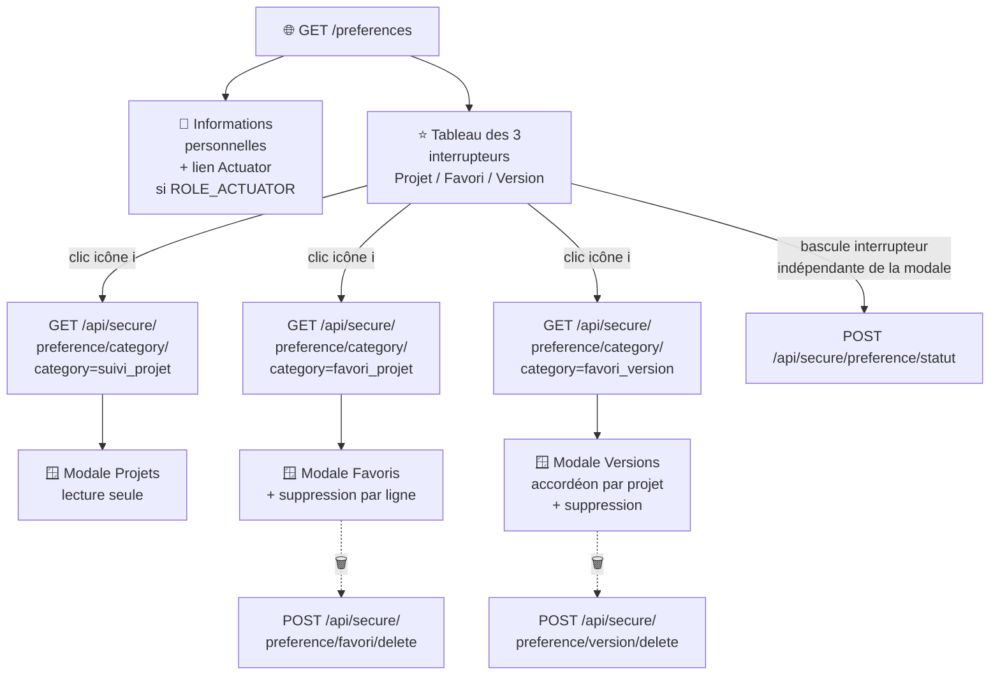

# ⚙️ Préférences utilisateur

Consultation des informations personnelles et personnalisation du suivi de projets. Aucun rôle spécifique requis (`ROLE_UTILISATEUR`).

!!! note "🔗 Accès"
    Cette page n'a pas d'icône dédiée dans le bandeau commun (voir [Accueil](accueil.md#-haut-de-page)) : elle est accessible depuis la carte « Réglages personnels » de la page d'accueil du back-office (`/admin`, voir [Dashboard back-office](../back-office/dashboard.md#-page-daccueil-cartes)), ou depuis la page « Plan du site » (lien en bas de page).

## 🗺️ Cartographie

<!-- markdownlint-disable MD046 -->

<!-- markdownlint-enable MD046 -->

L'icône ℹ️ (ouvre la modale, lecture) et l'interrupteur (bascule le statut, écriture) d'une même ligne sont deux actions indépendantes — cliquer l'un ne déclenche pas l'autre.

## 🧭 Chemin de fer

<!-- markdownlint-disable MD046 -->
```text
Page Préférences (/preferences)
│
├── 🧵 Fil d'Ariane : Accueil › Mes préférences
├── 🔔 Zone de messages (flash serveur + messages JS, voir plus bas)
│
├── 👤 Informations personnelles
│      ├── Avatar + nom/prénom + adresse courriel
│      ├── Mes privilèges (rôles)
│      ├── Groupe utilisateur (1 valeur, "Aucun" si absent)
│      └── Groupes fonctionnels (0..n, "Aucun" si vide)
│
├── 🌱 Bouton « Accéder à l'inventaire Actuator » (si ROLE_ACTUATOR)
│
├── ⭐ Tableau des préférences (3 lignes : Projet / Favori / Version)
│      ├── icône ℹ️ → ouvre la modale correspondante
│      └── interrupteur → bascule le statut en base
│
├── 🪟 Modale Projets (liste des projets suivis)
├── 🪟 Modale Favoris (liste + suppression par ligne)
└── 🪟 Modale Versions (accordéon par projet + suppression par ligne)
```
<!-- markdownlint-enable MD046 -->

## 👤 Informations personnelles

Affiche en lecture seule : avatar, nom/prénom, adresse courriel, rôles, groupe utilisateur (organisation de rattachement, un seul) et groupes fonctionnels (périmètre applicatif, un ou plusieurs).

!!! note "✅ ajout du groupe utilisateur"
    Cette page n'affichait auparavant que les groupes fonctionnels. Le groupe utilisateur (`Utilisateur::getGroupeUtilisateur()`, une seule valeur possible) est désormais affiché en complément, avec `Aucun` comme valeur par défaut si l'utilisateur n'en a pas.

## 🌱 Lien vers Actuator

Un bouton « Accéder à l'inventaire Actuator » est affiché sur cette page uniquement pour les utilisateurs disposant du rôle `ROLE_ACTUATOR` — voir [Actuator](actuator.md). La carte « Actuator » de la page d'accueil du back-office (même rôle requis) offre un second point d'entrée équivalent.

## ⭐ Tableau des préférences (3 interrupteurs)

| Option affichée | Clé réelle | Description affichée |
| --- | --- | --- |
| **Projet** | `suivi_projet` | Liste des projets à suivre |
| **Favori** | `favori_projet` | Liste des projets favoris |
| **Version** | `favori_version` | Liste des versions favorites |

Chaque interrupteur ouvre une modale listant les éléments concernés, avec un bouton de suppression par ligne pour les favoris et les versions — ces deux suppressions déclenchent bien un appel réseau.

!!! note "✅ clés désormais alignées avec le reste de l'application"
    Ces interrupteurs et leurs modales lisaient/écrivaient auparavant des clés `projet`/`favori`/`version` distinctes de celles utilisées ailleurs (bouton « cœur » de la page [Projet](projet.md), bloc favoris de l'[Accueil](accueil.md#-bloc-des-favoris), [Suivi](suivi.md)), ce qui rendait ces 3 réglages sans effet réel. `PreferenceController`, le JavaScript de la page et la suppression de version favorite (dont l'appel réseau était commenté) ont été corrigés pour utiliser les vraies clés `suivi_projet`/`favori_projet`/`favori_version` — les 3 interrupteurs et leurs modales pilotent maintenant bien l'état affiché ailleurs dans l'application.

La page « Ajouter une préférence » (orpheline, non routée, bouton « Valider » non fonctionnel) a été supprimée du code (template + JS).

Les 3 modales (Favoris/Projets/Versions) utilisent désormais un élément `<dialog>` avec gestion du focus à l'ouverture/fermeture (retour sur le bouton déclencheur), pour un fonctionnement correct au clavier et avec un lecteur d'écran.

## 💾 Enregistrement

Les préférences sont persistées en base (table `utilisateur`, colonne `preference` au format JSON). Chaque bascule d'interrupteur déclenche un enregistrement immédiat via une requête asynchrone.

## ⚠️ Messages remontés par la page

`index-preference.js` utilise désormais `showMessage()`/`hideMessage()` (`assets/js/common/messageHelper.js`) pour chacun des 5 appels vers `/api/secure/preference/*` — voir [Gestion des messages](../erreur/gestion-messages.md).
Un message de succès s'affiche après une bascule d'interrupteur ou une suppression réussie (disparaît après 5 secondes) ; un message d'erreur reprend le `type`/`message` renvoyé par l'API en cas d'échec métier, ou un message générique en cas d'erreur réseau/serveur inattendue.

| Code | Déclencheur | Message affiché |
| --- | --- | --- |
| 200 | Bascule d'un interrupteur réussie (`apiPreferenceStatut`) | ✅ La préférence a bien été mise à jour. |
| 200 | Suppression d'un favori réussie (`apiPreferenceFavoriDelete`) | ✅ Le favori a bien été supprimé. |
| 200 | Suppression d'une version favorite réussie (`apiPreferenceVersionDelete`) | ✅ La version a bien été supprimée des favoris. |
| 400 | `statut`/`category` manquant, ou catégorie hors whitelist (`apiPreferenceStatut`, `apiPreferenceCategory`) | ❌ La requête est incorrecte (Erreur 400). |
| 400 | `mavenKey` manquant (`apiPreferenceFavoriDelete`) | ❌ La requête est incorrecte (Erreur 400). |
| 400 | `index`/`mavenKey`/`version` manquant (`apiPreferenceVersionDelete`) | ❌ La requête est incorrecte (Erreur 400). |
| 404 | Index ou clé Maven introuvable dans les préférences (`apiPreferenceVersionDelete`) | ⚠️ La version demandée n'existe pas dans les préférences (Erreur 404). |
| 500 | Échec de l'écriture SQL (`updatePreference()`) | ❌ Une erreur est survenue lors de la mise à jour des préférences (Erreur 500). |
| — | Erreur réseau ou serveur inattendue (timeout, panne...) | 🔴 Message générique par action (ex. « Une erreur inattendue s'est produite lors de la mise à jour de la préférence (Erreur 500). ») |

!!! note "✅ Retour visuel désormais branché sur les 5 appels"
    Les listes lues via `apiPreferenceCategory` (Favoris/Projets/Versions) affichent aussi un message d'erreur si la lecture échoue, au lieu de laisser la modale s'ouvrir vide en silence.
    Pour les suppressions, la ligne n'est masquée côté écran qu'après confirmation du succès par le serveur — elle ne l'était auparavant que côté client, avant même l'appel réseau.

## 📚 Pour aller plus loin

- [Projet](projet.md) : bouton « cœur » pour gérer un favori-projet.
- [Accueil](accueil.md#-bloc-des-favoris) : affichage des favoris.
- [Suivi](suivi.md) : gestion des favoris de version et de la version de référence.
- [Actuator](actuator.md) : accessible depuis cette page pour les utilisateurs `ROLE_ACTUATOR`.

-**-- FIN --**-

[Retour au menu principal](/index.html)
