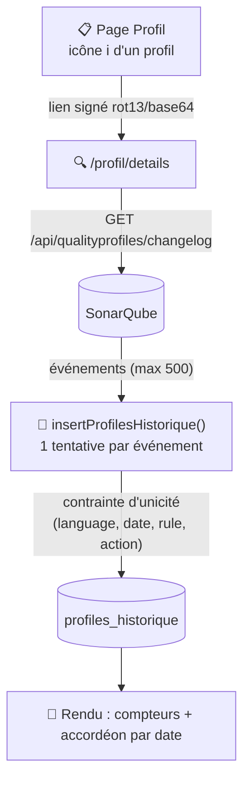

# 🔍 Profil — détails des changements

Historique des modifications de règles d'un profil qualité SonarQube, groupées par date. Accessible uniquement via le lien signé généré depuis [Profil](profil.md#-accès-au-détail-des-changements) ; aucun rôle spécifique n'est requis pour la consultation.
Contrairement à [Profil](profil.md), cette page n'est pas de la lecture pure : chaque chargement appelle `/api/qualityprofiles/changelog` sur SonarQube et **persiste** les changements reçus dans la table `profiles_historique` avant de les afficher.

!!! note "🔓 Le jeton n'est pas un mécanisme de sécurité"
    Le paramètre `?token=` (langage + nom de profil encodés en `rot13(base64(...))`) n'est **jamais revérifié cryptographiquement** côté serveur — c'est un simple obscurcissement d'URL, pas une signature.
    Un token absent affiche silencieusement une page minimale (`profil = 'NC'`, aucun message) ; un token présent mais mal formé (mauvais nombre de segments) affiche un message d'erreur.

## 🗺️ Cartographie



## 🧭 Chemin de fer de la page

<!-- markdownlint-disable MD046 -->
```text
Page Profil — Détails
│
├── 🧵 Fil d'Ariane : Accueil › Profil › Détails
├── 🔔 Zone de messages (flash serveur uniquement — pas d'appel AJAX sur cette page)
│
├── ⚠️ Callout fixe « Seuls les 500 premiers changements sont affichés »
├── 🔢 Nombre total de changements trouvés pour le profil
│
├── ℹ️ Informations générales
│        ├── Date d'initialisation (1ʳᵉ entrée connue)
│        ├── Date de dernière modification
│        ├── Nombre de règles (total renvoyé par SonarQube)
│        ├── Nombre de règles activées
│        ├── Nombre de règles modifiées
│        └── Nombre de règles désactivées
│
└── 📘 Accordéon groupé par date
         └── Par changement : statut (A/D/U), règle, description, auteur, détail technique (masqué sur mobile)
```
<!-- markdownlint-enable MD046 -->

## 📅 Contenu

Bandeau de synthèse : date de première analyse, date de dernière modification, nombre total de changements, nombre de règles activées / modifiées / désactivées.
Puis un menu accordéon groupé par date, chaque changement affichant : statut (A/D/U), nom de la règle, description, auteur, et détail technique (paramètres SonarQube) masqué sur mobile.

!!! note "✅ La réinsertion en doublon à chaque consultation a été corrigée"
    Ajout d'une contrainte d'unicité `(language, date, rule, action)` sur la table : une insertion en doublon est désormais silencieusement rejetée par `insertProfilesHistorique()` (code retour `23505`, déjà géré par `handleDatabaseException()`), sans casser la boucle d'insertion des événements suivants.

## 📏 Limite d'affichage

Seuls les **500 premiers changements** remontés par SonarQube sont affichés (limite de pagination fixe, pas un vrai plafond calculé) — l'avertissement à l'écran est affiché systématiquement, qu'il y ait effectivement plus de 500 changements ou non.

## ⚠️ Messages remontés par la page

Flash serveur uniquement (`ApiProfilController::profilDetails()`) — cette page n'a pas d'appel AJAX.

| Sévérité | Déclencheur | Message |
| --- | --- | --- |
| — | Token absent | *(aucun message — page minimale silencieuse, `profil = 'NC'`)* |
| `error` | Token présent mais mal formé (nombre de segments ≠ 3 après décodage) | ⚠️ Le token fourni est invalide ou mal formé (Erreur 422). |
| `warning` | Langage décodé non reconnu (ni référentiel SonarQube, ni alias Ma-Moulinette) | ⚠️ Le langage sélectionné n'est pas supporté (Erreur 404). |
| `error` | Échec de l'appel à `/api/qualityprofiles/changelog` | ❌ message d'erreur SonarQube dynamique |

## 📚 Pour aller plus loin

- [Profil](profil.md) : liste des profils qualité par langage.

-**-- FIN --**-

[Retour au menu principal](/index.html)
