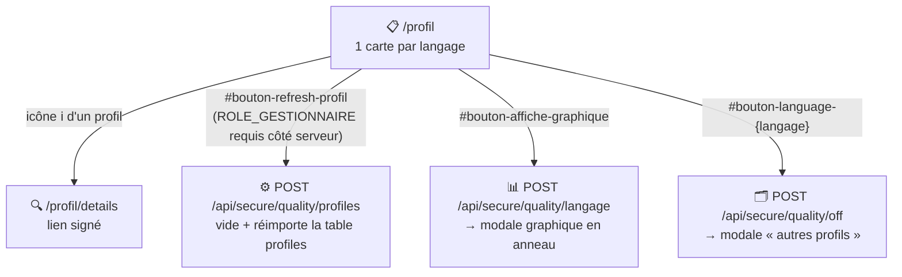

# 📋 Profils qualité SonarQube

Affiche, pour chaque langage détecté, le **profil qualité par défaut** utilisé par SonarQube (`referential_default = true`).
Accessible depuis [Accueil](accueil.md), aucun rôle spécifique requis pour la consultation (`ROLE_UTILISATEUR`). La page se charge en lecture pure (table `profiles`) ; les 3 actions (rafraîchir, graphique, autres profils) passent ensuite par des appels AJAX vers `ApiProfilController`.

## 🗺️ Cartographie



## 🧭 Chemin de fer de la page

<!-- markdownlint-disable MD046 -->
```text
Page Profil
│
├── 🧵 Fil d'Ariane : Accueil › Profil
├── 🔔 Zone de messages (flash serveur au chargement + messages JS ensuite)
│
├── 🔘 Boutons (toujours visibles)
│        ├── Mise à jour de la liste (#bouton-refresh-profil)
│        └── Répartition des langages (#bouton-affiche-graphique)
│
├── ℹ️ Total de règles du référentiel (recalculé côté client après rafraîchissement)
│
└── 🗂️ 1 carte par langage
         ├── Badge nombre de profils disponibles pour ce langage
         ├── Ligne : profil actif, nombre de règles, date de dernière modification
         ├── Icône ℹ️ → construit un lien signé et navigue vers /profil/details
         └── Bouton « Afficher les autres profils » (désactivé si un seul profil pour ce langage)

Modales
├── 🪟 Autres profils du langage (table, ouverte par le bouton de la carte)
└── 🪟 Répartition des règles par langage (graphique en anneau)
```
<!-- markdownlint-enable MD046 -->

## 📊 Contenu

Une carte par langage :

- nom du profil actif, nombre de règles, date de dernière modification.
- Un badge indique le nombre total de profils disponibles pour ce langage (pas seulement celui par défaut).

!!! note "🚫 Pas de colonne « statut » visible"
    La donnée technique `referential_default` est bien récupérée en base mais n'est **affichée nulle part** dans le tableau — la distinction « actif vs non actif » se déduit uniquement de l'endroit où le profil apparaît (carte principale = profil par défaut ; fenêtre « autres profils » = tous les profils non-défaut du même langage).

## 🔄 Mettre à jour la liste des profils

Bouton **toujours visible**, mais l'action est réservée au rôle `ROLE_GESTIONNAIRE` **côté serveur uniquement** (`ApiProfilController::listeQualityProfiles()`) — un utilisateur sans ce rôle voit le bouton, clique, et reçoit un message d'erreur plutôt qu'un bouton désactivé.
En cas de succès : vide puis réimporte entièrement la table `profiles` depuis `/api/qualityprofiles/search`, met à jour `properties.profil_bd`/`profil_sonar`, et reconstruit la liste affichée côté client sans recharger la page.

## 📈 Répartition des règles par langage

Bouton ouvrant un graphique en anneau (Chart.js) du nombre de règles par langage, pour les profils par défaut uniquement.

## 🗂️ Autres profils disponibles pour un langage

Bouton **« Afficher les autres profils »**, désactivé automatiquement si un seul profil existe pour ce langage. Sinon, ouvre la liste des profils non-défaut de ce langage (nom, nombre de règles, date).

## 🔗 Accès au détail des changements

Chaque profil dispose d'un lien signé (jeton `rot13(base64(salt|langage|profil))`, décodage non vérifié cryptographiquement — voir la mise en garde dans [Profil — détails](profil-details.md)) vers l'historique des modifications de règles de ce profil.

## ⚠️ Messages remontés par la page

### Flash serveur (chargement, `ProfilController::index()`)

| Sévérité | Déclencheur | Message |
| --- | --- | --- |
| `error` | `selectProfiles()` renvoie un code différent de 200 | ❌ La liste des profils n'a pas été récupérée ({code}). |
| `warning` | Table `profiles` vide | ⚠️ La liste des profils est vide. Vous devez la mettre à jour ! (Erreur 404) |
| `critical` | Exception lors de l'appel à `selectProfiles()` | ❌ Une erreur technique est survenue lors de la récupération des profils (Erreur 500). |

### Messages JS (`index-profil.js` → `showMessage()`)

Les 3 actions AJAX relaient directement le `type`/`message` renvoyés par `ApiProfilController`, sauf mention contraire.

| Sévérité | Déclencheur | Message |
| --- | --- | --- |
| `warning` | Rafraîchissement sans le rôle `ROLE_GESTIONNAIRE` | Vous devez avoir le rôle GESTIONNAIRE pour réaliser cette action (Erreur 403). |
| `error` | Rafraîchissement : aucun profil renvoyé par SonarQube | Vous devez au moins avoir un profil déclaré sur le serveur SonarQube (Erreur 404). |
| `error` | Rafraîchissement : échec suppression/insertion/relecture/mise à jour en base | message dynamique selon l'étape en échec |
| `alert` | Rafraîchissement : exception JS (réseau, timeout…) | Erreur technique lors de l'appel à l'API. |
| `success` | Rafraîchissement réussi | La liste des profils qualités a été mise à jour. *(auto-masqué après 3 s)* |
| — | « Autres profils » ou « Répartition » : erreur applicative | message dynamique relayé tel quel (`t.type`/`t.message`) |

## 📚 Pour aller plus loin

- [Profil — détails](profil-details.md) : historique des changements d'un profil.

-**-- FIN --**-

[Retour au menu principal](/index.html)
