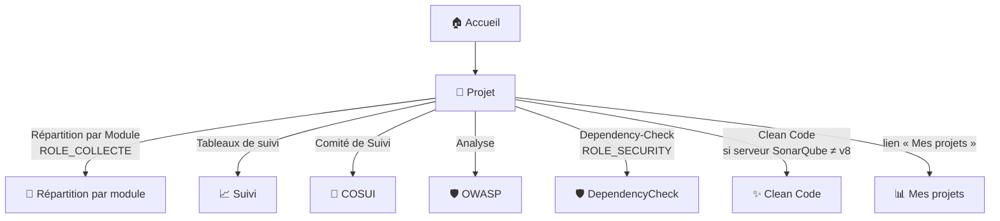
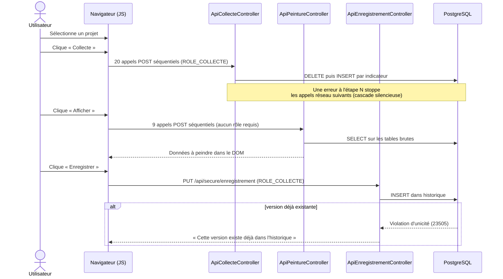

# 📁 Page Projet

La page Projet est **le cœur de l'application** : c'est ici qu'un projet SonarQube est sélectionné, collecté, visualisé, puis enregistré dans l'historique — et c'est le point de départ vers tous les autres tableaux de bord (OWASP, Clean Code, COSUI, Suivi, Répartition, DependencyCheck).

## 🗺️ Cartographie — pages accessibles depuis Projet

Le **bandeau commun** (logo, Préférences, Déconnexion, courriel) est identique sur toutes les pages — voir [Page d'accueil › Bandeau commun](accueil.md#bandeau-commun-present-sur-toutes-les-pages).

<!-- markdownlint-disable MD046 -->

<!-- markdownlint-enable MD046 -->

Deux façons de naviguer : un vrai lien `<a href>` (fil d'Ariane « Accueil », bouton « Dependency-Check ») ou un bouton piloté par JavaScript qui construit l'URL cible avec un jeton signé et la clé du projet sélectionné (`Répartition`, `Suivi`, `COSUI`, `OWASP`, `Clean Code`) — dans les deux cas, un projet doit être sélectionné au préalable.

## 🧭 Chemin de fer de la page

L'écran se découpe en quatre zones, dans l'ordre où elles apparaissent :

<!-- markdownlint-disable MD046 -->
```text
Page Projet
│
├── 🧵 Fil d'Ariane : Accueil › Mon projet
├── 🔔 Zone de messages (messages JS uniquement, voir plus bas)
│
├── 📰 Zone Journal
│        └── Journal d'activité (log en lecture seule) + 🧹 bouton Effacer
│
├── 🔎 Zone Sélection du projet
│        ├── ⭐ Icône favori (bascule le projet sélectionné en favori)
│        ├── 🔽 Sélecteur de projet (filtré par groupe fonctionnel)
│        └── 📊 Bouton « Mes projets » → page dédiée (tableau complet)
│
├── ⚙️ Zone des actions
│        ├── 🔄 Collecte (ROLE_COLLECTE) — rafraîchit les données ou ajoute une 1ère analyse
│        ├── 👁️ Afficher — peinture depuis la base (aucun appel SonarQube)
│        ├── 💾 Enregistrer (ROLE_COLLECTE) — verse la version affichée dans l'historique
│        └── 🧭 Boutons de navigation → Répartition, Suivi, COSUI, OWASP, DependencyCheck, Clean Code
│
└── 📋 Zone principale — affichage des données
         ├── 🪧 Bandeau « Informations générales »
         └── 🧱 Triptyque : Version · Projet · Qualité
```
<!-- markdownlint-enable MD046 -->

## 📰 Zone Journal

Un journal d'activité (`<textarea readonly>`) affiche en direct la trace des appels effectués par la page (collecte, peinture, erreurs). Le bouton 🧹 (icône gomme) le vide sans rien envoyer au serveur — c'est un affichage purement local, rien n'est conservé après un rechargement de la page.

## 🔎 Zone Sélection du projet

Le sélecteur (Select2) recherche parmi les projets du **groupe fonctionnel** de l'utilisateur (voir [Groupes](../back-office/groupes.md#-groupe-fonctionnel)) — la recherche se déclenche à partir de **2 caractères** saisis (`minimumInputLength: 2`). Si l'utilisateur n'est rattaché à aucun groupe fonctionnel, ou qu'aucun tag SonarQube ne correspond à son périmètre, aucun projet n'est proposé.

L'icône ⭐ à côté du titre bascule le projet actuellement sélectionné en favori/non-favori (`POST /api/secure/favori`) — c'est la même liste de favoris que celle affichée sur la page [Accueil](accueil.md#-bloc-des-favoris) et gérée depuis [Préférences](preferences.md).

### 📊 Bouton « Mes projets »

Le bouton **Mes projets** ouvre directement la page dédiée `/projet/mes-projets` (route `mes_projets`) : un **tableau complet** (volumétrie, notes A-E, violations, composants, qualité du code, loggers, tests) pour tous les projets du **groupe fonctionnel** de l'utilisateur — pas seulement ses favoris.

!!! note "✅ Modale supprimée, fonctionnalités unifiées (2026-07-14)"
    Le bouton ouvrait auparavant une **modale** limitée aux projets favoris, avec des raccourcis d'action (bulles **V / R / S / C / O / RM**) déjà simplifiés une première fois (raccourcis retirés) le même jour.
    Cette modale faisait doublon avec la page `/projet/mes-projets` (jusque-là accessible uniquement depuis le plan du site) : les deux portaient le même nom pour des listes différentes (favoris vs groupe fonctionnel entier).
    La modale, son JS (`afficheMesProjets()`, gestionnaires de clic) et son template (`_modal_liste_projet.html.twig`) ainsi que l'endpoint `projet_mes_applications_liste` ont été **supprimés** ; le bouton pointe désormais directement vers la page dédiée, plus riche.

!!! note "✅ Tableau DataTables (extension Zurb Foundation)"
    Un bug bloquant (clé `nom_projet` obsolète depuis un renommage de colonne DDL — devenue `project_name` — jamais répercuté dans ce template) empêchait l'affichage dès qu'un projet était présent dans l'historique.
    Corrigé, et le tableau est passé sous **DataTables** (extension `datatables.net-zf`, déjà utilisée sur [Statistiques › Projets](statistiques.md)) : recherche globale, tri par colonne (avec type numérique correct sur les colonnes de comptage), pagination à **15 lignes par défaut** (5/10/15/20/25 au choix).
    Le header à deux niveaux (groupes de colonnes + sous-colonnes) est géré nativement — plus de perte de l'en-tête en scrollant une longue liste.

## ⚙️ Zone des actions

| Bouton | Visible si | Action |
| --- | --- | --- |
| **Collecte des données** | `ROLE_COLLECTE` | Lance la chaîne complète de collecte (20 appels SonarQube séquentiels — voir [flux ci-dessous](#-le-flux-collecte--peinture--sauvegarde)). Sert aussi bien à **rafraîchir** un projet déjà connu qu'à **collecter pour la première fois** un projet jamais analysé — c'est le même bouton et le même flux dans les deux cas. |
| **Afficher** | toujours | « Peinture » : relit les tables déjà en base pour la **dernière collecte connue** et remplit l'affichage — sans appeler SonarQube |
| **Enregistrer** | `ROLE_COLLECTE` | Verse la version actuellement affichée dans l'historique (`historique`), **si elle n'y existe pas déjà** — sinon message d'erreur (violation d'unicité) |
| **Mes projets** | toujours | Ouvre la page [Mes projets](#-bouton--mes-projets-) (tableau de tous les projets du groupe fonctionnel) |
| **Répartition par Module** | `ROLE_COLLECTE` | Ouvre [Répartition détaillée](repartition_details.md) |
| **Tableaux de suivi** | toujours | Ouvre [Suivi](suivi.md) |
| **Comité de Suivi (COSUI)** | toujours | Ouvre [COSUI](cosui.md) |
| **Analyse OWASP** | toujours | Ouvre [OWASP](owasp.md) (référentiels 2017/2021/2025) |
| **Dependency-Check** | `ROLE_SECURITY` | Ouvre [DependencyCheck](../dependency-check/pages.md) |
| **Clean Code** | serveur SonarQube ≠ version 8 (pas un rôle) | Ouvre [Clean Code](clean-code.md) |

Tous les boutons de navigation (sauf « Afficher » et « Mes projets ») sont **désactivés à l'affichage** et ne se débloquent qu'une fois un projet sélectionné.

!!! note "✅ Incohérence JS/serveur corrigée"
    Le script de la page tolérait auparavant `ROLE_BATCH` ou `ROLE_GESTIONNAIRE` comme alternative à `ROLE_COLLECTE` pour débloquer les boutons Collecte/Enregistrer — alors que ni l'un ni l'autre n'hérite de `ROLE_COLLECTE` dans `role_hierarchy` (voir [Gestion de la sécurité](../developpement/securite.md#-rôles-et-hiérarchie)), que le bouton lui-même n'est pas rendu par Twig sans `ROLE_COLLECTE`, et que le serveur (`ApiCollecteController`/`ApiEnregistrementController`) exige `ROLE_COLLECTE` strictement. Le contrôle JS a été aligné sur le serveur : seul `ROLE_COLLECTE` débloque désormais ces deux boutons.

## 📋 Zone principale — affichage des données

Trois blocs (« triptyque ») plus un bandeau, tous initialement vides et remplis par la collecte ou l'affichage :

### 🏀 Bandeau « Informations générales »

Identité SonarQube du projet : nom, clé d'analyse, clé Maven, distribution des langages détectés. Purement informatif.

### 🏀 Bloc « Version »

- Version analysée, date de version, nombre de versions Release / Snapshot / Autres (bouton vers la modale *Répartition des versions*) ;
- Nombre de `NoSonar`/`@SuppressWarnings` (bouton vers le détail) ;
- Nombre de tags `TODO` (bouton vers le détail par langage/fichier) ;
- Nombre de loggers Java, avec accès au détail par framework et à un graphique de répartition.

### 🏀 Bloc « Projet » (volumétrie + qualité interne)

- Statut de la **Quality Gate** SonarQube (badge coloré) ;
- Volumétrie : nombre de lignes, lignes de code, commentaires, fichiers, classes, méthodes, déclarations ;
- 5 indicateurs notés A-E : complexité cyclomatique, complexité cognitive, couverture de tests, densité de duplication, densité de commentaires ;
- Tests unitaires : nombre total, erreurs, échecs, ignorés, taux de succès ;
- Violations acceptées / faux positifs (marquées comme telles après revue).

!!! note "✅ Aide branchée sur la complexité (2026-07-14)"
    Un bouton **ℹ️** (« Aide ») a été ajouté au titre du bloc « Projet », ouvrant `_modal_complexity.html.twig` : une page pédagogique qui explique la complexité cyclomatique et cognitive (concepts SonarQube), **et** la formule réellement utilisée par Ma-Moulinette pour la note A-E affichée (`ratio = ncloc ÷ complexité`, seuils `≤3→E … >18→A`).

!!! note "✅ Note de complexité inversée — corrigée (2026-07-14)"
    Le ratio `ncloc ÷ complexité` était converti en note A-E à l'envers : un ratio **faible** (complexité dense sur peu de lignes — code a priori moins bon) obtenait **A** (verte, meilleure), et un ratio **élevé** (code plus simple) obtenait **E** (rouge, pire).
    Corrigé dans `BuildMapHistoryService::getComplexityRating()` : ratio faible → **E**, ratio élevé → **A**, cohérent avec la convention A=bon/vert utilisée partout ailleurs dans l'app.
    Un ratio `null` (complexité absente) renvoie désormais `'--'` au lieu de `'A'` par accident de coercition PHP.

### 🏀 Bloc « Qualité » (fiabilité, sécurité, maintenabilité)

- Notes A-E de fiabilité, sécurité et maintenabilité (indice SQALE) ;
- Nombre de hotspots (bouton vers le détail des menaces potentielles) ;
- Détail bugs / vulnérabilités / mauvaises pratiques (réels vs total) ;
- Répartition par sévérité selon le module applicatif (Présentation/Métier/Autre/Inconnu — voir [Architecture des applications Java](../architecture/architecture-java.md)) ;
- Montant et ratio de la dette technique (bouton vers le détail) ;
- Nombre de violations à corriger (bouton vers la répartition par sévérité).

Aucun seuil de couleur n'est codé en dur dans les templates : les badges de notes A-E et les couleurs conditionnelles sont posés dynamiquement en JavaScript après réception des données.

## 🔄 Le flux Collecte → Peinture → Sauvegarde

Trois opérations bien distinctes, souvent confondues :

- 🧺 **Collecte** = appelle l'API SonarQube et **écrase** (DELETE puis INSERT) les tables « brutes » du projet (`information_projet`, `mesures`, `owasp`, `hotspots`, `anomalie`, `anomalie_details`, `hotspot_owasp`, `hotspot_details`, `no_sonar`, `todo`, `logger`, `logger_detail`, `clean_code`).
Ces tables ne contiennent **que la dernière collecte** — ce ne sont pas des tables d'historique.
- 🎨 **Peinture** = relit ces tables déjà en base (**aucun appel SonarQube**) et remplit l'affichage. Fonctionne pour **n'importe quelle collecte antérieure**, par n'importe quel utilisateur, à tout moment — pas seulement celle qui vient d'être lancée dans la session courante.
- 💾 **Sauvegarde (Enregistrement)** = copie ce qui est actuellement affiché dans la table **`historique`**, versionnée celle-là (une ligne par version de projet). C'est la seule étape qui alimente durablement [Suivi](suivi.md) et les graphiques de tendance.



### 🎬 Cas à connaître

- **Projet jamais collecté** : « Afficher » échoue en 404 (« vous devez lancer une collecte ») tant que la collecte n'a pas été faite au moins une fois.
- **Projet déjà collecté par le passé** : « Afficher » fonctionne **directement**, sans relancer de collecte — il relit simplement la dernière collecte connue, quelle que soit sa date ou son auteur.
- **Erreur en cours de collecte** : l'étape en échec affiche un message et arrête les appels réseau suivants ; les indicateurs déjà collectés avant l'erreur restent en base (pas d'annulation globale).
- **Collecte réussie mais pas d'enregistrement** : les tables brutes contiennent bien les nouvelles données (consultables via « Afficher ») mais rien n'est écrit dans `historique`. À la prochaine collecte de ce projet, ces données seront écrasées — cette version n'aura alors **jamais existé** dans l'historique versionné.

!!! caution "⚠️ La « peinture » ne vérifie pas le périmètre du groupe fonctionnel"
    Contrairement au sélecteur de projet (filtré par groupe fonctionnel), les routes `ApiPeintureController` ne vérifient que l'**existence** d'une clé maven en base — pas son appartenance au périmètre de l'utilisateur connecté.
    En théorie, un utilisateur qui connaîtrait la clé Maven exacte d'un projet hors de son périmètre pourrait en afficher les données via une requête directe.

!!! note "✅ Erreurs SonarQube correctement relayées pendant la collecte (2026-07-14)"
    `BatchCollecteInformationProjetController::controlVersionProjet()` n'anticipait que 3 codes d'erreur (401/404/503) : tout autre code (ex. `403 Insufficient privileges`) tombait dans une branche générique qui **remplaçait le vrai code/message par un « 500 » opaque**.
    Corrigé : le 403 est désormais géré explicitement, et le fallback générique **relaie le vrai code/message** de SonarQube au lieu de le masquer.
    `ApiCollecteController` envoyait aussi un texte placeholder (« Pas de données disponible. ») à la place d'une trace technique absente, ce qui affichait à tort un bouton « détails techniques » vide côté JS — corrigé pour envoyer `null`.

    Ce genre de 403 vient le plus souvent d'un `SONAR_TOKEN` du **mauvais type** (jeton d'analyse au lieu de jeton personnel) — voir [Jetons d'authentification SonarQube](../developpement/securite.md#-jetons-dauthentification-sonarqube).

## ⚠️ Messages remontés par la page

Cette page n'a **aucun flash serveur** au chargement (`ProjetController::index()` n'appelle jamais `addFlash`) — tous les retours viennent des appels AJAX déclenchés par les actions, via `showMessage()` de `messageHelper.js`.

### Messages JS (client, après une action)

| Sévérité | Déclencheur | Message |
| --- | --- | --- |
| *(relayé du serveur)* | Chacune des 20 étapes de collecte / 9 étapes de peinture peut échouer côté API | Le message renvoyé par le serveur est affiché tel quel (`t.type`, `t.message`) |
| `critical` | Exception JS inattendue à l'une des ~13 phases numérotées de la collecte | 🔴 Une erreur inattendue s'est produite lors de la phase *NN*. |
| `success` | Collecte terminée sans erreur | *{projet}* Le processus de collecte a été réalisé avec success pour le projet *{maven_key}* ! |
| `error` | `ROLE_COLLECTE` manquant pour lancer la collecte | ❌ Vous devez avoir au moins le rôle COLLECTE pour lancer la collecte des données. |
| `error` | `ROLE_COLLECTE` manquant pour enregistrer | ❌ Vous devez avoir au moins le rôle COLLECTE pour lancer la commande d'enregistrement (Erreur 403). |
| `primary` | Changement de projet en cours de collecte | 📌 Le processus de collecte a été interrompu ! 💡 Choisissez un autre projet. |
| `primary` | Changement de projet en cours d'affichage | 📌 Le processus d'affichage des données a été interrompu ! Choisissez un autre projet. |
| `primary` | Affichage (peinture) terminé | 📌 L'affichage des informations pour le projet est terminée. |
| `warning` | Une étape de peinture ne renvoie aucune donnée | ⚠️ Aucune donnée disponible. Relancez une collecte ou afficher les derniers résultats. |

### 🏀 Page « Mes projets » — ses propres flashs serveur

La page `/projet/mes-projets` a ses propres messages Flash, distincts de la page Projet :

| Sévérité | Déclencheur | Message |
| --- | --- | --- |
| `warning` | Utilisateur sans groupe fonctionnel | ⚠️ Tu dois être rattaché à une équipe (Erreur 404). |
| `warning` | Aucun projet trouvé pour le groupe fonctionnel | ⚠️ Je n'ai pas trouvé de projets pour ton équipe. Vérifie le nom du tag utilisé dans SonarQube (Erreur 406). |
| `error` | Échec de la lecture de l'historique | ⚠️ Tu dois être rattaché à une équipe (Erreur 404). *(message générique réutilisé, trace technique en `debug`)* |

## 📚 Pour aller plus loin

- [OWASP](owasp.md) — analyse des vulnérabilités.
- [Clean Code](clean-code.md) — indicateurs SonarQube 10+.
- [COSUI](cosui.md) — comité de suivi.
- [Suivi](suivi.md) — historique des versions, alimenté uniquement après enregistrement.
- [Répartition détaillée](repartition_details.md) — signalements par module applicatif.
- [DependencyCheck](../dependency-check/pages.md) — vulnérabilités des dépendances.
- [Gestion de la sécurité](../developpement/securite.md) — détail des rôles.

-**-- FIN --**-

[Retour au menu principal](/index.html)
