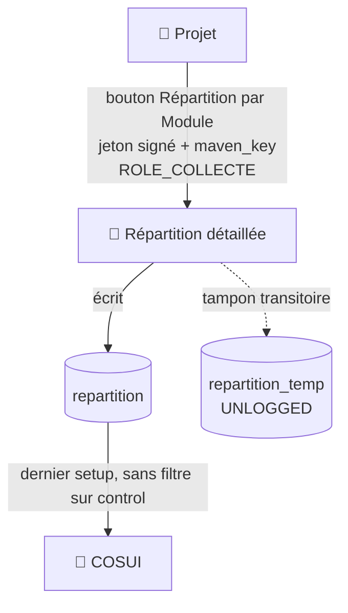
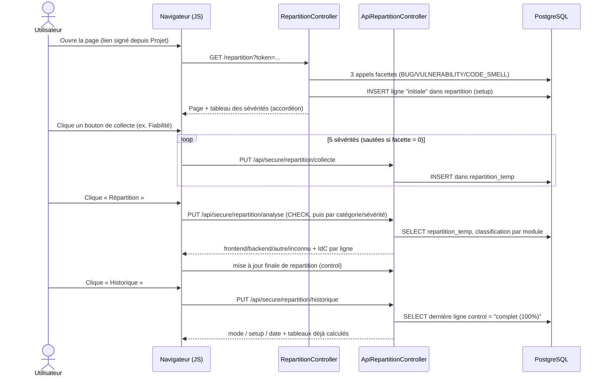

# 🧩 Répartition détaillée par module

Analyse la répartition des signalements SonarQube (fiabilité, sécurité, maintenabilité) par module applicatif (frontend/backend/autre/inconnu — voir [Architecture des applications Java](../architecture/architecture-java.md)).
Accessible depuis [Projet](projet.md) via un jeton obfusqué (confort de navigation, pas une signature — voir [COSUI](cosui.md)), rôle **`ROLE_COLLECTE`** requis pour toutes les actions de cette page (bouton d'ouverture masqué sans ce rôle, et vérifié à nouveau côté serveur au chargement — c'est ce contrôle de rôle par le pare-feu/serveur qui constitue la vraie protection, pas le jeton).

## 🗺️ Cartographie — adhérences avec les autres pages

Le **bandeau commun** est identique sur toutes les pages — voir [Page d'accueil › Bandeau commun](accueil.md#bandeau-commun-present-sur-toutes-les-pages).

<!-- markdownlint-disable MD046 -->

<!-- markdownlint-enable MD046 -->

Aucun bouton ne repart de cette page vers COSUI directement : c'est [COSUI](cosui.md) qui, de son côté, va relire `repartition` pour ce projet — la dépendance est à sens unique (Répartition alimente, COSUI consomme).

!!! caution "⚠️ COSUI ne filtre pas sur `control` — contrairement à ce qu'on pourrait attendre"
    `RepartitionRepository::findLatestSetupByMavenKey()` (utilisée par COSUI) prend le **dernier `setup` tout court** (`ORDER BY setup DESC LIMIT 1`), sans condition sur `control`. Contrairement au bouton **Historique** de cette page (qui lui filtre bien sur `control = 'complet (100%)'`), COSUI peut donc afficher une répartition **partielle** (`partiel (33%)`, `partiel (66%)`, voire `inconnue`) sans avertissement — voir [COSUI](cosui.md#-répartition-des-défauts).

## 🧭 Chemin de fer de la page

<!-- markdownlint-disable MD046 -->
```text
Page Répartition détaillée
│
├── 🧵 Fil d'Ariane : Accueil › Projet › Répartition
├── 🔔 Zone de messages (flash serveur au chargement + messages JS après action)
│
├── 🆔 Setup (horodatage du cycle courant)
│
├── 🗂️ Accordéon — Tableau des sévérités par catégorie
│        └── Fiabilité / Sécurité / Maintenabilité × Bloquant/Critique/Majeur/Mineur/Info
│             (facette SonarQube, dénominateur de l'indice de confiance)
│
├── 📥 Étape 1 — Collecte détaillée
│        ├── 🛡️ Bouton Fiabilité (BUG)
│        ├── 🔐 Bouton Sécurité (VULNERABILITY)
│        ├── 🚫 Bouton Maintenabilité (CODE_SMELL)
│        └── ⏱️ Minuteur par catégorie
│
└── 📊 Étape 2 — Analyse
         ├── 🗂️ Bouton Répartition (lance l'analyse du tampon)
         ├── 📈 Bouton Historique (relit la dernière analyse complète)
         ├── mode / setup / date de l'analyse affichée
         └── 4 tableaux : Synthèse, Fiabilité, Sécurité, Maintenabilité (frontend/backend/autre/inconnu + IdC)
```
<!-- markdownlint-enable MD046 -->

## 🆔 Le `setup` — un identifiant généré à chaque ouverture de page

!!! note "🔄 Pas au clic sur un bouton, mais dès le chargement"
    Le `setup` (identifiant de cycle collecte+analyse) est un **horodatage en millisecondes généré automatiquement à chaque chargement de la page**, pas au clic sur un bouton d'action. La page elle-même (`RepartitionController::repartition()`) déclenche dès le chargement les 3 appels de facettes ci-dessous **et** écrit une première ligne « initiale » dans `repartition` avec ce `setup` — le chargement de la page n'est donc pas une simple lecture, c'est déjà une écriture en base.

## 🗂️ Tableau des sévérités par catégorie (accordéon)

Dès l'ouverture de la page, un tableau replié dans un accordéon (« Tableau des sévérités par catégorie ») est rempli par un appel léger à l'API SonarQube par catégorie : `GET api/issues/search` filtré sur `statuses=OPEN,CONFIRMED,REOPENED` et `types={catégorie}`, avec `facets=severities` et `p=1&ps=1` (on ne lit que les compteurs de la facette, pas les signalements eux-mêmes).
Cela donne, pour chacune des 3 catégories (**Fiabilité**=`BUG`, **Sécurité**=`VULNERABILITY`, **Maintenabilité**=`CODE_SMELL`) et des 5 sévérités (Bloquant/Critique/Majeur/Mineur/Info), le **nombre réel de signalements existants côté SonarQube**.

!!! caution "⚠️ Ces comptages ne pilotent pas la pagination de l'étape 1"
    On pourrait croire que ce tableau sert à calculer à l'avance le nombre de pages à demander à SonarQube — ce n'est pas le cas : la collecte (étape 1) exécute une boucle à taille fixe (20 pages), quelle que soit la valeur lue ici.
    Ces comptages servent en réalité à : désactiver le bouton d'une catégorie entière si son total est à 0, **et** de dénominateur pour l'indice de confiance (voir plus bas).

!!! note "✅ Incohérences corrigées (2026-07-16)"
    Pour Sécurité et Maintenabilité, une sévérité à 0 signalement dans ce tableau était sautée lors de la collecte (pas d'appel inutile) — mais pas pour Fiabilité (`BUG`), qui interrogeait systématiquement les 5 sévérités même quand ce tableau en annonçait 0. Les 3 catégories sautent désormais une sévérité à 0.
    Le bouton de collecte de `CODE_SMELL` affichait par ailleurs « Mauvaise Pratique », alors que « Maintenabilité » est le libellé standard utilisé partout ailleurs dans l'application pour cette catégorie — harmonisé.

## 📥 Étape 1 — Collecte détaillée

Trois boutons, un par catégorie (**Fiabilité**, **Sécurité**, **Maintenabilité**) : chacun collecte, **séquentiellement pour les 5 niveaux de sévérité**, la liste des signalements ouverts (`OPEN`/`CONFIRMED`/`REOPENED`) via l'API SonarQube, avec une boucle à taille fixe : 500 résultats par page, jusqu'à 20 pages (arrêt anticipé dès qu'une page revient vide).

!!! caution "⚠️ Plafond réel : 10 000 signalements par sévérité, 50 000 par catégorie"
    500 × 20 = 10 000 par (catégorie, sévérité), soit 50 000 pour l'ensemble d'une catégorie (Fiabilité, Sécurité ou Maintenabilité) — c'est ce plafond qui contourne la limite de recherche profonde de SonarQube/ElasticSearch en découpant chaque catégorie par sévérité.
    Au-delà, les signalements excédentaires ne sont pas remontés (voir l'indice de confiance ci-dessous pour le détecter).

Les signalements bruts sont stockés temporairement dans une table tampon (`repartition_temp`, **`UNLOGGED`** — voir [Architecture base de données](../architecture/architecture-base-de-donnees.md#-tables-logged-vs-tables-unlogged)), purgée des cycles précédents à chaque nouvelle collecte pour ce projet — seul le `setup` courant y est conservé.

## 📊 Étape 2 — Analyse

Le bouton **Répartition** relit le tampon et classe chaque signalement par module applicatif (regex sur le chemin du fichier, mots-clés configurables — voir [Architecture des applications Java](../architecture/architecture-java.md#-classification-par-mots-clés)), catégorie par catégorie. La collecte détaillée doit avoir été lancée au préalable pour ce `setup` — sinon un message invite à collecter d'abord.

Le bouton **Historique** relit la **dernière analyse strictement complète** (100 %) déjà enregistrée pour ce projet, sans re-solliciter SonarQube — utile pour revoir un résultat déjà produit sans relancer un cycle complet.

!!! note "🗑️ Pas de bouton « Supprimer » sur cette page"
    Aucune action de suppression n'existe côté utilisateur sur cette page — la seule purge est interne (nettoyage automatique du tampon `repartition_temp` à chaque nouvelle collecte).

## 🔬 Deux indicateurs de complétude à ne pas confondre

- **IdC (indice de confiance)** — calculé côté JavaScript, un par (catégorie, sévérité) : `nombre de signalements classés ÷ total annoncé par la facette` (le compteur du tableau en accordéon, voir plus haut). 100 % = tout le volume attendu a été classé ; en dessous, une partie des signalements n'a jamais été récupérée — typiquement parce que le plafond des 20 pages a été atteint avant d'avoir tout collecté pour cette sévérité.
- **`control`** — champ discret stocké dans la table `repartition`, calculé côté serveur : `complet (100 %)`, `partiel (66 %)`, `partiel (33 %)` ou `inconnue`, selon le nombre de catégories (sur 3) ayant reçu exactement leurs 5 lignes de sévérité. C'est ce champ — et non l'IdC — que lit le bouton **Historique** pour ne proposer que des analyses réellement complètes.

## 🔄 Le flux Collecte → Analyse → Historique



## 🗃️ Deux tables, deux rôles bien distincts

- **`repartition_temp`** : tampon transitoire (`UNLOGGED`), une ligne par signalement individuel (`maven_key`, `component`, `type`, `severity`, `setup`), vidée à chaque nouveau cycle.
- **`repartition`** : résultat final versionné par `(projet, setup)`, colonnes de compteurs par module/catégorie/sévérité + `control` — table de référence pour [COSUI](cosui.md).

## ⚠️ Messages remontés par la page

### Flash serveur (au chargement, `RepartitionController::repartition()`)

| Sévérité | Déclencheur | Message |
| --- | --- | --- |
| `error` | Jeton (`token`) absent de l'URL | ❌ La requête est incorrecte (Erreur 400). |
| `warning` | `ROLE_COLLECTE` manquant | 🚫 Vous devez avoir le rôle COLLECTE pour réaliser cette action (Erreur 403). |
| `error` | Décodage du jeton en échec | ❌ La requête est incorrecte (Erreur 400). |
| `error` | Une des 3 collectes de facettes échoue (code SonarQube ≠ 200) | ❌ La collecte des données SonarQube à échouée. |
| `error` | Échec de l'écriture de la ligne « initiale » dans `repartition` | ❌ L'enregistrement des données initiales a échouées. |

### Messages JS (après une action)

| Sévérité | Déclencheur | Message |
| --- | --- | --- |
| `primary` | Catégorie sans aucun signalement (facette à 0) | 📌 Il n'y a pas de données à collecter pour la catégorie *{Bug/Vulnerability/Code_Smell}*. |
| `error` | Dataset de sévérité illisible | ❌ Impossible de récupérer les informations concernant cette catégorie. |
| *(relayé du serveur)* | Erreur pendant un appel de collecte/analyse/historique | ❌ Le message renvoyé par le serveur est affiché tel quel (`t.type`, `t.message`) |
| `critical` | Exception JS inattendue pendant la collecte (`try/catch`) | 🔴 Une erreur inconnue s'est produite (Erreur 500). |
| `warning` | Analyse lancée sans collecte préalable pour ce `setup` | ⚠️ Il n'y a pas de données disponibles pour ce setup. Vous devez lancer une collecte avant de lancer une analyse (Erreur 404). |
| `critical` | Une collecte a échoué avant le clic sur « Répartition »/« Historique » (indicateur de session) | 🔴 Une erreur générale lors du calcul de la répartition / de la récupération des données historisées a été rencontrée (Erreur 500). |
| `success` | Analyse terminée avec au moins une catégorie complète | ✅ Mise à jour de la répartition des anomalies par module effectuée. |

## 📚 Pour aller plus loin

- [Projet](projet.md) : point d'entrée (bouton « Répartition par Module »).
- [COSUI](cosui.md) : consomme le dernier cycle de répartition complet.
- [Architecture base de données](../architecture/architecture-base-de-donnees.md#-tables-logged-vs-tables-unlogged) : détail du mécanisme `UNLOGGED`.
- [Gestion de la sécurité](../developpement/securite.md) : rôle `ROLE_COLLECTE`.

-**-- FIN --**-

[Retour au menu principal](/index.html)
