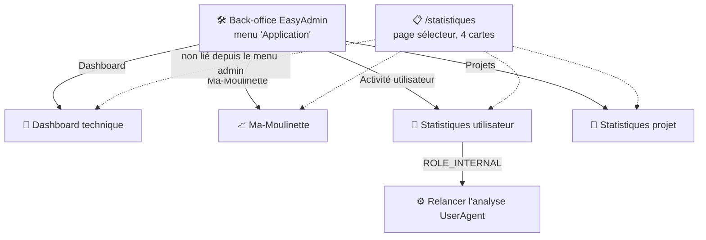
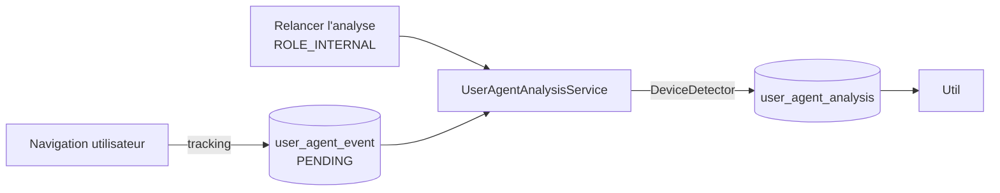

# 📊 Statistiques

« Statistiques » regroupe en réalité **5 pages distinctes**, pas une seule : un sélecteur et 4 sous-pages spécialisées. Aucune n'exige de rôle spécifique en consultation (`ROLE_UTILISATEUR` suffit) — seule l'action de recalcul (« Relancer l'analyse ») exige `ROLE_INTERNAL`.

## 🗺️ Cartographie



!!! note "✅ Confusion de nom avec la page Activité corrigée"
    L'entrée de menu EasyAdmin s'appelait **« Activité »** tout court et pointait vers `/statistiques/utilisateur` (statistiques de navigation des utilisateurs de l'application) — un nom identique à celui de la page [Activité](activite.md), qui suit elle les analyses SonarQube (deux fonctionnalités homonymes mais totalement distinctes). Renommée **« Activité utilisateur »** dans `DashboardController::configureMenuItems()` pour lever l'ambiguïté ; la page [Activité](activite.md) (côté SonarQube) garde son nom, elle n'est de toute façon pas liée depuis ce menu.

## 🧭 Dashboard (technique)

Versions PHP/Symfony/PostgreSQL, mémoire utilisée, nombre de tables du schéma, statistiques `pg_stat_activity`/`pg_stat_statements` (si les extensions PostgreSQL correspondantes sont installées), statistiques de code et de couverture de tests (générées par une commande dédiée, `var/admin-stats.json` — un message invite à la relancer si absente).

!!! note "✅ Comptage des tables corrigé"
    La requête de comptage des tables (`SELECT count(*) FROM ma_moulinette.pg_catalog.pg_tables ...`) faisait une référence à 3 parties (base.schéma.table) que PostgreSQL ne supporte pas — `pg_catalog` est un schéma système, jamais imbriqué sous le schéma applicatif `ma_moulinette`. La page renvoyait une erreur 500. Corrigé en interrogeant directement `pg_catalog.pg_tables` (accessible depuis n'importe quel schéma courant).

## 📈 Ma-Moulinette

Compteurs globaux : utilisateurs, projets, profils, règles actives, entrées d'historique, total bugs/vulnérabilités/mauvaises pratiques sur l'ensemble du parc. Deux graphiques (anomalies par type, volumétrie du référentiel).

## 📁 Statistiques projet

Un tableau (22 colonnes, tri/recherche/pagination 100% côté navigateur) : une ligne par projet, dernière synthèse connue dans `historique` — version, Quality Gate, les 8 notes A-E, volumétrie, anomalies, couverture.

## 👤 Statistiques utilisateur

Basée sur le suivi anonymisé de navigation (`user_agent_analysis`, alimentée par un pipeline événement → analyse — voir ci-dessous), **pas** sur une hypothétique table « events ».
Filtre par période (jour/semaine/mois). Contenu : nombre de comptes / comptes actifs, durée moyenne de session, nombre de sessions uniques, répartition OS/navigateurs/appareils, pages vues, répartition par durée de session.

### 🧭 Chemin de fer de la page

<!-- markdownlint-disable MD046 -->
```text
Page Statistiques utilisateur
│
├── 🧵 Fil d'Ariane : Accueil › Statistiques › Utilisateur
├── 🔔 Zone de messages (flash serveur uniquement)
├── 🔘 Filtre de période (jour / semaine / mois, sélecteur de semaine/mois selon le cas)
│
├── 🔢 Comptes disponibles / comptes actifs + badge « Adhésion » (couleur selon le taux)
├── 🗺️ Répartition OS / navigateurs / appareils (par période)
├── 📄 Pages vues uniques (par période)
│
├── ⏱️ Session de travail unique (nombre de sessions uniques — sur tout l'historique)
├── ⏱️ Suivi de la durée de travail moyenne (par période)
│
├── ⏱️ Session de travail globale (catégories courte/moyenne/longue — par période, corrigé)
└── ⏱️ Session de travail (durée par catégorie — par période, corrigé)
```
<!-- markdownlint-enable MD046 -->

!!! note "✅ Le code couleur du taux d'adhésion a été corrigé"
    Le taux d'adhésion (actifs/disponibles) est une fraction ≤ 1, mais le code couleur du template comparait cette fraction à des seuils pensés pour un pourcentage (0-100 au lieu de 0-1) — la couleur « faible adhésion » (rouge) était donc affichée quasiment tout le temps, quel que soit le taux réel (le pourcentage affiché en texte, lui, était correct). Corrigé pour comparer la fraction à `0.25`/`0.50`/`0.75`.

!!! note "✅ Les blocs « Session de travail » respectent désormais la période sélectionnée"
    Les 2 blocs de répartition par catégorie de durée (« Session de travail globale » et « Session de travail ») étaient **toujours calculés sur la journée en cours** (`WHERE created_at::date = CURRENT_DATE` codé en dur côté SQL), indépendamment du filtre de période choisi à l'écran — seul le bloc « Suivi de la durée de travail » respectait réellement la période sélectionnée.
    Corrigé en propageant `[$start, $end]` (déjà calculés pour les autres blocs) jusqu'aux deux requêtes SQL concernées.
    Les blocs « Session de travail unique » (nombre de sessions) et la moyenne de durée de session (`avg_session_duration`) restent, eux, calculés sur l'ensemble de l'historique, sans filtre de période — comportement distinct, non couvert par ce correctif.

### Pipeline de collecte (bouton « Relancer l'analyse », `ROLE_INTERNAL`)



## ⚠️ Messages remontés (Statistiques utilisateur)

Flash serveur uniquement (`StatistiqueUtilisateurController::statistiques()`) — un seul message générique, répété pour chaque étape susceptible d'échouer (comptage disponibles/actifs, OS, navigateur, device, pages vues, durée par période, moyenne, sessions uniques, catégories).

| Sévérité | Déclencheur | Message |
| --- | --- | --- |
| `error` | N'importe laquelle des requêtes de statistiques échoue (code ≠ 200) | Les données n'ont pas été correctement récupérées ({code}). |

## 📚 Pour aller plus loin

- [Activité](activite.md) : suivi des analyses SonarQube (à ne pas confondre avec les statistiques d'utilisation ci-dessus).
- [Gestion de la sécurité](../developpement/securite.md) : `ROLE_INTERNAL`.

-**-- FIN --**-

[Retour au menu principal](/index.html)
