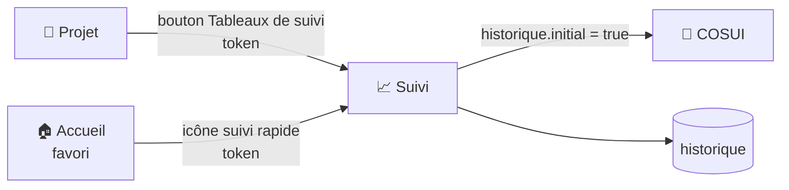

# 📈 Suivi des indicateurs

Historique des versions d'un projet, avec tendances et comparaison à une version de référence. Accessible depuis [Projet](projet.md) (bouton « Tableaux de suivi ») ou depuis [Accueil](accueil.md) (icône de suivi rapide sur un favori).

!!! note "🔓 Jeton = confort de navigation, pas un mécanisme de sécurité"
    L'accès se fait via `/suivi/set?token=...`, un jeton **ROT13 + Base64** (`salt|maven_key`) — même mécanisme que [Répartition](repartition_details.md)/[COSUI](cosui.md)/OWASP/Clean Code.
    Ce jeton n'a jamais eu vocation à être une preuve cryptographique : sa fonction est d'éviter d'exposer la clé Maven en clair dans l'URL au fil de la navigation interne, pas de filtrer l'accès.
    Le vrai périmètre de sécurité tient en deux couches, indépendantes du contenu du jeton :

    1. **Le pare-feu Symfony** (`config/packages/security.yaml`, `access_control` sur `^/api/secure/` → `ROLE_UTILISATEUR`) exige une session authentifiée valide pour atteindre la moindre route — un `curl` sans session (même avec un jeton parfaitement forgé après rétro-ingénierie du JS) est rejeté avant même d'atteindre le contrôleur.
    2. **`listeProjet()`**, appelée dans `suivi()`, vérifie que la clé Maven décodée appartient bien au **groupe fonctionnel** de l'utilisateur *authentifié* — donc même une session légitime ne peut pas afficher un projet hors de son périmètre, jeton ou pas.

Un projet doit déjà avoir **au moins une version enregistrée** dans l'historique (bouton « Enregistrer » de la page Projet, ou « Ajouter une analyse » ci-dessous) pour que cette page affiche quelque chose ; sinon un message invite à sauvegarder une collecte au préalable.

## 🗺️ Cartographie

<!-- markdownlint-disable MD046 -->

<!-- markdownlint-enable MD046 -->

## 🧭 Chemin de fer de la page

<!-- markdownlint-disable MD046 -->
```text
Page Suivi
│
├── 🧵 Fil d'Ariane : Accueil › Projet › Suivi
├── 🔔 Zone de messages (flash serveur + messages JS après action)
│
├── 🧭 En-tête projet (nom, compteur de versions affichées)
│
├── 🛠️ Menu des outils
│        ├── 📄 Lien « Éditer en PDF » (`suivi_rapport_pdf`)
│        ├── ➕ Bouton « Ajouter une analyse »
│        └── ✏️ Bouton « Modifier les versions »
│
├── 📊 Synthèse des notes (page de garde du rapport PDF)
├── 🐞 Tableau des anomalies
├── 📈 Graphique — courbe cumulée (Bug/Vulnérabilité/Mauvaise pratique)
├── 📏 Mesures (fichiers, lignes, classes, méthodes)
├── ✅ Tests et couverture
├── 🧮 Complexité (cyclomatique/cognitive)
├── 🌐 Distribution par langage (tableau + graphique empilé)
├── 🧩 Répartition par module
├── 🚦 Répartition par sévérité
├── 🔎 Répartition des anomalies par sévérité (détail croisé)
│
├── 🪟 Modale « Ajouter une analyse »
└── 🪟 Modale « Modifier les versions »
```
<!-- markdownlint-enable MD046 -->

!!! note "🚫 Aucun bouton masqué par rôle sur cette page"
    Contrairement à [Projet](projet.md)/[Répartition](repartition_details.md), aucun des 3 boutons du menu d'outils (PDF/Ajouter/Modifier) n'est masqué par Twig selon le rôle — ils sont **toujours visibles** pour tout utilisateur ayant accès à la page.
    `ROLE_SUIVI` n'est vérifié qu'à l'intérieur de la modale « Modifier les versions », sur 2 des 4 actions possibles (voir tableau ci-dessous).

## 🔐 Rôles — correction importante

!!! caution "Le rôle réel est `ROLE_SUIVI`, pas `ROLE_GESTIONNAIRE`"
    Seules deux actions sont réellement protégées par un rôle, et c'est **`ROLE_SUIVI`** (branche indépendante de `ROLE_UTILISATEUR`, sans lien avec `ROLE_GESTIONNAIRE` — voir [Gestion de la sécurité](../developpement/securite.md#-rôles-et-hiérarchie)) :

| Action | Rôle requis |
| --- | --- |
| Changer la **version de référence** | `ROLE_SUIVI` |
| **Supprimer** une version de l'historique | `ROLE_SUIVI` |
| Marquer/démarquer un **favori** | Aucun (`ROLE_UTILISATEUR`) |
| Choisir sa **liste de suivi personnalisée** (max 15 versions) | Aucun |
| **Ajouter une analyse** | Aucun |
| **Export PDF** | Aucun |

## 📊 Tableaux et graphiques affichés

Chaque tableau ci-dessous présente une colonne par version affichée, avec un marqueur « (collecte) » ou « (reconstitué) » selon l'origine de la donnée (voir [flux « Ajouter une analyse »](#-ajouter-une-analyse--appel-sonarqube-direct) ci-dessous), et un repère visuel sur la version de référence :

- **Synthèse des notes** : Quality Gate, notes fiabilité/sécurité/maintenabilité, hotspots, commentaires, complexité cyclomatique/cognitive ;
- **Anomalies** : bugs, failles, hotspots, mauvaises pratiques, `NoSonar`, avec notes associées ;
- **Courbe cumulée** : évolution du nombre de bugs/vulnérabilités/mauvaises pratiques dans le temps (Chart.js, axe X temporel, axe Y logarithmique) ;
- **Mesures** : nombre de fichiers, lignes, lignes de code, classes, méthodes ;
- **Tests et couverture** : couverture globale/branches, lignes/conditions couvertes, nombre de tests (succès/erreur/échec/ignorés), temps d'exécution ;
- **Complexité** : cyclomatique et cognitive, en valeur absolue et ratio, avec note ;
- **Distribution par langage** : lignes de code par langage détecté, en tableau et graphique empilé ;
- **Répartition par module** : présentation/métier/autre/inconnu (voir [Architecture des applications Java](../architecture/architecture-java.md)) ;
- **Répartition par sévérité** : bloquant/critique/majeur/mineur, avec flèche de tendance par rapport à la version précédente ;
- **Répartition des anomalies par sévérité** : détail croisé bug/faille/mauvaise pratique × sévérité.

Le nombre de versions affichées suit soit un `LIMIT` par défaut (paramètre `nombre.favori`, valeur qui **diffère selon l'environnement** : 8 en dev, 9 en production, 20 en test), soit la **liste de suivi personnalisée** de l'utilisateur si elle contient au moins une version pour ce projet (voir plus bas).

Il est recommandé de **ne pas dépasser 10 versions** (1 version de référence et 9 versions de suivi) pour la lisibilité des tableaux et graphiques, et de **ne pas dépasser 15 versions** pour la performance (temps de réponse du serveur et taille du JSON renvoyé).

!!! note "Version glissante vs version fixe"
    Par défaut, les tableaux affichent les **dernières versions enregistrées** dans l'historique (version glissante). Si une version de référence est définie, elle reste visible même si elle n'est plus la plus récente.
    La liste de suivi personnalisée permet de **figer un ensemble de versions** (version fixe) pour comparaison, indépendamment de leur ordre chronologique.

!!! note "✅ Le graphique de courbe cumulée respecte désormais la liste de suivi personnalisée"
    Quand une liste de suivi personnalisée est active pour ce projet, tous les tableaux basculent sur exactement les versions choisies (`SuiviController::suivi()`, requêtes `*ParVersions`) — mais le graphique de courbe cumulée continuait d'utiliser `selectHistoriqueAnomalieGraphique()` sans aucun filtre (elle ne prenait même pas le `LIMIT` en compte : elle remontait tout l'historique du projet). Le graphique pouvait donc afficher un jeu de versions différent de celui des tableaux juste au-dessus.
    Corrigé par l'ajout d'une variante `selectHistoriqueAnomalieGraphiqueParVersions()` (même filtre `initial = true OR version IN (...)` que les autres requêtes `*ParVersions`), appelée à la place de la version sans filtre quand `$modeVersionsChoisies` est actif.

## ⭐ Liste de suivi personnalisée (max 15 versions)

Stockée dans les préférences JSON de l'utilisateur (`utilisateur.preference['suivi_version'][maven_key]`, un tableau de numéros de version par projet).
Le bouton **Suivi** de chaque ligne, dans la modale « Modifier les versions », l'ajoute/le retire ; un compteur `(0/15)` affiche la progression. La limite de 15 est vérifiée **à la fois côté JS** (avant l'appel réseau, message immédiat) **et côté serveur** (`UtilisateurRepository::updateUtilisateurSuiviVersion()`, code 400 si la limite est atteinte) — double contrôle redondant mais cohérent.

## ➕ Ajouter une analyse — appel SonarQube direct

!!! caution "Ce n'est pas une simple relecture de l'historique"
    Contrairement à ce que son nom suggère, « Ajouter une analyse » **interroge directement le serveur SonarQube** (deux appels : `api/project_analyses/search` puis `api/measures/search_history`), pas seulement la base locale.

1. La modale liste les analyses disponibles côté SonarQube pour ce projet (jusqu'à 100).
2. La sélection d'une version déclenche un second appel SonarQube pour récupérer ses métriques à cette date.
3. Le clic sur **Ajouter** enregistre ces métriques dans `historique`, avec un marqueur **`mode_collecte = 'REBUILD'`** (reconstitué), distinct d'une vraie collecte via la page Projet (`'COLLECTE'`) — certains indicateurs avancés (notes de complexité/commentaires) ne sont pas reconstitués par cette voie, uniquement par une collecte complète.

Si la version existe déjà dans l'historique, un message l'indique sans dupliquer la ligne.

## 🗑️ Modifier les paramètres d'une version

Depuis la modale dédiée : bascule du **favori** (personnel), de la **version de référence** (partagée, `ROLE_SUIVI`), de l'inclusion dans la **liste de suivi personnalisée** (max 15 versions), ou **suppression** de la version (`ROLE_SUIVI`). Chaque bascule échouée côté serveur revient visuellement en arrière (rollback JS de l'interrupteur).

## 📄 Export PDF

Bouton « Éditer en PDF » — accessible sans rôle spécifique, ouvre le rapport dans un nouvel onglet.

!!! note "✅ Le PDF revérifie désormais l'appartenance au groupe fonctionnel"
    `suivi_rapport_pdf` ne vérifiait que l'**existence** d'un historique pour la clé Maven fournie — pas son appartenance au périmètre de l'utilisateur connecté, contrairement à `suivi()` (qui appelle `listeProjet()`).
    Un utilisateur connaissant la clé Maven exacte d'un projet hors de son groupe fonctionnel pouvait donc en générer le rapport PDF, alors que la page HTML elle-même le lui refusait.

    Corrigé : `rapportPdf()` appelle désormais le même contrôle `listeProjet()` que la route web, avec les mêmes réponses 404 (absence de groupe fonctionnel, ou projet hors périmètre) — cohérent avec le fait que cette route lève déjà des `NotFoundHttpException` pour ses autres cas d'erreur (clé manquante, historique vide).

## ⚠️ Messages remontés par la page

### Flash serveur (au chargement, `SuiviController::suivi()`)

| Sévérité | Déclencheur | Message |
| --- | --- | --- |
| `error` | `maven_key` absente de la session (token manquant/invalide, ou accès direct à `/suivi`) | ❌ La requête est incorrecte (Erreur 400). |
| `warning` | Utilisateur sans groupe fonctionnel | ⚠️ Vous devez être rattaché à une équipe (Erreur 404). |
| `warning` | Projet absent de la liste filtrée par groupe fonctionnel (`listeProjet()`) | ⚠️ Je n'ai pas trouvé de projets pour ton équipe / le projet n'est pas dans ta liste. |
| `warning` | Aucune version enregistrée dans `historique` pour ce projet | ⚠️ Le projet n'a pas été sauvegardé dans l'historique (Erreur 500). |
| `error` | Exception pendant la récupération des données (`FetchDataException`) | Message relayé, avec trace technique en `debug`. |

### Messages JS (après une action)

| Sévérité | Déclencheur | Message |
| --- | --- | --- |
| *(relayé du serveur)* | Erreur sur un des appels AJAX (liste de versions, métriques, enregistrement, favori, référence, suivi, suppression) | ❌ Le message renvoyé par le serveur est affiché tel quel |
| `critical` | Exception JS inattendue sur un appel AJAX | 🔴 Message localisé par action (ex. « Erreur lors de la récupération des versions ») |
| `warning` | Aucune version sélectionnée / clé Maven absente | ⚠️ Invite à sélectionner un projet ou une version |
| `warning` | Doublon (code `23505`) à l'enregistrement d'une analyse | Cette version est déjà présente dans l'historique |
| `success` | Enregistrement d'une analyse réussi | ✅ Enregistrement effectué |
| `warning` | Bascule favori refusée (préférence favoris désactivée) | ⚠️ Invite à activer la préférence |
| `warning` | Limite de 15 versions de suivi atteinte | ⚠️ Blocage côté JS avant même l'appel réseau |
| `info` | Favori / référence / suivi mis à jour avec succès | ℹ️ Confirmation |
| `warning` | Code 403 explicite sur suppression (rôle manquant) | ⚠️ Rôle `ROLE_SUIVI` requis |

## 📚 Pour aller plus loin

- [Projet](projet.md) : lancement d'une collecte complète et enregistrement.
- [COSUI](cosui.md) : compare la version courante à la version de référence définie ici.
- [Gestion de la sécurité](../developpement/securite.md) : détail des rôles.

-**-- FIN --**-

[Retour au menu principal](/index.html)
