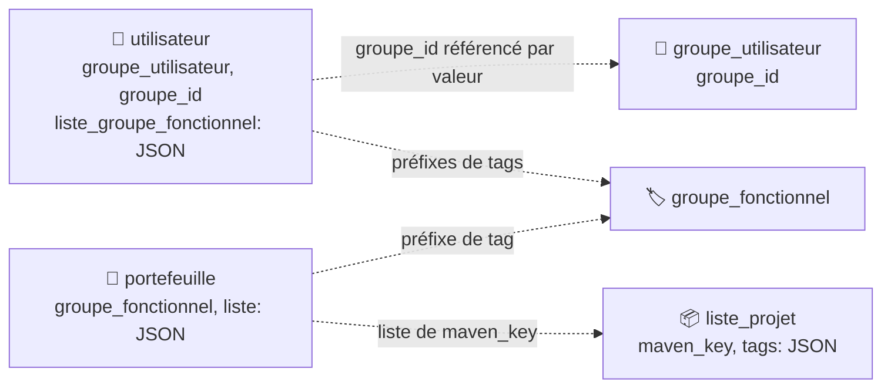
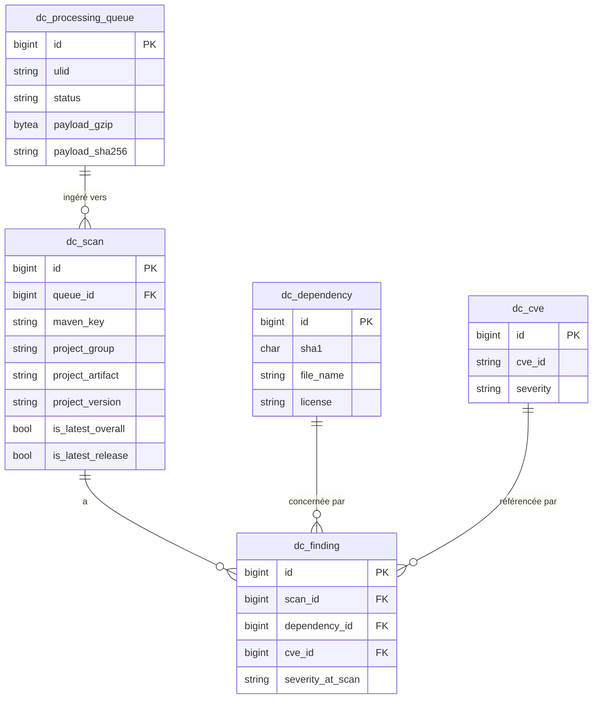

# 🗄️ Architecture — base de données

Depuis la v2.0.0, Ma-Moulinette utilise **une seule base PostgreSQL 18**, dans un schéma unique `ma_moulinette`. Les deux bases SQLite historiques (`data.db` et `temp.db`) ont été décommissionnées.

!!! note "🪶 SQLite décommissionné"
    Jusqu'en v1.6.0, l'application utilisait deux bases SQLite distinctes (`data.db` pour les données de collecte, `temp.db` pour les calculs intermédiaires de répartition).
    La migration vers PostgreSQL a fusionné les deux dans un schéma unique. L'historique détaillé de cette migration est dans `CHANGELOG.md` ; les scripts SQL de l'époque SQLite ne sont plus maintenus.

## 📊 Vue d'ensemble chiffrée

Décompte réel des objets déclarés dans `migrations/PosgreSQL/` (un fichier SQL = une définition, comptage exhaustif, pas une estimation) :

| Type d'objet | Nombre | Source |
| --- | :---: | --- |
| Tables | 45 (44 *logged* + 1 *UNLOGGED*, voir ci-dessous) | `20_tables/*.sql` |
| Vues | 5 | `30_views/*.sql` |
| Index | 142 | `40_indexes/indexes.sql` |
| Fonctions PL/pgSQL | 1 (`purge_batch_profiling`) | `50_functions/*.sql` |
| Commentaires (`COMMENT ON`) | 869 | `60_comments/comments.sql` |
| Contraintes (`ADD CONSTRAINT`, dont clés étrangères) | 41 | `70_constraints/constraints.sql` |
| Séquences explicites | 0 (colonnes `GENERATED ... AS IDENTITY`, séquences implicites) | — |
| Triggers | 0 | — |

## 📂 Organisation des scripts de migration

Le schéma est défini par des scripts SQL bruts dans `migrations/PosgreSQL/`, organisés par type d'objet et exécutés dans un ordre précis (voir `99_master_install.sql`) :

| Dossier | Contenu | Ordre |
| --- | --- | :---: |
| `00_init/` | Drop/création rôle, base, extensions (`pg_stat_statements`), search path | 1 |
| `10_schema/` | Création du schéma `ma_moulinette` | 2 |
| `20_tables/` | 45 tables (un fichier par table) | 3 |
| `30_views/` | 5 vues (statistiques `batch_profiling`) | 4 |
| `40_indexes/` | Les indexes | 5 |
| `50_functions/` | Fonctions PL/pgSQL (ex. purge `batch_profiling`) | 6 |
| `60_comments/` | Commentaires SQL sur tables/colonnes | 7 |
| `70_constraints/` | Contraintes (clés étrangères, uniques) | 8 |
| `80_grants/` | Droits d'accès par rôle | 9 |
| `90_fixtures/` | Données de référence (admin, OWASP, groupes par défaut) | 10 |
| `95_e2e/` | Jeu de données dédié aux tests E2E | — |
| `updates/` | Scripts d'évolution ponctuels hors création initiale | — |

Installation complète (nouvel environnement) :

```bash
psql -U postgres -v ON_ERROR_STOP=1 -f 99_master_install.sql
```

!!! caution "⚠️ Deux mécanismes de migration coexistent"
    `doctrine/doctrine-migrations-bundle` est présent dans `composer.json` et configuré (`config/packages/doctrine_migrations.yaml`, namespace `Migrations` → `migrations/`), mais **le dossier ne contient aucune classe de migration PHP** : le schéma réel est piloté par les scripts SQL ci-dessus, complétés en développement par `php bin/console doctrine:schema:update --force` pour resynchroniser rapidement le mapping Doctrine (`#[ORM\Column(name: ...)]`) sur la base. En cas d'erreur `Undefined column` après un changement d'entité, comparer d'abord le `name:` de la colonne au script `20_tables/<table>.sql` correspondant — un décalage entre les deux est la cause la plus fréquente.

## 🧊 Tables logged vs tables UNLOGGED

PostgreSQL propose un mode `UNLOGGED` pour les tables : les écritures ne passent pas par le WAL (journal de transactions), ce qui les rend plus rapides mais **non répliquées** et **non garanties après un crash ou un arrêt non propre du serveur** — leur contenu est alors automatiquement vidé (`TRUNCATE` implicite) au redémarrage.
C'est un mécanisme PostgreSQL natif (`CREATE UNLOGGED TABLE`), différent d'une table `TEMPORARY` (qui, elle, est propre à une session/connexion et disparaît à sa fermeture).

Dans `migrations/PosgreSQL/`, une seule table utilise ce mécanisme aujourd'hui :

| Table | Mode | Rôle |
| --- | --- | --- |
| `repartition_temp` | `UNLOGGED` | Tampon de collecte détaillée pour [Répartition par module](../application/repartition_details.md) — un volume élevé de lignes écrites/purgées à chaque cycle, sans besoin de durabilité (les données utiles sont réécrites dans `repartition` une fois l'analyse terminée) |

Toutes les autres tables du schéma (y compris `repartition`, la table finale versionnée) sont des tables **`logged`** classiques, avec garantie de durabilité standard.

## 🔗 Convention relationnelle

La grande majorité des tables **ne sont pas reliées par clé étrangère SQL** : les relations se font par clé naturelle au niveau applicatif (`maven_key`, `groupe_id`, tags JSON). Les seules contraintes `FOREIGN KEY` réellement déclarées (`70_constraints/constraints.sql`) concernent le domaine DependencyCheck et deux relations `batch`/`actuator` ponctuelles.



Les flèches en pointillés indiquent une **référence par valeur** (chaîne stockée, comparée par `LIKE prefix%` ou recherche dans un tableau JSON), pas une contrainte `FOREIGN KEY` — l'intégrité référentielle de ce périmètre est garantie côté applicatif (services/repository), pas par PostgreSQL.

À l'inverse, le domaine **DependencyCheck** est un modèle relationnel classique avec clés étrangères réelles :



## 📋 Tables par domaine

### 🔐 Identité et sécurité

| Table | Rôle |
| --- | --- |
| `utilisateur` | Comptes (local + provisioning LDAP), rôles, préférences JSON |
| `groupe_utilisateur` | Groupes d'accès (ADMIN, CONSULTATION, COLLECTE, GESTIONNAIRE…) |
| `groupe_fonctionnel` | Périmètres fonctionnels (préfixes de tags projet) |
| `user_role_log` | Journal des changements de rôle |

### 💼 Portefeuille et projets

| Table | Rôle |
| --- | --- |
| `portefeuille` | Regroupement de projets par groupe fonctionnel |
| `portefeuille_historique` | Historique des modifications de portefeuille |
| `liste_projet` | Référentiel des projets SonarQube (clé maven, tags, visibilité) |
| `information_projet` | Métadonnées projet (dernière analyse, langage…) |

### 📊 Collecte SonarQube

| Table | Rôle |
| --- | --- |
| `historique` | Série temporelle des indicateurs par version de projet |
| `anomalie`, `anomalie_details` | Bugs/vulnérabilités/code smells, détail par sévérité |
| `hotspots`, `hotspot_details`, `hotspot_owasp` | Hotspots de sécurité, classification OWASP |
| `owasp`, `owasp_top10` | Référentiel OWASP (2017/2021) et rattachement par projet |
| `mesures` | Mesures brutes (couverture, duplication, complexité…) |
| `no_sonar` | Occurrences `//NOSONAR` |
| `todo` | Occurrences `TODO`/`FIXME` |
| `profiles`, `profiles_historique` | Profils qualité SonarQube suivis |
| `properties` | Propriétés de configuration par projet |
| `repartition` | Répartition des indicateurs par module (frontend/backend/autre), résultat final versionné |
| `repartition_temp` | Tampon de collecte détaillée — table `UNLOGGED`, vidée automatiquement au redémarrage (voir [🧊 Tables simples vs `UNLOGGED`](#-tables-logged-vs-tables-unlogged)) |
| `clean_code` | Indicateurs Clean Code (nouveau modèle SonarQube) |

### 📈 Activité SonarQube

| Table | Rôle |
| --- | --- |
| `activity` | Activité de collecte en cours |
| `activity_historique` | Historique des collectes Activity |
| `activity_batch_report` | Rapport de collecte batch Activity |

### ⚙️ Traitement et batch

| Table | Rôle |
| --- | --- |
| `batch` | Configuration des traitements automatiques/manuels |
| `batch_traitement` | Instance de traitement (identifiant ULID) |
| `batch_execution`, `batch_execution_journal` | Exécutions et journal détaillé |
| `batch_profiling` | Mesures de performance des batchs (vues `30_views/`) |

### 🛡️ DependencyCheck (OWASP)

| Table | Rôle |
| --- | --- |
| `dc_processing_queue` | File d'ingestion des rapports uploadés par la CI |
| `dc_scan` | Un scan = un couple projet/version analysé |
| `dc_dependency` | Référentiel dédupliqué des dépendances (par sha1) |
| `dc_cve` | Référentiel des CVE |
| `dc_finding` | Association scan × dépendance × CVE |

### 🌱 Actuator (Spring Boot)

| Table | Rôle |
| --- | --- |
| `actuator` | Résultat de collecte Actuator par projet |
| `actuator_info` | Informations détaillées (build, env) associées |

### 🔭 Observabilité

| Table | Rôle |
| --- | --- |
| `logger`, `logger_detail` | Répartition des appels au logger Java |
| `user_agent_analysis`, `user_agent_event` | Analyse des User-Agent (détection d'activité suspecte) |
| `ma_moulinette` | Table de version applicative |

## 📚 Pour aller plus loin

- [Architecture technique](architecture-technique.md) : vue d'ensemble applicative.
- [Migration PostgreSQL](../developpement/guide-migration.md) : procédure détaillée pour un nouvel environnement.
- `CHANGELOG.md` : historique complet des évolutions de schéma, y compris la migration SQLite → PostgreSQL.

-**-- FIN --**-

[Retour au menu principal](/index.html)
