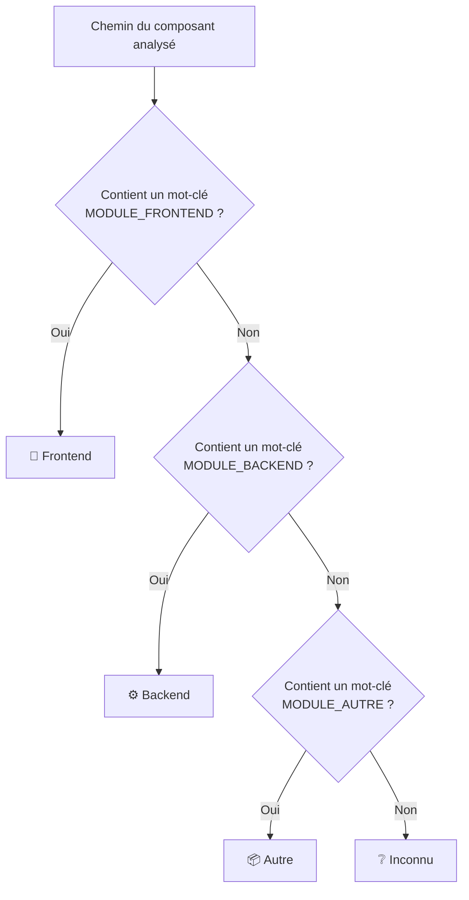

# ☕ Architecture des applications Java

Il est possible de passer la *moulinette* sur n'importe quelle application disponible sur la plateforme SonarQube. Certains indicateurs (répartition frontend/backend/autre) reposent cependant sur une classification automatique du chemin des fichiers analysés.

## 🔍 Classification par mots-clés

Contrairement à une correspondance stricte sur le nom du module Maven, la classification se fait par **recherche de mots-clés** (insensible à la casse, sur des limites de mot) n'importe où dans le chemin du composant SonarQube analysé. Les listes de mots-clés sont configurables par variable d'environnement (`config/services.yaml` → `module.frontend`/`module.backend`/`module.autre`), pas codées en dur :

```bash
MODULE_FRONTEND="presentation,webapp,front,frontend,angular,templates,styles,css,js,ts,vue,react,svelte,scss,less,html,xhtml"
MODULE_BACKEND="metier,back,backend,controller,api,service,business,common,dao,dto,sql,liquibase,changelog,middleoffice,rest,soap,entite,entity,repository,interface,converter,serviceweb,serviceweb-client"
MODULE_AUTRE="batch,rdd,etl,pipeline,processing"
```



L'ordre de test est **frontend → backend → autre → inconnu** : un chemin qui matcherait plusieurs catégories est classé dans la première qui correspond. Exemple de chemin classé frontend : `test-presentation/test-presentation-webapp/src/main/java/fr/mamoulinette/testpresentation/util/BeanUtils.java` (mot-clé `presentation`/`webapp`).

!!! note "🧩 Logique dupliquée dans 3 controllers"
    Ce mécanisme de classification est implémenté de façon similaire dans `BatchCollecteRepartitionController`, `BatchCollecteHotspotDetailController` et `BatchCollecteAnomalieController` (un par type d'indicateur collecté). Pour ajuster la classification d'un projet particulier, modifier les variables `MODULE_FRONTEND`/`MODULE_BACKEND`/`MODULE_AUTRE` plutôt que le code.

## 🧬 Socle technique et archétype (module DependencyCheck)

Au-delà du frontend/backend, les applications Java partagent souvent un **socle commun** : un parent POM ou BOM (Bill of Materials) d'entreprise qui fixe les versions de dépendances, éventuellement lui-même généré depuis un **archétype** Maven (template de scaffolding initial). Cette information est précieuse pour le module [DependencyCheck](../architecture/architecture-technique.md) : elle permet de regrouper les applications qui héritent des mêmes CVE potentielles via leur socle, plutôt que de les traiter comme complètement indépendantes.

!!! caution "⚠️ Non déductible du rapport DependencyCheck seul"
    OWASP DependencyCheck scanne les **jars runtime résolus**, pas le `pom.xml` — l'information de socle/archétype ne peut donc pas être extraite du rapport JSON lui-même. Elle est transmise séparément par la CI via des **en-têtes HTTP optionnels** au moment de l'upload.

| En-tête HTTP | Colonne (`dc_scan`/`dc_processing_queue`) | Rôle |
| --- | --- | --- |
| `X-Parent-Label` | `parent_label` (VARCHAR 128, nullable) | Identifiant du socle/BOM (ex. `springboot-config`, ou `<groupId>:<artifactId>` du parent legacy) |
| `X-Parent-Version` | `parent_version` (VARCHAR 64, nullable) | Version effective du socle qui pilote les CVE |
| `X-Archetype-Version` | `archetype_version` (VARCHAR 64, nullable) | Version du template Maven ayant généré le projet (optionnel) |

Les trois en-têtes sont optionnels et indépendants : un projet standalone (pas de socle d'entreprise) n'en envoie aucun, ce qui stocke `NULL` partout — c'est un cas nominal, pas une erreur.

Ces métadonnées alimentent, côté dashboard DependencyCheck, un **filtre par socle** (`?socle=<parent_label>@<parent_version>`, alias rétrocompatible `?archetype=`) qui restreint toutes les sections à un socle donné, une synthèse agrégeant les CVE par socle, et une distribution croisée socle × archétype qui repère les applications restées sur un ancien template alors que le reste du parc a migré (`is_socle_fragmented`).

## 📚 Pour aller plus loin

- [Architecture technique](architecture-technique.md) : vue d'ensemble applicative.
- [Répartition détaillée](../application/repartition_details.md) : utilisation de cette classification côté application.

-**-- FIN --**-

[Retour au menu principal](/index.html)
