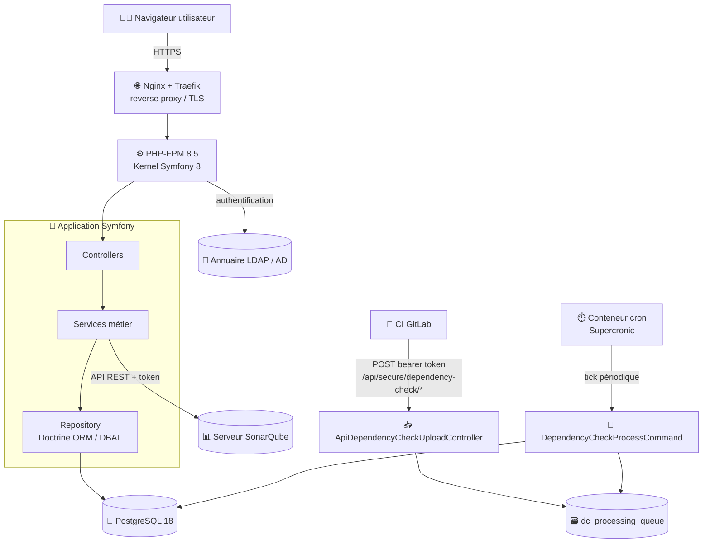
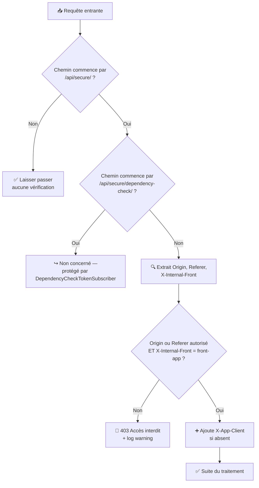

# 🏗️ Architecture technique

Ma-Moulinette est une application web développée en PHP/Symfony, qui collecte, historise et restitue les indicateurs qualité issus de SonarQube (et, depuis la v2.0.0, de rapports OWASP DependencyCheck) pour un portefeuille de projets.

## 🧱 Stack technique

| Composant | Version | Rôle |
| --- | --- | --- |
| PHP | ≥ 8.4 (8.5.5 en développement) | Runtime applicatif |
| Symfony | 8.0.\* | Framework |
| Doctrine ORM / DBAL | 3.6 / 4.4 | Accès aux données, mapping objet-relationnel |
| PostgreSQL | 18 | Base de données (unique — SQLite a été décommissionné en v2.0.0) |
| Symfony asset-mapper | 8.0.\* | Compilation des assets JS/CSS (remplace webpack Encore, décommissionné) |
| EasyAdmin | 5.0 | Back-office d'administration (CRUD Utilisateur, Groupe, Portefeuille, Batch) |
| Symfony LDAP | 8.0.\* | Authentification via annuaire LDAP/AD, en complément du compte local |
| Symfony Messenger | 8.0.\* | Bus de messages (transport Doctrine — voir [Traitements asynchrones](#-traitements-asynchrones-et-messenger)) |
| Symfony Scheduler | 8.0.\* | Planification des tâches internes (cron applicatif) |
| Twig | 3.24 | Moteur de templates |
| dompdf / FPDF+FPDI | — | Génération de rapports PDF (dont les rapports multi-orientation DependencyCheck) |
| PHPUnit | 13.1 | Tests (voir [Tests unitaires](../developpement/test-unitaire.md)) |
| PHPStan | 2.1 | Analyse statique |

Ces versions sont extraites de `composer.json` ; se référer à ce fichier pour l'état exact à un instant donné.

## 🔭 Vue d'ensemble applicative

Quatre grands types d'acteurs externes interagissent avec l'application :

- 🧑‍💻 **l'utilisateur**, via le navigateur, authentifié en local ou via LDAP ;
- 📊 **le serveur SonarQube**, interrogé en lecture par les services de collecte (`ClientService` et dérivés) ;
- 🦊 **la CI GitLab**, qui pousse les rapports OWASP DependencyCheck en asynchrone via un endpoint sécurisé par token bearer, distinct du reste de l'API ;
- ⏱️ **le conteneur cron** (Supercronic), qui dépile la file d'ingestion DependencyCheck à intervalle régulier.

Le service d'ingestion des rapports OWASP DependencyCheck est géré de manière asynchrone par la CI GitLab, qui pousse les rapports via un endpoint sécurisé par token bearer. Il n'y a pas de mécanisme de polling ou de webhook côté Ma-Moulinette : la CI est responsable de l'envoi des rapports.

Il est donc important de ne pas confondre le rôle de la CI (pousser les rapports) avec celui du conteneur cron (dépiler la file d'ingestion et traiter les rapports).

!!! warning "🐇 CI GitLab"
    GitLab CI n'est pas obligatoire. Ma-Moulinette est agnostique vis-à-vis de l'outil de CI/CD : tout autre outil capable de pousser des rapports via le même endpoint sécurisé par token bearer peut être utilisé.

Le détail du pipeline DependencyCheck (file d'attente, idempotence, cycle de vie d'un rapport, modèle des 4 tables `dc_scan/dc_dependency/dc_cve/dc_finding`) est couvert par la section dédiée [DependencyCheck — architecture d'ingestion](../dependency-check/architecture.md). Le schéma complet de la base de données est couvert par [Architecture — base de données](architecture-base-de-donnees.md).

## 🔄 Traitements asynchrones et Messenger

Symfony Messenger est configuré avec un transport **Doctrine** (`MESSENGER_TRANSPORT_DSN=doctrine://default?auto_setup=0`) : les messages en attente sont stockés dans une table PostgreSQL, pas dans un broker externe. Les DSN AMQP/Redis figurent encore en commentaire dans `.env` mais ne sont plus utilisés.

En pratique, le routing Messenger (`config/packages/messenger.yaml`) est aujourd'hui vide : la plupart des traitements différés historiquement portés par des messages (ex. collecte Activity) ont été migrés vers des **commandes console** invoquées par le cron (`ActivityCollecteCommand`, `DependencyCheckProcessCommand`, etc.), un choix plus simple à observer/déboguer qu'une file de messages pour des jobs qui tournent en batch court et périodique.

!!! note "🐇 RabbitMQ décommissionné"
    Jusqu'à la v1.x, les traitements batch/collecte transitaient par un serveur **RabbitMQ** dédié. Il a été entièrement retiré en v2.0.0 au profit du transport Doctrine ci-dessus (cf. `CHANGELOG.md`).

## 🔐 Sécurité et rôles

La gestion des accès repose sur les rôles Symfony définis dans `config/packages/security.yaml` : `ROLE_UTILISATEUR`, `ROLE_COLLECTE`, `ROLE_SUIVI`, `ROLE_BATCH`, `ROLE_ACTUATOR`, `ROLE_SECURITY`, `ROLE_SECURITY_ANALYTICS`, `ROLE_GESTIONNAIRE`, `ROLE_INTERNAL`. Le détail de la hiérarchie de rôles et du mapping rôle ↔ page est couvert par [Gestion de la sécurité](../developpement/securite.md).

### 🛡️ Filtrage des appels API internes — `ApiClientHeaderSubscriber`

Les routes `/api/secure/*` (hors DependencyCheck, voir plus bas) sont protégées par un event subscriber dédié, `App\EventSubscriber\ApiClientHeaderSubscriber` (priorité 20 sur `RequestEvent`), qui vérifie que l'appel provient bien du front applicatif :

Règles effectives (`src/EventSubscriber/ApiClientHeaderSubscriber.php`) :

- seules les routes `/api/secure/*` sont concernées ; `/api/public/*` n'est pas filtré ;
- pour le reste, la requête doit présenter **à la fois** un Origin ou Referer appartenant à `allowedOrigins` **et** le header `X-Internal-Front: front-app` — les deux conditions sont vérifiées ensemble, pas en cascade avec des messages d'erreur distincts ;
- en cas de succès, le header `X-App-Client` est injecté automatiquement s'il est absent ;
- en cas d'échec, la réponse est un JSON 403 unique (`[API-Credential] 🚫 Accès interdit : client non autorisé.`) et la tentative est journalisée via le logger applicatif standard (Monolog, pas un fichier dédié).

!!! caution "⚠️ Route DependencyCheck hors périmètre de ce subscriber"
    `/api/secure/dependency-check/*` est **explicitement exclu** de ce subscriber : ces endpoints sont appelés machine-à-machine par la CI GitLab et protégés séparément par `DependencyCheckTokenSubscriber` (validation d'un token bearer, pas d'Origin/Referer). Ne pas supposer que ces routes sont couvertes par le filtrage Origin/`X-Internal-Front` décrit ci-dessus — c'est un mécanisme de sécurité entièrement différent, à auditer séparément.

## 🐳 Environnement d'exécution

En développement comme en production, l'application tourne dans 4 conteneurs Docker (`docker/docker-compose.yml`) :

| Conteneur | Image / base | Rôle |
| --- | --- | --- |
| `database-ma-moulinette` | `postgres:${postgresql_version}` | 🐘 Base de données PostgreSQL |
| `php-fpm-ma-moulinette` | build custom (`php-custom.dockerfile`) | ⚙️ Exécution PHP-FPM de l'application Symfony |
| `cron-ma-moulinette` | build custom (`cron-ma-moulinette.dockerfile`) | ⏱️ Sidecar Supercronic — worker DependencyCheck et jobs planifiés, même code source (volume partagé), pas de process long-vécu |
| `nginx-ma-moulinette` | `nginx:${nginx_version}` | 🌐 Reverse proxy, TLS, intégration Traefik |

Le conteneur cron partage le volume applicatif avec `php-fpm` (même code, pas de duplication) et communique avec PostgreSQL sur le réseau Docker interne `proxy-net`.

Les variables Docker/infra (mots de passe PostgreSQL, tokens `DC_INGEST_TOKEN`/`SONAR_TOKEN`/`MAMOUL_TOKEN`, config Traefik/proxy) sont modélisées dans `docker/.env.template` — un gabarit avec des valeurs `changeMe_*` d'exemple, à copier/adapter par environnement (jamais commité avec de vraies valeurs). Côté applicatif Symfony, les variables clés sont `DATABASE_URL`, `MESSENGER_TRANSPORT_DSN`, `APP_CLIENT_TOKEN`/`API_CLIENT_TOKEN`/`APP_ALLOWED_ORIGINS` (sécurité API interne), `LDAP_HOST`/`LDAP_PORT`/`LDAP_ENCRYPTION` (authentification annuaire) — voir `.env`/`.env.local`/`.env.test.local` pour le détail complet.

!!! warning "🔒 Pas de secrets dans la doc"
    Aucune valeur de secret (token, mot de passe, clé) ne doit jamais être copiée dans cette documentation, y compris à titre d'exemple. Ne référencer que les **noms** des variables d'environnement, jamais leur contenu.

## 📚 Pour aller plus loin

- [Architecture — base de données](architecture-base-de-donnees.md) : schéma PostgreSQL détaillé.
- [Architecture — organisation du code](architecture-organisation.md) : arborescence `src/`, conventions.
- [Environnement de développement](../developpement/pour_bien_demarrer.md) : mise en place d'un poste de développement.
- [Gestion de la sécurité](../developpement/securite.md) : rôles, mapping page ↔ rôle.

-**-- FIN --**-

[Retour au menu principal](/index.html)
