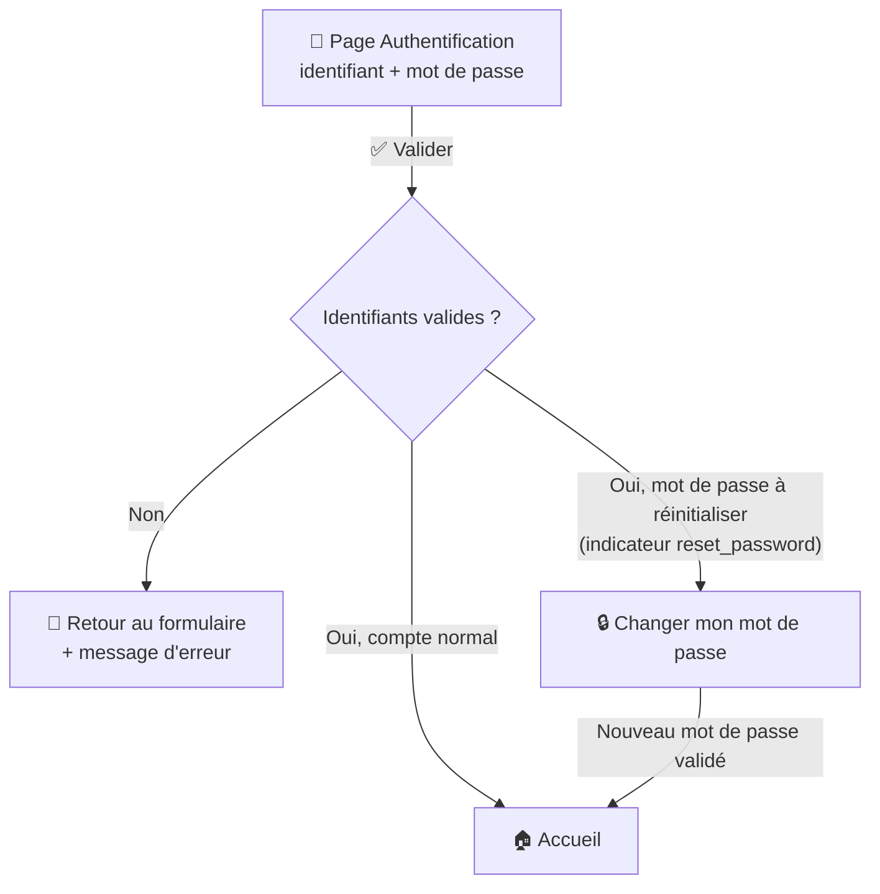
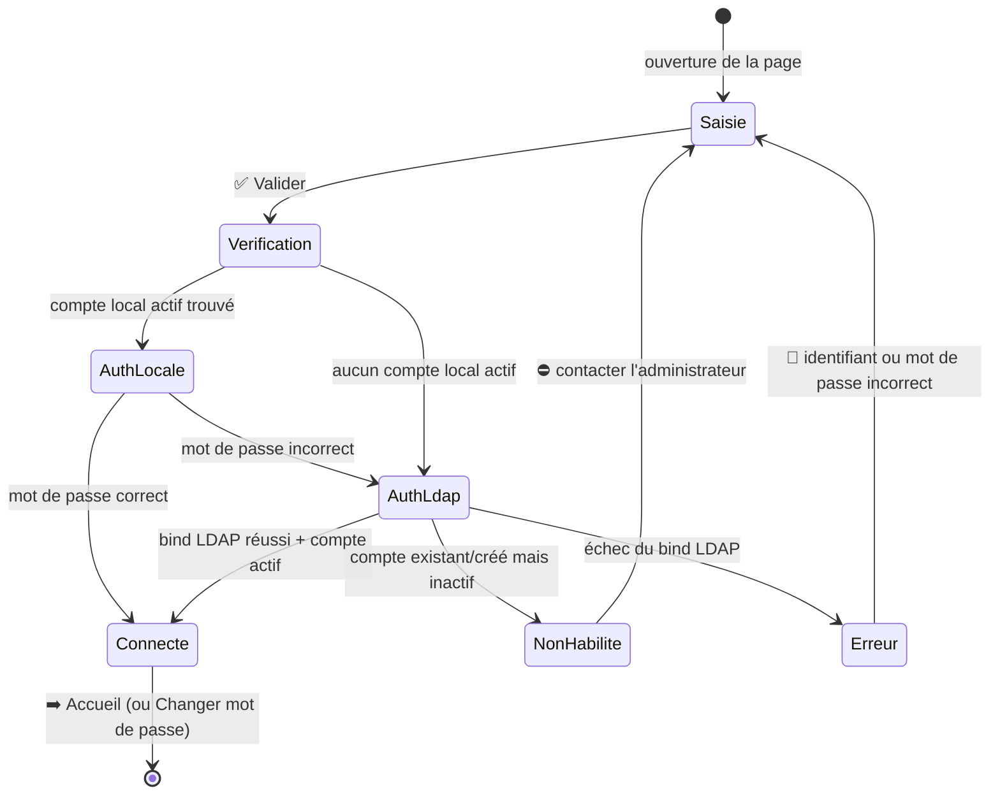

# 🔑 Authentification

La page d'authentification est **la porte d'entrée** de Ma-Moulinette : aucune autre page n'est accessible sans s'être connecté, sauf le plan du site, les conditions d'utilisation et les mentions légales.

C'est un simple formulaire (identifiant + mot de passe) qui, une fois validé, ouvre la page [Accueil](../application/accueil.md).

!!! note "🚫 Pas d'auto-inscription"
    Il n'existe **aucun formulaire d'inscription libre** dans l'application (aucune route/controller d'inscription dans le code actuel), et **aucun lien « mot de passe oublié »** sur cette page.

    Un compte est créé soit manuellement par un gestionnaire depuis le [back-office](../back-office/utilisateur.md), soit automatiquement lors d'une première tentative de connexion via l'annuaire LDAP (voir plus bas) — dans ce dernier cas le compte est créé **inactif**, en attente d'habilitation.

## 🗺️ Cartographie — où mène l'authentification

<!-- markdownlint-disable MD046 -->

<!-- markdownlint-enable MD046 -->

- Le seul bouton du formulaire, **✅ Valider**, déclenche la vérification des identifiants.
- En cas de succès « normal », l'utilisateur arrive directement sur la page [Accueil](../application/accueil.md).
- Si son compte porte l'indicateur `reset_password` (cas du compte `admin` livré par défaut — voir [Gestion de la sécurité](../developpement/securite.md#-compte-administrateur)), il est d'abord redirigé vers la page [Changer mon mot de passe](mise_a_jour_du_mot_de_passe.md), qu'il doit valider **avant** d'atteindre l'accueil.
- En cas d'échec, retour au formulaire avec un message d'erreur (volontairement générique).
- Un bouton « Afficher » permet de basculer l'affichage du mot de passe saisi en clair, pour faciliter la saisie.

!!! warning Attention
    Les identifiants de connexion sont sensibles. Veuillez les saisir avec précaution.
    Un compteur de tentatives est appliqué pour éviter les attaques par force brute — voir [Gestion de la sécurité](../developpement/securite.md#-firewalls).

## 🧭 Chemin de fer de la page

L'écran est en deux colonnes : une **vidéo décorative** à gauche (sans rôle fonctionnel) et le **formulaire de connexion** à droite. En haut, le fil d'Ariane rappelle la position dans le site.

<!-- markdownlint-disable MD046 -->
```text
Page Authentification
│
├── 🧵 Fil d'Ariane : Accueil › Authentification
│
├── 🎬 Colonne gauche  : vidéo d'illustration (décorative, muette, en boucle)
│
└── 📝 Colonne droite  : formulaire « Authentification »
        │
        ├── 🔤 Champ « Courriel »        → identifiant : « prenom.nom » ou « email@domaine.fr »
        │                                  (curseur placé ici automatiquement)
        ├── 🔒 Champ « Mot de passe »    → masqué par défaut
        │        └── 👁️ Bouton « Afficher » → affiche / masque le mot de passe saisi
        ├── ✅ Bouton « Valider »        → envoie le formulaire (ouvre l'Accueil si OK)
        └── ⚠️ Zone de message           → affiche l'erreur d'authentification le cas échéant
```
<!-- markdownlint-enable MD046 -->

### 📝 Éléments du formulaire

| Élément | Type | Comportement |
| --- | --- | --- |
| **Courriel** | champ texte | Accepte une **adresse mèl complète** (`email@domaine.fr`) **ou** un **identifiant court** (`prenom.nom`). Le curseur s'y place à l'ouverture de la page. Champ obligatoire. |
| **Mot de passe** | champ masqué | Saisie du mot de passe. Champ obligatoire. |
| **Afficher** | bouton | Bascule l'affichage du mot de passe en clair / masqué (aide à la saisie). N'envoie rien. |
| **✅ Valider** | bouton d'envoi | Soumet le formulaire et lance le processus d'authentification. En cas de succès, ouvre la page [Accueil](../application/accueil.md). |
| *(jeton CSRF)* | champ caché | Jeton anti-rejeu (`authenticate`) inséré automatiquement ; l'utilisateur n'a rien à saisir. |

!!! note "💡 Identifiant court ou adresse complète"
    Si vous saisissez un **identifiant court** (`prenom.nom`) au lieu d'une adresse complète, l'application reconstitue l'adresse en lui ajoutant le **domaine de repli** configuré pour l'instance (variable `LDAP_UPN_SUFFIX`).
    Une adresse mèl complète est toujours acceptée telle quelle.

## 🔀 Ce qui se passe quand on valide

Au clic sur **✅ Valider**, `App\Security\CustomAuthenticator` tente les identifiants dans cet ordre : d'abord le **compte local**, puis, en cas d'échec, l'**annuaire LDAP**.



- L'identifiant saisi est **normalisé en minuscules** ; il peut être une adresse courriel ou un identifiant court.
- **Authentification locale** (tentée en premier) : recherche d'un compte par courriel **avec statut actif**, puis vérification du mot de passe (hash bcrypt). Un ancien mot de passe stocké dans un format non normalisé est ré-encodé automatiquement à la volée (message « Votre mot de passe a été automatiquement mis à jour »).
- **Authentification LDAP** (repli) : un *bind* est tenté avec les identifiants saisis. En cas de succès, un compte local **actif** existant est réutilisé ; sinon un compte est **auto-provisionné** — inactif, rôle `ROLE_NONE`, rattaché au groupe utilisateur « En attente » — voir [Annuaire LDAP local](../developpement/openldap-local.md) pour la configuration de développement.
- Pour se connecter, un compte doit avoir le rôle `ROLE_UTILISATEUR` (ou un rôle qui en hérite) **et** le statut `actif` : un compte inactif ne peut pas se connecter, quel que soit son mot de passe.
- Dans tous les cas d'échec, le message reste volontairement **générique** côté utilisateur (pas de fuite d'information sur l'existence d'un compte).

!!! note "✅ Correction — domaine de repli configurable"
    Le domaine de repli n'est **plus codé en dur** dans `CustomAuthenticator` : il est désormais **injecté par configuration** via la variable d'environnement `LDAP_UPN_SUFFIX` (valeur de démonstration `@ma-moulinette.fr`, à surcharger dans `.env.local` sur une instance réelle). Chaque instance paramètre ainsi son propre domaine, sans valeur d'entreprise inscrite dans le code.

!!! caution "⚠️ Compte local inactif : message générique, pas de message dédié"
    La recherche du compte local (`courriel` + `actif = true`) échoue **silencieusement** si le compte existe mais est inactif — le flux part alors directement en tentative LDAP, comme si le compte n'existait pas.
    Le message « compte existant mais non habilité, contactez l'administrateur » ne s'affiche que si le **bind LDAP réussit ensuite**.

    Pour un compte purement local (jamais présent dans l'annuaire) et inactif, l'échec du bind LDAP renvoie le message générique « identifiant ou mot de passe incorrect » — sans indiquer qu'un compte existe réellement mais est désactivé.

## 🔒 Protection contre le brute-force

Le firewall applique un **throttling** de connexion : 3 tentatives par tranche de 15 minutes — voir [Gestion de la sécurité](../developpement/securite.md#-firewalls).

## ➡️ Après connexion

| Situation | Page ouverte |
| --- | --- |
| Compte normal | [🏠 Accueil](../application/accueil.md) |
| Compte avec `reset_password` actif (ex. `admin` par défaut) | [🔒 Changer mon mot de passe](mise_a_jour_du_mot_de_passe.md), puis Accueil après validation |

-**-- FIN --**-

[Retour au menu principal](/index.html)
