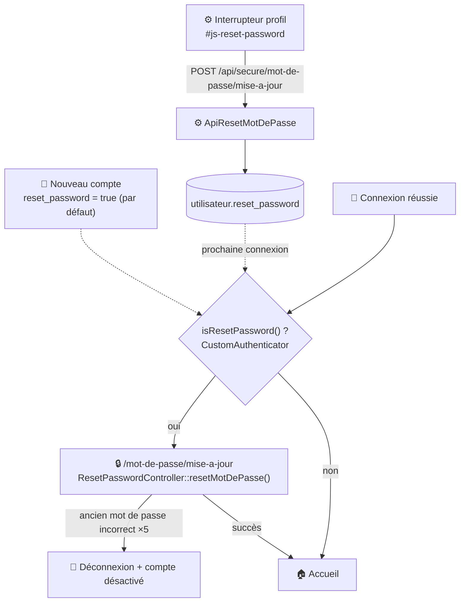

# 🔐 Mise à jour du mot de passe

## 🎯 Objectif

Deux façons d'arriver sur ce formulaire (`/mot-de-passe/mise-a-jour`) : le changement est **forcé** à la connexion suivante tant que `utilisateur.reset_password = true` — c'est la valeur par défaut de tout nouveau compte (voir [Authentification](authentification.md)) — ou l'utilisateur **active lui-même** cette contrainte pour la prochaine connexion, via l'interrupteur de la modale « Informations personnelles » (icône ⚙️ du bandeau).

## 🗺️ Cartographie

<!-- markdownlint-disable MD046 -->

<!-- markdownlint-enable MD046 -->

## 🧭 Chemin de fer de la page

<!-- markdownlint-disable MD046 -->
```text
Page Mise à jour du mot de passe
│
├── 🧵 Fil d'Ariane : Ma-Moulinette › Changer mon mot de passe
├── 🔔 Zone de messages (flash serveur uniquement)
│
├── 📝 Formulaire
│        ├── Compte utilisateur (courriel, lecture seule)
│        ├── Ancien mot de passe (+ bouton Afficher/Masquer)
│        ├── Nouveau mot de passe (+ jauge de robustesse visuelle, purement indicative)
│        ├── Vérification du nouveau mot de passe (+ bouton Afficher/Masquer)
│        └── Bouton Valider (désactivé tant que le focus n'a pas atteint le champ de ressaisie)
│
└── 💡 Recommandations (encart informatif, non technique)
```
<!-- markdownlint-enable MD046 -->

## 📝 Formulaire

Le formulaire demande : l'ancien mot de passe (pour confirmation), le nouveau mot de passe, et sa ressaisie. Le compte concerné est affiché mais non modifiable. Le nouveau mot de passe doit comporter entre **8 et 52 caractères** (`ResetPasswordFormType`, seule contrainte réellement vérifiée côté serveur).

L'encart « Recommandations » (12 caractères, complexité, éviter les informations personnelles) et la jauge de robustesse affichée en saisie (`password.js`, librairie de calcul d'entropie) sont **purement indicatifs** — aucune de ces règles n'est appliquée par le serveur, seule la longueur 8-52 l'est réellement.

!!! caution "⚠️ Verrouillage après 5 tentatives"
    Si l'ancien mot de passe saisi est incorrect, un compteur de tentatives s'incrémente et le compte est **désactivé** (`actif = false`) dès la première erreur — un message indique le nombre de tentatives restantes avant reconnexion. Après 5 tentatives, l'utilisateur est redirigé vers la déconnexion et **une réactivation manuelle par un gestionnaire est nécessaire**.

En cas de succès, le mot de passe est mis à jour (haché), le compteur de tentatives est réinitialisé, l'indicateur `reset_password` est levé, et l'utilisateur est redirigé vers la page [Accueil](../application/accueil.md).

## 🔁 Activer soi-même le changement à la prochaine connexion

Indépendamment du formulaire ci-dessus, tout utilisateur peut **s'imposer lui-même** un changement de mot de passe à sa prochaine connexion : un interrupteur dans la modale « Informations personnelles » (icône ⚙️ du bandeau, `information.utilisateur.html.twig`) appelle `POST /api/secure/mot-de-passe/mise-a-jour` (`ResetPasswordController::apiResetMotDePasse()`), qui met à jour `utilisateur.reset_password` — sans jamais toucher au mot de passe lui-même. Au prochain login réussi, `CustomAuthenticator` redirige automatiquement vers ce formulaire au lieu de la page [Accueil](../application/accueil.md) tant que ce drapeau est levé.

## ⚠️ Messages remontés par la page

### Flash serveur (`ResetPasswordController::resetMotDePasse()`)

| Sévérité | Déclencheur | Message |
| --- | --- | --- |
| `warning` | Ancien mot de passe incorrect (moins de 5 tentatives) | ⚠️ Votre mot de passe est incorrect (*N* tentative(s) restante(s)). |
| `success` | Changement de mot de passe réussi | 📌 Votre mot de passe a été changé avec succès. |

Au-delà de 5 tentatives incorrectes, aucun message flash n'est ajouté : redirection directe vers la déconnexion.

### Message JS direct (interrupteur, `details.js`)

Ce message n'utilise pas le mécanisme habituel `showMessage()` — il est injecté directement dans le DOM (`#mise-a-jour-message`), sans type ni icône.

| Déclencheur | Message |
| --- | --- |
| Interrupteur activé avec succès | 📌 Vous devez vous reconnecter pour changer votre mot de passe. |
| Interrupteur désactivé avec succès | *(message effacé)* |

## 📚 Pour aller plus loin

- [Authentification](authentification.md) : flux de connexion complet, y compris LDAP.
- [Gestion de la sécurité](../developpement/securite.md#-compte-administrateur) : cas du compte `admin`.
- [Accueil](../application/accueil.md) : page de destination après un changement réussi.

-**-- FIN --**-

[Retour au menu principal](/index.html)
