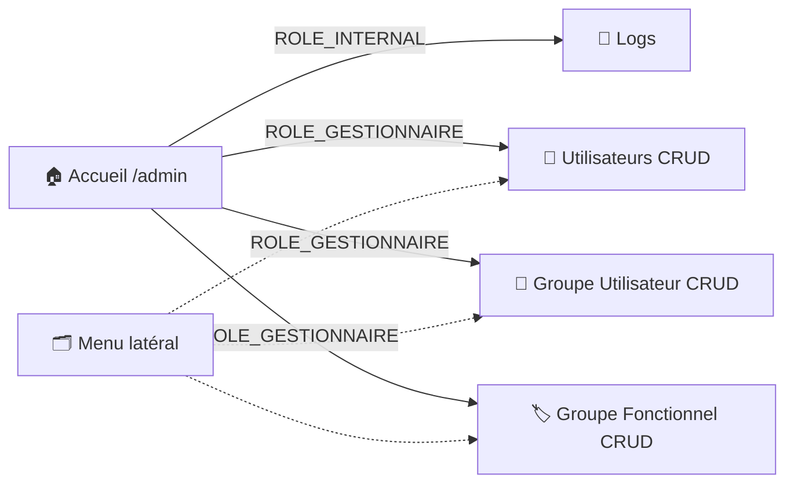
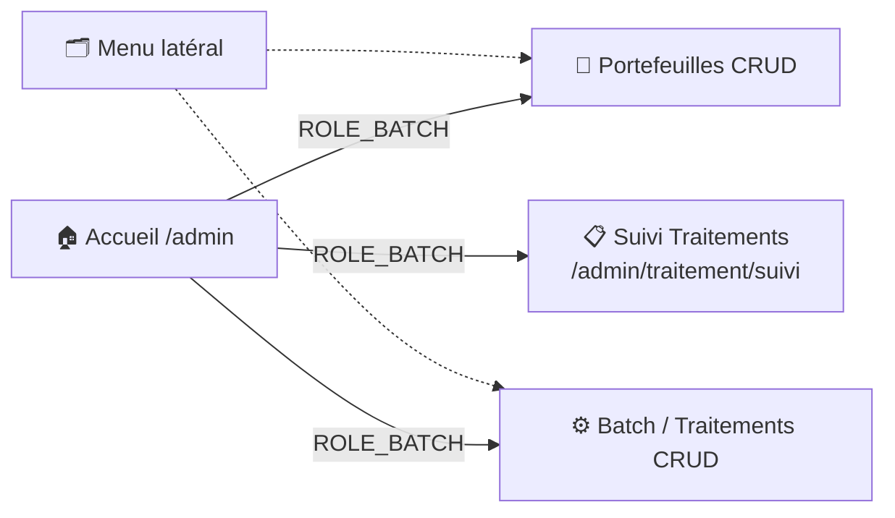
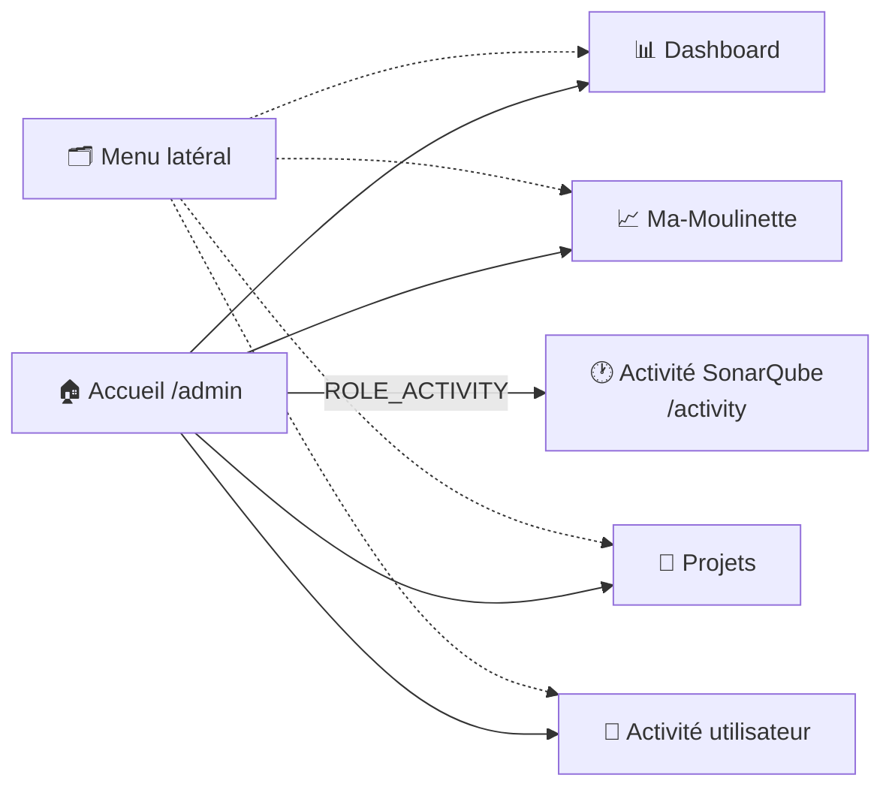
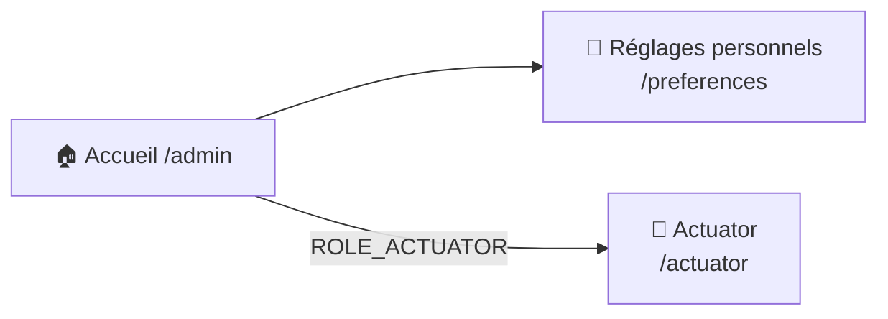

# 🧭 Dashboard back-office

Le back-office (`/admin`) s'appuie sur **EasyAdmin 5**. `Admin\DashboardController` est purement structurel : il ne calcule aucune statistique lui-même, il construit le menu latéral et sert de point d'entrée.

!!! note "🔐 Une porte d'entrée basse, des cartes filtrées par rôle"
    La route `/admin` elle-même n'exige que `ROLE_UTILISATEUR` — c'est volontaire : c'est le rôle minimal commun à tout compte actif, et c'est la page d'accueil (`admin/home.html.twig`) qui affiche ensuite des **cartes conditionnées par rôle** (voir ci-dessous), chaque CRUD ayant en plus son propre contrôle d'accès une fois ouvert.

!!! caution "⚠️ Si les pages EasyAdmin s'affichent sans mise en forme (CSS absent, erreurs JS)"
    Contrairement aux pages applicatives (asset-mapper), EasyAdmin sert ses propres CSS/JS déjà compilés depuis `public/bundles/easyadmin/` — un dossier gitignored, jamais créé automatiquement, à régénérer via `php bin/console assets:install` après le premier clone ou toute mise à jour du bundle.
    Détail dans [Pour bien démarrer](../developpement/pour_bien_demarrer.md), section « Assets publics des bundles tiers ».

## 🗺️ Cartographie — un hub de redirection filtrée par rôle

`/admin` ne rend aucun contenu propre : c'est un point d'entrée unique qui distribue vers ~13 destinations différentes selon les rôles de l'utilisateur connecté, via deux mécanismes distincts (cartes de la page d'accueil + menu latéral EasyAdmin, qui se recoupent partiellement). Un seul graphe global serait illisible — le détail est donc découpé par groupe de cartes, dans le même ordre que sur la page.

**Ligne 1 — Gestion** (`ROLE_INTERNAL` / `ROLE_GESTIONNAIRE`)



*Logs n'est accessible que par la carte — absent du menu latéral.*

**Ligne 2 — Traitement** (`ROLE_BATCH`)



*Suivi Traitements n'est accessible que par la carte — absent du menu latéral.*

**Ligne 3 — Statistiques** (aucun rôle, sauf Activité SonarQube)



*Activité SonarQube n'est accessible que par la carte — absente du menu latéral.*

**Ligne 4 — Espace personnel** (aucun rôle, sauf Actuator)



*Aucune des deux cartes de cette ligne n'apparaît dans le menu latéral.*

!!! note "🔀 Deux mécanismes de filtrage, deux chemins de code"
    Les cartes de `admin/home.html.twig` sont filtrées en Twig (`is_granted(...)` autour de chaque bloc).
    Le menu latéral est filtré en amont par EasyAdmin lui-même (les `MenuItem::linkTo(...)` vers un `CrudController` héritent du contrôle d'accès défini dans ce contrôleur ; les `MenuItem::linkToRoute(...)` vers les pages Statistiques ne sont, eux, protégés par aucun rôle spécifique).
    Les deux listes se recoupent mais ne sont **pas strictement identiques** : le menu n'expose ni « Suivi Traitements », ni « Activité SonarQube », ni « Réglages personnels », ni « Actuator », ni « Logs » — uniquement accessibles depuis les cartes.

## 🧭 Chemin de fer de la page d'accueil

<!-- markdownlint-disable MD046 -->
```text
Page d'accueil back-office (/admin)
│
├── 🧵 Titre + sous-titre + consigne « Cliquez sur un thème »
│
├── 🟦 Ligne 1 — Gestion
│        ├── Log                              (ROLE_INTERNAL)
│        ├── Utilisateurs                     (ROLE_GESTIONNAIRE)
│        ├── Groupe Utilisateur               (ROLE_GESTIONNAIRE)
│        └── Groupe Fonctionnel               (ROLE_GESTIONNAIRE)
│
├── 🟦 Ligne 2 — Traitement
│        ├── Portefeuilles                    (ROLE_BATCH)
│        ├── Traitements de données            (ROLE_BATCH)
│        └── Suivi Traitements                 (ROLE_BATCH)
│
├── 🟦 Ligne 3 — Statistiques
│        ├── Dashboard                        (aucun rôle)
│        ├── Ma-Moulinette                    (aucun rôle)
│        ├── Projets                          (aucun rôle)
│        ├── Activité utilisateur             (aucun rôle)
│        └── Activité SonarQube               (ROLE_ACTIVITY)
│
└── 🟦 Ligne 4 — Espace personnel
         ├── Réglages personnels              (aucun rôle)
         └── Actuator                         (ROLE_ACTUATOR)
```
<!-- markdownlint-enable MD046 -->

## 🃏 Page d'accueil (cartes)

| Carte | Rôle requis | Cible |
| --- | --- | --- |
| Log | `ROLE_INTERNAL` | Consultation des logs applicatifs |
| Utilisateurs, Groupe Utilisateur, Groupe Fonctionnel | `ROLE_GESTIONNAIRE` | [Utilisateurs](utilisateur.md), [Groupes](groupes.md) |
| Portefeuilles, Traitements de données, Suivi Traitements | `ROLE_BATCH` | [Portefeuilles](portefeuille.md), [Traitements](traitement.md) |
| Dashboard, Ma-Moulinette, Projets, Activité utilisateur | aucun (dès `ROLE_UTILISATEUR`) | [Statistiques](../application/statistiques.md) |
| Activité SonarQube | `ROLE_ACTIVITY` | [Activité SonarQube](../application/activite.md) |
| Réglages personnels | aucun (dès `ROLE_UTILISATEUR`) | [Préférences](../application/preferences.md) |
| Actuator | `ROLE_ACTUATOR` | [Actuator](../application/actuator.md) |

!!! note "✅ Homonymie « Activité » corrigée"
    La carte menant aux **statistiques d'usage des utilisateurs** (`/statistiques/utilisateur`) s'appelait **« Activité »** tout court, un nom trop proche de la carte **« Activité SonarQube »** (2026-07-15, `ROLE_ACTIVITY`, historique des tâches d'analyse SonarQube) — deux fonctionnalités distinctes. Renommée **« Activité utilisateur »** (carte + entrée du menu latéral, `DashboardController::configureMenuItems()`) pour lever l'ambiguïté — voir aussi [Statistiques](../application/statistiques.md).

Ces cartes sont les principaux points d'entrée de l'interface vers ces pages, en complément de la page « Plan du site » (voir [Accueil](../application/accueil.md#-haut-de-page)).

## 🗂️ Menu latéral

Le menu latéral d'EasyAdmin (distinct des cartes de la page d'accueil) reprend les mêmes CRUD que les cartes « Gestion utilisateur » et « Traitement », plus les 4 pages Statistiques.
Les libellés du menu ne reprennent pas toujours mot pour mot ceux des cartes (ex. « Batch » dans le menu vs « Traitements de données » sur la carte — même cible) :

| Section | Libellés du menu | Pages |
| --- | --- | --- |
| Gestion utilisateur | Utilisateurs, Groupes Utilisateurs, Groupes Fonctionnels | [Utilisateurs](utilisateur.md), [Groupes](groupes.md) |
| Traitement | Portefeuilles, Batch | [Portefeuilles](portefeuille.md), [Traitements](traitement.md) |
| Application | Dashboard, Ma-Moulinette, Activité utilisateur, Projets | Statistiques (dashboard, rapport SonarQube, activité utilisateur, projets) |

## 📊 Statistiques d'administration

Les indicateurs affichés sur `/statistiques/dashboard` (`StatistiqueController::adminDashboard()`, rôle `ROLE_INTERNAL`) proviennent directement de PostgreSQL :

- `pg_stat_activity` : connexions actives/idle sur la base ;
- `pg_stat_statements` : temps d'exécution moyen/min/max et écart-type des requêtes (extension PostgreSQL optionnelle, l'appel est protégé par un `try/catch` si elle n'est pas installée) ;
- versions PHP/Symfony/PostgreSQL, mémoire utilisée, nombre de tables du schéma ;
- statistiques de couverture de tests chargées depuis un fichier JSON généré (`admin-stats.json`) — voir [Tests unitaires](../developpement/test-unitaire.md).

!!! note "🧩 Historique du code"
    Ce calcul de statistiques a été déplacé depuis `DashboardController` vers `StatistiqueController` — si le code source mentionne encore un `AdminMetricsController` en commentaire, ce fichier n'existe plus dans le dépôt actuel.

-**-- FIN --**-

[Retour au menu principal](/index.html)
