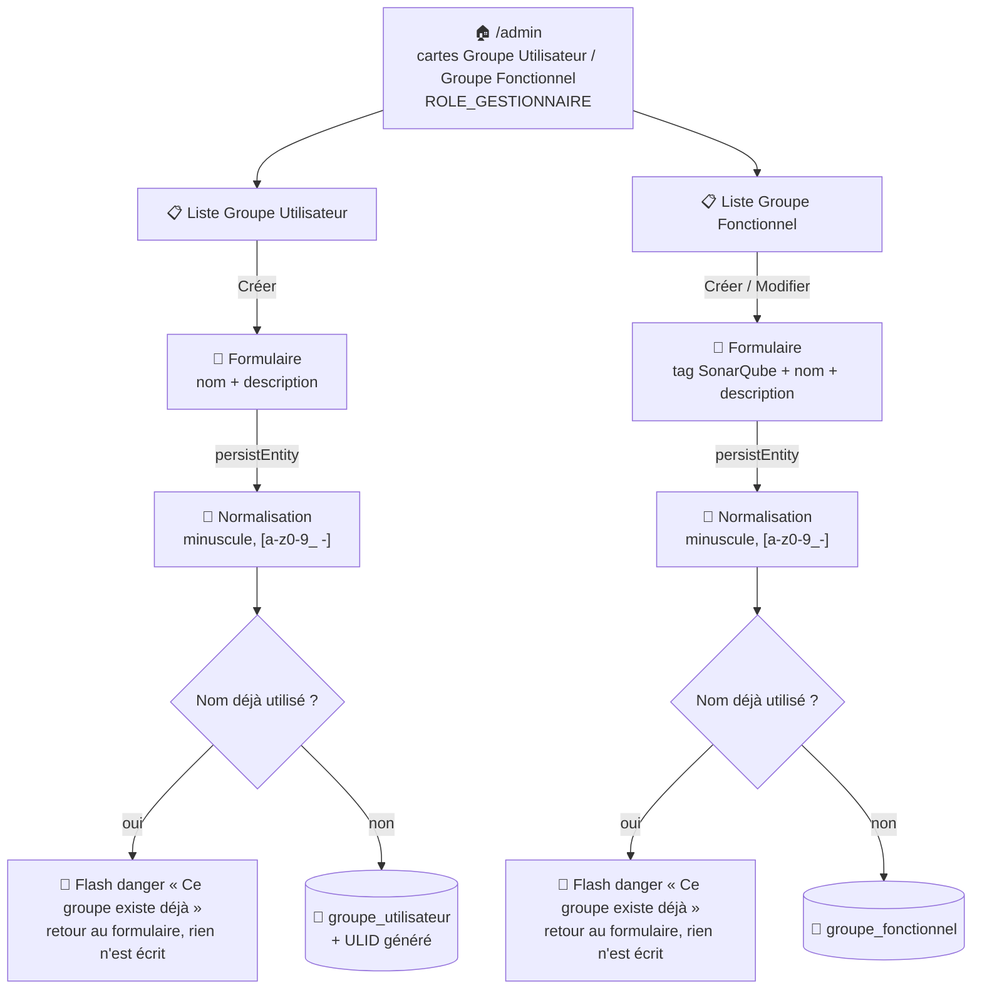

# 👥 Groupes utilisateur et groupes fonctionnels

Depuis la v2.0.0, la notion d'**équipe** a été remplacée par deux concepts distincts et complémentaires : le **groupe utilisateur** (un profil d'accès) et le **groupe fonctionnel** (un périmètre de projets). Deux CRUD EasyAdmin séparés les gèrent.

!!! caution "⚠️ Ne pas confondre les deux"
    Un **groupe utilisateur** répond à la question « à quel service/profil appartient cette personne ? » (ex. `Service-SI`). Un **groupe fonctionnel** répond à la question « sur quels projets cette personne peut-elle intervenir ? » (ex. `java-c-cool`, associé à des tags SonarQube). Un utilisateur a **un seul** groupe utilisateur mais peut avoir **plusieurs** groupes fonctionnels.

## 🗺️ Cartographie — cycle de vie d'une création

Les deux CRUD partagent la même logique de garde dans `persistEntity()` : normalisation du nom, puis vérification d'unicité **sur la valeur déjà normalisée** (une recherche Doctrine par nom exact ne suffirait pas — voir la note sur `#[UniqueEntity]` ci-dessous).



## 🧭 Chemin de fer des deux listes

<!-- markdownlint-disable MD046 -->
```text
Liste Groupe Utilisateur (/admin, GroupeUtilisateurCrudController)
│
├── 🔎 Filtre : groupeUtilisateur
├── 📊 Colonnes : Nom, Description, Identifiant (groupeId), Dernière modification, Date d'enregistrement
└── 🔘 Actions par ligne : Supprimer uniquement (Modifier/Détail retirés de l'index)

Liste Groupe Fonctionnel (/admin, GroupeFonctionnelCrudController)
│
├── 🔎 Filtre : groupeFonctionnel
├── 📊 Colonnes : Nom, Description, Dernière modification, Date d'enregistrement
│        (le champ Tags disponibles n'apparaît que sur les formulaires, jamais en colonne)
└── 🔘 Actions par ligne : Modifier, Supprimer (Détail retiré de l'index)

Formulaire Groupe Fonctionnel (Créer / Modifier)
│
├── 🏷️ Tags disponibles          — liste déroulante peuplée depuis liste_projet.tags,
│                                   désactivée en modification
├── 🔤 Nom du groupe             — se remplit automatiquement à la sélection d'un tag
│                                   (js-tags → js-groupe, groupe-fonctionnel.js),
│                                   lecture seule en modification
└── 📝 Description
```
<!-- markdownlint-enable MD046 -->


## 🧑‍🤝‍🧑 Groupe utilisateur

CRUD `Admin\GroupeUtilisateurCrudController`. Actions retirées de la page liste : **Modifier** et **Détail** (seules Créer/Supprimer restent visibles).

| Champ | Détail |
| --- | --- |
| Nom du groupe | Texte, unique, masqué sur le formulaire de modification une fois créé (ex. `Service-SI`) |
| Description | Texte libre (ex. `Service des Systèmes d'information`) |
| Identifiant (`groupeId`) | ULID généré automatiquement, lecture seule |

À la création, le nom est normalisé automatiquement (minuscules ; caractères conservés `[a-z0-9_ -]` — **l'espace est autorisé**, contrairement au groupe fonctionnel ci-dessous) et son unicité est vérifiée sur cette forme normalisée, pas sur la saisie brute.

**Groupes créés par défaut** (fixtures) : `En attente` (statut initial d'un compte nouvellement créé) et `Aucun` (aucun groupe). Les groupes métier (ex. `ADMIN`, `CONSULTATION`, `COLLECTE`, `GESTIONNAIRE METIER`, `GESTIONNAIRE APPLICATIF`) ne sont **pas** créés automatiquement — ce sont des exemples à créer manuellement selon l'organisation cible.

## 🏷️ Groupe fonctionnel

CRUD `Admin\GroupeFonctionnelCrudController`. Action retirée de la page liste : **Détail** uniquement — **Modifier** reste accessible (le nom devient alors en lecture seule dans le formulaire, la description et le tag restent modifiables).

| Champ | Détail |
| --- | --- |
| Nom du groupe | Texte, unique, lecture seule après création (ex. `java-c-cool`), caractères conservés `[a-z0-9_-]` (pas d'espace) |
| Description | Texte libre (ex. `Application - JAVA`) |
| Tags associés | Liste des tags SonarQube réellement présents sur les projets (`liste_projet.tags`), à titre informatif |

Le rattachement effectif d'un utilisateur ou d'un portefeuille à un groupe fonctionnel se fait par **préfixe de tag** (`LIKE 'préfixe%'`) plutôt que par une relation stricte — voir [Architecture — base de données](../architecture/architecture-base-de-donnees.md#-convention-relationnelle) pour le mécanisme complet.

Aucun groupe fonctionnel n'est créé par les fixtures de base : à créer selon l'organisation des projets de votre instance.

!!! note "🔎 Pourquoi une vérification manuelle en plus de `#[UniqueEntity]`"
    Les deux entités portent déjà une contrainte Symfony `#[UniqueEntity]` sur le nom, mais elle valide la **valeur brute saisie**, avant la normalisation appliquée dans `persistEntity()`. Deux saisies différentes (`Service SI`, `service_si`, `SERVICE-SI`…) peuvent normaliser vers la même valeur stockée sans que `#[UniqueEntity]` s'en aperçoive — d'où la recherche manuelle par `findOneBy()` sur le nom déjà normalisé, seule à même de détecter ce cas.

## 📚 Pour aller plus loin

- [Utilisateurs](utilisateur.md) : rattachement d'un compte à un groupe utilisateur et à des groupes fonctionnels.
- [Portefeuilles](portefeuille.md) : rattachement d'un portefeuille de projets à un groupe fonctionnel.
- [Gestion de la sécurité](../developpement/securite.md) : rôles applicatifs (à ne pas confondre avec les groupes utilisateur, qui sont un regroupement organisationnel, pas un mécanisme d'autorisation Symfony).

-**-- FIN --**-

[Retour au menu principal](/index.html)
