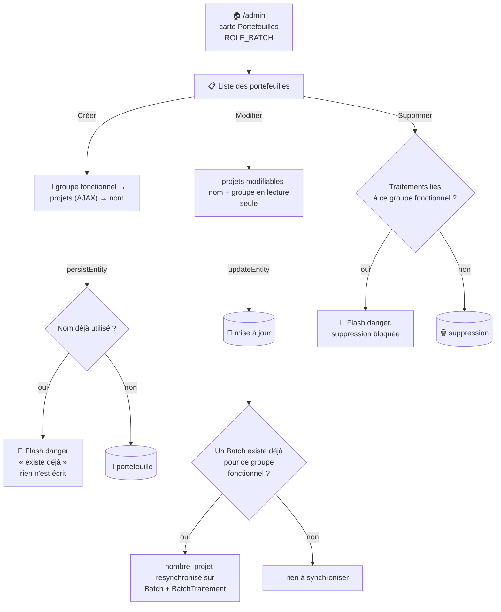

# 💼 Gestion des portefeuilles

CRUD EasyAdmin (`Admin\PortefeuilleCrudController`) permettant de regrouper un ensemble de projets SonarQube en vue d'une collecte automatique ou manuelle — le rattachement à un [portefeuille](portefeuille.md) est un préalable pour créer un [traitement](traitement.md).

## 🗺️ Cartographie — cycle de vie



## 🧭 Chemin de fer

<!-- markdownlint-disable MD046 -->
```text
Liste des portefeuilles (/admin, PortefeuilleCrudController)
│
├── 🔎 Filtres : portefeuille, groupeFonctionnel
├── 📊 Colonnes : Nom, Groupe fonctionnel, Projets (liste), Dernière modification, Date d'enregistrement
└── 🔘 Actions par ligne : Modifier, Supprimer (Détail retiré de l'index)

Formulaire (Créer / Modifier)
│
├── 🏷️ Groupe fonctionnel        — liste déroulante des groupes fonctionnels existants,
│                                    lecture seule en modification
├── 📁 Liste des projets         — choix multiple (autocomplete), reconstruite en AJAX à
│                                    chaque changement de groupe (/api/secure/admin/portefeuille/list-projets)
└── 🔤 Nom du portefeuille       — convention [groupe]-[fréquence], lecture seule en modification
```
<!-- markdownlint-enable MD046 -->

## 📋 Champs

| Champ | Détail |
| --- | --- |
| Nom du portefeuille | Texte, lecture seule après création, convention `[groupe]-[fréquence]` (ex. `java-c-cool-quotidien`) |
| Groupe fonctionnel | Choix parmi les [groupes fonctionnels](groupes.md) existants, lecture seule après création |
| Liste des projets | Choix multiple, filtré dynamiquement (Ajax) selon le groupe fonctionnel sélectionné — seuls les projets dont un tag correspond au groupe fonctionnel apparaissent |

!!! note "🔗 Rattachement par groupe fonctionnel, pas par équipe"
    Un portefeuille se rattache à un [groupe fonctionnel](groupes.md#-groupe-fonctionnel), qui filtre la liste des projets sélectionnables — la notion d'« équipe » n'existe plus dans le modèle de données depuis la v2.0.0.

!!! note "✅ Doublon à la création : silence trompeur corrigé"
    Contrairement à [Groupe Utilisateur / Groupe Fonctionnel](groupes.md), `Portefeuille` ne porte aucune contrainte Symfony `#[UniqueEntity]` — seule une vérification manuelle dans `persistEntity()` empêchait l'écriture d'un doublon. Cette vérification fonctionnait, mais **sans aucun message** : la tentative échouait silencieusement (rien n'était écrit) tandis qu'EasyAdmin affichait quand même son message de succès par défaut, laissant croire à tort que le portefeuille avait été créé. Corrigé en ajoutant un flash `danger` explicite, aligné sur le comportement des groupes.

!!! note "✅ Synchronisation du nombre de projets vers Batch/BatchTraitement corrigée"
    Piège de nommage réel : les colonnes `portefeuille` de `Batch` et `BatchTraitement` ne stockent **pas** le nom du portefeuille, mais le **slug du groupe fonctionnel** (voir le commentaire `$data->portefeuille = groupe_fonctionnel (slug)` dans `BatchAutoController::traitementListe()`, et le menu « Portefeuille » de [Traitements](traitement.md) qui liste en réalité des groupes fonctionnels).
    `PortefeuilleCrudController::updateEntity()` comparait à tort sur le nom du portefeuille — la resynchronisation de `nombre_projet` sur `Batch`/`BatchTraitement` après modification de la liste de projets ne trouvait donc jamais de correspondance et restait figée. Corrigé pour comparer sur le groupe fonctionnel, comme partout ailleurs dans le code (y compris le blocage de suppression ci-dessous, qui lui était déjà correct).

!!! note "✅ Renforcement de la sécurité : contrôle de rôle strict désormais appliqué sur le contrôleur"
    `PortefeuilleCrudController` n'imposait aucune restriction de rôle côté serveur — seule la carte de la page d'accueil du back-office masquait l'accès (`is_granted('ROLE_BATCH')`).
    **Corrigé** par l'ajout de `#[IsGranted('ROLE_BATCH', statusCode: 403)]` sur le contrôleur (même correctif appliqué à [Batch](traitement.md)) — voir [Gestion des utilisateurs](utilisateur.md) et [Gestion de la sécurité](../developpement/securite.md) pour le détail complet de ce renforcement.

## 🗑️ Suppression

La suppression d'un portefeuille est bloquée si un [traitement](traitement.md) y fait encore référence — il faut d'abord supprimer ou réaffecter les traitements concernés.

-**-- FIN --**-

[Retour au menu principal](/index.html)
