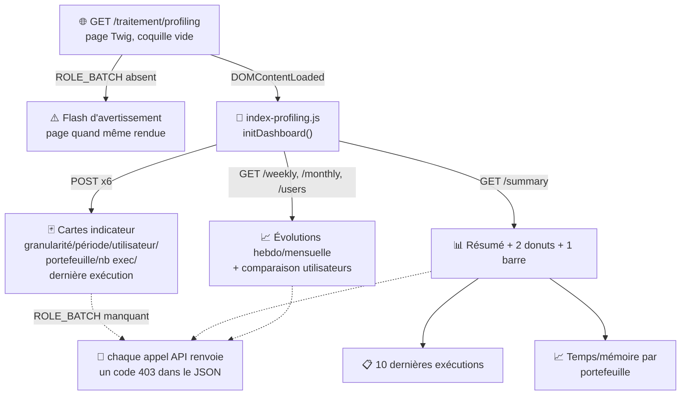

# 📐 Profiling des traitements batch

## 🎯 À quoi ça sert

Ce module mesure la **performance d'exécution des traitements batch de Ma-Moulinette elle-même** (temps d'exécution, consommation mémoire des collectes) — il n'a rien à voir avec les métriques de code SonarQube analysées par ailleurs. Il sert à observer la charge et la santé des traitements automatiques/manuels dans le temps (par portefeuille, par utilisateur, par semaine/mois).

## 🗺️ Cartographie



## 🧭 Chemin de fer

<!-- markdownlint-disable MD046 -->
```text
Dashboard Profiling (/traitement/profiling)
│
├── 📊 Résumé global (table + 3 graphiques : 2 donuts, 1 barre)
├── 🃏 Cartes indicateur : Granularité, Période, Utilisateurs,
│                           Portefeuille, Exécution, Dernière exécution
├── 📈 Graphiques globaux : Temps moyen / Mémoire peak par portefeuille
├── 📈 Évolution hebdomadaire : Temps moyen / Mémoire
├── 📈 Évolution mensuelle : Temps moyen / Mémoire
├── 📈 Comparaison utilisateurs : Temps moyen / Mémoire
└── 📋 Tableau des 10 dernières exécutions
```
<!-- markdownlint-enable MD046 -->

## 🧭 Pages et API

| Route | Rôle |
| --- | --- |
| `GET /traitement/profiling` | Dashboard de profiling (page Twig alimentée en AJAX) |
| `POST /api/secure/profiling/indicateur` | Filtre par indicateur (`utilisateur`, `portefeuille`, `granularite`, `periode`, `nb_exec`, `derniere_execution`) |
| `GET /api/secure/profiling/summary` | Résumé toutes granularités |
| `GET /api/secure/profiling/latest` | 10 dernières exécutions |
| `GET /api/secure/profiling/weekly/all` / `.../monthly/all` | Agrégats hebdomadaires/mensuels |
| `GET /api/secure/profiling/users/all` / `.../portefeuille/all` | Agrégats par utilisateur / par portefeuille |

Les 8 endpoints `/api/secure/profiling/*` vérifient chacun `ROLE_BATCH` (hérite de `ROLE_UTILISATEUR` — voir [Gestion de la sécurité](../developpement/securite.md)) et renvoient un JSON avec `code: 403` en cas de rôle manquant, sans casser le rendu de la page.

!!! note "🔎 La page se rend même sans `ROLE_BATCH`, les données restent protégées"
    `ProfilingController::profiling()` ne bloque pas l'affichage de la page pour un compte sans `ROLE_BATCH` — il ajoute un flash d'avertissement puis rend la même coquille Twig. C'est le JS (`initDashboard()`) qui charge ensuite les données via les 8 endpoints API ci-dessus, et ce sont **ces endpoints** qui appliquent le contrôle de rôle réel : sans `ROLE_BATCH`, la page s'affiche vide (chaque appel renvoie `code: 403`).
    Comportement volontaire, cohérent avec le modèle « page d'accès bas niveau + contenu filtré en aval » déjà observé sur `/admin`.

## 🗃️ Modèle de données

Une ligne dans `batch_profiling` par exécution de batch : portefeuille, référence d'exécution, nombre de projets traités, temps total/moyen, mémoire pic/moyenne, utilisateur, date.
Cinq vues SQL (`30_views/`) pré-agrègent ces données :

| Vue | Calcule |
| --- | --- |
| `vw_batch_profiling_weekly` | Agrégats par portefeuille + utilisateur + semaine |
| `vw_batch_profiling_monthly` | Idem par mois, avec date de dernière exécution |
| `vw_batch_profiling_global` | Agrégats toutes périodes confondues, avec première et dernière exécution |
| `vw_batch_profiling_stats` | Vue d'ensemble triée par activité la plus récente |
| `vw_batch_profiling_summary` | `UNION ALL` des 3 premières vues avec une colonne `granularite` (Hebdomadaire/Mensuel/Global) — vue "tout-en-un" consommée par l'API |

## 🧹 Purge

Une fonction PostgreSQL `purge_batch_profiling(v_limit_days INTEGER DEFAULT 90)` (`50_functions/`) supprime les lignes de `batch_profiling` plus anciennes que N jours (90 par défaut) et renvoie le nombre de lignes supprimées.

Commande console dédiée pour l'appeler :

```bash
php bin/console app:batch-profiling:purge                # purge > 90 jours
php bin/console app:batch-profiling:purge --days=30       # purge > 30 jours
php bin/console app:batch-profiling:purge --dry-run       # simulation, aucune suppression
```

À planifier via un cron externe (comme les autres traitements automatiques, voir [Traitements](traitement.md#-déclenchement-manuel-vs-automatique)) si une purge périodique est souhaitée — la commande ne s'exécute qu'à la demande, aucune tâche planifiée n'est incluse par défaut.

-**-- FIN --**-

[Retour au menu principal](/index.html)
