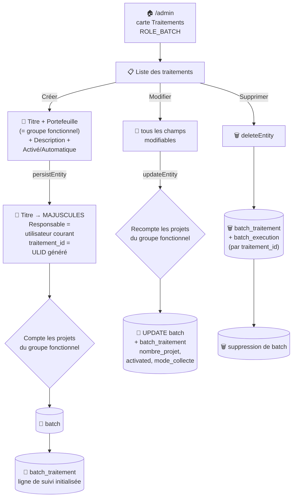

# ⚙️ Gestion des traitements

Un **traitement** (entité `Batch`) définit la configuration d'une collecte récurrente ou ponctuelle sur un [portefeuille](portefeuille.md) de projets. Cette page couvre à la fois sa **configuration** (CRUD back-office) et son **suivi d'exécution** (page de monitoring).

## ⚙️ Configuration (CRUD back-office)

CRUD EasyAdmin (`Admin\BatchCrudController`).

### 🗺️ Cartographie — cycle de vie



### 🧭 Chemin de fer

<!-- markdownlint-disable MD046 -->
```text
Liste des traitements (/admin, BatchCrudController)
│
├── 🔎 Filtres : titre, activated, automatique
├── 📊 Colonnes : Activé, Automatique, Titre, Portefeuille, Description,
│                  Nombre de projets, Responsable, Dernière modification,
│                  Date d'enregistrement
└── 🔘 Actions par ligne : Modifier, Supprimer (Détail retiré de l'index)

Formulaire (Créer / Modifier)
│
├── 🔘 Activé                — interrupteur, un traitement désactivé n'est jamais exécuté
├── 🔘 Automatique           — interrupteur, mode `automatique` (cron) ou `manuel`
├── 🔤 Titre                 — texte, forcé en MAJUSCULES à l'enregistrement (persistEntity)
├── 🏷️ Portefeuille          — liste déroulante des groupes fonctionnels (voir ⚠️ ci-dessous)
├── 📝 Description           — texte libre
├── 🔢 Nombre de projets     — lecture seule, recalculé automatiquement (Créer + Modifier)
└── 👤 Responsable           — lecture seule, rempli avec l'utilisateur qui crée le traitement
```
<!-- markdownlint-enable MD046 -->

| Champ | Détail |
| --- | --- |
| Activé | Interrupteur — un traitement désactivé n'est jamais exécuté |
| Automatique | Interrupteur — mode `automatique` (cron) ou `manuel` (déclenché par un utilisateur) |
| Titre | Texte (ex. `Application - Lot 1`) — converti en **MAJUSCULES** à l'enregistrement, quelle que soit la saisie |
| Portefeuille | Choix parmi les [groupes fonctionnels](groupes.md#-groupe-fonctionnel) existants (voir note ci-dessous) |
| Description | Texte libre |
| Nombre de projets | Calculé automatiquement depuis le portefeuille, non modifiable — recalculé à chaque création **et** modification |
| Responsable | Rempli automatiquement avec l'utilisateur qui crée le traitement (nom complet + un format court `I. NOM` pour l'affichage) |

À la création, un identifiant unique (ULID) est généré et une ligne correspondante est initialisée dans la table de suivi `batch_traitement`. À la suppression, les lignes `batch_traitement` et `batch_execution` liées (par `traitement_id`) sont supprimées avant l'entité elle-même.

!!! caution "⚠️ Le champ « Portefeuille » liste en réalité des groupes fonctionnels"
    Piège de nommage : le menu déroulant « Portefeuille » de ce formulaire (`BatchCrudController::configureFields()`) est peuplé par `SELECT groupe_fonctionnel FROM ma_moulinette.portefeuille`, pas par les noms de [portefeuilles](portefeuille.md) — c'est bien voulu : les colonnes `portefeuille` de `Batch`/`BatchTraitement` stockent en réalité le **slug du groupe fonctionnel** (confirmé par le commentaire `$data->portefeuille = groupe_fonctionnel (slug)` dans `BatchAutoController::traitementListe()`, qui l'utilise comme critère pour retrouver la liste de projets à collecter).
    Si plusieurs portefeuilles existent pour un même groupe fonctionnel, ce menu ne permet pas de choisir lequel — un traitement cible donc un **groupe fonctionnel dans son ensemble**, pas un portefeuille précis.

!!! note "✅ Renforcement de la sécurité : contrôle de rôle strict désormais appliqué sur le contrôleur"
    `BatchCrudController` n'imposait aucune restriction de rôle côté serveur — seule la carte de la page d'accueil du back-office masquait l'accès (`is_granted('ROLE_BATCH')`).
    **Corrigé** par l'ajout de `#[IsGranted('ROLE_BATCH', statusCode: 403)]` sur le contrôleur (même correctif appliqué à [Portefeuille](portefeuille.md)) — voir [Gestion des utilisateurs](utilisateur.md) et [Gestion de la sécurité](../developpement/securite.md) pour le détail complet de ce renforcement.

## 📊 Suivi d'exécution

Page accessible via `/traitement/suivi` (rôle `ROLE_BATCH` ou `ROLE_GESTIONNAIRE`), présentant un tableau des exécutions avec identifiant, batch/portefeuille associé, mode (automatique/manuel), utilisateur déclencheur, dates de début/fin, durée, statut (`EN_COURS`/`SUCCES`/`ECHEC`/`PARTIEL`), nombre de projets traités/en succès/en erreur, et un bouton **Journal** ouvrant le compte rendu détaillé (décompressé à la volée depuis la colonne `compte_rendu`, stockée en `BYTEA` gzippé).

Filtres disponibles : par portefeuille, par traitement, par statut, par mode, par plage de dates.

## 🔀 Déclenchement manuel vs automatique

!!! note "🧵 Ni Messenger, ni Scheduler Symfony natif"
    Contrairement à ce qu'on pourrait attendre, **aucun des deux modes n'utilise Symfony Messenger ni le Scheduler natif** (`src/Schedule.php` est un squelette vide, remplacé par du cron externe).

- **Manuel** : l'utilisateur clique sur « Lancer maintenant » depuis l'UI. Un script JS (`pendingWorker.js`) interroge en polling `GET /api/secure/traitement/pending`, et le déclenchement (`POST /api/secure/traitement/start`) exécute la collecte **de façon synchrone** dans une boucle PHP, en mettant à jour l'état (`pending`/`in_progress`/`success`) dans `batch_traitement`. Si un traitement est déjà en cours, une nouvelle demande est simplement marquée `pending` (file d'attente logique en base, pas de queue applicative).
- **Automatique** : une commande console dédiée (`app:collecte:run`) est planifiée par **Supercronic** dans le conteneur `cron-ma-moulinette` (chaque nuit à 01h30 — voir [Environnement d'exécution](../architecture/architecture-technique.md#-environnement-dexécution)). Elle appelle en HTTP l'API publique de l'application elle-même (`/api/public/traitement/automatique/{liste,start}`, protégée par token applicatif), qui exécute la collecte avec la même logique synchrone que le mode manuel — l'utilisateur de collecte est alors identifié comme un compte robot dédié.

## 📚 Pour aller plus loin

- [Portefeuilles](portefeuille.md) : prérequis à la création d'un traitement.
- [Profiling](profiling.md) : mesure de performance des exécutions batch.
- [Gestion de la sécurité](../developpement/securite.md) : rôles `ROLE_BATCH`/`ROLE_GESTIONNAIRE`.

-**-- FIN --**-

[Retour au menu principal](/index.html)
