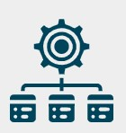

# Suivi des traitements

La page **Suivi des traitements** permet de visualiser l'historique et l'état d'avancement des batchs de collecte (manuels ou automatiques). Elle a été introduite en v2.0.0.

## Évolutions

> En version **2.0.0**

* [x] Ajout de la **page de suivi** des traitements automatiques et manuels.
* [x] Ajout d'un **bouton d'affichage du journal d'exécution** (table `batch_execution_journal`).
* [x] Les comptes rendus sont **compressés en `BYTEA`** (commande `app:migrate-compte-rendu`).
* [x] Traces HTTP **200 / 400 / 401 / 404 / 500 / 503** enregistrées pour chaque appel.
* [x] Historisation du **mode de collecte** (`automatique` / `manuel`) et de **l'utilisateur** déclencheur.

## Accès

L'accès est réservé aux utilisateurs disposant d'un des rôles suivants :

* `ROLE_BATCH`
* `ROLE_GESTIONNAIRE`

La page est accessible :

* depuis l'icône  en haut à droite ;
* depuis le menu latéral du back-office ;
* via l'URL `/traitement/suivi`.

## Contenu

La page présente un tableau des exécutions avec :

* **Identifiant** d'exécution ;
* **Batch** associé (titre et portefeuille) ;
* **Mode** : `automatique` (Scheduler) ou `manuel` (déclenché par un utilisateur) ;
* **Utilisateur** déclencheur ;
* **Date de début** / **date de fin** ;
* **Durée** ;
* **Statut** : `EN_COURS`, `SUCCES`, `ECHEC`, `PARTIEL` ;
* **Nombre de projets** traités / en succès / en erreur ;
* **Journal** : bouton ouvrant le compte rendu détaillé.

## Journal d'exécution

Le bouton **Journal** ouvre une fenêtre modale affichant le contenu de `compte_rendu` (décompressé à la volée). Le journal contient :

* la séquence des appels API SonarQube ;
* les codes HTTP retournés ;
* les éventuelles erreurs rencontrées ;
* le détail des insertions en base ;
* la synthèse finale (succès / erreurs).

## Filtres

Les filtres disponibles :

* par **portefeuille** ;
* par **batch** ;
* par **statut** ;
* par **mode** (automatique / manuel) ;
* par **plage de dates**.

## Déclenchement manuel

Depuis la liste des batchs, un bouton **Lancer maintenant** permet de déclencher manuellement un traitement. Le job est envoyé sur le transport **Doctrine** de Symfony Messenger et traité par un worker.

> [CAPTURE À FAIRE] — capture de la page de suivi avec journal ouvert.

-**-- FIN --**-

[Retour au menu principal](/index.html)
