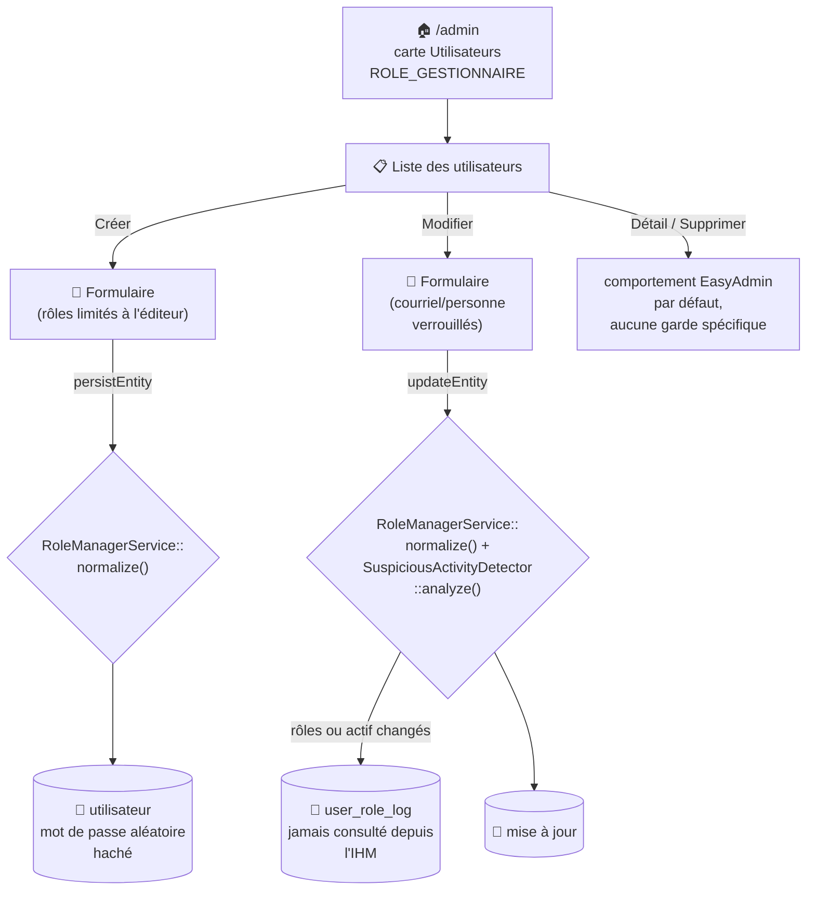
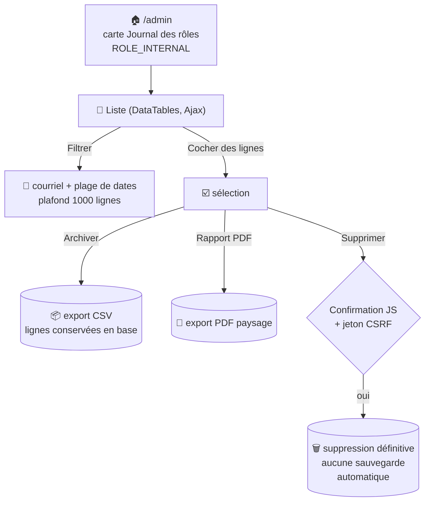

# 👤 Gestion des utilisateurs

CRUD EasyAdmin (`Admin\UtilisateurCrudController`) permettant de consulter, créer, modifier et supprimer les comptes utilisateurs.

## 🗺️ Cartographie



## 🧭 Chemin de fer

<!-- markdownlint-disable MD046 -->
```text
Liste des utilisateurs (/admin/utilisateur, UtilisateurCrudController)
│
├── 🔎 Filtres : courriel
├── 📊 Colonnes : Avatar, Personne, Courriel, Rôles (badges), Actif,
│                  Groupe utilisateur, Groupe(s) fonctionnel(s),
│                  Dernière modification, Date d'enregistrement
└── 🔘 Actions par ligne : Détail, Modifier, Supprimer
     (seul CRUD du back-office à conserver l'action Détail — les autres
      CRUD EasyAdmin de l'application la retirent de l'index)

Formulaire (Créer / Modifier)
│
├── 🖼️ Avatar               — lecture seule, non proposé au formulaire (géré ailleurs)
├── 👤 Personne              — absent du formulaire (voir ⚠️ ci-dessous), visible en liste/détail
├── 🔤 Prénom / Nom          — texte
├── 📧 Courriel              — verrouillé après création
├── 🔐 Rôles                 — cases à cocher, liste dépendante du rôle de l'éditeur
│                               (voir tableau ci-dessous), certaines désactivées selon
│                               l'état du compte édité
├── 🔘 Actif                 — interrupteur, aucun garde-fou serveur (voir ⚠️ ci-dessous)
├── 🏷️ Groupe utilisateur    — liste déroulante (table groupe_utilisateur)
└── 🏷️ Groupes fonctionnels  — choix multiple (table groupe_fonctionnel), périmètre de projets
```
<!-- markdownlint-enable MD046 -->

## 📋 Champs

| Champ | Détail |
| --- | --- |
| Avatar | Image, non modifiable directement dans le formulaire (masqué sur Créer/Modifier) |
| Personne | Valeur calculée (`getPersonne()` = `trim("$nom $prenom")`), pas une colonne — visible en liste/détail, absente du formulaire (voir ⚠️ ci-dessous) |
| Prénom / Nom | Texte |
| Courriel | Non modifiable après création |
| Rôles | Voir [Rôles assignables](#-rôles-assignables-selon-léditeur) ci-dessous |
| Actif | Interrupteur — un compte inactif ne peut pas se connecter (`CustomAuthenticator`) |
| Groupe utilisateur | Choix parmi les groupes définis dans [Groupes](groupes.md) |
| Groupes fonctionnels | Choix multiple parmi les groupes fonctionnels définis dans [Groupes](groupes.md) — détermine le périmètre de projets visible |
| Dernière modification / Date d'enregistrement | Horodatage automatique, lecture seule |

!!! note "✅ Champ « Personne » : option morte retirée du code"
    `configureFields()` déclarait `TextField::new('personne')->setFormTypeOption('disabled', in_array($pageName, [Crud::PAGE_EDIT], true))->hideOnForm()` — l'option `disabled` (qui laissait croire à un champ visible mais verrouillé) était en réalité **morte** : `hideOnForm()` retire déjà le champ des formulaires Créer *et* Modifier, dans tous les cas.
    **Corrigé** : l'option `disabled` a été retirée (`personne` n'a pas de colonne en base, ni de `setPersonne()` — c'est un getter calculé `trim("$nom $prenom")`, non éditable par nature ; aucun changement de comportement, juste un nettoyage de code mort trompeur).

## 🔐 Rôles assignables selon l'éditeur

La liste des rôles proposés dans le formulaire dépend du rôle de la personne qui édite, pas d'une liste fixe :

| Rôle de l'éditeur | Rôles qu'il peut attribuer |
| --- | --- |
| `ROLE_INTERNAL` | Tous : `ROLE_NONE`, `ROLE_UTILISATEUR`, `ROLE_COLLECTE`, `ROLE_SUIVI`, `ROLE_ACTIVITY`, `ROLE_BATCH`, `ROLE_ACTUATOR`, `ROLE_SECURITY`, `ROLE_SECURITY_ANALYTICS`, `ROLE_GESTIONNAIRE`, `ROLE_INTERNAL` |
| `ROLE_GESTIONNAIRE` | Sous-ensemble restreint : `ROLE_NONE`, `ROLE_UTILISATEUR`, `ROLE_COLLECTE`, `ROLE_SUIVI`, `ROLE_SECURITY` (+ `ROLE_GESTIONNAIRE` si déjà présent sur le compte édité — il ne peut pas se l'auto-attribuer sur un autre compte) |
| Autre | Uniquement `ROLE_NONE` |

Quelques garde-fous supplémentaires, appliqués à la fois dans le formulaire (cases décochables désactivées) et re-vérifiés côté serveur par `RoleManagerService::normalize()` (donc résistants à une soumission de formulaire trafiquée) :

- Un compte actif ne peut pas être ramené à `ROLE_NONE` sans être désactivé au préalable.
- `ROLE_GESTIONNAIRE` ne peut **jamais** être retiré depuis ce formulaire, y compris par un éditeur `ROLE_INTERNAL` — la case est toujours désactivée, et `normalize()` réattribue le rôle même s'il était absent des données soumises. La seule façon de « démettre » un compte `ROLE_GESTIONNAIRE` est de le désactiver d'abord (retombe alors sur `ROLE_NONE`), puis de le réactiver avec de nouveaux rôles.
- Dès qu'un compte porte `ROLE_INTERNAL`, l'intégralité de la liste de rôles est verrouillée dans le formulaire — un éditeur non `ROLE_INTERNAL` ne peut modifier aucun rôle de ce compte.

!!! note "🧬 `ROLE_NONE` = compte sans privilège"
    Voir [Gestion de la sécurité](../developpement/securite.md#-rôles-et-hiérarchie) — `ROLE_NONE` est la sentinelle utilisée pour un compte désactivé ou pas encore affecté, sans aucun droit.

!!! note "✅ Renforcement de la sécurité : contrôle de rôle strict désormais appliqué sur le contrôleur"
    Par l'ajout de `#[IsGranted('ROLE_GESTIONNAIRE', statusCode: 403)]` directement sur ce contrôleur (et `#[IsGranted('ROLE_BATCH', statusCode: 403)]` sur [Portefeuille](portefeuille.md) et Batch), alignés sur le modèle de rôle déjà voulu par la page d'accueil — le rôle est désormais vérifié avant toute exécution du contrôleur, plus seulement par le masquage d'un lien.

!!! note "✅ Journal des changements de rôle désormais consultable"
    Chaque modification de rôles ou du statut Actif est auditée en base (table `user_role_log`, alimentée par `UserRoleLoggerService` à chaque `updateEntity()` — courriel de la cible et de l'éditeur, anciens/nouveaux rôles, ancien/nouveau statut actif, alertes de `SuspiciousActivityDetector`).
    Ce journal était jusqu'ici écrit mais jamais consultable depuis l'application.
    **Corrigé** par l'ajout d'une page dédiée : [Journal des rôles](#-journal-des-rôles).

## 📜 Journal des rôles

Nouvelle page `Admin\UserRoleLogController` (`/admin/journal-roles`, carte dédiée sur la page d'accueil du back-office à côté de « Log », `ROLE_INTERNAL` — plus restrictif que le CRUD Utilisateur lui-même, car ce journal expose qui a modifié les droits de qui).

### 🗺️ Cartographie - Journal des rôles



### 🧭 Chemin de fer - Journal des rôles

<!-- markdownlint-disable MD046 -->
```text
Journal des rôles (/admin/journal-roles, UserRoleLogController)
│
├── 🔎 Filtres : courriel (cible ou éditeur), plage de dates (depuis / jusqu'au)
├── 📊 Colonnes : Date, Compte modifié, Éditeur, Rôles avant, Rôles après,
│                  Actif avant → après, Alertes, sélection (case à cocher)
└── 🔘 Actions sur la sélection : Archiver (CSV), Rapport PDF, Supprimer
```
<!-- markdownlint-enable MD046 -->

### 📋 Fonctions - Journal des rôles

| Fonction | Détail |
| --- | --- |
| Consultation | Tableau (DataTables) chargé en Ajax, filtrable par courriel (cible ou éditeur) et par plage de dates ; tri/pagination/recherche côté client |
| Archiver la sélection | Export CSV (UTF-8, séparateur `;`) des lignes cochées — **les lignes ne sont pas supprimées**, c'est une simple copie téléchargeable |
| Rapport PDF | Export PDF (paysage) des lignes cochées, mise en page dédiée (`PdfExportService::generateUserRoleLogPdf`) |
| Supprimer la sélection | Suppression définitive des lignes cochées, protégée par jeton CSRF et confirmation JS — **aucune sauvegarde automatique**, archiver au préalable si nécessaire |

### ⚠️ Messages remontés par la page

| Sévérité | Déclencheur | Message |
| --- | --- | --- |
| `warning` | Archiver / Rapport PDF / Supprimer sans aucune ligne cochée (bloqué côté JS avant l'appel réseau) | ⚠️ Veuillez sélectionner au moins une ligne (Erreur 404). |
| `error` | Jeton CSRF invalide à la suppression | ❌ Jeton de sécurité invalide (Erreur 403). |
| `success` | Suppression réussie | ✅ N ligne(s) supprimée(s). |
| `critical` | Erreur de lecture du journal (`GET .../list`) | Une erreur est survenue lors de la lecture du journal (Erreur 500). |
| `critical` | Erreur pendant l'archivage CSV | 🔴 Une erreur est survenue lors de l'archivage (Erreur 500). |
| `critical` | Erreur pendant la génération du PDF | 🔴 Une erreur est survenue lors de la génération du rapport (Erreur 500). |
| `error` | Session expirée pendant un téléchargement (401/403 HTTP réel) | 🚫 Accès refusé. Veuillez vous reconnecter. |

!!! caution "⚠️ Pas de pagination serveur : plafond à 1000 lignes"
    La page charge jusqu'à 1000 lignes (les plus récentes) en une seule requête — au-delà, affiner le filtre par plage de dates pour retrouver les lignes plus anciennes. Pas de troncature silencieuse : le plafond est appliqué côté `UserRoleLogRepository::findFiltered()`, à faire évoluer vers une pagination serveur si le volume le justifie.

!!! note "✅ Erreur serveur sur Archiver/PDF téléchargée comme un faux fichier — corrigé"
    `downloadSelection()` (JS) force `responseType: 'blob'` pour récupérer le CSV/PDF binaire, et bloque bien l'appel réseau si aucune ligne n'est cochée.
    Mais si le serveur échouait **après** l'appel (ex. erreur base de données pendant `findByIds()`), la réponse JSON d'erreur (`{"code":500,...}`, envoyée en HTTP 200 comme partout ailleurs dans l'application) était tout de même traitée comme un succès par le callback `success` de jQuery : l'utilisateur téléchargeait un fichier `journal_roles.csv`/`.pdf` qui ne contenait en réalité que le message d'erreur JSON, sans être informé de l'échec réel.
    **Corrigé** en inspectant l'en-tête `Content-Type` de la réponse dans `success` : si `application/json` (au lieu de `text/csv`/`application/pdf`), le blob est relu comme texte, parsé, et le vrai message d'erreur est affiché via `showMessage()` plutôt que déclencher un faux téléchargement. Le même motif préexistait à l'identique dans `admin/logs` (`AdminLogController::downloadSelection()` / `app-admin-log.js`) — corrigé aussi, par cohérence.

## 🌱 Comptes créés par défaut

Les fixtures de base (`migrations/PosgreSQL/90_fixtures/fixtures.sql`) ne créent qu'un seul compte : `admin@ma-moulinette.fr` (rôle `ROLE_INTERNAL`) — voir [Gestion de la sécurité](../developpement/securite.md#-compte-administrateur) pour le mot de passe par défaut et l'avertissement associé.

Il n'y a pas d'autres comptes créés automatiquement en environnement de production/développement standard.

-**-- FIN --**-

[Retour au menu principal](/index.html)
