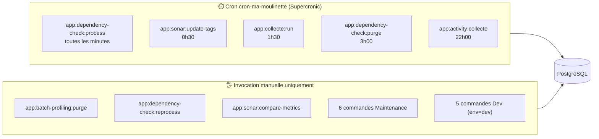

# ⚙️ Commandes console

Ma-Moulinette embarque **19 commandes console** Symfony (`bin/console app:...`), réparties en 3 catégories selon leur usage :

| Dossier | Nombre | Usage |
| --- | --- | --- |
| `src/Command/Prod/` | 8 | Exploitables en production, dont 5 tournent automatiquement via le cron `cron-ma-moulinette` (Supercronic) |
| `src/Command/Maintenance/` | 6 | Outils ponctuels (migration, audit, statistiques) — invocation manuelle |
| `src/Command/Dev/` | 5 | Réservées à l'environnement de développement (seed de données fictives, diagnostic) |

## 🗺️ Cartographie

## 📋 Vue d'ensemble

Classification d'**impact** utilisée dans les 3 pages de détail :

| Impact | Signification |
| --- | --- |
| 🔵 Lecture seule | Aucune écriture, uniquement des `SELECT`/appels API en lecture |
| 🟡 Modification | Écritures (INSERT/UPDATE) sans suppression |
| 🔴 Destructive | `DELETE`/`TRUNCATE` réel, avec ou sans `--dry-run` |
| 🟣 Hybride | Comportement différent selon `--dry-run` (simulation disponible) |

### Prod (8) — [détail](prod.md)

| Commande | Impact | Invocation |
| --- | --- | --- |
| `app:dependency-check:process` | 🟡 Modification | Cron — toutes les minutes |
| `app:dependency-check:purge` | 🔴 Destructive | Cron — quotidien 3h00 |
| `app:sonar:update-tags` | 🟡 Modification (distant) | Cron — quotidien 0h30 |
| `app:collecte:run` | 🟣 Hybride | Cron — quotidien 1h30 |
| `app:activity:collecte` | 🟣 Hybride | Cron — quotidien 22h00 |
| `app:batch-profiling:purge` | 🟣 Hybride (destructive hors dry-run) | Manuelle uniquement |
| `app:dependency-check:reprocess` | 🟣 Hybride (destructive hors dry-run) | Manuelle uniquement |
| `app:sonar:compare-metrics` | 🔵 Lecture seule | Manuelle uniquement |

### Maintenance (6) — [détail](maintenance.md)

| Commande | Impact | Notes |
| --- | --- | --- |
| `app:dc:audit-snapshot` | 🔵 Lecture seule | Outil de diagnostic ASCII, sortie console uniquement |
| `app:dc:recompute-latest` | 🟡 Modification (idempotente) | Backfill des drapeaux "dernière version" |
| `app:admin:refresh-stats` | 🟡 Modification (fichiers locaux) | Nécessite le binaire `cloc` |
| `app:migrate-compte-rendu` | 🟣 Hybride | Migration de compression par lots |
| `app:historique:rebuild` | 🟣 Hybride | Reconstruction d'historique Sonar |
| `app:verify:historique` | 🔵 Lecture seule | Détection de drift NULL/zéro |

### Dev (5) — [détail](dev.md)

Toutes réservées à `env=dev` (garde-fou explicite, refus en dehors de cet environnement).

| Commande | Impact | Notes |
| --- | --- | --- |
| `app:dc:ingest-local` | 🟡 Modification | Alternative locale à l'upload HTTP |
| `app:dev:seed-dc-scans` | 🟣 Hybride (destructive avec `--clean`) | Génère des scans DependencyCheck plausibles |
| `app:ldap:test` | 🔵 Lecture seule | Diagnostic de connexion LDAP |
| `app:seed:projet-fixture` | 🟣 Hybride (destructive ciblée) | Purge + recrée un projet de test complet |
| `app:test-compte-rendu` | 🔵 Lecture seule | Vérifie la lecture/décompression d'un champ BYTEA |

## 📚 Pour aller plus loin

- [Commandes Prod](prod.md)
- [Commandes Maintenance](maintenance.md)
- [Commandes Dev](dev.md)
- [Automatisation des tâches (CI)](../developpement/gitlab-ci.md)

-**-- FIN --**-

[Retour au menu principal](/index.html)
