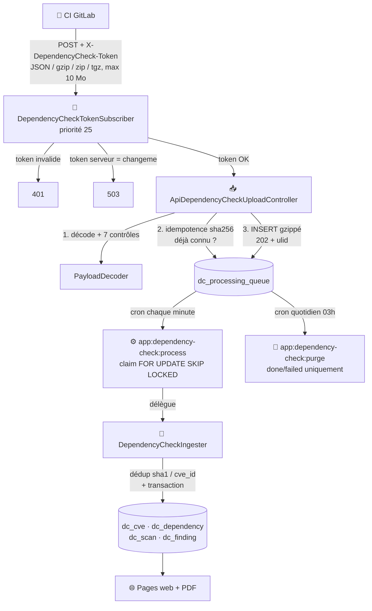
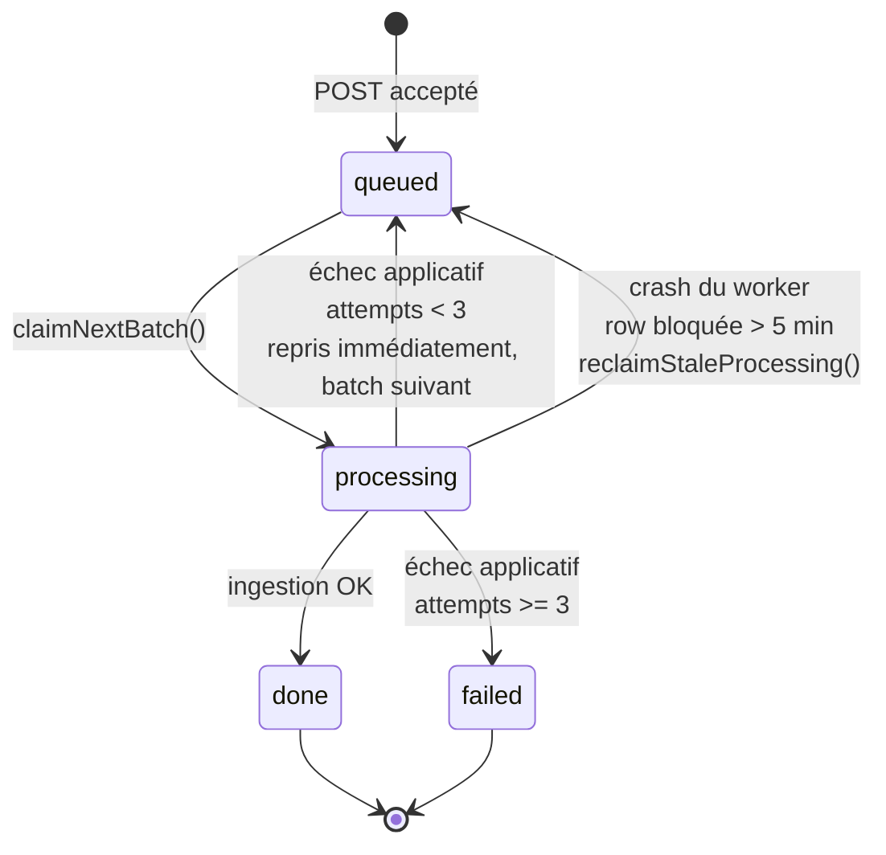

# 🛡️ DependencyCheck — architecture d'ingestion

## 🎯 Contexte et objectif

Les applications Java sont scannées en CI par **OWASP DependencyCheck** (rapport JSON, ~3 Mo pour une stack Spring/Angular typique), qui recense les CVE détectées sur chaque dépendance. Avant ce module, ces rapports n'étaient consultables qu'en HTML statique, sans agrégation cross-projet, sans historique, sans déduplication des CVE entre applications partageant un socle commun.

Le module **DC-Ingest** centralise ces rapports dans Ma-Moulinette pour :

- 🔍 la recherche transverse des CVE par projet/dépendance/sévérité ;
- 📊 la **mutualisation** : des applications basées sur un socle commun partagent souvent une large part de leurs CVE — la déduplication en base réduit drastiquement le volume et permet d'identifier les correctifs à fort effet de levier ;
- 📅 l'historique des scans par projet et version ;
- 🧮 un **plan de remédiation chiffré** (effort en jours-homme) pour prioriser les correctifs — voir [Référence](reference.md#-formule-jh-effort-de-remediation).

## 🏗️ Pipeline d'ingestion

La table `dc_processing_queue` ne connaît que 4 statuts : `queued`/`processing`/`done`/`failed` — il n'existe pas de statut `requeue` intermédiaire. Deux mécanismes distincts ramènent une row en `queued`, à ne pas confondre :

1. **Échec applicatif** (JSON invalide, erreur d'ingestion...) avec `attempts < 3` : la row repasse **immédiatement** en `queued` et sera reprise dès le batch suivant, sans délai d'attente.
2. **Crash du worker** : une row reste bloquée en `processing` parce que le process est mort avant de la clôturer (jamais explicitement requeue). `reclaimStaleProcessing()` détecte ces rows orphelines après 5 minutes et les repasse en `queued`.

!!! caution "⚠️ `queued`/`processing` ne sont jamais purgés automatiquement"
    La purge quotidienne ne supprime que les rows `done`/`failed` de plus de N jours. Une entrée `queued` ancienne (> 15 min) est une anomalie à investiguer manuellement — voir [Exploitation — reprise après incident](exploitation.md#-reprise-après-incident).

## 🧭 Décisions d'architecture clés

**Job table + cron court, pas Symfony Messenger.** Un worker `messenger:consume` long-running a déjà causé des fuites mémoire et des redémarrages fréquents sur d'autres déploiements. Un process court qui traite un batch puis `exit` élimine cette classe de bug à la racine : pas de fuite possible puisque le process meurt après chaque batch. La reprise après crash se fait via `reclaimStaleProcessing()` (requeue les `processing` orphelins après 5 min), et le multi-instance est géré nativement par `FOR UPDATE SKIP LOCKED` (PostgreSQL ≥ 9.5).

**Stockage du payload en BYTEA gzippé.** Alternative à un fichier disque (évite un volume Docker partagé app/cron à synchroniser) et à du JSON brut en TEXT (bloat). PostgreSQL TOAST compresse et stocke automatiquement hors-ligne les BYTEA > 2 Ko. Volume cumulé estimé négligeable (~120 Mo pour 10 rapports/jour sur 30 jours).

**Idempotence à deux niveaux.** Niveau file (`UNIQUE(payload_sha256)` — un re-post exact du même rapport renvoie l'`ulid` existant, zéro logique applicative, garanti par la contrainte PostgreSQL) et niveau métier (`findByProjectVersionDate` — un même triplet projet/version/date déjà ingéré n'est pas re-créé).

**Sécurité bearer dédiée, pas le firewall Symfony classique.** Les flux CI sont machine-à-machine, sans session — un firewall à formulaire de login n'a pas de sens. `DependencyCheckTokenSubscriber` compare le token en temps constant (`hash_equals`), refuse l'accès (503) si le token serveur n'est pas configuré (`changeme`), et passe **avant** `ApiClientHeaderSubscriber` (priorité 25 > 20) qui exclut explicitement ces routes — voir [Architecture technique](../architecture/architecture-technique.md#-filtrage-des-appels-api-internes--apiclientheadersubscriber).

**Modèle 4 tables dédupliquées.** `dc_cve` (clé `cve_id`) et `dc_dependency` (clé `sha1`) ne stockent chacune qu'une ligne par CVE/dépendance unique, quel que soit le nombre de projets touchés — ce qui permet directement les requêtes cross-projets ("combien de projets sont touchés par CVE-X ?"). `dc_finding` matérialise la jointure ternaire (scan × dépendance × CVE) avec un **snapshot** de la sévérité/CVSS au moment du scan, pour rester traçable même si NVD requalifie une CVE ultérieurement. Voir [Architecture — base de données](../architecture/architecture-base-de-donnees.md#-dependencycheck-owasp) pour le schéma détaillé.

## 📚 Pour aller plus loin

- [Pages et navigation](pages.md) : parcours utilisateur, filtres socle/vue.
- [Exploitation](exploitation.md) : configuration, supervision, incidents.
- [Référence](reference.md) : mapping JSON→DB, codes HTTP, glossaire.
- [Architecture technique](../architecture/architecture-technique.md) : vue d'ensemble applicative.

-**-- FIN --**-

[Retour au menu principal](/index.html)
