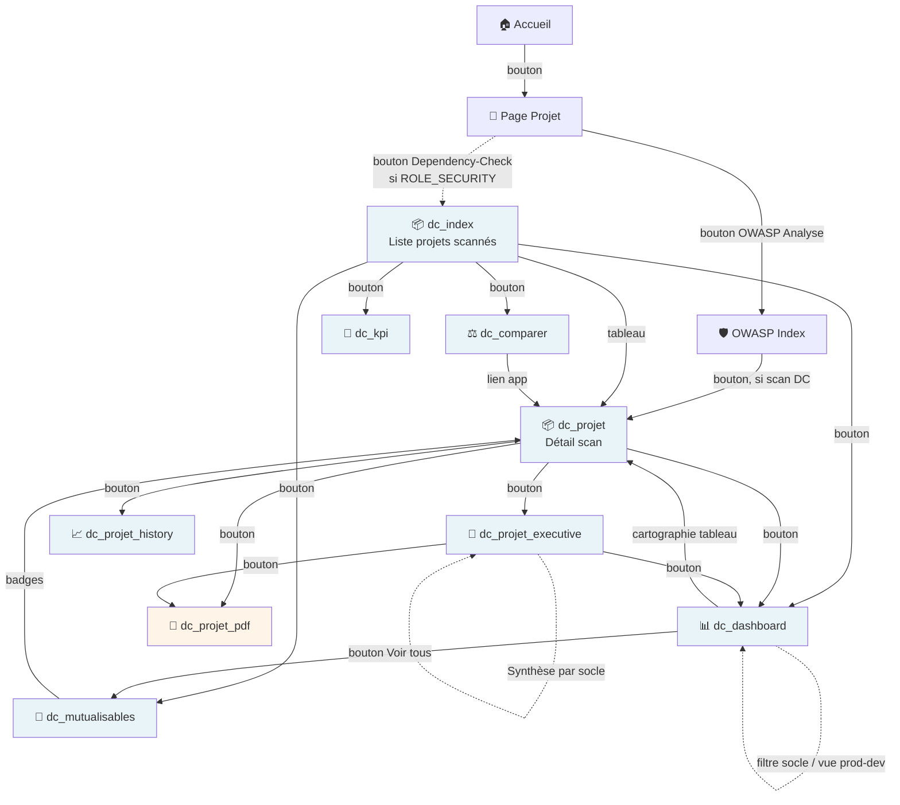

# 🧭 DependencyCheck — pages et navigation

Toutes les pages de ce module exigent le rôle `ROLE_SECURITY` (attribut de classe sur `DependencyCheckPageController`) — voir [Gestion de la sécurité](../developpement/securite.md#-rôles-et-hiérarchie). `ROLE_SECURITY_ANALYTICS` n'est jamais une condition d'accès supplémentaire sur une route ; il élargit le **périmètre de données** vu sur les sections agrégées cross-projets (voir la note plus bas).

## 🗺️ Cartographie des pages

## 📋 Détail des pages

| Route | Nom | Rôle |
| --- | --- | --- |
| `GET /dependency-check` | Index | Tableau de tous les projets scannés (dernier scan par couple projet/version), compteurs CVE par sévérité |
| `GET /dependency-check/projet/{group}/{artifact}/{version}` | Détail scan | Synthèse + tableau complet des findings (CVE × dépendance) du scan le plus récent |
| `GET /dependency-check/projet/{group}/{artifact}/{version}/executive` | Executive summary | Vue synthétique pour décision : répartition par criticité/famille, top dépendances/CWE/CVE, table décision (Upgrade/Mitigation/Surveillance), **plan de remédiation chiffré en JH**, diff vs scan précédent |
| `GET /dependency-check/projet/{group}/{artifact}/{version}/pdf` | Export PDF | Rapport PDF orientation mixte (garde + executive en portrait, détails par sévérité en paysage, glossaire en portrait), fusionné via FPDI avec pagination continue |
| `GET /dependency-check/projet/{group}/{artifact}/history` | Historique | Évolution des CVE par sévérité sur tous les scans du couple (groupe, artefact), toutes versions confondues |
| `GET /dependency-check/dashboard` | Dashboard agrégé | Vue cross-projets : totaux par sévérité, nouvelles CVE critiques depuis le dernier scan, top dépendances/CWE mutualisables, cartographie du parc, 4 graphiques |
| `GET /dependency-check/kpi` | Pilotage SLA | Score sécurité par application, top applications les plus à risque / les plus saines, tendance 90 jours |
| `GET /dependency-check/comparer` | Comparaison | Comparaison side-by-side de 2 à 4 applications (CVE communes, écarts) |
| `GET /dependency-check/mutualisables` | Mutualisations | Liste exhaustive et triable des dépendances mutualisables (paginée), filtrable par socle |

## 🎚️ Filtre socle et vue prod/dev

Le dashboard, le KPI et les pages associées supportent deux filtres transverses, propagés en query string :

- **`?socle=<parent_label>@<parent_version>`** (alias rétrocompatible `?archetype=`) : restreint toutes les sections à un socle technique donné. Valeur validée contre l'ensemble des socles réellement référencés ; une valeur inconnue est ignorée silencieusement (pas d'erreur). Voir [Socle technique et archétype](../architecture/architecture-java.md#-socle-technique-et-archétype-module-dependencycheck).
- **`?vue=prod|dev`** : bascule entre la dernière **release stable** ingérée par application (`prod`) et la dernière version ingérée tout court (`dev`, inclut les builds en cours). Piloté par les flags `is_latest_release`/`is_latest_overall` maintenus sur `dc_scan` à chaque ingestion. « Release stable » est une **liste blanche stricte** (`LatestVersionResolver::isRelease()`) plutôt qu'une exclusion de suffixes connus : est acceptée une version sans qualificatif, ou avec un qualificatif `RELEASE`/`FINAL`/`GA`/`SP<n>`, ou purement numérique — tout le reste (y compris un suffixe qui ne serait ni `SNAPSHOT` ni `RC`/`ALPHA`/`BETA`/`M*`) est exclu de la vue `prod`.

!!! note "🔍 Vue analytics vs vue périmètre"
    Un utilisateur avec `ROLE_SECURITY_ANALYTICS` voit une vue globale non filtrée par groupe fonctionnel (profils transverses : RSSI, équipe sécurité, management). Sans ce rôle, les pages sont restreintes au périmètre `groupe_fonctionnel` de l'utilisateur, comme le reste de l'application — voir [Gestion de la sécurité](../developpement/securite.md).

## 📚 Pour aller plus loin

- [Architecture d'ingestion](architecture.md) : pipeline, décisions techniques.
- [Référence](reference.md) : formule de remédiation JH, glossaire.

-**-- FIN --**-

[Retour au menu principal](/index.html)
