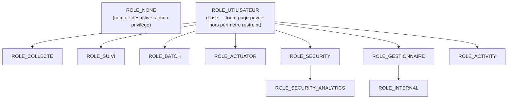

# 🔐 Gestion de la sécurité

## 👤 Compte administrateur

Un compte `admin` (`admin@ma-moulinette.fr`, rôle `ROLE_INTERNAL`) est créé par les fixtures de base (`migrations/POSTGRESQL/90_fixtures/fixtures.sql`). Son mot de passe par défaut est **`eYK8k4[T;99N!em^`** (également documenté dans `README.md`).

!!! warning "🔒 Changement obligatoire avant toute mise en production"
    Ce mot de passe est un identifiant de démarrage connu et public (documenté ici et dans `README.md` volontairement), pas un secret — il **doit être changé manuellement** avant toute exposition de l'environnement au-delà d'un poste de développement local.
    Sur la fixture `admin`, `reset_password` vaut `false` : le changement **n'est pas forcé automatiquement** à la première connexion, contrairement aux autres comptes créés via l'application (où `reset_password = true` par défaut).
    Une fois un gestionnaire applicatif nommé, il est recommandé de désactiver le compte `admin` (attribut `actif`) plutôt que de le laisser actif en permanence.

## 🌐 Filtrage par host/proxy

`config/packages/framework.yaml` restreint les hosts autorisés et déclare les en-têtes de confiance pour le reverse proxy Traefik (voir [Environnement d'exécution](../architecture/architecture-technique.md#-environnement-dexécution)) :

```yaml
trusted_hosts: ['%env(TRUST_HOST1)%', '%env(TRUST_HOST2)%']
trusted_proxies: '%env(TRUSTED_PROXIES)%'
trusted_headers: ['x-forwarded-for', 'x-forwarded-host', 'x-forwarded-proto', 'x-forwarded-port', 'x-forwarded-prefix']
```

`TRUST_HOST1`/`TRUST_HOST2` sont définis par environnement dans `.env.local` (jamais dans `.env` versionné).

## 🧩 Rôles et hiérarchie

`config/packages/security.yaml` définit la hiérarchie de rôles suivante :



!!! note "🧬 Hiérarchie à plat, pas en cascade"
    Contrairement à une hiérarchie classique où un rôle hériterait des droits d'un autre rôle métier, ici **tous les rôles fonctionnels héritent uniquement de `ROLE_UTILISATEUR`** — `ROLE_BATCH` n'inclut pas `ROLE_COLLECTE` par exemple. Seules deux chaînes existent : `ROLE_SECURITY_ANALYTICS → ROLE_SECURITY` et `ROLE_INTERNAL → ROLE_GESTIONNAIRE`.
    Un utilisateur qui doit accéder à plusieurs périmètres fonctionnels doit se voir attribuer chaque rôle explicitement.

`ROLE_NONE` est une sentinelle sans aucun privilège, utilisée pour les comptes désactivés ou pas encore affectés (notamment en jeu de données E2E).

## 🧱 Firewalls

Deux firewalls sont configurés :

| Firewall | Périmètre | Authentification |
| --- | --- | --- |
| `api` | `^/api` | Contexte partagé avec `main` (session), erreurs gérées par `App\Security\ApiSecurityHandler` (retour JSON, pas de redirection HTML) |
| `main` | `^/` | Formulaire de login + `App\Security\CustomAuthenticator` (authentification locale et LDAP, voir [Annuaire LDAP local](openldap-local.md)) |

Le firewall `main` applique un throttling de connexion : **3 tentatives par tranche de 15 minutes**. `remember_me` est désactivé.

## 🚦 Points d'accès (`access_control`)

```yaml
access_control:
    - { path: ^/api/public/, roles: PUBLIC_ACCESS }
    - { path: ^/api/secure/dependency-check/, roles: PUBLIC_ACCESS }   # protégé par token bearer dédié
    - { path: ^/api/secure/, roles: ROLE_UTILISATEUR }
    - { path: ^/login, roles: PUBLIC_ACCESS }
    - { path: ^/register, roles: PUBLIC_ACCESS }
    - { path: ^/welcome, roles: PUBLIC_ACCESS }
    - { path: ^/plan-du-site, roles: PUBLIC_ACCESS }
    - { path: ^/mention-legal, roles: PUBLIC_ACCESS }
    - { path: ^/donnees-personnelles, roles: PUBLIC_ACCESS }
    - { path: ^/admin, roles: ROLE_UTILISATEUR }
    - { path: ^/, roles: ROLE_UTILISATEUR }
```

`/api/secure/dependency-check/*` est publique **au sens Symfony** (`PUBLIC_ACCESS`) car son authentification ne repose pas sur une session utilisateur mais sur un token bearer vérifié par `DependencyCheckTokenSubscriber` — voir [Filtrage des appels API internes](../architecture/architecture-technique.md#-filtrage-des-appels-api-internes--apiclientheadersubscriber) pour le détail des deux mécanismes de sécurité API qui coexistent.

Au-delà de `ROLE_UTILISATEUR` (accès de base à toute page privée), certaines fonctionnalités exigent un rôle fonctionnel supplémentaire, vérifié au niveau du controller (`#[IsGranted(...)]` ou `$this->isGranted(...)`) :

| Fonctionnalité | Rôle requis | Vérifié dans |
| --- | --- | --- |
| Collecte manuelle d'un projet | `ROLE_COLLECTE` | `ApiCollecteController` |
| Traitement batch (page + actions) | `ROLE_BATCH` | `BatchController`, `ProfilingController`/`ProfilingApiController` |
| Collecte Actuator (Spring Boot) | `ROLE_ACTUATOR` | `ActuatorController` |
| Page Activité SonarQube (affichage + actions) | `ROLE_ACTIVITY` | `ActivityController`, `ApiActivityController` |
| Toutes les pages DependencyCheck | `ROLE_SECURITY` | `DependencyCheckPageController` (attribut de classe) |
| Vue transverse multi-projets DependencyCheck | `ROLE_SECURITY_ANALYTICS` | `isAnalyticsMode()` (`DependencyCheckPageController`) |
| Mise à jour de la liste des projets/profils (Accueil) | `ROLE_GESTIONNAIRE` | `AccueilController`, `ApiAccueilController` |
| Gestion des portefeuilles (actions Ajax) | `ROLE_GESTIONNAIRE` | `PortefeuilleAjaxController` |
| Statistiques d'utilisation transverses | `ROLE_INTERNAL` | `StatistiqueController` |
| Journal d'administration (logs applicatifs) | `ROLE_INTERNAL` | `AdminLogController` |
| Journal des changements de rôle | `ROLE_INTERNAL` | `UserRoleLogController` |
| CRUD Utilisateur / Groupe Utilisateur / Groupe Fonctionnel (back-office) | `ROLE_GESTIONNAIRE` (EasyAdmin) | `UtilisateurCrudController`, `GroupeUtilisateurCrudController`, `GroupeFonctionnelCrudController` |
| CRUD Portefeuille / Batch (back-office) | `ROLE_BATCH` (EasyAdmin) | `PortefeuilleCrudController`, `BatchCrudController` |

!!! note "✅ Renforcement : contrôle de rôle strict sur les 5 CRUD EasyAdmin"
    5 contrôleurs ne portaient **aucune restriction de rôle côté serveur** : seul `admin/home.html.twig` masquait leur carte d'accès sur la page d'accueil du back-office (`is_granted('ROLE_GESTIONNAIRE')`/`is_granted('ROLE_BATCH')`), un filtrage purement cosmétique — la route restait accessible par URL directe à tout compte `ROLE_UTILISATEUR` (le rôle minimal exigé par `access_control` sur `^/admin`).
    **Corrigé** en ajoutant `#[IsGranted(...)]` sur chacun des 5 contrôleurs, alignés sur le rôle déjà voulu par la page d'accueil — désormais une requête sans le rôle requis reçoit un **403** avant même d'atteindre la moindre logique métier, au lieu de dépendre du seul masquage de l'interface.
    Voir [Gestion des utilisateurs](../back-office/utilisateur.md) pour le détail de l'impact découvert (désactivation de compte sans contrôle de rôle).

!!! caution "⚠️ Cette liste n'est pas exhaustive"
    De nouvelles fonctionnalités peuvent introduire de nouvelles restrictions de rôle sans que cette page soit mise à jour immédiatement.
    En cas de doute sur le rôle requis par une page, chercher `#[IsGranted]` ou `isGranted(`/`denyAccessUnlessGranted(` dans le controller concerné — c'est la source de vérité.
    **Ne jamais se fier au seul masquage d'une carte ou d'un lien dans l'interface** (`home.html.twig`, menu latéral) : ce n'est qu'un confort d'affichage, pas une garantie de contrôle d'accès — voir le renforcement ci-dessus.

## 🎓 Jetons de navigation vs sécurité réelle (démonstration boîte noire)

Plusieurs pages (Suivi, Répartition, COSUI, OWASP, Clean Code) sont ouvertes depuis un bouton JavaScript qui construit une URL du type `?token=...` — un encodage **ROT13 + Base64** de la clé Maven (`salt|maven_key`), décodé côté serveur par une méthode `decodeToken()` dupliquée dans chaque contrôleur concerné.

**Pourquoi une URL et pas un vrai appel sécurisé ?** Une route Symfony déclarée en `GET` n'a pas de corps de requête exploitable pour transporter un paramètre applicatif, et une navigation classique (`<a href>`, `location.href = ...`) ne permet pas d'ajouter un en-tête HTTP personnalisé — la seule façon de transmettre la clé du projet est donc la chaîne de requête de l'URL.
Le jeton n'est **pas conçu comme un mécanisme de sécurité** : c'est une réponse à cette contrainte mécanique du GET, et un confort (éviter d'afficher `?maven_key=fr.example:mon-projet` en clair dans la barre d'adresse).

!!! tip "Pourquoi ROT13 et pas du sha256+clé symétrique ?"
    Dans tous les cas, à défaut d'utiliser une clé externe, un Vault ou un provider de sécurité, il sera toujours possible de lire le code sur le dépôt GitHub, ou directement depuis son navigateur en éditant le code JS. Pourquoi utiliser un mécanisme aussi complexe pour arriver au même résultat ?
    L'objectif n'est **pas** de bloquer l'IDOR par le token lui-même — cette protection-là vient des contrôles serveur (cf. plus bas), pas de l'encodage choisi. Le seul but ici est d'éviter d'exposer la clé du projet en clair dans l'URL, par confort. ROT13 est donc largement suffisant pour ce simple objectif d'obfuscation, et c'est amusant à coder.

!!! note "🧪 Vérification empirique en boîte noire (sans lire le code)"
    Trois appels `curl` strictement anonymes (aucun cookie de session, aucune connexion préalable) contre l'application locale :

```text
$ curl -s -D - -o /dev/null http://localhost:8000/suivi
HTTP/1.1 302 Found
Location: /login

$ curl -s -D - -o /dev/null "http://localhost:8000/suivi/set?token=<jeton_forgé_au_hasard>"
HTTP/1.1 302 Found
Location: /login

$ curl -s -X POST -H "Content-Type: application/json" \
        -d '{"maven_key":"fr.ma-moulinette:ma-moulinette"}' \
        http://localhost:8000/api/secure/suivi/version/liste
{"code":403,"message":"[API-Credential] 🚫 Accès interdit : client non autorisé."}
```

Dans les 3 cas, **aucun contrôleur métier n'est exécuté** (ni `SuiviController::suivi()`/`setSession()`, ni `ApiSuiviController`), mais pas par le même mécanisme : les 2 premiers appels (pages web) sont interceptés par le pare-feu `main` (redirection `/login`, aucune session), tandis que le 3ᵉ (`/api/secure/*`) est bloqué en amont par `ApiClientHeaderSubscriber` (vérification Origin/Referer/`X-Internal-Front`, voir [Filtrage des appels API internes](../architecture/architecture-technique.md#-filtrage-des-appels-api-internes--apiclientheadersubscriber)) — un event subscriber distinct du pare-feu, pas `App\Security\ApiSecurityHandler`.

Dans les 3 cas, le jeton n'est jamais lu ni décodé, qu'il soit valide, forgé au hasard, ou absent. C'est exactement la même réponse qu'on obtienne un jeton correctement formé ou une suite de caractères aléatoire : **le contenu du jeton ne change rien tant qu'aucune session authentifiée n'est présente.**

**Ce qui protège réellement l'accès** (indépendamment du jeton) :

1. **Le pare-feu Symfony** (`access_control`, voir ci-dessus) — une session authentifiée valide (`ROLE_UTILISATEUR` a minima) est exigée pour atteindre la moindre route `^/` ou `^/api/secure/`.
2. **Les contrôles serveur par rôle/périmètre**, exécutés seulement *après* le pare-feu, pour l'utilisateur *authentifié* réel : `ROLE_COLLECTE` sur Répartition, `listeProjet()` (appartenance au groupe fonctionnel) sur Suivi.
   Ces contrôles s'appliquent que la clé Maven soit arrivée via un jeton, une session, ou un paramètre en clair — le canal de transport n'a aucune incidence sur eux.

Un attaquant capable de forger un jeton valide (après rétro-ingénierie du JS, triviale avec les outils de développement du navigateur) n'obtient donc **rien de plus** qu'un utilisateur qui taperait l'URL à la main : il lui faut de toute façon une session authentifiée légitime, et cette session reste bornée à son propre périmètre par les contrôles du point 2.

## 🔑 Hachage des mots de passe

Algorithme **bcrypt**, coût 13 en production/développement (`config/packages/security.yaml`). En environnement de test, le coût est abaissé au minimum (`cost: 4`) pour ne pas ralentir la suite de tests — voir [Tests unitaires](test-unitaire.md).

## 🔐 Jetons d'authentification SonarQube

Ma-Moulinette appelle l'API SonarQube avec deux jetons distincts, définis en `.env.local` :

| Variable | Utilisé par | Type de jeton attendu |
| --- | --- | --- |
| `SONAR_TOKEN` | Collecte standard (`ApiCollecteController`, `BatchCollecteInformationProjetController`, etc.) — appels `/api/measures/*`, `/api/issues/*`, `/api/project_analyses/search`... | **Jeton personnel (User Token)** |
| `SONAR_ACTIVITY_TOKEN` | Page [Activité SonarQube](../application/activite.md) — appel `/api/ce/activity` | **Jeton personnel (User Token)**, compte **administrateur** (permission « Administer System ») |

!!! caution "⚠️ Les jetons d'analyse (projet ou global) ne conviennent PAS pour ces appels"
    Depuis SonarQube 2025/2026, trois portées de jeton existent : **jeton d'analyse de projet**, **jeton d'analyse globale**, et **jeton personnel (utilisateur)**.
    Les deux premiers sont conçus **uniquement pour pousser des résultats d'analyse** (`sonar-scanner ... -Dsonar.token=...`) — ils n'ont **pas accès aux endpoints Web API de lecture** (mesures, issues, historique des tâches, etc.), quelle que soit leur portée.
    Un jeton d'analyse globale a ainsi provoqué un `403 Insufficient privileges` sur `/api/project_analyses/search` (incident `tetris:TetrisGame`, 2026-07-15) — passer à un jeton d'analyse **projet** ne change rien au problème, car **la nature du jeton** (analyse vs personnel) est en cause, pas sa portée.
    Seul un **jeton personnel**, généré depuis *My Account → Security* d'un compte utilisateur ayant les permissions nécessaires sur le(s) projet(s) concerné(s) (a minima *Browse*), fonctionne de façon fiable pour ces appels.

## 🖍️ Filtrage côté Twig et controllers

Dans les templates Twig :

```twig
 ... 
 ... 
```

Dans les controllers, par attribut ou par appel explicite :

```php
#[IsGranted('ROLE_UTILISATEUR')]
```

```php
$this->denyAccessUnlessGranted(
    "ROLE_BATCH",
    null,
    "L'utilisateur essaye d'accéder à la page sans avoir le rôle ROLE_BATCH"
);
```

## 📚 Pour aller plus loin

- [Architecture technique](../architecture/architecture-technique.md) : filtrage des appels API internes, rôles vs. architecture globale.
- [Annuaire LDAP local](openldap-local.md) : authentification LDAP/AD en complément du compte local.

-**-- FIN --**-

[Retour au menu principal](/index.html)
