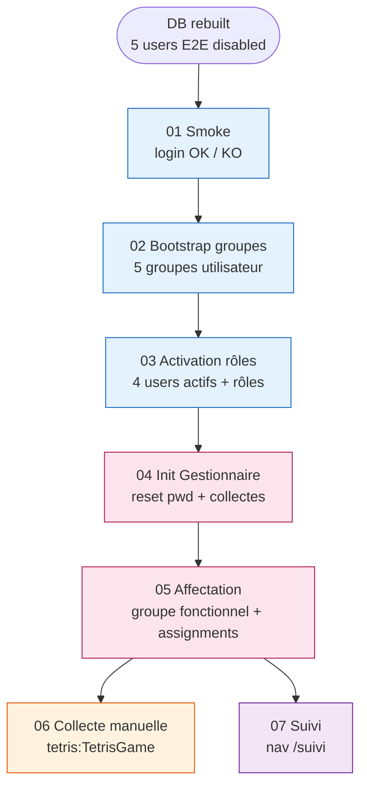
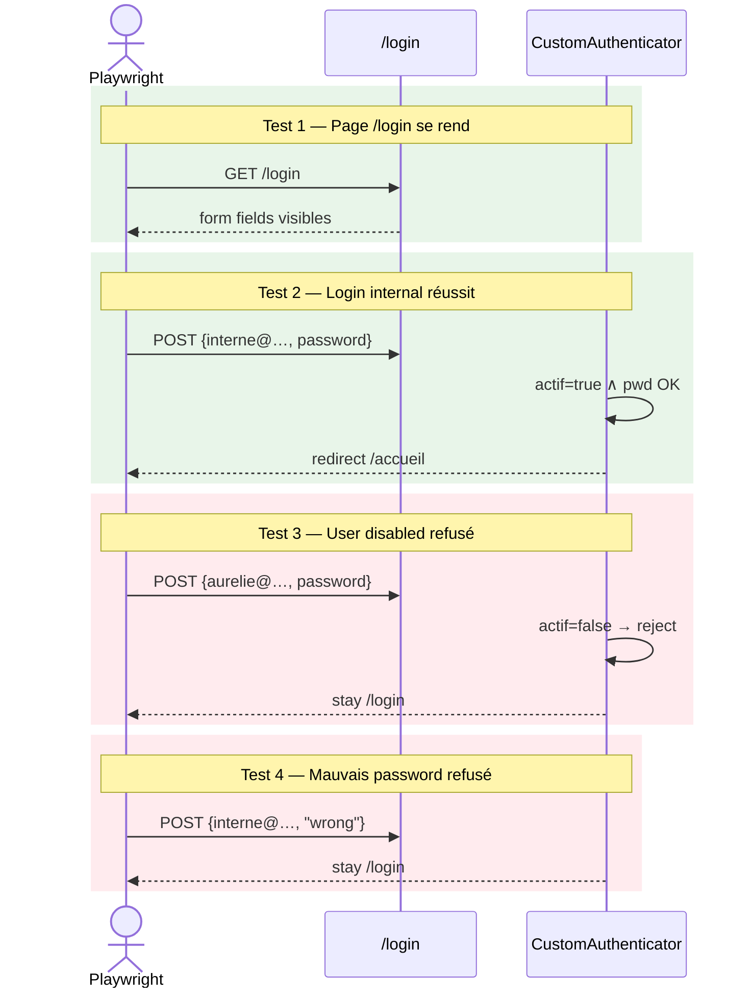
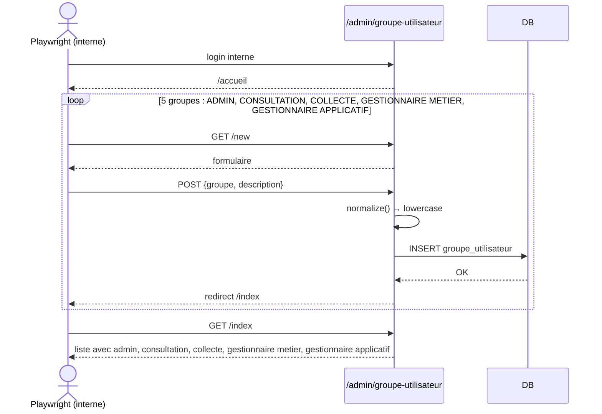
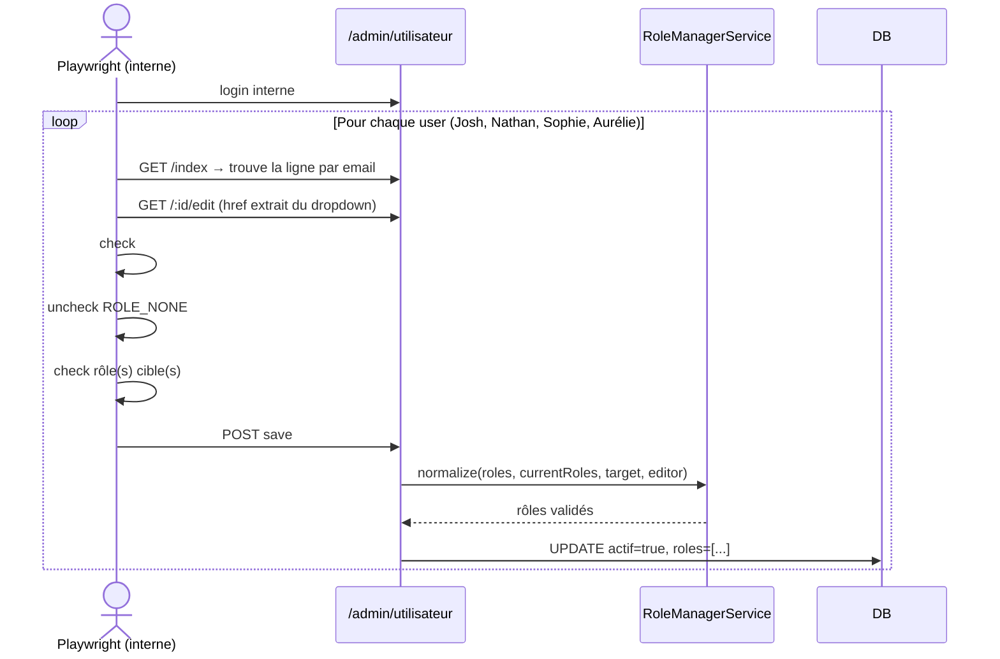
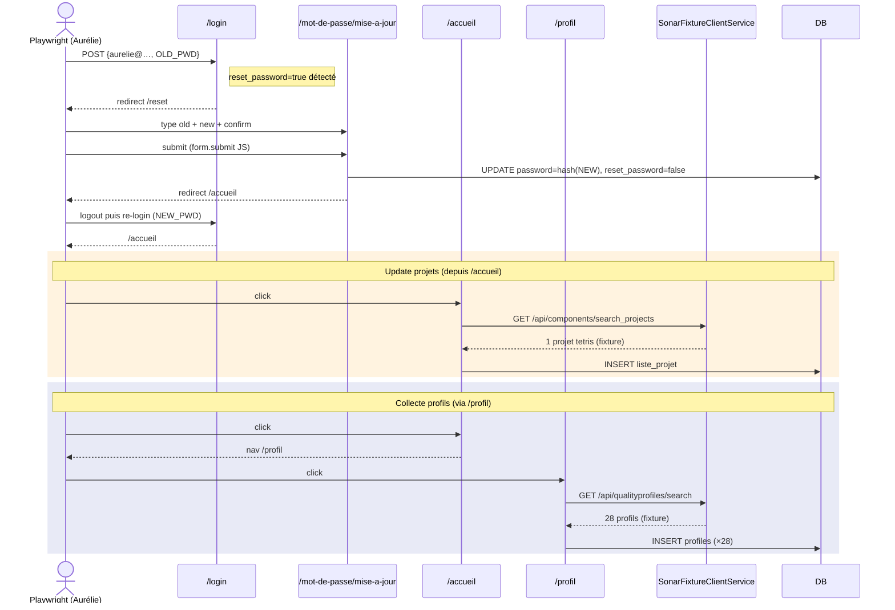
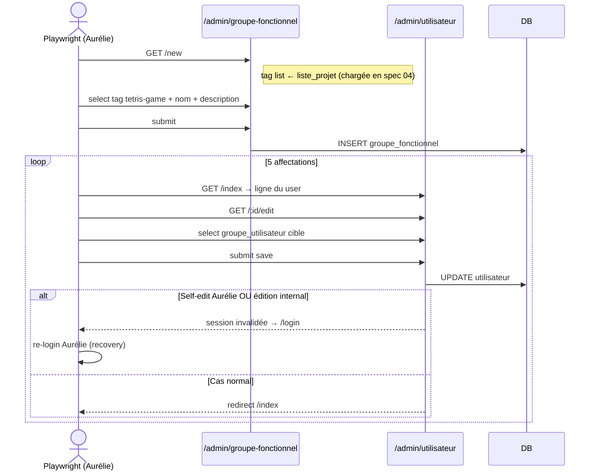
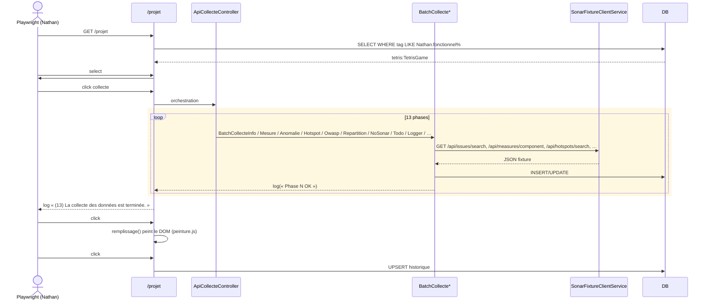
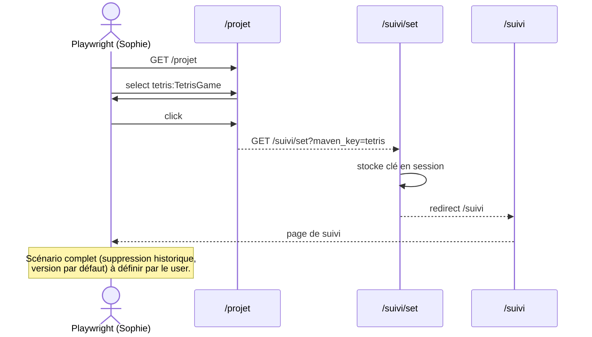

# Tests End-to-End (E2E) Playwright


## Pourquoi des tests E2E

PHPUnit valide la logique backend (services, repos, controllers, contrats API). Il ne peut **pas** tester :

- Le rendu Twig dynamique avec données réelles
- Les interactions JS / jQuery / charts
- Les workflows multi-pages avec session
- Les permissions effectives au travers des firewalls
- L'UX (flash messages, modales, redirections)

Playwright pilote un vrai navigateur (Chromium par défaut) qui consomme l'application Symfony comme un utilisateur réel.

## Architecture

```text
tests/e2e/
├── package.json              # @playwright/test + scripts npm
├── tsconfig.json             # TS strict, ES2022, CommonJS
├── playwright.config.ts      # workers=1, séquentiel, baseURL :8000
├── .gitignore                # node_modules, test-results, reports
├── README.md                 # quickstart
├── helpers/
│   ├── users.ts              # 5 USERS typés + USER_GROUPS + ALL_GROUPS
│   ├── auth.ts               # login() / loginExpectFailure() / logout()
│   ├── admin.ts              # gotoCrudIndex() / gotoCrudNew() (EasyAdmin v4)
│   └── db.ts                 # resetE2EData() + resetAndSeedAfterSpec0X()
└── specs/
    ├── 01-smoke.spec.ts
    ├── 02-bootstrap-groupes.spec.ts
    ├── 03-activation-roles.spec.ts
    ├── 04-gestionnaire-init.spec.ts
    ├── 05-affectation-groupes.spec.ts
    ├── 06-collecte-manuelle.spec.ts
    └── 07-suivi.spec.ts
```

## Stratégie : scénario d'onboarding séquentiel

Les specs construisent l'état pour la suivante (DB build-up). On simule le parcours réel d'une nouvelle installation Ma-Moulinette.

### Vue globale du build-up



| # | Spec | Acteur | Action |
| --- | --- | --- | --- |
| 01 | `01-smoke` | infra | login `interne` OK, login disabled refusé |
| 02 | `02-bootstrap-groupes` | interne | crée 5 groupes utilisateur (ADMIN, CONSULTATION, …) |
| 03 | `03-activation-roles` | interne | active 4 users + assigne rôles cibles |
| 04 | `04-gestionnaire-init` | aurelie | reset password → collecte profils → update projets |
| 05 | `05-affectation-groupes` | aurelie | crée groupe fonctionnel + assigne users aux groupes |
| 06 | `06-collecte-manuelle` | nathan | collecte sur tetris:TetrisGame → enregistre |
| 07 | `07-suivi` | sophie | navigation projet → page suivi |

**Conséquences** :

- `workers: 1`, `fullyParallel: false` dans `playwright.config.ts`
- Préfixe numérique des fichiers → ordre garanti par tri alphabétique
- DB rebuilt **une fois** avant la suite (pas entre specs)
- Si une spec plante au milieu, les suivantes échouent en cascade — c'est le comportement attendu (révèle la régression à la racine)

## Diagrammes des parcours

### Spec 01 — Smoke

Quatre canaris pour valider l'infrastructure (Symfony serve up + APP_ENV=test + fixtures-e2e.sql chargées).



### Spec 02 — Bootstrap des groupes utilisateur

L'internal crée les 5 groupes utilisateur via l'UI EasyAdmin.



### Spec 03 — Activation des rôles

L'internal active chaque user et lui assigne ses rôles cibles via le formulaire EasyAdmin (case `actif` + checkboxes rôles).



**Affectations cibles** :

| User | Rôle(s) cible |
| --- | --- |
| Josh LIBERMAN | `ROLE_UTILISATEUR` |
| Nathan JONES | `ROLE_COLLECTE` |
| Sophie MARTIN | `ROLE_COLLECTE` + `ROLE_SUIVI` |
| Aurélie PETIT-COEUR | `ROLE_GESTIONNAIRE` (+ `reset_password=true` via seed) |

### Spec 04 — Init Gestionnaire

Aurélie passe par le flow nominal "1ère connexion → reset password" puis lance les collectes profils + projets.



### Spec 05 — Affectation des groupes

Aurélie crée le groupe fonctionnel et affecte chaque user à son groupe utilisateur.



**Affectations groupe utilisateur** :

| User | Groupe utilisateur |
| -- | --- |
| interne | `admin` |
| Josh | `consultation` |
| Nathan | `collecte` |
| Sophie | `gestionnaire metier` |
| Aurélie | `gestionnaire applicatif` |

### Spec 06 — Collecte manuelle

Nathan lance la collecte SonarQube complète sur tetris:TetrisGame. C'est le test le plus long (~2 min) car il enchaîne ~13 phases d'API.



**Sentinel de fin** : on attend `(13) La collecte des données est terminée.` dans `<textarea id="log">.value` (timeout 90s).

### Spec 07 — Suivi

Sophie (COLLECTE+SUIVI) navigue vers la page de suivi.



## Reset rapide entre runs (≈ 3s, sans prompt password)

Pour itérer rapidement sur une spec qui mute la DB, chaque spec mutante appelle `resetE2EData()` (et éventuellement `resetAndSeedAfterSpec0X()`) dans son `test.beforeAll()`. Équivalent du reset entre tests d'intégration Symfony.

```typescript
import { resetAndSeedAfterSpec05 } from '../helpers/db';

test.describe('06 — Collecte manuelle', () => {
  test.beforeAll(() => {
    resetAndSeedAfterSpec05();   // ~5s, pas de prompt password
  });

  test('...', async ({ page }) => { /* ... */ });
});
```

**Sous le capot** :

- `tests/e2e/helpers/db.ts` → spawn `bin/e2e/reset-e2e-data.ps1` puis `bin/e2e/seed-e2e.ps1`
- Ces scripts utilisent `db_user` (password connu via `.env`) → `PGPASSWORD` env var → **pas de prompt**
- `migrations/PosgreSQL/95_e2e/reset-e2e-data.sql` :
  - TRUNCATE toutes les tables de données projet (mesures, anomalie, hotspots, etc.)
  - DELETE les groupes/portefeuilles custom (garde "Aucun" + "En attente")
  - DELETE les 5 users E2E + reload `fixtures-e2e.sql`
- `migrations/PosgreSQL/95_e2e/seed-after-spec-0X-…sql` : replicat de l'état de fin de chaque spec via SQL pour permettre l'isolation au debug
- Conserve : référentiels OWASP, versions ma_moulinette, admin de prod, groupes par défaut

### Quand utiliser quoi

| Situation | Commande | Durée | Prompt password |
| --- | --- | --- | --- |
| Première fois après pull / structure DB modifiée | `.\bin\e2e\rebuild-database.ps1` | ~30s | ✅ (postgres superuser) |
| Run E2E complet propre | `.\bin\e2e\run-e2e.ps1` | rebuild + warmup + tests | ✅ |
| Itération sur une spec (debug) | `.\bin\e2e\run-e2e.ps1 -SkipRebuild -Spec "02"` | reset auto via `beforeAll` ~3-5s + tests | ❌ |
| Reset manuel hors Playwright | `.\bin\e2e\reset-e2e-data.ps1` | ~3s | ❌ |

## Utilisateurs E2E

Chargés via `migrations/PosgreSQL/90_fixtures/fixtures-e2e.sql`.

| User | État initial | Cible (post step 3) | Groupe (post step 5) |
| --- | --- | --- | -- |
| `interne@ma-moulinette.fr` | actif, `ROLE_INTERNAL` | `ROLE_INTERNAL` | ADMIN |
| `josh.liberman@ma-moulinette.fr` | disabled, `ROLE_NONE` | `ROLE_UTILISATEUR` | CONSULTATION |
| `nathan.jones@ma-moulinette.fr` | disabled, `ROLE_NONE` | `ROLE_COLLECTE` | COLLECTE |
| `sophie.martin@ma-moulinette.fr` | disabled, `ROLE_NONE` | `ROLE_COLLECTE` + `ROLE_SUIVI` | GESTIONNAIRE METIER |
| `aurelie.petit-coeur@ma-moulinette.fr` | disabled, `ROLE_NONE` | `ROLE_GESTIONNAIRE` | GESTIONNAIRE APPLICATIF |

**Convention** : password = courriel (bcrypt cost 13).
**Génération des hashes** : `php bin/e2e/generate-e2e-hashes.php`
**Vérification des hashes** : `php bin/e2e/verify-e2e-hashes.php`

`ROLE_NONE` est ajouté à `config/packages/security.yaml` comme rôle sentinelle (sans héritage, sans privilège). Il bloque l'accès à toutes les routes mais permet de stocker un user en attente d'affectation.

## Pré-requis

- **Node.js** ≥ 20 (`node -v`)
- **PostgreSQL 18** up (db_user / db_password)
- **PHP 8.5.5** + Symfony CLI (`symfony -v`)
- **psql** dans le PATH

## Installation Playwright (une fois)

```powershell
cd tests\e2e
npm install
npm run install:browsers   # Chromium + deps
```

## Lancer les tests

### Méthode automatique (recommandée)

Script PowerShell qui enchaîne tout :

```powershell
# Depuis la racine du projet
.\bin\e2e\run-e2e.ps1                     # tous les specs, headless
.\bin\e2e\run-e2e.ps1 -Headed             # avec navigateur visible
.\bin\e2e\run-e2e.ps1 -Spec "01-smoke"    # un spec en particulier (substring match)
.\bin\e2e\run-e2e.ps1 -SkipRebuild        # garder la DB existante (debug)
.\bin\e2e\run-e2e.ps1 -SkipServer         # ne pas démarrer Symfony serve (déjà up ailleurs)
```

Le script :

1. Rebuild la DB `ma_moulinette` (sauf si `-SkipRebuild`)
2. Démarre Symfony serve avec `APP_ENV=test` en daemon (port 8000) si pas déjà up
3. Warmup le cache test (évite les 502 sur les assets)
4. Lance `npx playwright test` depuis `tests/e2e/`
5. Stoppe le daemon Symfony à la fin (uniquement si on l'a démarré)

### Méthode manuelle (debug fin)

```powershell
# Terminal 1 : DB clean
.\bin\e2e\rebuild-database.ps1

# Terminal 2 : Symfony en env test
$env:APP_ENV = "test"
symfony serve --no-tls --port=8000

# Terminal 3 : Playwright
cd tests\e2e
npm test                  # headless
npm run test:headed       # avec navigateur visible
npm run test:ui           # mode UI interactif (idéal debug)
npm run test:debug        # pas-à-pas
npm run report            # ouvrir le dernier rapport HTML
```

## Pourquoi `APP_ENV=test`

`config/services_test.yaml` substitue `App\Service\ClientService` par `App\Tests\Support\SonarFixtureClientService` qui sert des **fixtures JSON locales** (capturées depuis un vrai SonarQube via `bin/e2e/capture-sonar-fixtures.ps1`).

Conséquences :

- Pas besoin d'un serveur SonarQube up
- Tests reproductibles (même JSON à chaque run)
- Cas particuliers (`null`, valeurs absentes) figés dans les fixtures

Les fixtures sont dans `tests/fixtures/sonarqube/`. Endpoints couverts (Phase I + extensions) :

| URL pattern | Fixture | Utilisé par |
| --- | --- | --- |
| `/api/components/app` | `components/app.json` | InformationProjet |
| `/api/components/search_projects` | `components/search_projects.json` | Update projets accueil |
| `/api/measures/component` | `measures/component.json` | Mesures |
| `/api/issues/search` | `issues/search.json` | Anomalies, NoSonar, Todo, Logger, Repartition |
| `/api/hotspots/search` | `hotspots/search.json` | Hotspots, OWASP |
| `/api/hotspots/show` | `hotspots/show.json` | HotspotDetails |
| `/api/project_analyses/search` | `project_analyses/search-page1.json` | Versions historique |
| `/api/qualityprofiles/search` | `qualityprofiles/search.json` | Collecte profils (28 profils synthétiques) |

## Conventions d'écriture

### Helpers

- **`auth.login(page, USERS.foo)`** : raccourci pour login
- **`auth.loginExpectFailure(page, email, pwd)`** : assertion d'échec (reste sur /login)
- **`auth.logout(page)`** : déconnexion + assertion redirect /login
- **`admin.gotoCrudIndex(page, 'utilisateur')`** : nav vers `/admin/utilisateur`
- **`admin.gotoCrudNew(page, 'utilisateur')`** : nav vers `/admin/utilisateur/new`
- **`db.resetE2EData()`** : reset DB sans prompt
- **`db.resetAndSeedAfterSpec0X()`** : reset + seed à l'état de fin de la spec X

### Locators

Préférer dans cet ordre :

1. **`page.getByRole(...)`** (a11y-first, recommandé Playwright)
2. **`page.getByLabel(...)`** (formulaires)
3. **`page.locator('#id')`** (stable mais lié à la structure DOM)
4. **`page.locator('input[name$="..."]')`** (formulaires Symfony, indépendant du prefix)

Éviter les sélecteurs CSS de classe (changent souvent).

### Cas particuliers EasyAdmin v4

- Les actions CRUD (edit/delete/show) sont dans un **dropdown** : on peut cliquer le toggle puis le lien, OU extraire le href directement via `getAttribute('href')` + `goto()` (plus rapide)
- Les boutons "Créer" et "Sauvegarder" sont **hors du `<form>`** (toolbar header) : utiliser `getByRole('button', { name: 'Créer', exact: true })`
- Les `<select>` avec `data-action-name="..."` sont enrichis par TomSelect : `selectOption()` sur le `<select>` natif (caché) marche
- Le label de checkbox de rôle peut entrer en collision avec le combobox de groupe utilisateur du même nom (ex: "Utilisateur") : préférer `input[type="checkbox"][value="ROLE_UTILISATEUR"]`

### Assertions

- `await expect(page).toHaveURL(...)` : navigation
- `await expect(locator).toBeVisible()` : rendu UI
- `await expect(locator).toContainText('...')` : contenu (⚠️ ne marche pas pour `<textarea>`)
- `await expect(locator).toHaveValue(...)` : valeur d'un input/textarea
- `await expect(locator).toHaveCount(n)` : compteurs (listes, tableaux)
- `await expect(locator).not.toHaveClass(/disabled-bouton/)` : état UI dynamique

### Form submission gotchas

- **Reset password** : le bouton est `type="button"` initialement, le JS le passe en `submit` après focus. Préférer `form.submit()` direct via `page.evaluate()` avec set de la value pour être atomique.
- **HTML5 pattern v-flag** : Chrome 132+ rejette `[a-zA-Z0-9._@-]` car `@-]` est ambigu. Utiliser `[-a-zA-Z0-9._@]` (hyphen en début).

## Debug

- **Mode UI** (`npm run test:ui`) : timeline complète, time-travel debugging, locator picker
- **Trace** : auto-générée sur retry → `npx playwright show-trace test-results/.../trace.zip`
- **Screenshot** : auto-pris en cas d'échec (`test-results/`)
- **Rapport HTML** : `npm run report`
- **error-context.md** : généré dans `test-results/<spec>/`, contient le snapshot ARIA du DOM au moment de l'échec — précieux pour identifier les sélecteurs

## Statut Phase K

| Tâche | Statut |
| --- | --- |
| K.2.a — `ROLE_NONE` dans security.yaml | ✅ |
| K.2.b — Refonte `fixtures-e2e.sql` (5 users) | ✅ |
| K.2.c — Fixtures JSON SonarQube | ✅ |
| K.3 — Scaffold Playwright | ✅ |
| K.3.b — Reset rapide + warmup cache | ✅ |
| K.4 — Spec `02-bootstrap-groupes` | ✅ |
| K.5 — Spec `03-activation-roles` | ✅ |
| K.6 — Spec `04-gestionnaire-init` | ✅ |
| K.7 — Spec `05-affectation-groupes` | ✅ |
| K.8 — Spec `06-collecte-manuelle` | ✅ |
| K.9 — Spec `07-suivi` | ✅ |

## Prochaines étapes

- **Validation finale** : run complet `01→07` from scratch pour valider l'enchaînement
- **Spec 07 étendue** : suppression d'historique, sélection de version par défaut (à préciser par le user)
- **Bug avatar** : URL `/assets/avatar/chiffre/02.png` ne se résout pas (à investiguer côté AssetMapper / `getAvatarUrl()`)
- **Cypress-style isolation** (option future) : si on veut chaque spec totalement auto-suffisante, snapshoter la DB après chaque spec pour restauration rapide

> Cette doc est complétée au fur et à mesure (sections debug, patterns récurrents, gotchas) — pensez à enrichir au fil des évolutions.
