# Tests End-to-End (E2E) Playwright

## Pourquoi des tests E2E

PHPUnit valide la logique backend (services, repos, controllers, contrats API). Il ne peut **pas** tester :

- Le rendu Twig dynamique avec données réelles
- Les interactions JS / jQuery / charts
- Les workflows multi-pages avec session
- Les permissions effectives au travers des firewalls
- L'UX (flash messages, modales, redirections)

Playwright pilote un vrai navigateur (Chromium par défaut) qui consomme l'application Symfony comme un utilisateur réel.

## Architecture

```text
tests/e2e/
├── package.json              # @playwright/test + scripts npm
├── tsconfig.json             # TS strict, ES2022, CommonJS
├── playwright.config.ts      # workers=1, séquentiel, baseURL :8000
├── .gitignore                # node_modules, test-results, reports
├── README.md                 # quickstart
├── helpers/
│   ├── users.ts              # 5 USERS typés + USER_GROUPS + ALL_GROUPS
│   ├── auth.ts               # login() / loginExpectFailure() / logout()
│   ├── admin.ts              # gotoCrudIndex() / gotoCrudNew() (EasyAdmin v4)
│   ├── db.ts                 # resetE2EData() + resetAndSeedAfterSpec0X()
│   └── fixtures.ts           # test étendu : bloque les requêtes d'images
│                              # (avatars, icônes — purement cosmétiques,
│                              # non vérifiées) pour réduire la charge sur
│                              # le serveur Symfony de dev et accélérer les runs
└── specs/
    ├── 01-smoke.spec.ts
    ├── 02-bootstrap-groupes.spec.ts
    ├── 03-activation-roles.spec.ts
    ├── 04-gestionnaire-init.spec.ts
    ├── 05-affectation-groupes.spec.ts
    ├── 06-collecte-manuelle.spec.ts
    ├── 07-suivi.spec.ts
    ├── 08-controle-acces.spec.ts
    ├── 09-crud-batch-portefeuille.spec.ts
    ├── 10-crud-actuator.spec.ts
    └── 11-owasp.spec.ts
```

## Stratégie : scénario d'onboarding séquentiel

Les specs construisent l'état pour la suivante (DB build-up). On simule le parcours réel d'une nouvelle installation Ma-Moulinette.

### Vue globale du build-up


| # | Spec | Acteur | Action |
| --- | --- | --- | --- |
| 01 | `01-smoke` | infra | login `interne` OK, login disabled refusé |
| 02 | `02-bootstrap-groupes` | interne | crée 5 groupes utilisateur (ADMIN, CONSULTATION, …) |
| 03 | `03-activation-roles` | interne | active 4 users + assigne rôles cibles |
| 04 | `04-gestionnaire-init` | aurelie | **A.** reset password (`test.fixme`, flaky — voir plus bas) · **B.** update projets + collecte profils (seedé indépendamment de A) |
| 05 | `05-affectation-groupes` | aurelie | crée groupe fonctionnel + assigne users aux groupes |
| 06 | `06-collecte-manuelle` | nathan | collecte sur tetris:TetrisGame → enregistre |
| 07 | `07-suivi` | sophie | navigation projet → page suivi |
| 08 | `08-controle-acces` | josh, nathan, sophie, aurélie, interne | contrôle d'accès par rôle (indépendant du build-up, propre reset) |
| 09 | `09-crud-batch-portefeuille` | nathan (+ ROLE_BATCH transverse) | crée un portefeuille puis un batch qui le référence (EasyAdmin) |
| 10 | `10-crud-actuator` | nathan (+ ROLE_ACTUATOR transverse) | ajoute un point d'accès Actuator (contrôleur custom, pas EasyAdmin) |
| 11 | `11-owasp` | nathan | collecte générale puis consultation du dashboard OWASP |

**Conséquences** :

- `workers: 1`, `fullyParallel: false` dans `playwright.config.ts`
- Préfixe numérique des fichiers → ordre garanti par tri alphabétique
- DB rebuilt **une fois** avant la suite (pas entre specs)
- Si une spec plante au milieu, les suivantes échouent en cascade — c'est le comportement attendu (révèle la régression à la racine)

## Diagrammes des parcours

### Spec 01 — Smoke

Quatre canaris pour valider l'infrastructure (Symfony serve up + APP_ENV=test + fixtures-e2e.sql chargées).

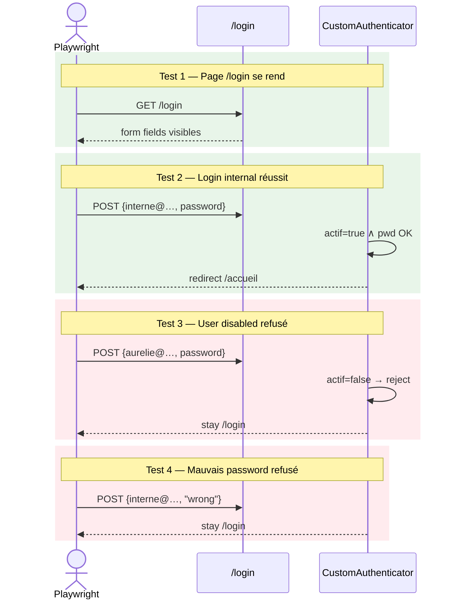

### Spec 02 — Bootstrap des groupes utilisateur

L'internal crée les 5 groupes utilisateur via l'UI EasyAdmin.

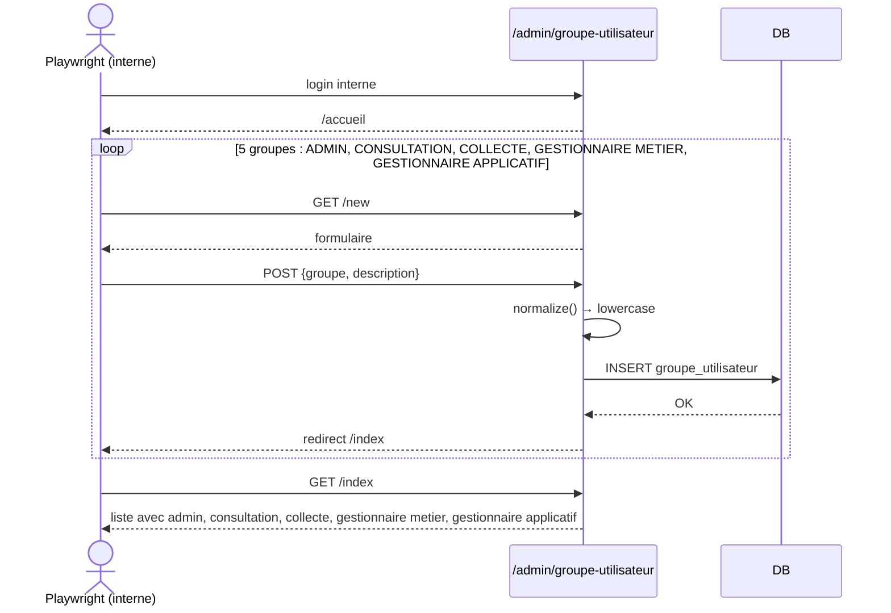

### Spec 03 — Activation des rôles

L'internal active chaque user et lui assigne ses rôles cibles via le formulaire EasyAdmin (case `actif` + checkboxes rôles).

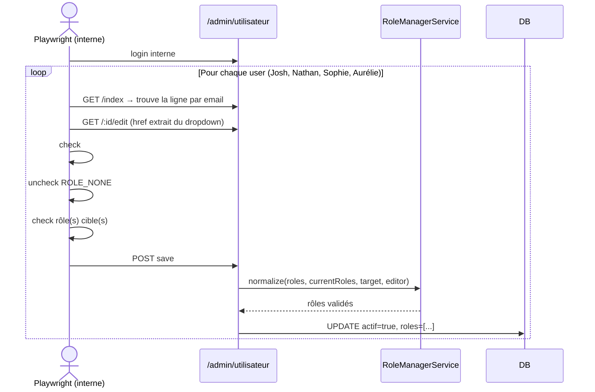

**Affectations cibles** :

| User | Rôle(s) cible |
| --- | --- |
| Josh LIBERMAN | `ROLE_UTILISATEUR` |
| Nathan JONES | `ROLE_COLLECTE` |
| Sophie MARTIN | `ROLE_COLLECTE` + `ROLE_SUIVI` |
| Aurélie PETIT-COEUR | `ROLE_GESTIONNAIRE` (+ `reset_password=true` via seed) |

### Spec 04 — Init Gestionnaire

Scindé en deux cas indépendants le 2026-07-26 (voir [Cas A mis de côté](#cas-a-reset-password-mis-de-côté--testfixme) plus bas pour le détail des correctifs tentés).

**Cas A** — Aurélie passe par le flow nominal "1ère connexion → reset password" puis se reconnecte avec le nouveau mot de passe. Marqué `test.fixme` : reste flaky (~50% d'échec) malgré deux correctifs applicatifs réels (voir plus bas), cause exacte non identifiée.

**Cas B** — Update projets + collecte profils, seedé directement en état post-reset (via `resetAndSeedAfterSpec04()`) : ne dépend pas du succès du cas A.

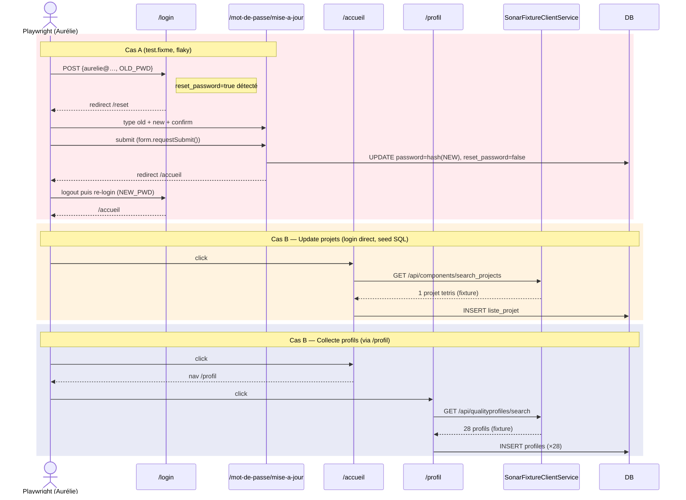

#### Cas A (reset password) mis de côté — `test.fixme`

Deux bugs applicatifs réels ont été trouvés et corrigés au passage (conservés indépendamment du statut du test) :

- **`assets/js/auth/reset.js`** : le bouton "Valider" changeait son propre `type` en `submit` puis rappelait `.click()` sur lui-même, depuis son propre handler de clic, pour forcer la soumission — un `click()` imbriqué sur le même élément peut être avalé par le flag anti-réentrance du spec HTML (clic sans effet visible, ni erreur ni navigation). Remplacé par `form.requestSubmit()` sur le `<form>` englobant.
- **`src/Form/ResetPasswordFormType.php`** : `autocomplete="off"` sur les 3 champs password — Chrome ignore délibérément cette valeur sur les champs de type password depuis 2014. Remplacé par les valeurs sémantiques `current-password` / `new-password`, que Chrome respecte réellement.
- **`templates/auth/reset.html.twig`** : `autocomplete="username"` ajouté au champ email en lecture seule qui précède les champs password, pour éviter que Chrome ne l'associe à tort au champ password suivant.

Malgré ces trois correctifs, environ un run sur deux voit encore le champ "Ancien mot de passe" écrasé par l'email du compte entre la saisie (vérifiée correcte via `toHaveValue` juste après frappe) et le clic sur "Valider". Cause exacte non identifiée à ce jour. Le test est mis de côté via `test.fixme()` plutôt que laissé flaky en CI ; la collecte projets/profils (cas B) reste couverte séparément puisqu'elle n'en dépend pas.

**Décision du 2026-08-02** : ce cas reste mis de côté définitivement, pas juste en pause. Dans un déploiement s'appuyant sur LDAP pour l'authentification, le changement de mot de passe ne passe pas par ce formulaire applicatif (géré côté annuaire) — le parcours "reset password interne" devient un cas secondaire, pas le chemin nominal. Pas de reprise prévue sauf besoin métier nouveau qui le remettrait au premier plan.

### Spec 05 — Affectation des groupes

Aurélie crée le groupe fonctionnel et affecte chaque user à son groupe utilisateur.

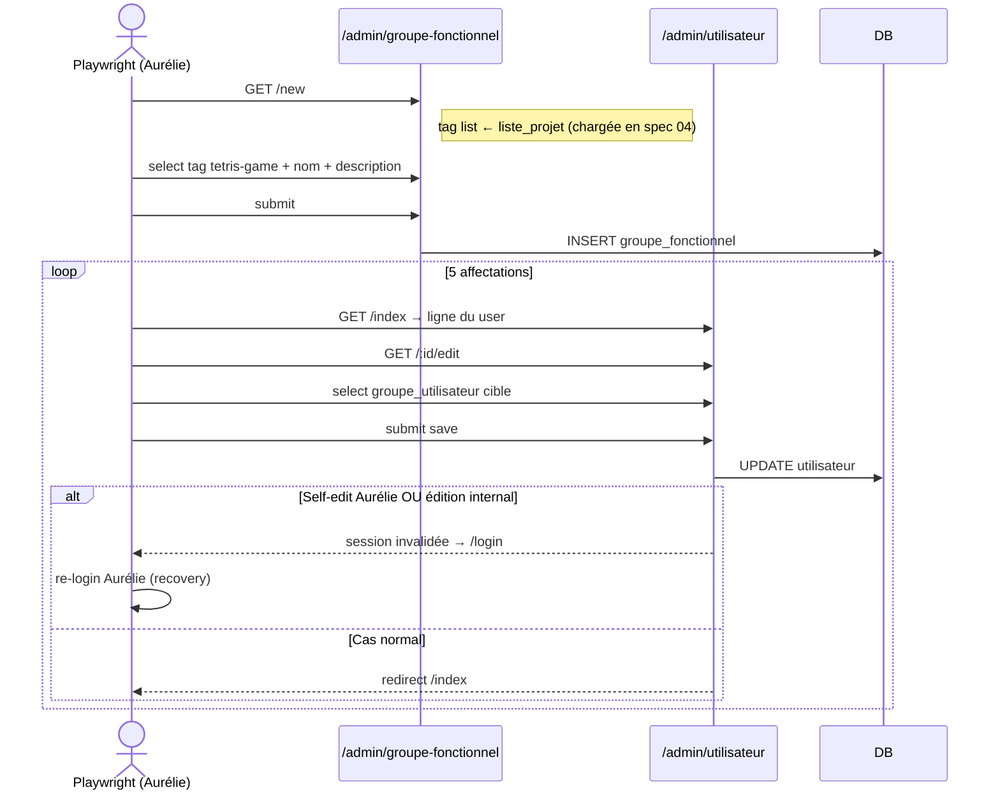

**Affectations groupe utilisateur** :

| User | Groupe utilisateur |
| -- | --- |
| interne | `admin` |
| Josh | `consultation` |
| Nathan | `collecte` |
| Sophie | `gestionnaire metier` |
| Aurélie | `gestionnaire applicatif` |

### Spec 06 — Collecte manuelle

Nathan lance la collecte SonarQube complète sur tetris:TetrisGame. C'est le test le plus long (~2 min) car il enchaîne ~13 phases d'API.

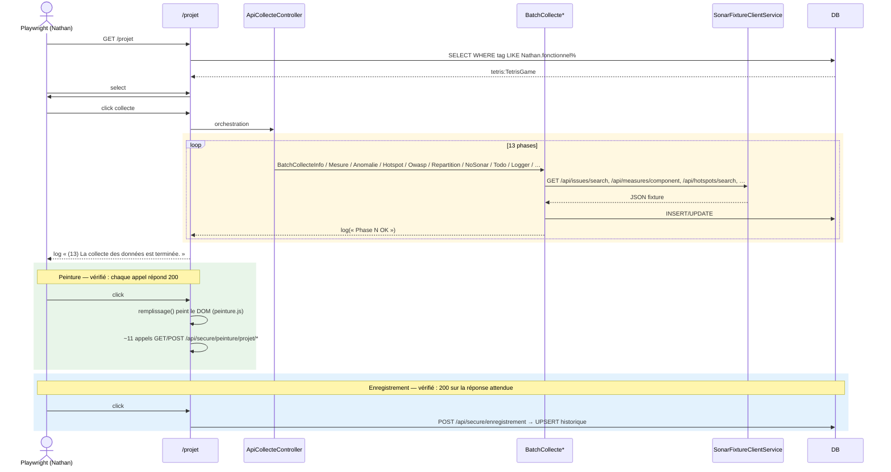

**Sentinel de fin** : on attend `(13) La collecte des données est terminée.` dans `<textarea id="log">.value` (timeout 90s).

**Vérification renforcée (2026-07-26)** : les étapes peinture et enregistrement ne se contentaient auparavant que d'un `waitForTimeout` (absence de crash visible, pas de vérification réelle). Le spec capture désormais les réponses réseau et vérifie explicitement le code HTTP 200 de chaque appel `/api/secure/peinture/projet/*` et de `POST /api/secure/enregistrement`.

**Limite connue** : ce spec ne produit qu'**une seule ligne d'historique** par run, car `tests/fixtures/sonarqube/project_analyses/search-page1.json` ne contient qu'une seule analyse (`projectVersion: "1.1.0-RELEASE"`). C'est suffisant pour valider le pipeline de collecte/peinture/enregistrement, mais **insuffisant** pour tester des scénarios qui nécessitent plusieurs versions historiques côte à côte (suppression d'une ligne, changement de version par défaut — cf. spec 07 étendue ci-dessous). Enrichir cette fixture avec des entrées supplémentaires est un pré-requis pour ces scénarios.

### Spec 07 — Suivi

Sophie (COLLECTE+SUIVI) navigue vers la page de suivi.

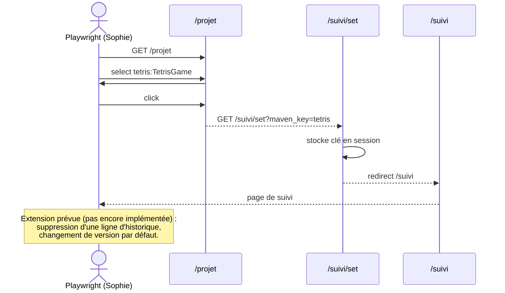

**Extension prévue — suppression d'historique et version par défaut** (recherche faite, implémentation à venir) :

- **Suppression** : `PUT /api/secure/suivi/version/poubelle` (`ApiSuiviController.php:799`), déclenché par le clic sur `[id^=poubelle-]` dans la modale "Modifier les paramètres" (`.js-modifier-analyse`). Succès (200) → la ligne est **masquée** (`$('#ligne-N').hide()`), pas retirée du DOM : asserter `toBeHidden()`, pas l'absence de l'élément. Aucune confirmation JS (`confirm()`) à gérer.
- **Version par défaut** ("référence", à ne pas confondre avec "Favori" ou "Suivi") : `PUT /api/secure/suivi/version/reference` (`ApiSuiviController.php:658`), switch `#switch-reference-{ligne}`, exclusion mutuelle gérée côté JS.
- Rôle requis : `ROLE_SUIVI` seul (Sophie convient, pas besoin de rôle transverse supplémentaire).
- **Bloquant à lever avant d'écrire ces tests** : `tests/fixtures/sonarqube/project_analyses/search-page1.json` ne contient qu'**une seule analyse** — sans plusieurs lignes d'historique, rien à supprimer ni à comparer pour "version par défaut". Il faut enrichir cette fixture (versions/dates distinctes) avant d'implémenter ce scénario. Voir aussi la limite équivalente notée sur le spec 06 ci-dessus (même fixture).

### Spec 08 — Contrôle d'accès par rôle

Indépendant du scénario d'onboarding 01-07 (son propre reset+seed). Vérifie que chaque rôle métier protège effectivement les pages/actions qui lui sont associées, dans les deux mécanismes de contrôle présents dans l'app :

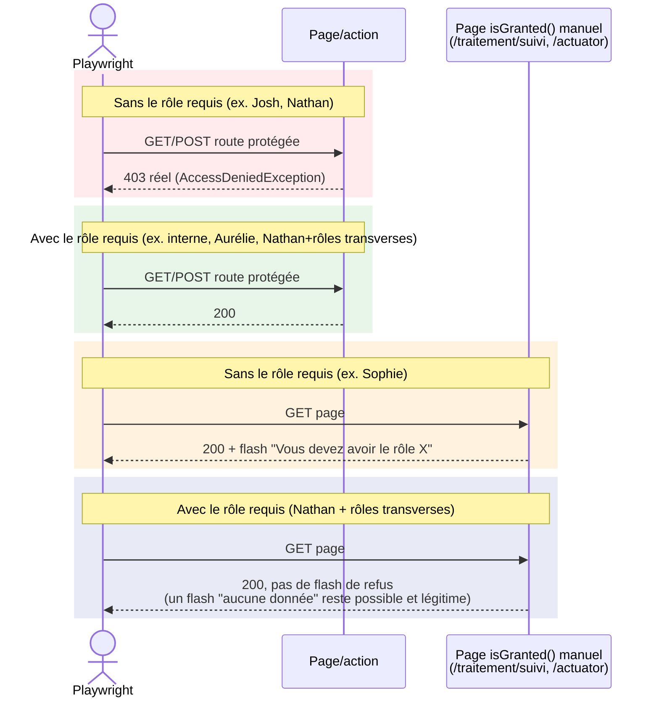

| Mécanisme | Comportement | Rôles couverts | Test négatif (sans le rôle) | Test positif (avec le rôle) |
| --- | --- | --- | --- | --- |
| **Strict** — `#[IsGranted(...)]` (classe ou méthode) | Vraie `AccessDeniedException` → **HTTP 403 réel** | `ROLE_INTERNAL` (`/admin/logs`), `ROLE_GESTIONNAIRE` (actions accueil), `ROLE_SECURITY` (`/dependency-check`), `ROLE_ACTIVITY` (`/activity`) | Josh, Nathan (selon le cas) | interne, Aurélie, Nathan (rôles transverses cumulés, voir plus bas) |
| **Souple** — `isGranted()` manuel dans le contrôleur | Pas d'exception : flash message + rendu normal, **HTTP 200** | `ROLE_BATCH` (`/traitement/suivi`), `ROLE_ACTUATOR` (`/actuator`) | Sophie | Nathan (rôles transverses cumulés) |

`ROLE_SECURITY_ANALYTICS` n'est **pas** un contrôle d'accès : c'est un feature-flag d'affichage (vue restreinte vs vue org-wide) à l'intérieur de pages déjà protégées par `ROLE_SECURITY` — aucun accès n'est refusé sans lui. Hors périmètre de ce spec, à couvrir séparément comme test fonctionnel si besoin.

Sélecteur du flash pour le contrôle souple : `.js-flash-box .callout-message` (`templates/_message.html.twig`). Attention à ne pas confondre le message de **refus de rôle** ("Vous devez avoir le rôle …") avec un message légitime de **données absentes** ("Aucun traitement trouvé") qui utilise la même classe CSS quand le rôle est correct mais qu'il n'y a rien à afficher.

**Rôles transverses** : `ROLE_SECURITY`, `ROLE_ACTIVITY`, `ROLE_BATCH` et `ROLE_ACTUATOR` ne sont portés nativement par aucun des 5 users du scénario d'onboarding (modules indépendants du récit 01-07). Un seed dédié (`resetAndSeedAfterSpec08()` → `95_e2e/seed-after-spec-08-roles-transverses.sql`) les cumule tous sur Nathan pour couvrir le cas positif de chacun.

**Piège `page.request.post()` sur `/api/secure/*`** : `App\EventSubscriber\ApiClientHeaderSubscriber` bloque en 403 toute requête sans un `Origin`/`Referer` autorisé **et** le header `X-Internal-Front: front-app`, avant même d'atteindre le contrôleur/`IsGranted`. Un vrai `fetch()` déclenché depuis la page les ajoute automatiquement ; `page.request.post()` non — sans ces en-têtes explicites, le test obtient un 403 pour **tous** les users (bon rôle ou pas), ce qui ne teste rien du tout. Voir `INTERNAL_FRONT_HEADERS` dans `08-controle-acces.spec.ts`.

**Bug applicatif trouvé et corrigé** : `templates/actuator/index.html.twig:79` appelait `pagination.getTotalItemCount` sans garde — un vrai `Twig\Error\RuntimeError` (500) pour tout utilisateur sans `ROLE_ACTUATOR`, car le contrôleur retourne `pagination = null` avant même d'atteindre le check de rôle. Corrigé par `pagination is not empty ? pagination.getTotalItemCount : 0`.

### Spec 09 — CRUD Portefeuille et Batch

EasyAdmin, `ROLE_BATCH` (protège les deux CRUD, pas de rôle "portefeuille" dédié). Nathan cumule ce rôle via le seed dédié `resetAndSeedForCrudTransverse()`.

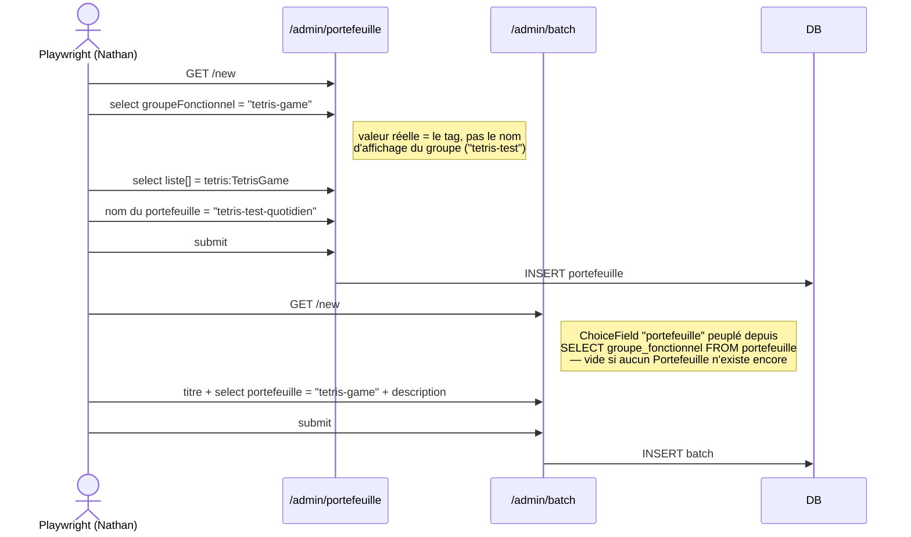

**Ordre imposé par une dépendance de données réelle** : le `ChoiceField` "portefeuille" du formulaire Batch est peuplé depuis `SELECT groupe_fonctionnel FROM ma_moulinette.portefeuille` — sans Portefeuille existant, seul le placeholder "Aucun" est disponible. D'où l'ordre Portefeuille → Batch.

**Piège de valeur** : les deux `ChoiceField` ("groupeFonctionnel" côté Portefeuille, "portefeuille" côté Batch) stockent en réalité le **tag/groupe_fonctionnel** ("tetris-game"), pas le nom d'affichage saisi par l'utilisateur ("tetris-test" ou "tetris-test-quotidien"). Toujours vérifier la valeur réelle des `<option>` dans le DOM avant d'écrire `selectOption(...)`, ne pas supposer que c'est le libellé visible.

**Bug historique déjà corrigé** (non régressé, vérifié en documentant ce spec) : `BatchCrudController::updateEntity()` référençait autrefois une colonne `titre` fantôme sur la table `portefeuille`.

### Spec 10 — CRUD Actuator

Contrôleur custom (`ActuatorController`, pas EasyAdmin), `ROLE_ACTUATOR`. Nathan cumule ce rôle via le même seed `resetAndSeedForCrudTransverse()`.

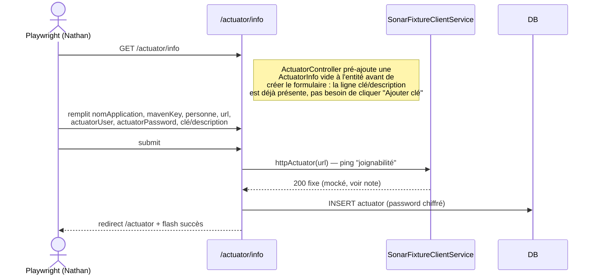

**Pièges réels rencontrés en écrivant ce test** (pas des artefacts Playwright — de vrais comportements applicatifs) :

- **Auto-deadlock réseau** : la création fait un vrai ping HTTP (`ActuatorController::urlActuatorEstJoignable()`) avant d'enregistrer. Pointer cette URL vers le serveur e2e lui-même échoue systématiquement : ce serveur n'a qu'**un seul worker PHP-CGI**, occupé par la requête `actuator/info` en cours — il ne peut pas répondre à sa propre requête de ping avant le timeout (3s), classée "injoignable" à tort. **Fix retenu** : `SonarFixtureClientService` (déjà le double de test pour SonarQube) surcharge maintenant aussi `httpActuator()` pour renvoyer un succès fixe sans appel réseau — cohérent avec le principe déjà appliqué à `httpSonarQube()`. L'URL saisie dans le test n'a donc plus besoin d'être réellement joignable, juste de respecter le format `Assert\Url` (schéma http/https, ≥12 caractères).
- **Champ `actuatorUser` "optionnel" mais bloquant** : `ActuatorFormType` ne définit pas `'required' => false` sur ce champ (pourtant sans contrainte `NotBlank` côté validation Symfony) — le widget rendu porte donc l'attribut HTML5 `required` par défaut. Vide, il bloque silencieusement la soumission native (tooltip navigateur "Please fill out this field", pas d'erreur serveur visible). Le test le remplit systématiquement ; à corriger côté formulaire si on veut un champ réellement optionnel de bout en bout.
- **Footer fixe qui chevauche le bouton submit** : `.footer-fixed` recouvre `#valider-formulaire-enregistrement` à la hauteur de viewport par défaut de Playwright. `click({force: true})` ne suffit pas (le clic finit sur le footer, pas le bouton) — la solution retenue est d'agrandir le viewport (`page.setViewportSize`) avant d'interagir avec le formulaire.
- Pas d'id custom sur les champs (`ActuatorFormType` n'a pas de `getBlockPrefix()`) : sélecteurs par `name$=...` plutôt que par id.

### Spec 11 — Module OWASP

Nathan (`ROLE_COLLECTE`, pas de rôle transverse nécessaire).

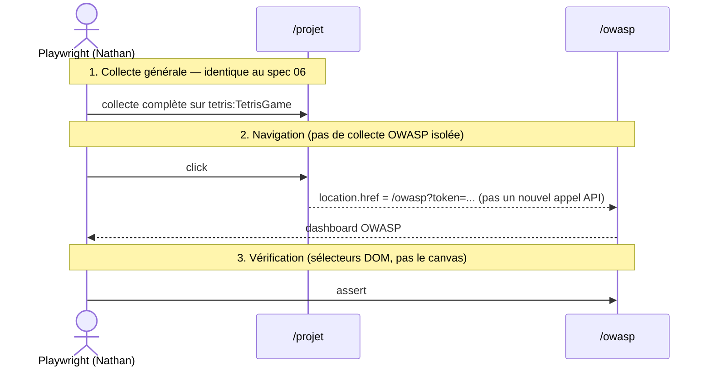

**Point clé découvert avant d'écrire ce test** : il n'existe **aucun déclenchement OWASP isolé** côté UI. Le bouton `#bouton-analyse-owasp` sur `/projet` ne fait que naviguer vers `/owasp?token=...` (token = ROT13+base64 de `salt|maven_key`, généré côté template) — la collecte OWASP fait partie de l'orchestration unique de collecte générale (mêmes phases que le spec 06 : "Collecte des menaces OWASP" / "...potentielles"). Ce test rejoue donc le flux complet de spec 06 avant de vérifier `/owasp`, ce qui le rend aussi long (~1-2 min).

`OwaspController` utilise le même trait `ProjetPerimetreGuard` que `/projet` et `/suivi` (mêmes messages "Erreur 404"/"Erreur 406") — non re-testé ici, déjà couvert par les messages génériques du trait sur les autres specs.

**Canvas Chart.js non testable** : `#owasp-bar-chart` est un `<canvas>` — son contenu (rendu pixel) n'est pas inspectable via le DOM par Playwright. Le test vérifie sa présence/visibilité, jamais son contenu, et cible plutôt les données adjacentes (résumé chiffré, tableau `#a1`-`#a10`, tableau détaillé `#tbody`).

## Reset rapide entre runs (≈ 3s, sans prompt password)

Pour itérer rapidement sur une spec qui mute la DB, chaque spec mutante appelle `resetE2EData()` (et éventuellement `resetAndSeedAfterSpec0X()`) dans son `test.beforeAll()`.
Équivalent du reset entre tests d'intégration Symfony.

```typescript
import { resetAndSeedAfterSpec05 } from '../helpers/db';

test.describe('06 — Collecte manuelle', () => {
  test.beforeAll(() => {
    resetAndSeedAfterSpec05();   // ~5s, pas de prompt password
  });

  test('...', async ({ page }) => { /* ... */ });
});
```

**Sous le capot** :

- `tests/e2e/helpers/db.ts` → spawn `bin/e2e/reset-e2e-data.ps1` puis `bin/e2e/seed-e2e.ps1`
- Ces scripts utilisent `db_user` (password connu via `.env`) → `PGPASSWORD` env var → **pas de prompt**
- `migrations/PosgreSQL/95_e2e/reset-e2e-data.sql` :
  - TRUNCATE toutes les tables de données projet (mesures, anomalie, hotspots, etc.)
  - DELETE les groupes/portefeuilles custom (garde "Aucun" + "En attente")
  - DELETE les 5 users E2E + reload `fixtures-e2e.sql`
- `migrations/PosgreSQL/95_e2e/seed-after-spec-0X-…sql` : replicat de l'état de fin de chaque spec via SQL pour permettre l'isolation au debug (dont `seed-after-spec-08-roles-transverses.sql`, indépendant du récit d'onboarding — cumule sur Nathan les rôles `ROLE_SECURITY`/`ROLE_ACTIVITY`/`ROLE_BATCH`/`ROLE_ACTUATOR`, réutilisé par `resetAndSeedAfterSpec08()` (spec 08) ET `resetAndSeedForCrudTransverse()` (specs 09/10, qui ont en plus besoin d'un groupe fonctionnel existant, donc chaînent depuis `resetAndSeedAfterSpec05()` plutôt que `resetAndSeedAfterSpec03()`))
- Conserve : référentiels OWASP, versions ma_moulinette, admin de prod, groupes par défaut

### Quand utiliser quoi

| Situation | Commande | Durée | Prompt password |
| --- | --- | --- | --- |
| Première fois après pull / structure DB modifiée | `.\bin\e2e\rebuild-database.ps1` | ~30s | ✅ (postgres superuser) |
| Run E2E complet propre | `.\bin\e2e\run-e2e.ps1` | rebuild + warmup + tests | ✅ |
| Itération sur une spec (debug) | `.\bin\e2e\run-e2e.ps1 -SkipRebuild -Spec "02"` | reset auto via `beforeAll` ~3-5s + tests | ❌ |
| Reset manuel hors Playwright | `.\bin\e2e\reset-e2e-data.ps1` | ~3s | ❌ |

## Utilisateurs E2E

Chargés via `migrations/PosgreSQL/90_fixtures/fixtures-e2e.sql`.

| User | État initial | Cible (post step 3) | Groupe (post step 5) |
| --- | --- | --- | -- |
| `interne@ma-moulinette.fr` | actif, `ROLE_INTERNAL` | `ROLE_INTERNAL` | ADMIN |
| `josh.liberman@ma-moulinette.fr` | disabled, `ROLE_NONE` | `ROLE_UTILISATEUR` | CONSULTATION |
| `nathan.jones@ma-moulinette.fr` | disabled, `ROLE_NONE` | `ROLE_COLLECTE` | COLLECTE |
| `sophie.martin@ma-moulinette.fr` | disabled, `ROLE_NONE` | `ROLE_COLLECTE` + `ROLE_SUIVI` | GESTIONNAIRE METIER |
| `aurelie.petit-coeur@ma-moulinette.fr` | disabled, `ROLE_NONE` | `ROLE_GESTIONNAIRE` | GESTIONNAIRE APPLICATIF |

**Convention** : password = courriel (bcrypt cost 13).
**Génération des hashes** : `php bin/e2e/generate-e2e-hashes.php`
**Vérification des hashes** : `php bin/e2e/verify-e2e-hashes.php`

`ROLE_NONE` est ajouté à `config/packages/security.yaml` comme rôle sentinelle (sans héritage, sans privilège). Il bloque l'accès à toutes les routes mais permet de stocker un user en attente d'affectation.

## Pré-requis

- **Node.js** ≥ 20 (`node -v`)
- **PostgreSQL 18** up (db_user / db_password)
- **PHP 8.5.5** + Symfony CLI (`symfony -v`)
- **psql** dans le PATH

## Installation Playwright (une fois)

```powershell
cd tests\e2e
npm install
npm run install:browsers   # Chromium + deps
```

## Lancer les tests

### Méthode automatique (recommandée)

Script PowerShell qui enchaîne tout :

```powershell
# Depuis la racine du projet
.\bin\e2e\run-e2e.ps1                     # tous les specs, headless
.\bin\e2e\run-e2e.ps1 -Headed             # avec navigateur visible
.\bin\e2e\run-e2e.ps1 -Spec "01-smoke"    # un spec en particulier (substring match)
.\bin\e2e\run-e2e.ps1 -SkipRebuild        # garder la DB existante (debug)
.\bin\e2e\run-e2e.ps1 -SkipServer         # ne pas démarrer Symfony serve (déjà up ailleurs)
```

Le script :

1. Rebuild la DB `ma_moulinette` (sauf si `-SkipRebuild`)
2. Démarre Symfony serve avec `APP_ENV=test` en daemon (port 8000) si pas déjà up
3. Warmup le cache test (évite les 502 sur les assets)
4. Lance `npx playwright test` depuis `tests/e2e/`
5. Stoppe le daemon Symfony à la fin (uniquement si on l'a démarré)

### Méthode manuelle (debug fin)

```powershell
# Terminal 1 : DB clean
.\bin\e2e\rebuild-database.ps1

# Terminal 2 : Symfony en env test
$env:APP_ENV = "test"
symfony serve --no-tls --port=8000

# Terminal 3 : Playwright
cd tests\e2e
npm test                  # headless
npm run test:headed       # avec navigateur visible
npm run test:ui           # mode UI interactif (idéal debug)
npm run test:debug        # pas-à-pas
npm run report            # ouvrir le dernier rapport HTML
```

## Pourquoi `APP_ENV=test`

`config/services_test.yaml` substitue `App\Service\ClientService` par `App\Tests\Support\SonarFixtureClientService` qui sert des **fixtures JSON locales** (capturées depuis un vrai SonarQube via `bin/e2e/capture-sonar-fixtures.ps1`).

Conséquences :

- Pas besoin d'un serveur SonarQube up
- Tests reproductibles (même JSON à chaque run)
- Cas particuliers (`null`, valeurs absentes) figés dans les fixtures

Les fixtures sont dans `tests/fixtures/sonarqube/`. Endpoints couverts (Phase I + extensions) :

| URL pattern | Fixture | Utilisé par |
| --- | --- | --- |
| `/api/components/app` | `components/app.json` | InformationProjet |
| `/api/components/search_projects` | `components/search_projects.json` | Update projets accueil |
| `/api/measures/component` | `measures/component.json` | Mesures |
| `/api/issues/search` | `issues/search.json` | Anomalies, NoSonar, Todo, Logger, Repartition |
| `/api/hotspots/search` | `hotspots/search.json` | Hotspots, OWASP |
| `/api/hotspots/show` | `hotspots/show.json` | HotspotDetails |
| `/api/project_analyses/search` | `project_analyses/search-page1.json` | Versions historique |
| `/api/qualityprofiles/search` | `qualityprofiles/search.json` | Collecte profils (28 profils synthétiques) |

## Conventions d'écriture

### Helpers

- **`auth.login(page, USERS.foo)`** : raccourci pour login
- **`auth.loginExpectFailure(page, email, pwd)`** : assertion d'échec (reste sur /login)
- **`auth.logout(page)`** : déconnexion + assertion redirect /login
- **`admin.gotoCrudIndex(page, 'utilisateur')`** : nav vers `/admin/utilisateur`
- **`admin.gotoCrudNew(page, 'utilisateur')`** : nav vers `/admin/utilisateur/new`
- **`db.resetE2EData()`** : reset DB sans prompt
- **`db.resetAndSeedAfterSpec0X()`** : reset + seed à l'état de fin de la spec X
- **`db.resetAndSeedForCrudTransverse()`** : état post-spec-05 + rôles transverses (`ROLE_SECURITY`/`ROLE_ACTIVITY`/`ROLE_BATCH`/`ROLE_ACTUATOR`) cumulés sur Nathan — utilisé par les specs 09/10 (CRUD Batch/Portefeuille/Actuator)

### Locators

Préférer dans cet ordre :

1. **`page.getByRole(...)`** (a11y-first, recommandé Playwright)
2. **`page.getByLabel(...)`** (formulaires)
3. **`page.locator('#id')`** (stable mais lié à la structure DOM)
4. **`page.locator('input[name$="..."]')`** (formulaires Symfony, indépendant du prefix)

Éviter les sélecteurs CSS de classe (changent souvent).

### Cas particuliers EasyAdmin v4

- Les actions CRUD (edit/delete/show) sont dans un **dropdown** : on peut cliquer le toggle puis le lien, OU extraire le href directement via `getAttribute('href')` + `goto()` (plus rapide)
- Les boutons "Créer" et "Sauvegarder" sont **hors du `<form>`** (toolbar header) : utiliser `getByRole('button', { name: 'Créer', exact: true })`
- Les `<select>` avec `data-action-name="..."` sont enrichis par TomSelect : `selectOption()` sur le `<select>` natif (caché) marche
- Le label de checkbox de rôle peut entrer en collision avec le combobox de groupe utilisateur du même nom (ex: "Utilisateur") : préférer `input[type="checkbox"][value="ROLE_UTILISATEUR"]`

### Assertions

- `await expect(page).toHaveURL(...)` : navigation
- `await expect(locator).toBeVisible()` : rendu UI
- `await expect(locator).toContainText('...')` : contenu (⚠️ ne marche pas pour `<textarea>`)
- `await expect(locator).toHaveValue(...)` : valeur d'un input/textarea
- `await expect(locator).toHaveCount(n)` : compteurs (listes, tableaux)
- `await expect(locator).not.toHaveClass(/disabled-bouton/)` : état UI dynamique

### Form submission gotchas

- **Reset password** : le bouton est `type="button"` initialement ; `reset.js` valide les champs puis appelle `form.requestSubmit()` sur le `<form>` englobant (pas d'AJAX, vraie navigation POST). Voir [Cas A mis de côté](#cas-a-reset-password-mis-de-côté--testfixme) pour l'historique des correctifs et la flakiness résiduelle non résolue.
- **HTML5 pattern v-flag** : Chrome 132+ rejette `[a-zA-Z0-9._@-]` car `@-]` est ambigu. Utiliser `[-a-zA-Z0-9._@]` (hyphen en début).
- **Autofill Chrome sur formulaires multi-password** : `autocomplete="off"` est ignoré par Chrome sur les champs `type="password"` depuis 2014 — utiliser les valeurs sémantiques `current-password`/`new-password`. Un champ identifiant en lecture seule précédant un champ password doit porter `autocomplete="username"` explicitement, sinon Chrome peut l'associer à tort au champ suivant.

## Debug

- **Mode UI** (`npm run test:ui`) : timeline complète, time-travel debugging, locator picker
- **Trace** : auto-générée sur retry → `npx playwright show-trace test-results/.../trace.zip`
- **Screenshot** : auto-pris en cas d'échec (`test-results/`)
- **Rapport HTML** : `npm run report`
- **error-context.md** : généré dans `test-results/<spec>/`, contient le snapshot ARIA du DOM au moment de l'échec — précieux pour identifier les sélecteurs

## Prochaines étapes

- **Cas A (reset password) : mis de côté définitivement** (décision du 2026-08-02, pas juste en attente) — dans un déploiement LDAP, le changement de mot de passe ne passe pas par l'application, ce parcours devient secondaire. `test.fixme` reste en place, pas de reprise prévue sauf besoin métier nouveau.
- **Spec 07 étendue** : suppression d'historique + version par défaut — recherche faite et documentée dans la section spec 07 ci-dessus, implémentation bloquée sur l'enrichissement de la fixture `project_analyses/search-page1.json` (une seule analyse actuellement)
- **Bug avatar** : URL `/assets/avatar/chiffre/02.png` ne se résout pas (à investiguer côté AssetMapper / `getAvatarUrl()`)
- **`actuatorUser` non réellement optionnel** : `ActuatorFormType` ne force pas `'required' => false`, le widget HTML5 bloque une soumission avec ce champ vide alors qu'aucune contrainte Symfony ne l'exige (cf. spec 10)
- **Cypress-style isolation** (option future) : si on veut chaque spec totalement auto-suffisante, snapshoter la DB après chaque spec pour restauration rapide

> Cette doc est complétée au fur et à mesure (sections debug, patterns récurrents, gotchas) — pensez à enrichir au fil des évolutions.
